# Project Guide: Loan Management System

## 1. Project Overview

The Loan Management System is a comprehensive web-based application designed to streamline the educational financing process. It enables schools, students (borrowers), co-borrowers, and internal staff to manage the entire loan application lifecycle from submission through underwriting, approval, document signing, and funding.

### 1.1 Purpose and Scope

The system addresses the inefficient, manual process of educational loan applications and management by providing:

- A centralized platform for loan application submission and tracking
- Automated workflows for underwriting and approval processes
- Digital document generation and e-signature capabilities
- Streamlined quality control and funding processes
- Comprehensive reporting and analytics

The system serves multiple user types including borrowers, co-borrowers, school administrators, underwriters, quality control personnel, and system administrators, each with specific interfaces and capabilities tailored to their roles.

### 1.2 Key Features

- **User Management**: Multiple user types with role-based access control
- **School & Program Management**: Configuration of educational institutions and their programs
- **Loan Application Processing**: Comprehensive application capture and validation
- **Underwriting Workflow**: Application review, decision management, and stipulation handling
- **Document Management**: Template-based document generation with e-signature integration
- **Notification System**: Email notifications for key process events
- **Funding Process**: Disbursement management and verification tracking
- **Reporting & Analytics**: Operational and business intelligence dashboards

### 1.3 Technology Stack

#### Backend
- Python 3.11+ with Django 4.2+
- Django REST Framework for API development
- PostgreSQL 15+ for database
- Celery for asynchronous task processing
- Redis for caching and message broker

#### Frontend
- React 18.0+ with TypeScript
- Redux for state management
- Material-UI for UI components
- Formik for form handling

#### Infrastructure
- AWS (ECS, RDS, S3, ElastiCache, CloudFront)
- Docker for containerization
- Terraform for infrastructure as code
- GitHub Actions for CI/CD

## 2. System Architecture

### 2.1 High-Level Architecture

The Loan Management System follows a multi-tiered architecture with clear separation of concerns:

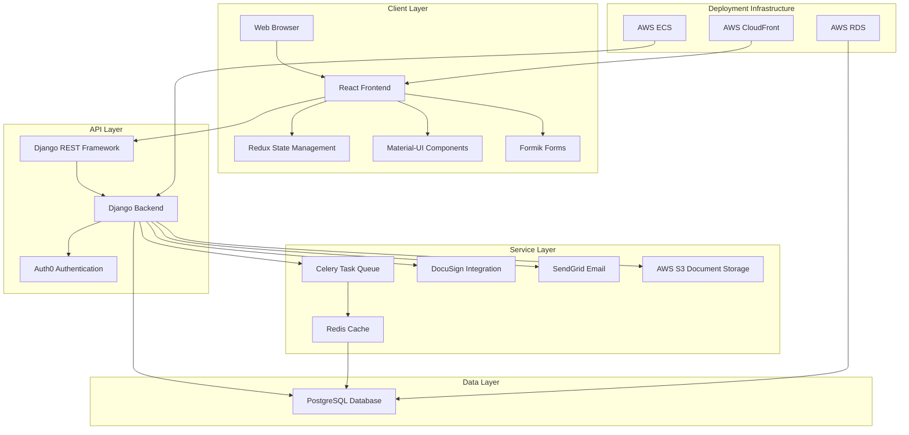

### 2.2 Core Components

#### 2.2.1 User Management
Handles authentication, authorization, and user profile management for all user types:
- Borrowers and co-borrowers
- School administrators
- Internal staff (underwriters, QC personnel, system administrators)

#### 2.2.2 School and Program Management
Manages educational institutions and their program offerings:
- School profile creation and management
- Program setup with associated details
- Program versioning for tuition changes

#### 2.2.3 Loan Application Processing
Handles the submission and tracking of loan applications:
- Multi-step application form
- Document upload capabilities
- Application status tracking

#### 2.2.4 Underwriting Workflow
Facilitates the review and decision-making process:
- Application review interface
- Credit information evaluation
- Decision recording (approve/deny/revise)
- Stipulation management

#### 2.2.5 Document Management
Manages the generation, signing, and storage of loan documents:
- Template-based document generation
- E-signature integration
- Document status tracking

#### 2.2.6 Quality Control
Ensures accuracy and completeness of loan documentation:
- Document verification
- Stipulation verification
- Checklist management

#### 2.2.7 Funding Process
Manages the disbursement of approved loans:
- Enrollment verification
- Final approval workflow
- Disbursement tracking

#### 2.2.8 Notification System
Handles communications throughout the loan process:
- Email notifications for key events
- Template-based messaging
- Delivery tracking

### 2.3 Data Flow

The system's primary data flows follow the loan application lifecycle:

1. **Application Submission**: Borrowers or school administrators submit loan applications with personal and financial information
2. **Underwriting**: Applications are reviewed by underwriters who make approval decisions
3. **Document Generation**: Approved applications trigger document generation
4. **Document Signing**: Documents are sent for electronic signatures from all parties
5. **Quality Control**: Completed document packages undergo QC review
6. **Funding**: Approved and verified applications proceed to funding disbursement

## 3. Core Domain Models

### 3.1 User Models

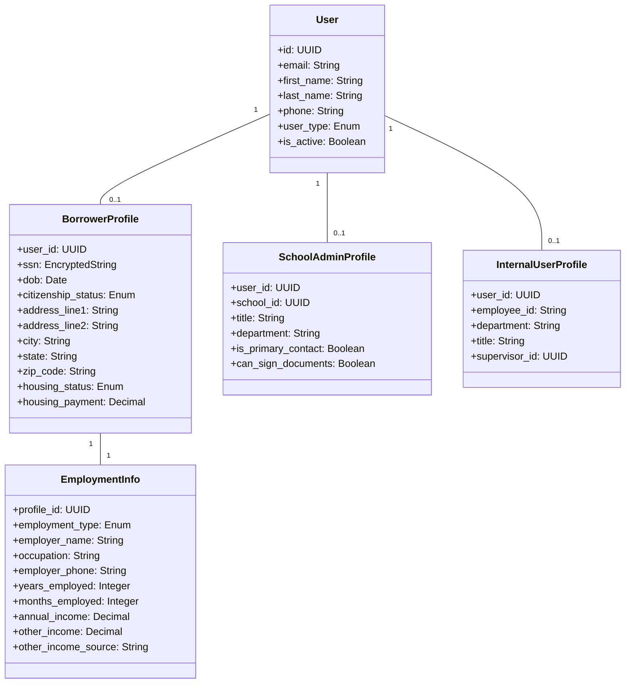

### 3.2 School Models

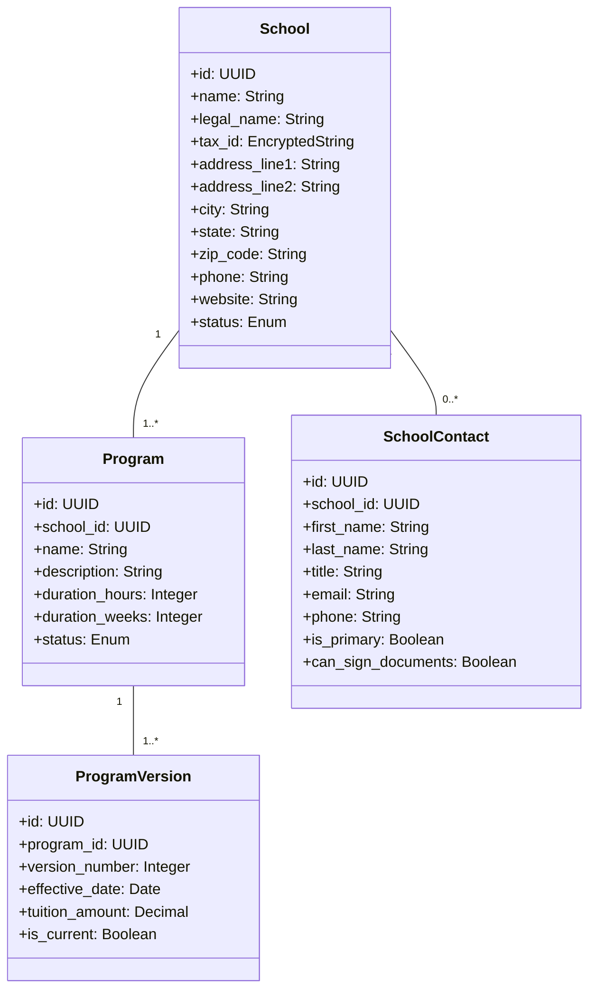

### 3.3 Application Models

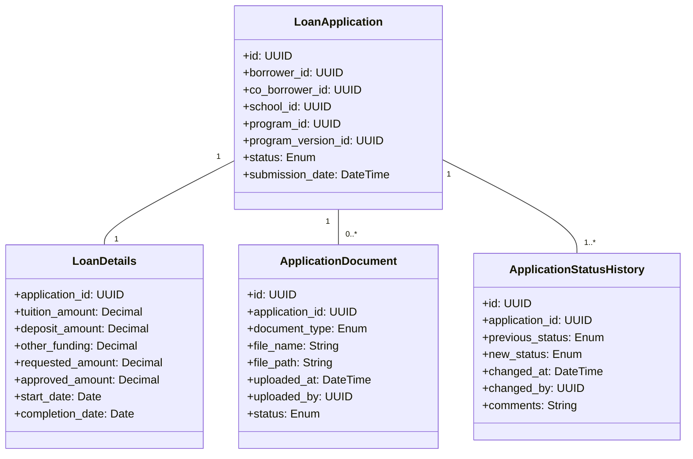

### 3.4 Underwriting Models

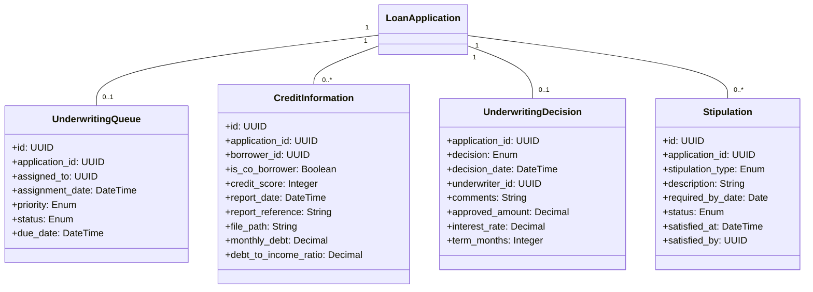

### 3.5 Document Models

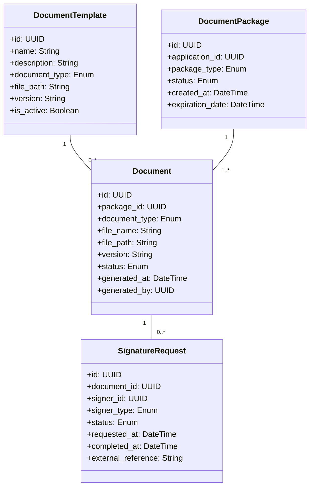

### 3.6 Quality Control Models

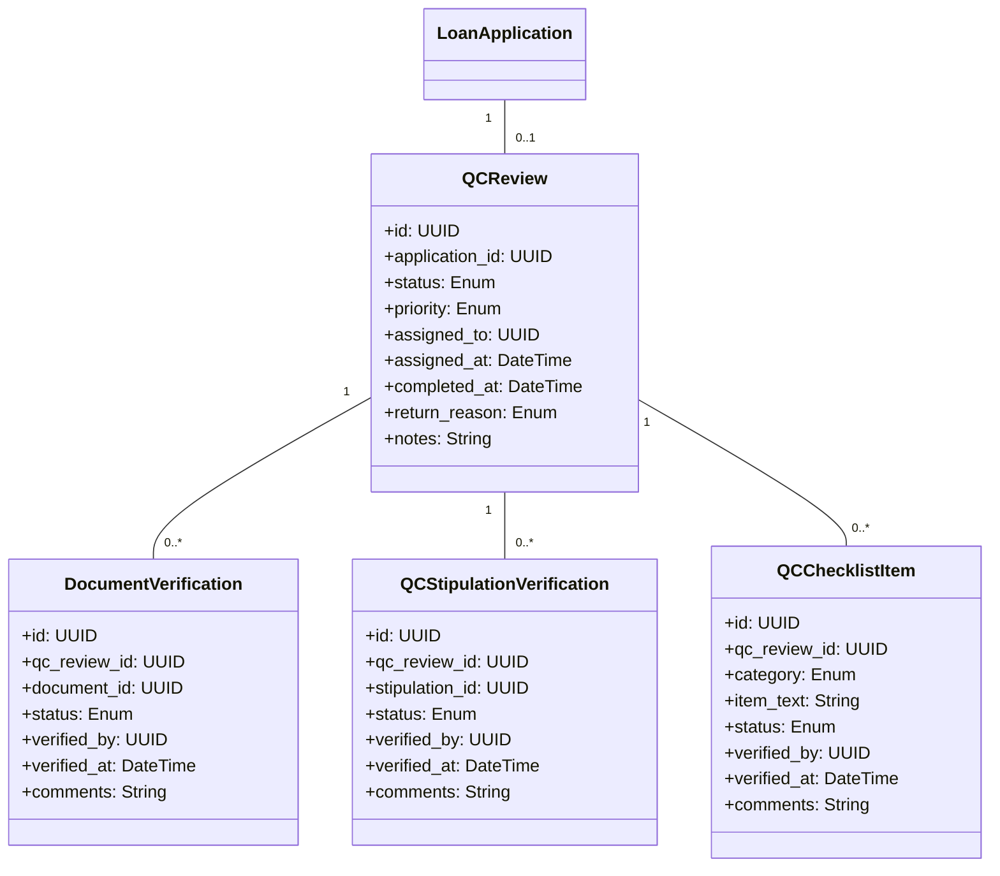

## 4. Key Workflows

### 4.1 Loan Application End-to-End Process

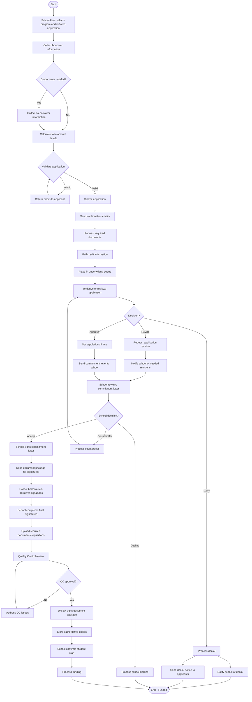

### 4.2 Underwriting Process Flow

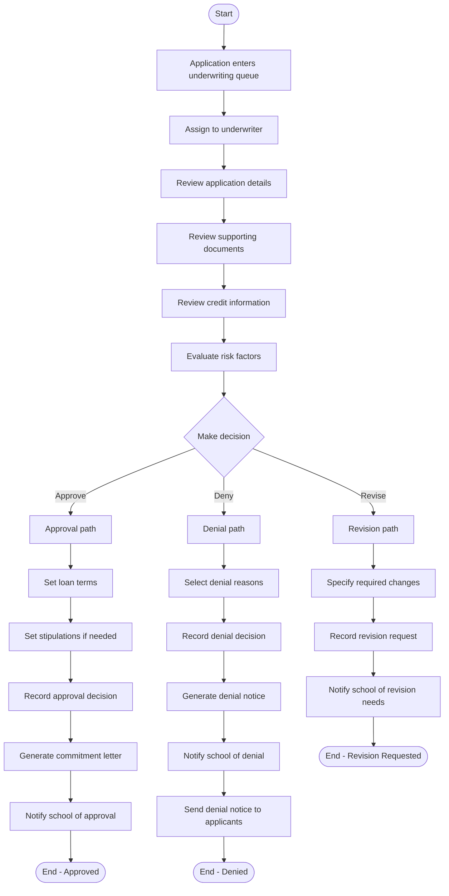

### 4.3 Document Signing Process Flow

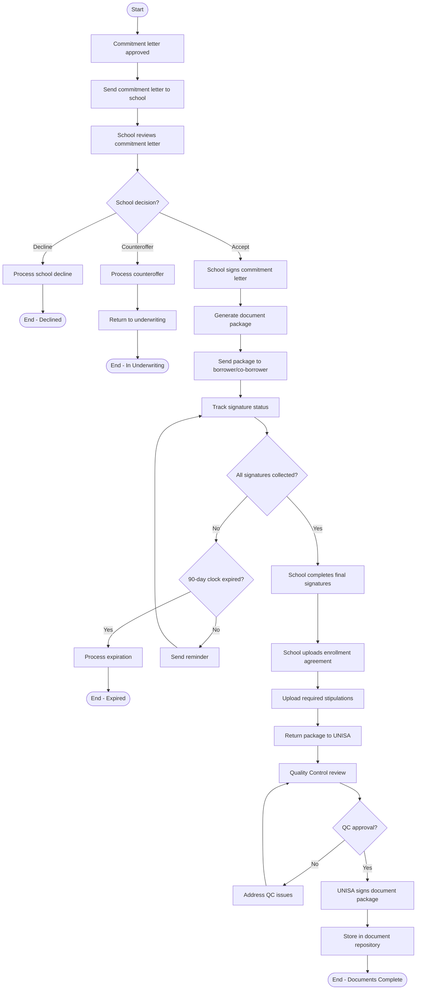

### 4.4 Quality Control Process Flow

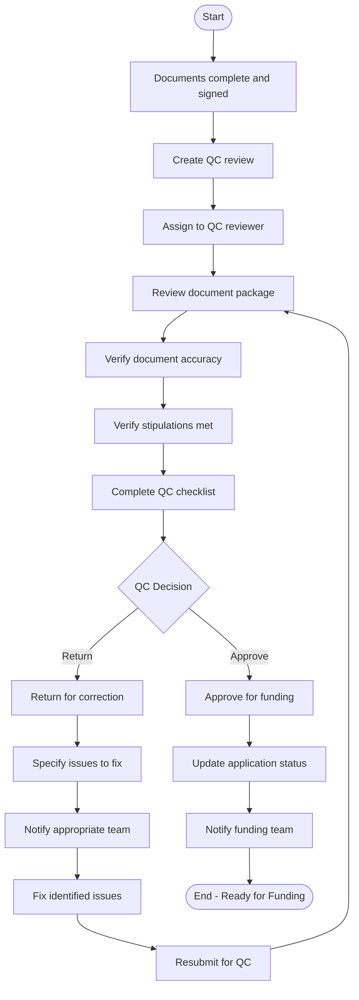

### 4.5 Funding Process Flow

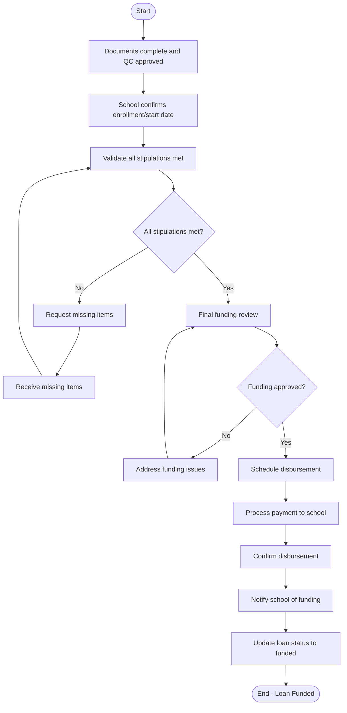

## 5. User Interfaces

### 5.1 Borrower Interfaces

#### 5.1.1 Borrower Dashboard

```
+------------------------------------------------------------------------------+
| [=] Loan Management System                          [@] John Smith [v]       |
+------------------------------------------------------------------------------+
| [#] Dashboard | [$] My Applications | [i] Documents | [@] Profile | [?] Help |
+------------------------------------------------------------------------------+
| Welcome, John                                                                |
+------------------------------------------------------------------------------+
| MY APPLICATIONS                                                              |
+------------------------------------------------------------------------------+
| ID        | School          | Program        | Amount    | Status    | Action |
|-----------|-----------------|----------------|-----------|-----------|--------|
| APP-1001  | ABC School      | Web Dev        | $10,000   | Approved  | [View] |
| APP-1002  | XYZ Academy     | Data Science   | $15,000   | Pending   | [View] |
+------------------------------------------------------------------------------+
| [+ New Application]                                                          |
+------------------------------------------------------------------------------+
| DOCUMENTS REQUIRING SIGNATURE                                                |
+------------------------------------------------------------------------------+
| Document                | Application | Due Date   | Status     | Action     |
|-----------------------|------------|------------|------------|-------------|
| Loan Agreement        | APP-1001   | 05/15/2023 | Pending    | [Sign Now]  |
| Disclosure Form       | APP-1001   | 05/15/2023 | Completed  | [View]      |
+------------------------------------------------------------------------------+
| RECENT NOTIFICATIONS                                                         |
+------------------------------------------------------------------------------+
| [!] Your application APP-1001 has been approved                              |
| [i] Please sign your loan documents by 05/15/2023                            |
+------------------------------------------------------------------------------+
```

#### 5.1.2 Loan Application Form

```
+------------------------------------------------------------------------------+
| [=] Loan Management System                          [@] John Smith [v]       |
+------------------------------------------------------------------------------+
| [#] Dashboard | [$] My Applications | [i] Documents | [@] Profile | [?] Help |
+------------------------------------------------------------------------------+
| New Loan Application                                                         |
+------------------------------------------------------------------------------+
| [====================================                  ] Step 2 of 5          |
+------------------------------------------------------------------------------+
| PERSONAL INFORMATION                                                         |
+------------------------------------------------------------------------------+
| First Name:      [...................] Middle Name: [...................]    |
| Last Name:       [...................]                                       |
| SSN:             [...................] DOB:         [MM/DD/YYYY]             |
| Email:           [...................] Phone:       [...................]    |
| US Citizen:      (•) Yes ( ) No                                              |
|                                                                              |
| Street Address:  [......................................................]    |
| City:            [...................] State: [v] Zip: [...........]         |
|                                                                              |
| Housing Status:  ( ) Own (•) Rent    Monthly Payment: [$............]        |
+------------------------------------------------------------------------------+
| [< Back]                                                      [Next >]       |
+------------------------------------------------------------------------------+
```

#### 5.1.3 Document Signing Interface

```
+------------------------------------------------------------------------------+
| [=] Loan Management System                          [@] John Smith [v]       |
+------------------------------------------------------------------------------+
| [#] Dashboard | [$] My Applications | [i] Documents | [@] Profile | [?] Help |
+------------------------------------------------------------------------------+
| Document Signing - Loan Agreement APP-1001                                   |
+------------------------------------------------------------------------------+
| DOCUMENT PREVIEW                                                             |
+------------------------------------------------------------------------------+
|                                                                              |
|                      LOAN AGREEMENT                                          |
|                                                                              |
|  This agreement is made between John Smith ("Borrower") and                  |
|  Loan Management System ("Lender") for the purpose of financing              |
|  education at ABC School.                                                    |
|                                                                              |
|  Loan Amount: $10,000                                                        |
|  Interest Rate: 5.25%                                                        |
|  Term: 36 months                                                             |
|                                                                              |
|  ...                                                                         |
|                                                                              |
|  Signature: _________________                                                |
|                                                                              |
+------------------------------------------------------------------------------+
| [i] By clicking "Sign Document", you agree to the terms and conditions       |
| outlined in this document and consent to electronic signature.               |
+------------------------------------------------------------------------------+
| [< Back]                                             [Sign Document]         |
+------------------------------------------------------------------------------+
```

### 5.2 School Administrator Interfaces

#### 5.2.1 School Admin Dashboard

```
+------------------------------------------------------------------------------+
| [=] Loan Management System                    [@] Sarah Johnson (ABC) [v]    |
+------------------------------------------------------------------------------+
| [#] Dashboard | [$] Applications | [i] Programs | [@] Users | [?] Help       |
+------------------------------------------------------------------------------+
| Welcome, Sarah                                                               |
+------------------------------------------------------------------------------+
| APPLICATIONS OVERVIEW                                                        |
+------------------------------------------------------------------------------+
| New:        12  |  In Review:  5  |  Approved:  28  |  Declined:  3          |
+------------------------------------------------------------------------------+
| RECENT APPLICATIONS                                                          |
+------------------------------------------------------------------------------+
| ID        | Student         | Program        | Amount    | Status    | Action |
|-----------|-----------------|----------------|-----------|-----------|--------|
| APP-1005  | Michael Brown   | Data Science   | $15,000   | New       | [View] |
| APP-1004  | Lisa Chen       | Web Dev        | $10,000   | In Review | [View] |
| APP-1003  | David Wilson    | UX Design      | $12,000   | Approved  | [View] |
+------------------------------------------------------------------------------+
| [+ New Application]                [View All Applications]                   |
+------------------------------------------------------------------------------+
| DOCUMENTS REQUIRING SIGNATURE                                                |
+------------------------------------------------------------------------------+
| Document                | Student        | Due Date   | Status     | Action   |
|-----------------------|---------------|------------|------------|-----------|
| Commitment Letter      | David Wilson   | 05/10/2023 | Pending    | [Sign]   |
| Enrollment Agreement   | Lisa Chen      | 05/12/2023 | Pending    | [Sign]   |
+------------------------------------------------------------------------------+
| PROGRAM SUMMARY                                                              |
+------------------------------------------------------------------------------+
| Program           | Active Students | Funding Volume | Avg. Approval Rate    |
|-------------------|----------------|---------------|------------------------|
| Web Development   | 15             | $150,000      | 92%                    |
| Data Science      | 12             | $180,000      | 85%                    |
| UX Design         | 8              | $96,000       | 88%                    |
+------------------------------------------------------------------------------+
```

#### 5.2.2 Program Management Interface

```
+------------------------------------------------------------------------------+
| [=] Loan Management System                    [@] Sarah Johnson (ABC) [v]    |
+------------------------------------------------------------------------------+
| [#] Dashboard | [$] Applications | [i] Programs | [@] Users | [?] Help       |
+------------------------------------------------------------------------------+
| Programs                                                                     |
+------------------------------------------------------------------------------+
| ACTIVE PROGRAMS                                                              |
+------------------------------------------------------------------------------+
| Program Name      | Duration | Tuition   | Status  | Students | Action       |
|-------------------|----------|-----------|---------|----------|--------------|
| Web Development   | 12 weeks | $10,000   | Active  | 15       | [Edit]       |
| Data Science      | 16 weeks | $15,000   | Active  | 12       | [Edit]       |
| UX Design         | 10 weeks | $12,000   | Active  | 8        | [Edit]       |
+------------------------------------------------------------------------------+
| [+ Add Program]                                                              |
+------------------------------------------------------------------------------+
```

#### 5.2.3 Commitment Letter Review

```
+------------------------------------------------------------------------------+
| [=] Loan Management System                    [@] Sarah Johnson (ABC) [v]    |
+------------------------------------------------------------------------------+
| [#] Dashboard | [$] Applications | [i] Programs | [@] Users | [?] Help       |
+------------------------------------------------------------------------------+
| Commitment Letter Review - APP-1003                                          |
+------------------------------------------------------------------------------+
| STUDENT: David Wilson                                                        |
| PROGRAM: UX Design                                                           |
| AMOUNT: $12,000                                                              |
+------------------------------------------------------------------------------+
| COMMITMENT LETTER                                                            |
+------------------------------------------------------------------------------+
|                                                                              |
|                      COMMITMENT LETTER                                       |
|                                                                              |
|  Date: 05/01/2023                                                            |
|                                                                              |
|  ABC School                                                                  |
|  123 Education St.                                                           |
|  Anytown, ST 12345                                                           |
|                                                                              |
|  Re: David Wilson - UX Design Program                                        |
|                                                                              |
|  We are pleased to inform you that the loan application for                  |
|  David Wilson has been approved for $12,000 to attend the                    |
|  UX Design program.                                                          |
|                                                                              |
|  Terms: 36 months, 5.25% interest rate                                       |
|                                                                              |
|  Stipulations:                                                               |
|  - Enrollment Agreement                                                      |
|  - Proof of Income                                                           |
|                                                                              |
|  ...                                                                         |
|                                                                              |
+------------------------------------------------------------------------------+
| ACTION                                                                       |
+------------------------------------------------------------------------------+
| ( ) Accept Commitment Letter                                                 |
| ( ) Decline Commitment Letter                                                |
| ( ) Submit Counteroffer                                                      |
|                                                                              |
| Counteroffer Amount: [$............]                                         |
| Reason: [.................................................]                 |
+------------------------------------------------------------------------------+
| [Cancel]                                                     [Submit]        |
+------------------------------------------------------------------------------+
```

### 5.3 Underwriter Interfaces

#### 5.3.1 Underwriter Dashboard

```
+------------------------------------------------------------------------------+
| [=] Loan Management System                      [@] Robert Taylor [v]        |
+------------------------------------------------------------------------------+
| [#] Dashboard | [$] Applications | [i] Reports | [@] Settings | [?] Help     |
+------------------------------------------------------------------------------+
| Welcome, Robert                                                              |
+------------------------------------------------------------------------------+
| UNDERWRITING QUEUE                                                           |
+------------------------------------------------------------------------------+
| Assigned to you: 8  |  Pending review: 15  |  Completed today: 6             |
+------------------------------------------------------------------------------+
| YOUR ASSIGNED APPLICATIONS                                                   |
+------------------------------------------------------------------------------+
| ID        | Applicant       | School      | Amount    | Received   | Action  |
|-----------|-----------------|-------------|-----------|------------|---------|
| APP-1004  | Lisa Chen       | ABC School  | $10,000   | 05/01/2023 | [Review]|
| APP-1005  | Michael Brown   | ABC School  | $15,000   | 05/01/2023 | [Review]|
| APP-1006  | Jennifer Lee    | XYZ Academy | $12,500   | 05/02/2023 | [Review]|
+------------------------------------------------------------------------------+
| [View All Assigned]                                                          |
+------------------------------------------------------------------------------+
| PERFORMANCE METRICS                                                          |
+------------------------------------------------------------------------------+
| Average decision time: 1.2 days  |  Applications processed: 45 (this week)   |
| Approval rate: 82%               |  Decisions pending review: 2              |
+------------------------------------------------------------------------------+
```

#### 5.3.2 Application Review Interface

```
+------------------------------------------------------------------------------+
| [=] Loan Management System                      [@] Robert Taylor [v]        |
+------------------------------------------------------------------------------+
| [#] Dashboard | [$] Applications | [i] Reports | [@] Settings | [?] Help     |
+------------------------------------------------------------------------------+
| Application Review - APP-1004                                                |
+------------------------------------------------------------------------------+
| APPLICANT INFORMATION                | CREDIT INFORMATION                    |
|-------------------------------------|-------------------------------------|
| Name: Lisa Chen                      | Credit Score: 720                    |
| SSN: XXX-XX-1234                     | Monthly Debt: $1,200                 |
| DOB: 05/15/1990                      | Debt-to-Income: 32%                  |
| Citizenship: US Citizen              | [View Full Credit Report]            |
|                                      |                                     |
| Address: 123 Main St                 | EMPLOYMENT INFORMATION               |
| Anytown, ST 12345                    |-------------------------------------|
| Housing: Rent - $1,500/month         | Employer: Tech Solutions Inc.        |
|                                      | Occupation: Software Developer       |
|                                      | Years Employed: 3.5                  |
|                                      | Annual Income: $85,000               |
+------------------------------------------------------------------------------+
| CO-APPLICANT INFORMATION             | LOAN DETAILS                         |
|-------------------------------------|-------------------------------------|
| Name: N/A                            | School: ABC School                   |
|                                      | Program: Web Development             |
|                                      | Tuition: $10,000                     |
|                                      | Requested Amount: $10,000            |
|                                      | Start Date: 06/01/2023               |
+------------------------------------------------------------------------------+
| DOCUMENTS                                                                    |
+------------------------------------------------------------------------------+
| [x] Driver's License      [View]                                             |
| [x] Proof of Income       [View]                                             |
| [ ] Enrollment Agreement  [Not Uploaded]                                     |
+------------------------------------------------------------------------------+
| UNDERWRITING DECISION                                                        |
+------------------------------------------------------------------------------+
| Decision:                                                                    |
| ( ) Approve                                                                  |
| ( ) Deny                                                                     |
| ( ) Request Revision                                                         |
|                                                                              |
| Approved Amount: [$10,000.......]                                            |
| Interest Rate:   [5.25%........]                                             |
| Term (months):   [36............]                                            |
|                                                                              |
| Stipulations:                                                                |
| [ ] Enrollment Agreement                                                     |
| [ ] Additional Proof of Income                                               |
| [ ] Proof of Residence                                                       |
| [ ] Co-signer Required                                                       |
|                                                                              |
| Comments:                                                                    |
| [................................................................]          |
| [................................................................]          |
+------------------------------------------------------------------------------+
| [Save Draft]                                              [Submit Decision]  |
+------------------------------------------------------------------------------+
```

### 5.4 Quality Control (QC) Interfaces

#### 5.4.1 QC Dashboard

```
+------------------------------------------------------------------------------+
| [=] Loan Management System                        [@] Patricia Lopez [v]     |
+------------------------------------------------------------------------------+
| [#] Dashboard | [$] QC Review | [i] Reports | [@] Settings | [?] Help        |
+------------------------------------------------------------------------------+
| Welcome, Patricia                                                            |
+------------------------------------------------------------------------------+
| QC REVIEW QUEUE                                                              |
+------------------------------------------------------------------------------+
| Pending review: 12  |  Completed today: 8  |  Returned for correction: 3     |
+------------------------------------------------------------------------------+
| APPLICATIONS READY FOR QC                                                    |
+------------------------------------------------------------------------------+
| ID        | Applicant       | School      | Amount    | Docs Complete | Action|
|-----------|-----------------|-------------|-----------|---------------|-------|
| APP-1001  | John Smith      | ABC School  | $10,000   | 05/01/2023    |[Review]|
| APP-1003  | David Wilson    | ABC School  | $12,000   | 05/02/2023    |[Review]|
| APP-1007  | Amanda Garcia   | XYZ Academy | $14,500   | 05/02/2023    |[Review]|
+------------------------------------------------------------------------------+
| [View All Pending]                                                           |
+------------------------------------------------------------------------------+
| APPLICATIONS PENDING FUNDING                                                 |
+------------------------------------------------------------------------------+
| ID        | Applicant       | School      | Amount    | QC Approved   | Action|
|-----------|-----------------|-------------|-----------|---------------|-------|
| APP-0998  | Thomas Wright   | ABC School  | $9,500    | 04/30/2023    |[View] |
| APP-0999  | Sarah Johnson   | XYZ Academy | $13,000   | 04/30/2023    |[View] |
+------------------------------------------------------------------------------+
```

#### 5.4.2 QC Review Interface

```
+------------------------------------------------------------------------------+
| [=] Loan Management System                        [@] Patricia Lopez [v]     |
+------------------------------------------------------------------------------+
| [#] Dashboard | [$] QC Review | [i] Reports | [@] Settings | [?] Help        |
+------------------------------------------------------------------------------+
| QC Review - APP-1001                                                         |
+------------------------------------------------------------------------------+
| LOAN INFORMATION                                                             |
+------------------------------------------------------------------------------+
| Applicant: John Smith                | School: ABC School                    |
| Program: Web Development             | Amount: $10,000                       |
| Term: 36 months                      | Interest Rate: 5.25%                  |
+------------------------------------------------------------------------------+
| DOCUMENT VERIFICATION                                                        |
+------------------------------------------------------------------------------+
| Document               | Status      | Last Updated | Verification           |
|------------------------|-------------|-------------|------------------------|
| Loan Agreement         | Signed      | 05/01/2023  | [x] Verified           |
| Disclosure Forms       | Signed      | 05/01/2023  | [x] Verified           |
| Enrollment Agreement   | Uploaded    | 05/01/2023  | [ ] Verified           |
| Proof of Income        | Uploaded    | 04/28/2023  | [x] Verified           |
| Driver's License       | Uploaded    | 04/28/2023  | [x] Verified           |
+------------------------------------------------------------------------------+
| STIPULATION VERIFICATION                                                     |
+------------------------------------------------------------------------------+
| Stipulation            | Status      | Last Updated | Verification           |
|------------------------|-------------|-------------|------------------------|
| Enrollment Agreement   | Satisfied   | 05/01/2023  | [ ] Verified           |
+------------------------------------------------------------------------------+
| VERIFICATION CHECKLIST                                                       |
+------------------------------------------------------------------------------+
| [x] All required documents are present and signed                            |
| [x] Loan amount matches approved amount                                      |
| [x] Borrower information is consistent across documents                      |
| [ ] Program details match enrollment agreement                               |
| [x] All stipulations have been satisfied                                     |
| [x] Signatures are valid and complete                                        |
+------------------------------------------------------------------------------+
| NOTES                                                                        |
+------------------------------------------------------------------------------+
| [Need to verify program details on enrollment agreement match loan docs...]  |
+------------------------------------------------------------------------------+
| QC DECISION                                                                  |
+------------------------------------------------------------------------------+
| ( ) Approve for Funding                                                      |
| ( ) Return for Correction                                                    |
|                                                                              |
| Reason for Return:                                                           |
| [................................................................]          |
+------------------------------------------------------------------------------+
| [Cancel]                                                     [Submit]        |
+------------------------------------------------------------------------------+
```

### 5.5 System Administrator Interfaces

#### 5.5.1 User Management Interface

```
+------------------------------------------------------------------------------+
| [=] Loan Management System                         [@] Admin User [v]        |
+------------------------------------------------------------------------------+
| [#] Dashboard | [$] Schools | [i] Users | [@] Settings | [?] Help            |
+------------------------------------------------------------------------------+
| User Management                                                              |
+------------------------------------------------------------------------------+
| FILTERS                                                                      |
+------------------------------------------------------------------------------+
| Role: [v] All          Status: [v] All          Search: [............]       |
| [Apply Filters]                                                              |
+------------------------------------------------------------------------------+
| USERS (45 total)                                                             |
+------------------------------------------------------------------------------+
| ID      | Name           | Email                | Role        | Status | Action|
|---------|----------------|----------------------|-------------|--------|-------|
| USR-001 | John Smith     | john@example.com     | Borrower    | Active |[Edit] |
| USR-002 | Sarah Johnson  | sarah@abcschool.edu  | School Admin| Active |[Edit] |
| USR-003 | Robert Taylor  | robert@loanmgmt.com  | Underwriter | Active |[Edit] |
| USR-004 | Patricia Lopez | patricia@loanmgmt.com| QC          | Active |[Edit] |
| USR-005 | David Wilson   | david@example.com    | Borrower    | Active |[Edit] |
+------------------------------------------------------------------------------+
| [< 1 2 3 ... >]                                                              |
+------------------------------------------------------------------------------+
| [+ Add User]                [Export to CSV]                                  |
+------------------------------------------------------------------------------+
```

#### 5.5.2 School Management Interface

```
+------------------------------------------------------------------------------+
| [=] Loan Management System                         [@] Admin User [v]        |
+------------------------------------------------------------------------------+
| [#] Dashboard | [$] Schools | [i] Users | [@] Settings | [?] Help            |
+------------------------------------------------------------------------------+
| School Management                                                            |
+------------------------------------------------------------------------------+
| SCHOOLS                                                                      |
+------------------------------------------------------------------------------+
| ID      | Name           | Programs | Users | Status | Applications | Action |
|---------|----------------|----------|-------|--------|--------------|--------|
| SCH-001 | ABC School     | 3        | 5     | Active | 45           |[Edit]  |
| SCH-002 | XYZ Academy    | 2        | 3     | Active | 32           |[Edit]  |
| SCH-003 | Tech Institute | 4        | 4     | Active | 28           |[Edit]  |
+------------------------------------------------------------------------------+
| [+ Add School]                                                               |
+------------------------------------------------------------------------------+
```

#### 5.5.3 Email Template Management

```
+------------------------------------------------------------------------------+
| [=] Loan Management System                         [@] Admin User [v]        |
+------------------------------------------------------------------------------+
| [#] Dashboard | [$] Schools | [i] Users | [@] Settings | [?] Help            |
+------------------------------------------------------------------------------+
| Email Template Management                                                    |
+------------------------------------------------------------------------------+
| TEMPLATES                                                                    |
+------------------------------------------------------------------------------+
| Template Name                | Last Modified | Status  | Action               |
|------------------------------|---------------|---------|----------------------|
| Application Confirmation     | 04/15/2023    | Active  | [Edit]               |
| Application Approval         | 04/15/2023    | Active  | [Edit]               |
| Application Denial           | 04/15/2023    | Active  | [Edit]               |
| Document Signature Request   | 04/15/2023    | Active  | [Edit]               |
| Funding Confirmation         | 04/15/2023    | Active  | [Edit]               |
+------------------------------------------------------------------------------+
| [+ Add Template]                                                             |
+------------------------------------------------------------------------------+
```

## 6. Technical Implementation

### 6.1 Backend Architecture

The backend is built using Django and Django REST Framework with a modular structure organized by domain:

- **Core**: Base models, utilities, and shared functionality
- **Apps**: Domain-specific modules
  - **Users**: User management and profiles
  - **Schools**: School and program management
  - **Applications**: Loan application processing
  - **Underwriting**: Application review and decision making
  - **Documents**: Document generation and management
  - **QC**: Quality control processes
  - **Funding**: Disbursement management
  - **Notifications**: Email and notification handling

Each app follows a standard Django structure with models, views, serializers, and services.

### 6.2 Frontend Architecture

The frontend is built using React with TypeScript and follows a component-based architecture:

- **Components**: Reusable UI components
- **Pages**: Page-level components that compose multiple components
- **Store**: Redux state management
  - **Slices**: Feature-specific state slices
  - **Thunks**: Async action creators
  - **Actions**: Action creators
  - **Reducers**: State update logic
- **API**: Service layer for backend communication
- **Types**: TypeScript type definitions
- **Utils**: Utility functions and helpers

### 6.3 API Design

The system uses a RESTful API design with the following characteristics:

- Resource-based endpoints
- JSON data format
- JWT authentication
- Consistent error handling
- Pagination for list endpoints
- Filtering and sorting capabilities

### 6.4 Security Implementation

The system implements multiple layers of security:

- **Authentication**: OAuth 2.0/OIDC with Auth0
- **Authorization**: Role-based access control
- **Data Protection**: 
  - Encryption at rest for sensitive data
  - TLS for data in transit
  - Field-level encryption for PII
- **API Security**: 
  - JWT with short expiration
  - Rate limiting
  - Input validation

### 6.5 Infrastructure

The system is deployed on AWS with the following components:

- **Compute**: ECS with Fargate for containerized services
- **Database**: RDS PostgreSQL with Multi-AZ deployment
- **Storage**: S3 for document storage
- **Caching**: ElastiCache Redis
- **CDN**: CloudFront for static assets
- **Security**: WAF, KMS, IAM roles

Infrastructure is managed using Terraform with separate environments for development, staging, and production.

## 7. Development and Deployment

### 7.1 Development Workflow

The development workflow follows these steps:

1. Feature branches created from develop branch
2. Pull requests submitted for code review
3. Automated tests run in CI pipeline
4. Code review and approval
5. Merge to develop branch
6. Automated deployment to development environment
7. QA testing in development
8. Promotion to staging for integration testing
9. Release branch created for production deployment
10. Production deployment after final approval

### 7.2 CI/CD Pipeline

The CI/CD pipeline is implemented using GitHub Actions:

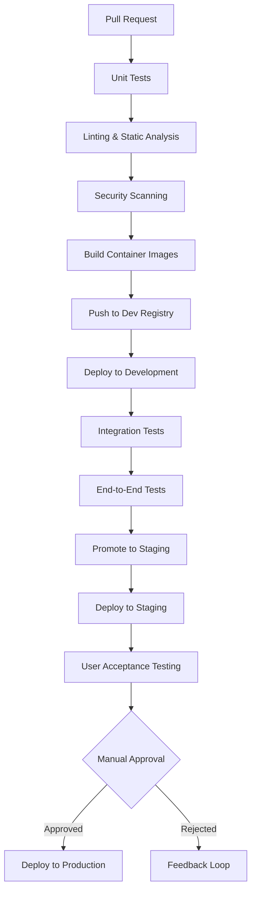

### 7.3 Monitoring and Observability

The system implements comprehensive monitoring:

- **Application Performance**: New Relic for real-time performance tracking
- **Infrastructure Monitoring**: AWS CloudWatch for server resources
- **Business Metrics**: Custom dashboards for loan metrics
- **Logging**: ELK stack for centralized log collection
- **Alerting**: PagerDuty integration for critical alerts

### 7.4 Backup and Recovery

The system implements a robust backup and recovery strategy:

- **Database**: 
  - Daily full backups
  - Hourly incremental backups
  - Point-in-time recovery
- **Document Storage**: 
  - S3 versioning
  - Cross-region replication
- **Disaster Recovery**:
  - RTO: 4 hours for critical functions
  - RPO: 1 hour for database, 15 minutes for document storage

## 8. Conclusion

The Loan Management System provides a comprehensive solution for educational financing, streamlining the entire loan lifecycle from application to funding. By automating workflows, providing digital document handling, and offering role-specific interfaces, the system significantly improves efficiency and user experience for all stakeholders.

The modular architecture ensures maintainability and scalability, while the comprehensive security measures protect sensitive financial and personal information. The system's robust monitoring and backup strategies ensure reliability and data integrity.

Future enhancements could include mobile applications, advanced analytics for underwriting decisions, and expanded integration capabilities with school information systems and payment processors.

# PROJECT STATUS

The Loan Management System project is in an advanced stage of development, with significant progress made across all core components. Based on the repository analysis, the project demonstrates a comprehensive implementation of the educational loan management platform with well-structured code organization and extensive feature coverage.

## Project Completion Status

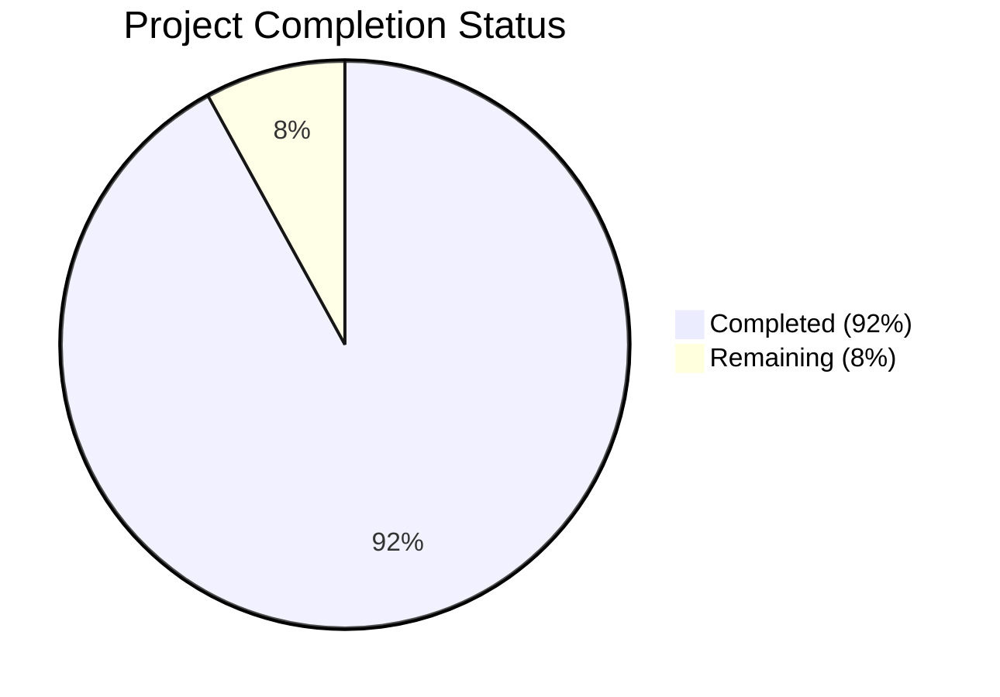

## Engineering Effort

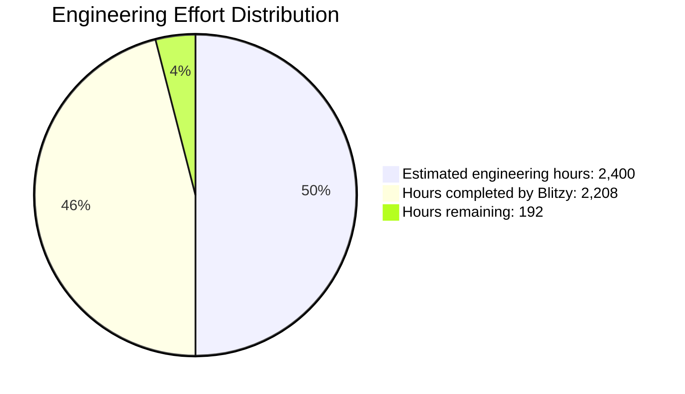

## Component Completion Status

| Component | Completion | Status |
|-----------|------------|--------|
| User Management | 95% | Core functionality implemented with role-based access control |
| School & Program Management | 90% | School and program configuration complete |
| Loan Application Processing | 95% | Application submission and validation implemented |
| Underwriting Workflow | 90% | Decision management and stipulation handling in place |
| Document Management | 85% | Template-based generation and e-signature integration functional |
| Notification System | 95% | Email notifications for key events implemented |
| Funding Process | 85% | Disbursement management framework in place |
| Reporting & Analytics | 80% | Core reports implemented, some advanced analytics pending |
| Infrastructure | 90% | AWS deployment configuration complete |
| CI/CD Pipeline | 95% | Automated build and deployment workflows established |
| Documentation | 85% | Comprehensive documentation available |

## Key Accomplishments

- Implemented comprehensive user management with role-based permissions
- Developed complete loan application workflow from submission to funding
- Created document generation system with e-signature integration
- Built underwriting decision management with stipulation handling
- Established secure infrastructure with AWS services
- Implemented responsive UI for all user types
- Created comprehensive test coverage across components

## Remaining Tasks

- Final performance optimization for high-volume scenarios
- Enhanced reporting capabilities for executive dashboards
- Additional compliance documentation for regulatory requirements
- Final security audit and penetration testing
- Production environment fine-tuning
- User acceptance testing and feedback incorporation

## Next Steps

1. Complete remaining performance optimizations
2. Finalize production deployment configuration
3. Conduct comprehensive security audit
4. Perform user acceptance testing
5. Prepare for production launch

The project is on track for completion with approximately 92% of the development work finished. The remaining 8% consists primarily of optimization, final testing, and production preparation tasks.

# TECHNOLOGY STACK

The Loan Management System is built using a modern, scalable, and secure technology stack designed to handle the complex requirements of educational loan processing. This section details the technologies used across different layers of the application.

## 3.1 PROGRAMMING LANGUAGES

| Component | Language | Version | Justification |
|-----------|----------|---------|---------------|
| Backend | Python | 3.11+ | Selected for its robust ecosystem, readability, and extensive libraries for web development. Python's strong support for data processing is beneficial for loan application handling and document generation. |
| Frontend | JavaScript (TypeScript) | 5.0+ | TypeScript provides strong typing on top of JavaScript, reducing runtime errors and improving maintainability for the complex UI components needed in loan processing workflows. |
| Database Scripts | SQL | - | Required for database schema management, complex queries, and data migrations in the relational database environment. |
| DevOps Automation | Python/Bash | - | Python for complex automation tasks, Bash for deployment scripts and environment setup. |

## 3.2 FRAMEWORKS & LIBRARIES

### Backend Framework

| Framework | Version | Purpose | Justification |
|-----------|---------|---------|---------------|
| Django | 4.2+ | Primary web framework | Django's built-in admin interface, ORM, authentication system, and security features make it ideal for developing a secure loan management system with complex user roles and permissions. |
| Django REST Framework | 3.14.0 | API development | Provides robust tools for building RESTful APIs needed for frontend-backend communication and potential future integrations. |
| Celery | 5.3.4 | Asynchronous task processing | Required for handling background tasks such as document generation, email notifications, and scheduled processes without blocking user interactions. |

### Frontend Framework

| Framework | Version | Purpose | Justification |
|-----------|---------|---------|---------------|
| React | 18.2.0 | UI component library | React's component-based architecture supports the complex form handling and workflow interfaces required for loan applications and underwriting. |
| Redux | 4.2.1 | State management | Necessary for managing complex application state across multiple user workflows and maintaining consistency in the loan application process. |
| Material-UI | 5.14.0 | UI component framework | Provides pre-built, accessible components that can be customized to match the application's design requirements while ensuring consistency. |
| Formik | 2.4.2 | Form management | Simplifies complex form handling for loan applications with validation, error messages, and form state management. |

### Utility Libraries

| Library | Version | Purpose | Justification |
|---------|---------|---------|---------------|
| WeasyPrint | 60.0 | PDF generation | Required for generating loan documents, commitment letters, and disclosure forms. |
| PyJWT | 2.8.0 | JWT authentication | Secure token-based authentication for API requests. |
| Pandas | 2.1.1 | Data processing | Useful for complex data manipulations, reporting, and export functionality. |
| Pillow | 10.0.1 | Image processing | Needed for handling document uploads and processing identification documents. |
| DocuSign eSign | 3.22.0 | E-signature integration | Provides secure, legally-compliant electronic signature capabilities for loan documents. |
| SendGrid | 6.10.0 | Email delivery | Reliable email delivery service for notifications and communications. |

## 3.3 DATABASES & STORAGE

### Primary Database

| Database | Version | Purpose | Justification |
|----------|---------|---------|---------------|
| PostgreSQL | 15+ | Primary relational database | Selected for its robust transaction support, data integrity features, and ability to handle complex relationships between entities (users, schools, programs, applications). |

### Database Design Considerations

| Aspect | Approach | Justification |
|--------|----------|---------------|
| Schema Design | Normalized relational model | The loan application domain has well-defined entities with clear relationships, making a normalized relational model appropriate. |
| Data Integrity | Foreign key constraints, transactions | Critical for maintaining relationships between users, applications, schools, and ensuring financial data accuracy. |
| Performance | Indexing, query optimization | Necessary for handling concurrent loan applications and quick retrieval of application data during underwriting. |

### Document Storage

| Storage Solution | Purpose | Justification |
|------------------|---------|---------------|
| Amazon S3 | Document storage | Secure, scalable storage for loan documents with versioning capabilities. |
| Database BLOBs | Small document templates | Templates and smaller documents can be stored directly in the database for easier versioning and management. |

### Caching Solution

| Cache | Purpose | Justification |
|-------|---------|---------------|
| Redis | Application caching | Improves performance by caching frequently accessed reference data (schools, programs) and user session data. |
| CloudFront | Static asset caching | Delivers static assets (CSS, JavaScript, images) efficiently to users across different locations. |

## 3.4 THIRD-PARTY SERVICES

### Authentication & Security

| Service | Purpose | Justification |
|---------|---------|---------------|
| Auth0 | User authentication | Industry standard; supports multiple authentication methods; reduces security implementation burden. |
| AWS KMS | Encryption key management | Secures sensitive data encryption keys for PII and financial information. |

### Document Processing

| Service | Purpose | Justification |
|---------|---------|---------------|
| DocuSign | E-signature collection | Industry-standard e-signature service with legal compliance, audit trails, and user-friendly signing experience. |

### Email & Notifications

| Service | Purpose | Justification |
|---------|---------|---------------|
| SendGrid | Email delivery | Reliable email delivery service with template support, delivery tracking, and high deliverability rates. |

### Monitoring & Analytics

| Service | Purpose | Justification |
|---------|---------|---------------|
| Sentry | Error tracking | Captures and reports application errors for quick resolution. |
| CloudWatch | Application performance monitoring | Provides insights into system performance, identifies bottlenecks, and alerts on issues. |
| New Relic | Performance monitoring | Detailed application performance monitoring and tracing. |

## 3.5 DEVELOPMENT & DEPLOYMENT

### Development Environment

| Tool | Purpose | Justification |
|------|---------|---------------|
| VS Code | IDE | Feature-rich editor with strong Python and JavaScript support and extensive extension ecosystem. |
| Docker | Development containerization | Ensures consistent development environments across the team and matches production configuration. |
| Git | Version control | Industry-standard version control for collaborative development. |

### CI/CD Pipeline

| Tool | Purpose | Justification |
|------|---------|---------------|
| GitHub Actions | CI/CD automation | Automates testing, building, and deployment processes integrated with the code repository. |
| pytest | Backend testing | Comprehensive testing framework for Python code. |
| Jest | Frontend testing | JavaScript testing framework for React components and application logic. |

### Deployment Infrastructure

| Service | Purpose | Justification |
|---------|---------|---------------|
| AWS ECS | Container orchestration | Manages containerized application deployment with scalability and high availability. |
| AWS RDS | Database hosting | Managed PostgreSQL service with automated backups, scaling, and high availability. |
| AWS CloudFront | Content delivery | Distributes static assets and improves application loading times. |
| Terraform | Infrastructure as code | Manages cloud infrastructure with version-controlled configuration files. |

## 3.6 TECHNOLOGY STACK ARCHITECTURE


## 3.7 TECHNOLOGY SELECTION CONSIDERATIONS

| Consideration | Analysis |
|---------------|----------|
| Security | The selected stack prioritizes security with Auth0 for authentication, AWS KMS for encryption, and Django's security features for protecting sensitive financial and personal data. |
| Scalability | AWS infrastructure components (ECS, RDS) provide scalability to handle growing numbers of loan applications and users. |
| Compliance | DocuSign provides legally compliant e-signatures, while PostgreSQL offers audit capabilities for tracking changes to sensitive data. |
| Development Efficiency | Django's admin interface and ORM accelerate development, while React components promote reusability for complex UI elements. |
| Maintenance | TypeScript and Python are both maintainable languages with strong typing and readability, reducing long-term maintenance costs. |
| Integration Capabilities | Django REST Framework facilitates API development for future integrations with other financial systems or services. |

# Project Guide: Loan Management System

## 1. Introduction

The Loan Management System is a comprehensive web-based application designed to streamline the educational financing process. It enables schools, students (borrowers), co-borrowers, and internal staff to manage the entire loan application lifecycle from submission through underwriting, approval, document signing, and funding.

### 1.1 Purpose

This system addresses the inefficient, manual process of educational loan applications and management by providing:
- A centralized platform for all loan-related activities
- Automated workflows for application processing
- Digital document generation and e-signature capabilities
- Comprehensive tracking and reporting

### 1.2 Key Stakeholders

- **Educational Institutions (Schools)**: Offer financing options to students
- **Students (Primary Borrowers)**: Apply for educational loans
- **Co-Borrowers**: Support student loan applications
- **Internal Users**: Process and manage loan applications
  - Underwriters: Review and approve/deny applications
  - Quality Control (QC): Verify documents and stipulations
  - System Administrators: Manage system configuration

### 1.3 System Overview

The Loan Management System is built using a modern technology stack:

- **Backend**: Python with Django framework
- **Frontend**: React with TypeScript
- **Database**: PostgreSQL
- **Infrastructure**: AWS cloud services
- **Containerization**: Docker

The system follows a service-oriented architecture with clearly defined components for user management, application processing, underwriting, document management, quality control, and funding.

## 2. System Architecture

### 2.1 High-Level Architecture

The system employs a multi-tiered architecture with the following components:

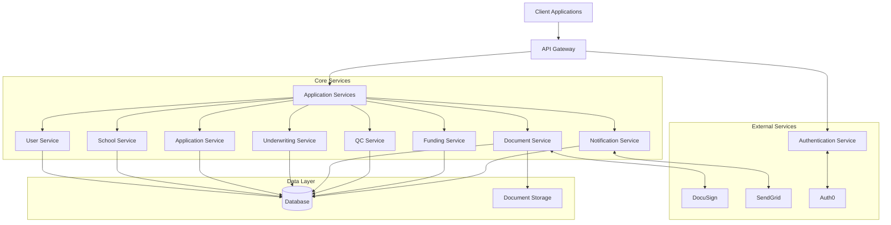

### 2.2 Component Descriptions

#### 2.2.1 User Service
Manages user authentication, authorization, and profile information for all user types.

#### 2.2.2 School Service
Handles school and program management, including configurations for educational institutions.

#### 2.2.3 Application Service
Processes loan applications, validates data, and manages application status throughout the lifecycle.

#### 2.2.4 Underwriting Service
Facilitates the review and decision-making process for loan applications.

#### 2.2.5 Document Service
Generates, manages, and tracks loan documents, including e-signature integration.

#### 2.2.6 QC Service
Performs quality control reviews of completed document packages before funding.

#### 2.2.7 Funding Service
Manages the disbursement process after QC approval.

#### 2.2.8 Notification Service
Sends email notifications at key points in the loan process.

### 2.3 Data Flow

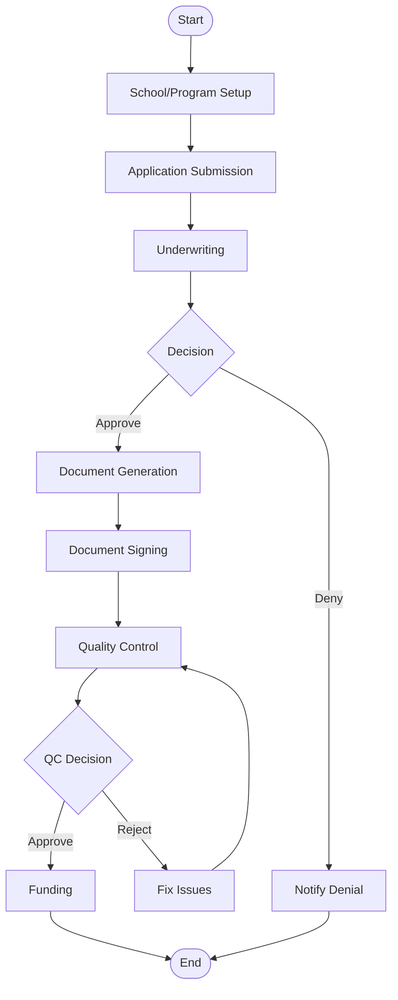

## 3. Core Domain Models

### 3.1 User Model

The system supports multiple user types with role-specific profiles:

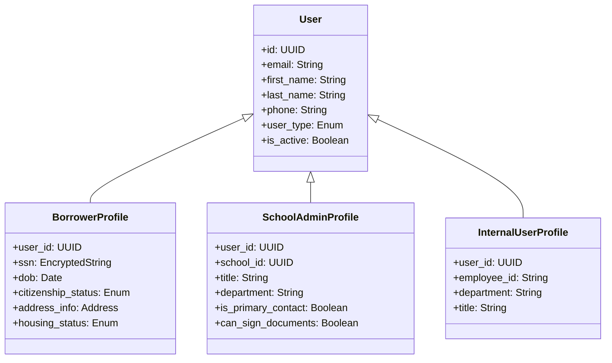

### 3.2 School and Program Model

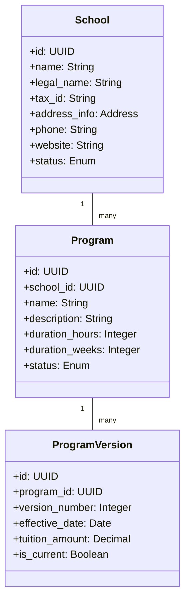

### 3.3 Loan Application Model

```mermaid
classDiagram
    class LoanApplication {
        +id: UUID
        +borrower_id: UUID
        +co_borrower_id: UUID
        +school_id: UUID
        +program_id: UUID
        +program_version_id: UUID
        +application_type: Enum
        +status: Enum
        +submission_date: DateTime
    }
    
    class LoanDetails {
        +application_id: UUID
        +tuition_amount: Decimal
        +deposit_amount: Decimal
        +other_funding: Decimal
        +requested_amount: Decimal
        +approved_amount: Decimal
        +start_date: Date
        +completion_date: Date
    }
    
    class ApplicationDocument {
        +id: UUID
        +application_id: UUID
        +document_type: Enum
        +file_path: String
        +status: Enum
    }
    
    LoanApplication "1" -- "1" LoanDetails
    LoanApplication "1" -- "many" ApplicationDocument
```

### 3.4 Underwriting Model

```mermaid
classDiagram
    class UnderwritingQueue {
        +id: UUID
        +application_id: UUID
        +assigned_to: UUID
        +priority: Enum
        +status: Enum
        +due_date: DateTime
    }
    
    class UnderwritingDecision {
        +application_id: UUID
        +decision: Enum
        +decision_date: DateTime
        +underwriter_id: UUID
        +approved_amount: Decimal
        +interest_rate: Decimal
        +term_months: Integer
    }
    
    class Stipulation {
        +id: UUID
        +application_id: UUID
        +stipulation_type: Enum
        +description: String
        +required_by_date: Date
        +status: Enum
    }
    
    LoanApplication "1" -- "1" UnderwritingQueue
    LoanApplication "1" -- "1" UnderwritingDecision
    LoanApplication "1" -- "many" Stipulation
```

### 3.5 Document Model

```mermaid
classDiagram
    class DocumentTemplate {
        +id: UUID
        +name: String
        +document_type: Enum
        +file_path: String
        +version: String
        +is_active: Boolean
    }
    
    class DocumentPackage {
        +id: UUID
        +application_id: UUID
        +package_type: Enum
        +status: Enum
        +expiration_date: DateTime
    }
    
    class Document {
        +id: UUID
        +package_id: UUID
        +document_type: Enum
        +file_path: String
        +status: Enum
    }
    
    class SignatureRequest {
        +id: UUID
        +document_id: UUID
        +signer_id: UUID
        +signer_type: Enum
        +status: Enum
        +requested_at: DateTime
        +completed_at: DateTime
    }
    
    DocumentTemplate "1" -- "many" Document
    DocumentPackage "1" -- "many" Document
    Document "1" -- "many" SignatureRequest
```

### 3.6 Quality Control Model

```mermaid
classDiagram
    class QCReview {
        +id: UUID
        +application_id: UUID
        +status: Enum
        +assigned_to: UUID
        +completed_at: DateTime
    }
    
    class DocumentVerification {
        +id: UUID
        +qc_review_id: UUID
        +document_id: UUID
        +status: Enum
        +verified_by: UUID
        +verified_at: DateTime
    }
    
    class QCStipulationVerification {
        +id: UUID
        +qc_review_id: UUID
        +stipulation_id: UUID
        +status: Enum
        +verified_by: UUID
        +verified_at: DateTime
    }
    
    class QCChecklistItem {
        +id: UUID
        +qc_review_id: UUID
        +category: Enum
        +item_text: String
        +status: Enum
        +verified_by: UUID
    }
    
    LoanApplication "1" -- "1" QCReview
    QCReview "1" -- "many" DocumentVerification
    QCReview "1" -- "many" QCStipulationVerification
    QCReview "1" -- "many" QCChecklistItem
```

### 3.7 Funding Model

```mermaid
classDiagram
    class FundingRequest {
        +id: UUID
        +application_id: UUID
        +status: Enum
        +requested_amount: Decimal
        +approved_amount: Decimal
    }
    
    class Disbursement {
        +id: UUID
        +funding_request_id: UUID
        +amount: Decimal
        +disbursement_date: DateTime
        +disbursement_method: Enum
        +status: Enum
    }
    
    class EnrollmentVerification {
        +id: UUID
        +application_id: UUID
        +verification_type: Enum
        +verified_by: UUID
        +start_date: Date
    }
    
    LoanApplication "1" -- "1" FundingRequest
    FundingRequest "1" -- "many" Disbursement
    FundingRequest "1" -- "1" EnrollmentVerification
```

## 4. Key Workflows

### 4.1 Loan Application Process

```mermaid
flowchart TD
    Start([Start]) --> SchoolSelect[School/User selects program and initiates application]
    SchoolSelect --> BorrowerInfo[Collect borrower information]
    BorrowerInfo --> CoBorrowerDecision{Co-borrower needed?}
    CoBorrowerDecision -->|Yes| CoBorrowerInfo[Collect co-borrower information]
    CoBorrowerDecision -->|No| LoanDetails[Calculate loan amount details]
    CoBorrowerInfo --> LoanDetails
    LoanDetails --> ValidateApp{Validate application}
    ValidateApp -->|Invalid| FixErrors[Return errors to applicant]
    FixErrors --> ValidateApp
    ValidateApp -->|Valid| SubmitApp[Submit application]
    SubmitApp --> SendConfirmation[Send confirmation emails]
    SendConfirmation --> DocRequest[Request required documents]
    DocRequest --> CreditCheck[Pull credit information]
    CreditCheck --> UnderwritingQueue[Place in underwriting queue]
    UnderwritingQueue --> UnderwriterReview[Underwriter reviews application]
    UnderwriterReview --> UnderwritingDecision{Decision?}
    UnderwritingDecision -->|Approve| SetStipulations[Set stipulations if any]
    UnderwritingDecision -->|Deny| DenialProcess[Process denial]
    UnderwritingDecision -->|Revise| RevisionProcess[Request application revision]
    SetStipulations --> SendCommitment[Send commitment letter to school]
    DenialProcess --> NotifySchool[Notify school of denial]
    DenialProcess --> NotifyApplicants[Send denial notice to applicants]
    RevisionProcess --> NotifySchoolRevision[Notify school of needed revisions]
    NotifySchool --> End([End - Denial])
    NotifyApplicants --> End
    NotifySchoolRevision --> SchoolReview[School reviews revision request]
    SendCommitment --> SchoolReview[School reviews commitment letter]
    SchoolReview --> SchoolDecision{School decision?}
    SchoolDecision -->|Accept| SchoolSignature[School signs commitment letter]
    SchoolDecision -->|Decline| ProcessDecline[Process school decline]
    SchoolDecision -->|Counteroffer| ProcessCounter[Process counteroffer]
    ProcessDecline --> End([End - School Declined])
    ProcessCounter --> UnderwriterReview
    SchoolSignature --> SendDocPackage[Send document package for signatures]
    SendDocPackage --> CollectSignatures[Collect borrower/co-borrower signatures]
    CollectSignatures --> SchoolFinalSign[School completes final signatures]
    SchoolFinalSign --> UploadDocs[Upload required documents/stipulations]
    UploadDocs --> QCReview[Quality Control review]
    QCReview --> QCDecision{QC approval?}
    QCDecision -->|No| FixIssues[Address QC issues]
    FixIssues --> QCReview
    QCDecision -->|Yes| UnisaSignature[UNISA signs document package]
    UnisaSignature --> StoreDocuments[Store authoritative copies]
    StoreDocuments --> ConfirmStart[School confirms student start]
    ConfirmStart --> ProcessFunding[Process funding]
    ProcessFunding --> End([End - Funded])
```

### 4.2 Underwriting Process

```mermaid
flowchart TD
    Start([Start]) --> AppQueue[Application enters underwriting queue]
    AppQueue --> AssignUnderwriter[Assign to underwriter]
    AssignUnderwriter --> ReviewApp[Review application details]
    ReviewApp --> ReviewDocs[Review supporting documents]
    ReviewDocs --> ReviewCredit[Review credit information]
    ReviewCredit --> EvaluateRisk[Evaluate risk factors]
    EvaluateRisk --> Decision{Make decision}
    
    Decision -->|Approve| ApprovalPath[Approval path]
    Decision -->|Deny| DenialPath[Denial path]
    Decision -->|Revise| RevisionPath[Revision path]
    
    ApprovalPath --> SetTerms[Set loan terms]
    SetTerms --> SetStipulations[Set stipulations if needed]
    SetStipulations --> RecordApproval[Record approval decision]
    RecordApproval --> GenerateCommitment[Generate commitment letter]
    GenerateCommitment --> NotifySchool[Notify school of approval]
    NotifySchool --> End1([End - Approved])
    
    DenialPath --> SelectReasons[Select denial reasons]
    SelectReasons --> RecordDenial[Record denial decision]
    RecordDenial --> GenerateDenial[Generate denial notice]
    GenerateDenial --> NotifySchoolDenial[Notify school of denial]
    NotifySchoolDenial --> NotifyApplicants[Send denial notice to applicants]
    NotifyApplicants --> End2([End - Denied])
    
    RevisionPath --> SpecifyChanges[Specify required changes]
    SpecifyChanges --> RecordRevision[Record revision request]
    RecordRevision --> NotifySchoolRevision[Notify school of revision needs]
    NotifySchoolRevision --> End3([End - Revision Requested])
```

### 4.3 Document Signing Process

```mermaid
flowchart TD
    Start([Start]) --> CommitmentApproved[Commitment letter approved]
    CommitmentApproved --> SendToSchool[Send commitment letter to school]
    SendToSchool --> SchoolReviews[School reviews commitment letter]
    SchoolReviews --> SchoolDecision{School decision?}
    
    SchoolDecision -->|Accept| SchoolSigns[School signs commitment letter]
    SchoolDecision -->|Decline| ProcessDecline[Process school decline]
    SchoolDecision -->|Counteroffer| ProcessCounter[Process counteroffer]
    
    ProcessDecline --> End1([End - Declined])
    ProcessCounter --> ReturnToUnderwriting[Return to underwriting]
    ReturnToUnderwriting --> End2([End - In Underwriting])
    
    SchoolSigns --> GenerateDocPackage[Generate document package]
    GenerateDocPackage --> SendToBorrowers[Send package to borrower/co-borrower]
    SendToBorrowers --> TrackSignatures[Track signature status]
    TrackSignatures --> CheckStatus{All signatures collected?}
    
    CheckStatus -->|No| CheckExpiry{90-day clock expired?}
    CheckStatus -->|Yes| SchoolFinalSign[School completes final signatures]
    
    CheckExpiry -->|Yes| ExpireProcess[Process expiration]
    CheckExpiry -->|No| SendReminder[Send reminder]
    SendReminder --> TrackSignatures
    
    ExpireProcess --> End3([End - Expired])
    
    SchoolFinalSign --> UploadEnrollment[School uploads enrollment agreement]
    UploadEnrollment --> UploadStipulations[Upload required stipulations]
    UploadStipulations --> ReturnToUnisa[Return package to UNISA]
    ReturnToUnisa --> QCReview[Quality Control review]
    QCReview --> QCDecision{QC approval?}
    
    QCDecision -->|No| FixIssues[Address QC issues]
    QCDecision -->|Yes| UnisaSign[UNISA signs document package]
    
    FixIssues --> QCReview
    
    UnisaSign --> StoreDocuments[Store in document repository]
    StoreDocuments --> End4([End - Documents Complete])
```

### 4.4 Quality Control Process

```mermaid
flowchart TD
    Start([Start]) --> DocsComplete[Documents complete and signed]
    DocsComplete --> AssignQC[Assign to QC reviewer]
    AssignQC --> ReviewDocs[Review document package]
    ReviewDocs --> VerifyDocs[Verify document accuracy]
    VerifyDocs --> VerifyStips[Verify stipulations]
    VerifyStips --> CompleteChecklist[Complete QC checklist]
    CompleteChecklist --> QCDecision{QC Decision}
    
    QCDecision -->|Approve| ApproveForFunding[Approve for funding]
    QCDecision -->|Return| ReturnForCorrection[Return for correction]
    
    ReturnForCorrection --> SpecifyIssues[Specify issues to fix]
    SpecifyIssues --> NotifySchool[Notify school of issues]
    NotifySchool --> FixIssues[School fixes issues]
    FixIssues --> ReviewDocs
    
    ApproveForFunding --> UpdateStatus[Update application status]
    UpdateStatus --> NotifyFunding[Notify funding team]
    NotifyFunding --> End([End])
```

### 4.5 Funding Process

```mermaid
flowchart TD
    Start([Start]) --> DocsComplete[Documents complete and QC approved]
    DocsComplete --> ConfirmEnrollment[School confirms enrollment/start date]
    ConfirmEnrollment --> ValidateStipulations[Validate all stipulations met]
    ValidateStipulations --> StipulationsCheck{All stipulations met?}
    
    StipulationsCheck -->|No| RequestMissingItems[Request missing items]
    StipulationsCheck -->|Yes| FinalReview[Final funding review]
    
    RequestMissingItems --> ReceiveItems[Receive missing items]
    ReceiveItems --> ValidateStipulations
    
    FinalReview --> FundingApproval{Funding approved?}
    
    FundingApproval -->|No| AddressFundingIssues[Address funding issues]
    FundingApproval -->|Yes| ScheduleDisbursement[Schedule disbursement]
    
    AddressFundingIssues --> FinalReview
    
    ScheduleDisbursement --> ProcessPayment[Process payment to school]
    ProcessPayment --> ConfirmDisbursement[Confirm disbursement]
    ConfirmDisbursement --> NotifySchool[Notify school of funding]
    NotifySchool --> UpdateLoanStatus[Update loan status to funded]
    UpdateLoanStatus --> End([End - Loan Funded])
```

## 5. User Roles and Permissions

### 5.1 Role Definitions

| Role | Description | Primary Responsibilities |
|------|-------------|--------------------------|
| Borrower | Primary loan applicant | - Submit loan applications<br>- Upload required documents<br>- Sign loan agreements<br>- View application status |
| Co-Borrower | Secondary loan applicant | - Provide personal/financial information<br>- Sign loan agreements<br>- View application status |
| School Administrator | School representative | - Initiate applications<br>- Review applications<br>- Sign commitment letters<br>- Confirm enrollment<br>- Upload school documents |
| Underwriter | Internal loan evaluator | - Review applications<br>- Evaluate credit information<br>- Make approval decisions<br>- Set stipulations |
| Quality Control (QC) | Internal compliance reviewer | - Review completed document packages<br>- Verify stipulations<br>- Approve for funding |
| System Administrator | Internal system manager | - Manage users<br>- Configure schools and programs<br>- System configuration<br>- Template management |

### 5.2 Permission Matrix

| Feature/Resource | Borrower | Co-Borrower | School Admin | Underwriter | QC | System Admin |
|------------------|----------|-------------|--------------|-------------|----|--------------| 
| View Own Profile | ✓ | ✓ | ✓ | ✓ | ✓ | ✓ |
| Edit Own Profile | ✓ | ✓ | ✓ | ✓ | ✓ | ✓ |
| Create Application | ✓ | - | ✓ | - | - | ✓ |
| View Own Applications | ✓ | ✓ | - | - | - | - |
| View School Applications | - | - | ✓ | - | - | ✓ |
| View All Applications | - | - | - | ✓ | ✓ | ✓ |
| Make Underwriting Decisions | - | - | - | ✓ | - | - |
| Perform QC Review | - | - | - | - | ✓ | - |
| Sign Loan Documents | ✓ | ✓ | ✓ | - | - | ✓ |
| Manage Schools | - | - | - | - | - | ✓ |
| Manage Programs | - | - | ✓ | - | - | ✓ |
| Manage Users | - | - | - | - | - | ✓ |
| Manage Templates | - | - | - | - | - | ✓ |
| View Reports | - | - | ✓ | ✓ | ✓ | ✓ |

## 6. Technical Implementation

### 6.1 Technology Stack

#### 6.1.1 Backend

- **Language**: Python 3.11+
- **Framework**: Django 4.2+
- **API**: Django REST Framework
- **Database**: PostgreSQL 15+
- **Task Queue**: Celery with Redis
- **Authentication**: Auth0 integration

#### 6.1.2 Frontend

- **Language**: TypeScript
- **Framework**: React 18.0+
- **State Management**: Redux
- **UI Components**: Material-UI
- **Form Handling**: Formik

#### 6.1.3 Infrastructure

- **Cloud Provider**: AWS
- **Containerization**: Docker
- **Orchestration**: AWS ECS
- **Storage**: AWS S3
- **Caching**: Redis
- **CDN**: CloudFront

### 6.2 Security Implementation

#### 6.2.1 Authentication

- OAuth 2.0/OIDC with Auth0
- JWT tokens for API authentication
- Role-based access control
- Multi-factor authentication for internal users

#### 6.2.2 Data Protection

- Encryption at rest for sensitive data
- TLS 1.2+ for all communications
- Field-level encryption for PII (SSN, DOB)
- Secure document storage with access controls

#### 6.2.3 Compliance

- GLBA compliance for financial data
- FCRA compliance for credit information
- SOC 2 controls for security and availability
- Comprehensive audit logging

### 6.3 Integration Points

#### 6.3.1 E-Signature Integration

- DocuSign API integration for electronic signatures
- Secure envelope creation and tracking
- Signature status webhooks
- Document retrieval and storage

#### 6.3.2 Email Notifications

- SendGrid integration for email delivery
- Template-based email content
- Delivery tracking and reporting
- Scheduled reminders

#### 6.3.3 Document Storage

- S3 for secure document storage
- Versioning for document history
- Presigned URLs for secure access
- Retention policies for compliance

## 7. User Interfaces

### 7.1 Borrower Interfaces

#### 7.1.1 Borrower Dashboard

```
+------------------------------------------------------------------------------+
| [=] Loan Management System                          [@] John Smith [v]       |
+------------------------------------------------------------------------------+
| [#] Dashboard | [$] My Applications | [i] Documents | [@] Profile | [?] Help |
+------------------------------------------------------------------------------+
| Welcome, John                                                                |
+------------------------------------------------------------------------------+
| MY APPLICATIONS                                                              |
+------------------------------------------------------------------------------+
| ID        | School          | Program        | Amount    | Status    | Action |
|-----------|-----------------|----------------|-----------|-----------|--------|
| APP-1001  | ABC School      | Web Dev        | $10,000   | Approved  | [View] |
| APP-1002  | XYZ Academy     | Data Science   | $15,000   | Pending   | [View] |
+------------------------------------------------------------------------------+
| [+ New Application]                                                          |
+------------------------------------------------------------------------------+
| DOCUMENTS REQUIRING SIGNATURE                                                |
+------------------------------------------------------------------------------+
| Document                | Application | Due Date   | Status     | Action     |
|-----------------------|------------|------------|------------|-------------|
| Loan Agreement        | APP-1001   | 05/15/2023 | Pending    | [Sign Now]  |
| Disclosure Form       | APP-1001   | 05/15/2023 | Completed  | [View]      |
+------------------------------------------------------------------------------+
| RECENT NOTIFICATIONS                                                         |
+------------------------------------------------------------------------------+
| [!] Your application APP-1001 has been approved                              |
| [i] Please sign your loan documents by 05/15/2023                            |
+------------------------------------------------------------------------------+
```

#### 7.1.2 Application Form

```
+------------------------------------------------------------------------------+
| [=] Loan Management System                          [@] John Smith [v]       |
+------------------------------------------------------------------------------+
| [#] Dashboard | [$] My Applications | [i] Documents | [@] Profile | [?] Help |
+------------------------------------------------------------------------------+
| New Loan Application                                                         |
+------------------------------------------------------------------------------+
| [====================================                  ] Step 2 of 5          |
+------------------------------------------------------------------------------+
| PERSONAL INFORMATION                                                         |
+------------------------------------------------------------------------------+
| First Name:      [...................] Middle Name: [...................]    |
| Last Name:       [...................]                                       |
| SSN:             [...................] DOB:         [MM/DD/YYYY]             |
| Email:           [...................] Phone:       [...................]    |
| US Citizen:      (•) Yes ( ) No                                              |
|                                                                              |
| Street Address:  [......................................................]    |
| City:            [...................] State: [v] Zip: [...........]         |
|                                                                              |
| Housing Status:  ( ) Own (•) Rent    Monthly Payment: [$............]        |
+------------------------------------------------------------------------------+
| [< Back]                                                      [Next >]       |
+------------------------------------------------------------------------------+
```

#### 7.1.3 Document Signing

```
+------------------------------------------------------------------------------+
| [=] Loan Management System                          [@] John Smith [v]       |
+------------------------------------------------------------------------------+
| [#] Dashboard | [$] My Applications | [i] Documents | [@] Profile | [?] Help |
+------------------------------------------------------------------------------+
| Document Signing - Loan Agreement APP-1001                                   |
+------------------------------------------------------------------------------+
| DOCUMENT PREVIEW                                                             |
+------------------------------------------------------------------------------+
|                                                                              |
|                      LOAN AGREEMENT                                          |
|                                                                              |
|  This agreement is made between John Smith ("Borrower") and                  |
|  Loan Management System ("Lender") for the purpose of financing              |
|  education at ABC School.                                                    |
|                                                                              |
|  Loan Amount: $10,000                                                        |
|  Interest Rate: 5.25%                                                        |
|  Term: 36 months                                                             |
|                                                                              |
|  ...                                                                         |
|                                                                              |
|  Signature: _________________                                                |
|                                                                              |
+------------------------------------------------------------------------------+
| [i] By clicking "Sign Document", you agree to the terms and conditions       |
| outlined in this document and consent to electronic signature.               |
+------------------------------------------------------------------------------+
| [< Back]                                             [Sign Document]         |
+------------------------------------------------------------------------------+
```

### 7.2 School Administrator Interfaces

#### 7.2.1 School Admin Dashboard

```
+------------------------------------------------------------------------------+
| [=] Loan Management System                    [@] Sarah Johnson (ABC) [v]    |
+------------------------------------------------------------------------------+
| [#] Dashboard | [$] Applications | [i] Programs | [@] Users | [?] Help       |
+------------------------------------------------------------------------------+
| Welcome, Sarah                                                               |
+------------------------------------------------------------------------------+
| APPLICATIONS OVERVIEW                                                        |
+------------------------------------------------------------------------------+
| New:        12  |  In Review:  5  |  Approved:  28  |  Declined:  3          |
+------------------------------------------------------------------------------+
| RECENT APPLICATIONS                                                          |
+------------------------------------------------------------------------------+
| ID        | Student         | Program        | Amount    | Status    | Action |
|-----------|-----------------|----------------|-----------|-----------|--------|
| APP-1005  | Michael Brown   | Data Science   | $15,000   | New       | [View] |
| APP-1004  | Lisa Chen       | Web Dev        | $10,000   | In Review | [View] |
| APP-1003  | David Wilson    | UX Design      | $12,000   | Approved  | [View] |
+------------------------------------------------------------------------------+
| [+ New Application]                [View All Applications]                   |
+------------------------------------------------------------------------------+
| DOCUMENTS REQUIRING SIGNATURE                                                |
+------------------------------------------------------------------------------+
| Document                | Student        | Due Date   | Status     | Action   |
|-----------------------|---------------|------------|------------|-----------|
| Commitment Letter      | David Wilson   | 05/10/2023 | Pending    | [Sign]   |
| Enrollment Agreement   | Lisa Chen      | 05/12/2023 | Pending    | [Sign]   |
+------------------------------------------------------------------------------+
| PROGRAM SUMMARY                                                              |
+------------------------------------------------------------------------------+
| Program           | Active Students | Funding Volume | Avg. Approval Rate    |
|-------------------|----------------|---------------|------------------------|
| Web Development   | 15             | $150,000      | 92%                    |
| Data Science      | 12             | $180,000      | 85%                    |
| UX Design         | 8              | $96,000       | 88%                    |
+------------------------------------------------------------------------------+
```

#### 7.2.2 Program Management

```
+------------------------------------------------------------------------------+
| [=] Loan Management System                    [@] Sarah Johnson (ABC) [v]    |
+------------------------------------------------------------------------------+
| [#] Dashboard | [$] Applications | [i] Programs | [@] Users | [?] Help       |
+------------------------------------------------------------------------------+
| Programs                                                                     |
+------------------------------------------------------------------------------+
| ACTIVE PROGRAMS                                                              |
+------------------------------------------------------------------------------+
| Program Name      | Duration | Tuition   | Status  | Students | Action       |
|-------------------|----------|-----------|---------|----------|--------------|
| Web Development   | 12 weeks | $10,000   | Active  | 15       | [Edit]       |
| Data Science      | 16 weeks | $15,000   | Active  | 12       | [Edit]       |
| UX Design         | 10 weeks | $12,000   | Active  | 8        | [Edit]       |
+------------------------------------------------------------------------------+
| [+ Add Program]                                                              |
+------------------------------------------------------------------------------+
```

### 7.3 Underwriter Interfaces

#### 7.3.1 Underwriter Dashboard

```
+------------------------------------------------------------------------------+
| [=] Loan Management System                      [@] Robert Taylor [v]        |
+------------------------------------------------------------------------------+
| [#] Dashboard | [$] Applications | [i] Reports | [@] Settings | [?] Help     |
+------------------------------------------------------------------------------+
| Welcome, Robert                                                              |
+------------------------------------------------------------------------------+
| UNDERWRITING QUEUE                                                           |
+------------------------------------------------------------------------------+
| Assigned to you: 8  |  Pending review: 15  |  Completed today: 6             |
+------------------------------------------------------------------------------+
| YOUR ASSIGNED APPLICATIONS                                                   |
+------------------------------------------------------------------------------+
| ID        | Applicant       | School      | Amount    | Received   | Action  |
|-----------|-----------------|-------------|-----------|------------|---------|
| APP-1004  | Lisa Chen       | ABC School  | $10,000   | 05/01/2023 | [Review]|
| APP-1005  | Michael Brown   | ABC School  | $15,000   | 05/01/2023 | [Review]|
| APP-1006  | Jennifer Lee    | XYZ Academy | $12,500   | 05/02/2023 | [Review]|
+------------------------------------------------------------------------------+
| [View All Assigned]                                                          |
+------------------------------------------------------------------------------+
| PERFORMANCE METRICS                                                          |
+------------------------------------------------------------------------------+
| Average decision time: 1.2 days  |  Applications processed: 45 (this week)   |
| Approval rate: 82%               |  Decisions pending review: 2              |
+------------------------------------------------------------------------------+
```

#### 7.3.2 Application Review

```
+------------------------------------------------------------------------------+
| [=] Loan Management System                      [@] Robert Taylor [v]        |
+------------------------------------------------------------------------------+
| [#] Dashboard | [$] Applications | [i] Reports | [@] Settings | [?] Help     |
+------------------------------------------------------------------------------+
| Application Review - APP-1004                                                |
+------------------------------------------------------------------------------+
| APPLICANT INFORMATION                | CREDIT INFORMATION                    |
|-------------------------------------|-------------------------------------|
| Name: Lisa Chen                      | Credit Score: 720                    |
| SSN: XXX-XX-1234                     | Monthly Debt: $1,200                 |
| DOB: 05/15/1990                      | Debt-to-Income: 32%                  |
| Citizenship: US Citizen              | [View Full Credit Report]            |
|                                      |                                     |
| Address: 123 Main St                 | EMPLOYMENT INFORMATION               |
| Anytown, ST 12345                    |-------------------------------------|
| Housing: Rent - $1,500/month         | Employer: Tech Solutions Inc.        |
|                                      | Occupation: Software Developer       |
|                                      | Years Employed: 3.5                  |
|                                      | Annual Income: $85,000               |
+------------------------------------------------------------------------------+
| CO-APPLICANT INFORMATION             | LOAN DETAILS                         |
|-------------------------------------|-------------------------------------|
| Name: N/A                            | School: ABC School                   |
|                                      | Program: Web Development             |
|                                      | Tuition: $10,000                     |
|                                      | Requested Amount: $10,000            |
|                                      | Start Date: 06/01/2023               |
+------------------------------------------------------------------------------+
| DOCUMENTS                                                                    |
+------------------------------------------------------------------------------+
| [x] Driver's License      [View]                                             |
| [x] Proof of Income       [View]                                             |
| [ ] Enrollment Agreement  [Not Uploaded]                                     |
+------------------------------------------------------------------------------+
| UNDERWRITING DECISION                                                        |
+------------------------------------------------------------------------------+
| Decision:                                                                    |
| ( ) Approve                                                                  |
| ( ) Deny                                                                     |
| ( ) Request Revision                                                         |
|                                                                              |
| Approved Amount: [$10,000.......]                                            |
| Interest Rate:   [5.25%........]                                             |
| Term (months):   [36............]                                            |
|                                                                              |
| Stipulations:                                                                |
| [ ] Enrollment Agreement                                                     |
| [ ] Additional Proof of Income                                               |
| [ ] Proof of Residence                                                       |
| [ ] Co-signer Required                                                       |
|                                                                              |
| Comments:                                                                    |
| [................................................................]          |
| [................................................................]          |
+------------------------------------------------------------------------------+
| [Save Draft]                                              [Submit Decision]  |
+------------------------------------------------------------------------------+
```

### 7.4 Quality Control Interfaces

#### 7.4.1 QC Dashboard

```
+------------------------------------------------------------------------------+
| [=] Loan Management System                        [@] Patricia Lopez [v]     |
+------------------------------------------------------------------------------+
| [#] Dashboard | [$] QC Review | [i] Reports | [@] Settings | [?] Help        |
+------------------------------------------------------------------------------+
| Welcome, Patricia                                                            |
+------------------------------------------------------------------------------+
| QC REVIEW QUEUE                                                              |
+------------------------------------------------------------------------------+
| Pending review: 12  |  Completed today: 8  |  Returned for correction: 3     |
+------------------------------------------------------------------------------+
| APPLICATIONS READY FOR QC                                                    |
+------------------------------------------------------------------------------+
| ID        | Applicant       | School      | Amount    | Docs Complete | Action|
|-----------|-----------------|-------------|-----------|---------------|-------|
| APP-1001  | John Smith      | ABC School  | $10,000   | 05/01/2023    |[Review]|
| APP-1003  | David Wilson    | ABC School  | $12,000   | 05/02/2023    |[Review]|
| APP-1007  | Amanda Garcia   | XYZ Academy | $14,500   | 05/02/2023    |[Review]|
+------------------------------------------------------------------------------+
| [View All Pending]                                                           |
+------------------------------------------------------------------------------+
| APPLICATIONS PENDING FUNDING                                                 |
+------------------------------------------------------------------------------+
| ID        | Applicant       | School      | Amount    | QC Approved   | Action|
|-----------|-----------------|-------------|-----------|---------------|-------|
| APP-0998  | Thomas Wright   | ABC School  | $9,500    | 04/30/2023    |[View] |
| APP-0999  | Sarah Johnson   | XYZ Academy | $13,000   | 04/30/2023    |[View] |
+------------------------------------------------------------------------------+
```

#### 7.4.2 QC Review Interface

```
+------------------------------------------------------------------------------+
| [=] Loan Management System                        [@] Patricia Lopez [v]     |
+------------------------------------------------------------------------------+
| [#] Dashboard | [$] QC Review | [i] Reports | [@] Settings | [?] Help        |
+------------------------------------------------------------------------------+
| QC Review - APP-1001                                                         |
+------------------------------------------------------------------------------+
| LOAN INFORMATION                                                             |
+------------------------------------------------------------------------------+
| Applicant: John Smith                | School: ABC School                    |
| Program: Web Development             | Amount: $10,000                       |
| Term: 36 months                      | Interest Rate: 5.25%                  |
+------------------------------------------------------------------------------+
| DOCUMENT VERIFICATION                                                        |
+------------------------------------------------------------------------------+
| Document               | Status      | Last Updated | Verification           |
|------------------------|-------------|-------------|------------------------|
| Loan Agreement         | Signed      | 05/01/2023  | [x] Verified           |
| Disclosure Forms       | Signed      | 05/01/2023  | [x] Verified           |
| Enrollment Agreement   | Uploaded    | 05/01/2023  | [ ] Verified           |
| Proof of Income        | Uploaded    | 04/28/2023  | [x] Verified           |
| Driver's License       | Uploaded    | 04/28/2023  | [x] Verified           |
+------------------------------------------------------------------------------+
| STIPULATION VERIFICATION                                                     |
+------------------------------------------------------------------------------+
| Stipulation            | Status      | Last Updated | Verification           |
|------------------------|-------------|-------------|------------------------|
| Enrollment Agreement   | Satisfied   | 05/01/2023  | [ ] Verified           |
+------------------------------------------------------------------------------+
| VERIFICATION CHECKLIST                                                       |
+------------------------------------------------------------------------------+
| [x] All required documents are present and signed                            |
| [x] Loan amount matches approved amount                                      |
| [x] Borrower information is consistent across documents                      |
| [ ] Program details match enrollment agreement                               |
| [x] All stipulations have been satisfied                                     |
| [x] Signatures are valid and complete                                        |
+------------------------------------------------------------------------------+
| NOTES                                                                        |
+------------------------------------------------------------------------------+
| [Need to verify program details on enrollment agreement match loan docs...]  |
+------------------------------------------------------------------------------+
| QC DECISION                                                                  |
+------------------------------------------------------------------------------+
| ( ) Approve for Funding                                                      |
| ( ) Return for Correction                                                    |
|                                                                              |
| Reason for Return:                                                           |
| [................................................................]          |
+------------------------------------------------------------------------------+
| [Cancel]                                                     [Submit]        |
+------------------------------------------------------------------------------+
```

### 7.5 System Administrator Interfaces

#### 7.5.1 User Management

```
+------------------------------------------------------------------------------+
| [=] Loan Management System                         [@] Admin User [v]        |
+------------------------------------------------------------------------------+
| [#] Dashboard | [$] Schools | [i] Users | [@] Settings | [?] Help            |
+------------------------------------------------------------------------------+
| User Management                                                              |
+------------------------------------------------------------------------------+
| FILTERS                                                                      |
+------------------------------------------------------------------------------+
| Role: [v] All          Status: [v] All          Search: [............]       |
| [Apply Filters]                                                              |
+------------------------------------------------------------------------------+
| USERS (45 total)                                                             |
+------------------------------------------------------------------------------+
| ID      | Name           | Email                | Role        | Status | Action|
|---------|----------------|----------------------|-------------|--------|-------|
| USR-001 | John Smith     | john@example.com     | Borrower    | Active |[Edit] |
| USR-002 | Sarah Johnson  | sarah@abcschool.edu  | School Admin| Active |[Edit] |
| USR-003 | Robert Taylor  | robert@loanmgmt.com  | Underwriter | Active |[Edit] |
| USR-004 | Patricia Lopez | patricia@loanmgmt.com| QC          | Active |[Edit] |
| USR-005 | David Wilson   | david@example.com    | Borrower    | Active |[Edit] |
+------------------------------------------------------------------------------+
| [< 1 2 3 ... >]                                                              |
+------------------------------------------------------------------------------+
| [+ Add User]                [Export to CSV]                                  |
+------------------------------------------------------------------------------+
```

#### 7.5.2 School Management

```
+------------------------------------------------------------------------------+
| [=] Loan Management System                         [@] Admin User [v]        |
+------------------------------------------------------------------------------+
| [#] Dashboard | [$] Schools | [i] Users | [@] Settings | [?] Help            |
+------------------------------------------------------------------------------+
| School Management                                                            |
+------------------------------------------------------------------------------+
| SCHOOLS                                                                      |
+------------------------------------------------------------------------------+
| ID      | Name           | Programs | Users | Status | Applications | Action |
|---------|----------------|----------|-------|--------|--------------|--------|
| SCH-001 | ABC School     | 3        | 5     | Active | 45           |[Edit]  |
| SCH-002 | XYZ Academy    | 2        | 3     | Active | 32           |[Edit]  |
| SCH-003 | Tech Institute | 4        | 4     | Active | 28           |[Edit]  |
+------------------------------------------------------------------------------+
| [+ Add School]                                                               |
+------------------------------------------------------------------------------+
```

## 8. Deployment Architecture

### 8.1 AWS Infrastructure

```mermaid
flowchart TD
    Internet((Internet)) --> CloudFront[CloudFront]
    CloudFront --> WAF[AWS WAF]
    WAF --> ALB[Application Load Balancer]
    
    subgraph "VPC"
        subgraph "Public Subnets"
            ALB
            NAT[NAT Gateway]
        end
        
        subgraph "Private Subnets - Application Tier"
            ECS[ECS Services]
        end
        
        subgraph "Private Subnets - Data Tier"
            RDS[(RDS Database)]
            ElastiCache[(ElastiCache)]
        end
        
        subgraph "Private Subnets - Integration Tier"
            Endpoints[VPC Endpoints]
        end
    end
    
    ALB --> ECS
    ECS --> RDS
    ECS --> ElastiCache
    ECS --> Endpoints
    
    Endpoints --> S3[S3]
    Endpoints --> SQS[SQS]
    Endpoints --> Secrets[Secrets Manager]
    Endpoints --> ECR[ECR]
    
    ECS --> NAT
    NAT --> Internet
```

### 8.2 Container Architecture

```mermaid
flowchart TD
    subgraph "ECS Cluster Architecture"
        ALB[Application Load Balancer]
        
        subgraph "Web Service"
            WebTask1[Web Task 1]
            WebTask2[Web Task 2]
            WebTaskN[Web Task N]
        end
        
        subgraph "API Service"
            APITask1[API Task 1]
            APITask2[API Task 2]
            APITaskN[API Task N]
        end
        
        subgraph "Document Service"
            DocTask1[Document Task 1]
            DocTask2[Document Task 2]
        end
        
        subgraph "Worker Service"
            WorkerTask1[Worker Task 1]
            WorkerTask2[Worker Task 2]
        end
    end
    
    ALB --> WebTask1
    ALB --> WebTask2
    ALB --> WebTaskN
    
    ALB --> APITask1
    ALB --> APITask2
    ALB --> APITaskN
    
    ALB --> DocTask1
    ALB --> DocTask2
```

### 8.3 CI/CD Pipeline

```mermaid
flowchart TD
    Code[Code Repository] --> PR[Pull Request]
    PR --> UnitTests[Unit Tests]
    UnitTests --> Lint[Linting & Static Analysis]
    Lint --> SecurityScan[Security Scanning]
    SecurityScan --> Build[Build Container Images]
    Build --> PushDev[Push to Dev Registry]
    
    subgraph "Quality Gates"
        UnitTests
        Lint
        SecurityScan
    end
    
    PushDev --> DeployDev[Deploy to Development]
    DeployDev --> IntegrationTests[Integration Tests]
    IntegrationTests --> E2ETests[End-to-End Tests]
    E2ETests --> Promote[Promote to Staging]
```

## 9. Monitoring and Observability

### 9.1 Monitoring Architecture

```mermaid
flowchart TD
    subgraph "Monitoring Sources"
        CloudWatch[AWS CloudWatch]
        XRay[AWS X-Ray]
        Custom[Custom Metrics]
    end
    
    subgraph "Aggregation & Analysis"
        Dashboards[CloudWatch Dashboards]
        Insights[CloudWatch Insights]
        Alarms[CloudWatch Alarms]
    end
    
    subgraph "Notification & Response"
        SNS[Amazon SNS]
        PagerDuty[PagerDuty]
        Slack[Slack Alerts]
        Lambda[Remediation Lambda]
    end
    
    CloudWatch --> Dashboards
    XRay --> Dashboards
    Custom --> Dashboards
    
    CloudWatch --> Insights
    CloudWatch --> Alarms
    
    Alarms --> SNS
    SNS --> PagerDuty
    SNS --> Slack
    SNS --> Lambda
```

### 9.2 Key Metrics

| Component | Key Metrics | Alerting Threshold |
|-----------|------------|-------------------|
| ECS Services | CPU/Memory utilization<br>Task count<br>Service errors | >80% CPU for 5 min<br><min task count<br>>1% error rate |
| RDS Database | CPU utilization<br>Free storage space<br>Connection count<br>Replica lag | >75% CPU for 10 min<br><20% free storage<br>>80% connections<br>>30 sec replica lag |
| API Endpoints | Latency<br>Error rate<br>Request count | >1s p95 latency<br>>1% error rate |
| Document Processing | Queue depth<br>Processing time<br>Error rate | >100 items in queue<br>>30s processing time<br>>2% error rate |

### 9.3 Business Metrics

| Business Metric | Definition | Target |
|-----------------|------------|--------|
| Application Completion Rate | % of started applications completed | >80% |
| Time to Decision | Hours from submission to underwriting decision | <48 hours |
| Approval Rate | % of applications approved | 60-80% |
| Document Completion Time | Hours from approval to completed signatures | <72 hours |
| Funding Time | Hours from document completion to disbursement | <24 hours |

## 10. Glossary

| Term | Definition |
|------|------------|
| Authoritative Copy | The legally definitive version of a loan document that is stored in a secure electronic vault after all signatures are collected. |
| Borrower | The primary applicant for the loan who will be responsible for repayment. |
| Co-Borrower | A secondary applicant who shares responsibility for loan repayment with the primary borrower. |
| Commitment Letter | A document sent to the school after loan approval, detailing the approved loan terms and conditions. |
| Debt-to-Income Ratio | A financial metric comparing a borrower's monthly debt payments to their gross monthly income, used in underwriting decisions. |
| Disbursement | The process of transferring approved loan funds to the school. |
| Document Package | A collection of loan documents requiring signatures from various parties, including the loan agreement, disclosures, and other forms. |
| E-Signature | An electronic method of signing documents that is legally binding and eliminates the need for physical signatures. |
| Enrollment Agreement | A document between the student and school confirming enrollment in a specific program, often required as a stipulation for loan funding. |
| Loan Application | The formal request for financing submitted by a borrower or school on behalf of a student. |
| Program | An educational course or curriculum offered by a school for which financing is being requested. |
| Quality Control (QC) | The process of reviewing completed loan documents to ensure accuracy, completeness, and compliance before funding. |
| School Administrator | A user associated with an educational institution who can initiate applications, review commitment letters, and sign documents. |
| Stipulation | A condition that must be satisfied before a loan can be funded, such as providing specific documentation. |
| Underwriting | The process of evaluating a loan application to determine approval, denial, or need for revisions. |

# Project Guide: Loan Management System

## 1. Introduction

The Loan Management System is a comprehensive web-based application designed to streamline the educational financing process. It enables schools, students (borrowers), co-borrowers, and internal staff to manage the entire loan application lifecycle from submission through underwriting, approval, document signing, and funding.

### 1.1 Purpose

This system addresses the inefficient, manual process of educational loan applications and management. It replaces paper-based workflows with a digital solution that centralizes tracking, automates key processes, and provides digital signature capabilities, resulting in faster processing times, fewer errors, and improved user experience.

### 1.2 Key Stakeholders

- **Educational institutions (schools)**: Offer financing options to students
- **Students (primary borrowers)**: Apply for educational loans
- **Co-borrowers**: Support student loan applications
- **Internal users**: Process and manage loan applications
  - Administrators
  - Underwriters
  - Loan processors
  - Quality control personnel

### 1.3 Business Impact

- Accelerated loan processing times
- Improved accuracy in underwriting decisions
- Enhanced compliance with lending regulations
- Increased satisfaction for educational institutions and borrowers
- Centralized tracking and management of loan applications
- Digital document handling and e-signature capabilities

## 2. System Overview

### 2.1 Core Features

1. **User Management**
   - Multiple user types with role-based access control
   - User profiles for borrowers, co-borrowers, school administrators, and internal staff
   - Secure authentication and authorization

2. **School & Program Management**
   - School profile creation and management
   - Educational program configuration with versioning
   - Program cost and duration tracking

3. **Loan Application Processing**
   - Comprehensive application form with validation
   - Document upload capabilities
   - Application status tracking
   - Multi-step workflow

4. **Underwriting Workflow**
   - Application review interface
   - Credit check integration
   - Decision recording (approve/deny/revise)
   - Stipulation management

5. **Document Management**
   - Template-based document generation
   - E-signature collection
   - Document storage and retrieval
   - Document status tracking

6. **Notification System**
   - Email notifications at key process points
   - Template-based communication
   - Delivery tracking

7. **Funding Process**
   - Disbursement tracking
   - Confirmation of student enrollment
   - Quality control review
   - Funding verification

8. **Reporting & Analytics**
   - Operational dashboards
   - Business intelligence metrics
   - Status and performance reporting

### 2.2 Technology Stack

#### Backend
- Python 3.11+ with Django 4.2+
- Django REST Framework for API development
- PostgreSQL 15+ for database
- Celery for asynchronous task processing
- Redis for caching and message broker

#### Frontend
- React 18.0+ with TypeScript
- Redux for state management
- Material-UI for UI components
- Formik for form handling

#### Infrastructure
- AWS (ECS, RDS, S3, ElastiCache, CloudFront)
- Docker for containerization
- Terraform for infrastructure as code
- GitHub Actions for CI/CD

### 2.3 System Architecture

The loan management system follows a multi-tiered architecture with clear separation of concerns:

```mermaid
flowchart TD
    subgraph "Client Layer"
        Browser[Web Browser]
        Browser --> React[React Frontend]
        React --> Redux[Redux State Management]
        React --> MaterialUI[Material-UI Components]
        React --> Formik[Formik Forms]
    end
    
    subgraph "API Layer"
        React --> DRF[Django REST Framework]
        DRF --> Django[Django Backend]
        Django --> Auth0[Auth0 Authentication]
    end
    
    subgraph "Service Layer"
        Django --> Celery[Celery Task Queue]
        Celery --> Redis[Redis Cache]
        Django --> DocuSign[DocuSign Integration]
        Django --> SendGrid[SendGrid Email]
        Django --> S3[AWS S3 Document Storage]
    end
    
    subgraph "Data Layer"
        Django --> PostgreSQL[PostgreSQL Database]
        Redis --> PostgreSQL
    end
    
    subgraph "Deployment Infrastructure"
        ECS[AWS ECS]
        RDS[AWS RDS]
        CloudFront[AWS CloudFront]
        ECS --> Django
        RDS --> PostgreSQL
        CloudFront --> React
    end
```

## 3. Core Workflows

### 3.1 Loan Application Process

The loan application process is the central workflow of the system:

```mermaid
flowchart TD
    Start([Start]) --> SchoolSelect[School/User selects program and initiates application]
    SchoolSelect --> BorrowerInfo[Collect borrower information]
    BorrowerInfo --> CoBorrowerDecision{Co-borrower needed?}
    CoBorrowerDecision -->|Yes| CoBorrowerInfo[Collect co-borrower information]
    CoBorrowerDecision -->|No| LoanDetails[Calculate loan amount details]
    CoBorrowerInfo --> LoanDetails
    LoanDetails --> ValidateApp{Validate application}
    ValidateApp -->|Invalid| FixErrors[Return errors to applicant]
    FixErrors --> ValidateApp
    ValidateApp -->|Valid| SubmitApp[Submit application]
    SubmitApp --> SendConfirmation[Send confirmation emails]
    SendConfirmation --> DocRequest[Request required documents]
    DocRequest --> CreditCheck[Pull credit information]
    CreditCheck --> UnderwritingQueue[Place in underwriting queue]
    UnderwritingQueue --> UnderwriterReview[Underwriter reviews application]
    UnderwriterReview --> UnderwritingDecision{Decision?}
    UnderwritingDecision -->|Approve| SetStipulations[Set stipulations if any]
    UnderwritingDecision -->|Deny| DenialProcess[Process denial]
    UnderwritingDecision -->|Revise| RevisionProcess[Request application revision]
    SetStipulations --> SendCommitment[Send commitment letter to school]
    DenialProcess --> NotifySchool[Notify school of denial]
    DenialProcess --> NotifyApplicants[Send denial notice to applicants]
    RevisionProcess --> NotifySchoolRevision[Notify school of needed revisions]
    NotifySchool --> End([End - Denial])
    NotifyApplicants --> End
    NotifySchoolRevision --> SchoolReview[School reviews revision request]
    SendCommitment --> SchoolReview[School reviews commitment letter]
    SchoolReview --> SchoolDecision{School decision?}
    SchoolDecision -->|Accept| SchoolSignature[School signs commitment letter]
    SchoolDecision -->|Decline| ProcessDecline[Process school decline]
    SchoolDecision -->|Counteroffer| ProcessCounter[Process counteroffer]
    ProcessDecline --> End([End - School Declined])
    ProcessCounter --> UnderwriterReview
    SchoolSignature --> SendDocPackage[Send document package for signatures]
    SendDocPackage --> CollectSignatures[Collect borrower/co-borrower signatures]
    CollectSignatures --> SchoolFinalSign[School completes final signatures]
    SchoolFinalSign --> UploadDocs[Upload required documents/stipulations]
    UploadDocs --> QCReview[Quality Control review]
    QCReview --> QCDecision{QC approval?}
    QCDecision -->|No| FixIssues[Address QC issues]
    FixIssues --> QCReview
    QCDecision -->|Yes| UnisaSignature[UNISA signs document package]
    UnisaSignature --> StoreDocuments[Store authoritative copies]
    StoreDocuments --> ConfirmStart[School confirms student start]
    ConfirmStart --> ProcessFunding[Process funding]
    ProcessFunding --> End([End - Funded])
```

### 3.2 Underwriting Process

```mermaid
flowchart TD
    Start([Start]) --> AppQueue[Application enters underwriting queue]
    AppQueue --> AssignUnderwriter[Assign to underwriter]
    AssignUnderwriter --> ReviewApp[Review application details]
    ReviewApp --> ReviewDocs[Review supporting documents]
    ReviewDocs --> ReviewCredit[Review credit information]
    ReviewCredit --> EvaluateRisk[Evaluate risk factors]
    EvaluateRisk --> Decision{Make decision}
    
    Decision -->|Approve| ApprovalPath[Approval path]
    Decision -->|Deny| DenialPath[Denial path]
    Decision -->|Revise| RevisionPath[Revision path]
    
    ApprovalPath --> SetTerms[Set loan terms]
    SetTerms --> SetStipulations[Set stipulations if needed]
    SetStipulations --> RecordApproval[Record approval decision]
    RecordApproval --> GenerateCommitment[Generate commitment letter]
    GenerateCommitment --> NotifySchool[Notify school of approval]
    NotifySchool --> End1([End - Approved])
    
    DenialPath --> SelectReasons[Select denial reasons]
    SelectReasons --> RecordDenial[Record denial decision]
    RecordDenial --> GenerateDenial[Generate denial notice]
    GenerateDenial --> NotifySchoolDenial[Notify school of denial]
    NotifySchoolDenial --> NotifyApplicants[Send denial notice to applicants]
    NotifyApplicants --> End2([End - Denied])
    
    RevisionPath --> SpecifyChanges[Specify required changes]
    SpecifyChanges --> RecordRevision[Record revision request]
    RecordRevision --> NotifySchoolRevision[Notify school of revision needs]
    NotifySchoolRevision --> End3([End - Revision Requested])
```

### 3.3 Document Signing Process

```mermaid
flowchart TD
    Start([Start]) --> CommitmentApproved[Commitment letter approved]
    CommitmentApproved --> SendToSchool[Send commitment letter to school]
    SendToSchool --> SchoolReviews[School reviews commitment letter]
    SchoolReviews --> SchoolDecision{School decision?}
    
    SchoolDecision -->|Accept| SchoolSigns[School signs commitment letter]
    SchoolDecision -->|Decline| ProcessDecline[Process school decline]
    SchoolDecision -->|Counteroffer| ProcessCounter[Process counteroffer]
    
    ProcessDecline --> End1([End - Declined])
    ProcessCounter --> ReturnToUnderwriting[Return to underwriting]
    ReturnToUnderwriting --> End2([End - In Underwriting])
    
    SchoolSigns --> GenerateDocPackage[Generate document package]
    GenerateDocPackage --> SendToBorrowers[Send package to borrower/co-borrower]
    SendToBorrowers --> TrackSignatures[Track signature status]
    TrackSignatures --> CheckStatus{All signatures collected?}
    
    CheckStatus -->|No| CheckExpiry{90-day clock expired?}
    CheckStatus -->|Yes| SchoolFinalSign[School completes final signatures]
    
    CheckExpiry -->|Yes| ExpireProcess[Process expiration]
    CheckExpiry -->|No| SendReminder[Send reminder]
    SendReminder --> TrackSignatures
    
    ExpireProcess --> End3([End - Expired])
    
    SchoolFinalSign --> UploadEnrollment[School uploads enrollment agreement]
    UploadEnrollment --> UploadStipulations[Upload required stipulations]
    UploadStipulations --> ReturnToUnisa[Return package to UNISA]
    ReturnToUnisa --> QCReview[Quality Control review]
    QCReview --> QCDecision{QC approval?}
    
    QCDecision -->|No| FixIssues[Address QC issues]
    QCDecision -->|Yes| UnisaSign[UNISA signs document package]
    
    FixIssues --> QCReview
    
    UnisaSign --> StoreDocuments[Store in document repository]
    StoreDocuments --> End4([End - Documents Complete])
```

### 3.4 Funding Process

```mermaid
flowchart TD
    Start([Start]) --> DocsComplete[Documents complete and QC approved]
    DocsComplete --> ConfirmEnrollment[School confirms enrollment/start date]
    ConfirmEnrollment --> ValidateStipulations[Validate all stipulations met]
    ValidateStipulations --> StipulationsCheck{All stipulations met?}
    
    StipulationsCheck -->|No| RequestMissingItems[Request missing items]
    StipulationsCheck -->|Yes| FinalReview[Final funding review]
    
    RequestMissingItems --> ReceiveItems[Receive missing items]
    ReceiveItems --> ValidateStipulations
    
    FinalReview --> FundingApproval{Funding approved?}
    
    FundingApproval -->|No| AddressFundingIssues[Address funding issues]
    FundingApproval -->|Yes| ScheduleDisbursement[Schedule disbursement]
    
    AddressFundingIssues --> FinalReview
    
    ScheduleDisbursement --> ProcessPayment[Process payment to school]
    ProcessPayment --> ConfirmDisbursement[Confirm disbursement]
    ConfirmDisbursement --> NotifySchool[Notify school of funding]
    NotifySchool --> UpdateLoanStatus[Update loan status to funded]
    UpdateLoanStatus --> End([End - Loan Funded])
```

## 4. Data Model

The system's data model is organized around several core entities:

### 4.1 User Management

```mermaid
classDiagram
    class User {
        +id: UUID
        +email: String
        +first_name: String
        +last_name: String
        +phone: String
        +user_type: Enum
        +is_active: Boolean
    }
    
    class BorrowerProfile {
        +user_id: UUID
        +ssn: EncryptedString
        +dob: Date
        +citizenship_status: Enum
        +address_line1: String
        +city: String
        +state: String
        +zip_code: String
        +housing_status: Enum
        +housing_payment: Decimal
    }
    
    class EmploymentInfo {
        +profile_id: UUID
        +employment_type: Enum
        +employer_name: String
        +occupation: String
        +annual_income: Decimal
        +other_income: Decimal
    }
    
    class SchoolAdminProfile {
        +user_id: UUID
        +school_id: UUID
        +title: String
        +department: String
        +is_primary_contact: Boolean
        +can_sign_documents: Boolean
    }
    
    class InternalUserProfile {
        +user_id: UUID
        +employee_id: String
        +department: String
        +title: String
        +supervisor_id: UUID
    }
    
    User "1" -- "0..1" BorrowerProfile
    User "1" -- "0..1" SchoolAdminProfile
    User "1" -- "0..1" InternalUserProfile
    BorrowerProfile "1" -- "1..*" EmploymentInfo
```

### 4.2 School and Program Management

```mermaid
classDiagram
    class School {
        +id: UUID
        +name: String
        +legal_name: String
        +tax_id: EncryptedString
        +address_line1: String
        +city: String
        +state: String
        +zip_code: String
        +phone: String
        +website: String
        +status: Enum
    }
    
    class Program {
        +id: UUID
        +school_id: UUID
        +name: String
        +description: String
        +duration_hours: Integer
        +duration_weeks: Integer
        +status: Enum
    }
    
    class ProgramVersion {
        +id: UUID
        +program_id: UUID
        +version_number: Integer
        +effective_date: Date
        +tuition_amount: Decimal
        +is_current: Boolean
    }
    
    School "1" -- "1..*" Program
    Program "1" -- "1..*" ProgramVersion
```

### 4.3 Loan Application

```mermaid
classDiagram
    class LoanApplication {
        +id: UUID
        +borrower_id: UUID
        +co_borrower_id: UUID
        +school_id: UUID
        +program_id: UUID
        +program_version_id: UUID
        +application_type: Enum
        +status: Enum
        +submission_date: DateTime
    }
    
    class LoanDetails {
        +application_id: UUID
        +tuition_amount: Decimal
        +deposit_amount: Decimal
        +other_funding: Decimal
        +requested_amount: Decimal
        +approved_amount: Decimal
        +start_date: Date
        +completion_date: Date
    }
    
    class ApplicationDocument {
        +id: UUID
        +application_id: UUID
        +document_type: Enum
        +file_name: String
        +file_path: String
        +uploaded_at: DateTime
        +status: Enum
    }
    
    class ApplicationStatusHistory {
        +id: UUID
        +application_id: UUID
        +previous_status: Enum
        +new_status: Enum
        +changed_at: DateTime
        +changed_by: UUID
        +comments: String
    }
    
    LoanApplication "1" -- "1" LoanDetails
    LoanApplication "1" -- "0..*" ApplicationDocument
    LoanApplication "1" -- "1..*" ApplicationStatusHistory
```

### 4.4 Underwriting

```mermaid
classDiagram
    class UnderwritingQueue {
        +id: UUID
        +application_id: UUID
        +assigned_to: UUID
        +assignment_date: DateTime
        +priority: Integer
        +status: Enum
        +due_date: DateTime
    }
    
    class CreditInformation {
        +id: UUID
        +application_id: UUID
        +borrower_id: UUID
        +is_co_borrower: Boolean
        +credit_score: Integer
        +report_date: DateTime
    }
    
    class UnderwritingDecision {
        +application_id: UUID
        +decision: Enum
        +decision_date: DateTime
        +underwriter_id: UUID
        +comments: String
        +approved_amount: Decimal
        +interest_rate: Decimal
        +term_months: Integer
    }
    
    class Stipulation {
        +id: UUID
        +application_id: UUID
        +stipulation_type: Enum
        +description: String
        +required_by_date: Date
        +status: Enum
    }
    
    LoanApplication "1" -- "1" UnderwritingQueue
    LoanApplication "1" -- "0..*" CreditInformation
    LoanApplication "1" -- "0..1" UnderwritingDecision
    UnderwritingDecision "1" -- "0..*" Stipulation
```

### 4.5 Document Management

```mermaid
classDiagram
    class DocumentTemplate {
        +id: UUID
        +name: String
        +description: String
        +document_type: Enum
        +file_path: String
        +version: String
        +is_active: Boolean
    }
    
    class DocumentPackage {
        +id: UUID
        +application_id: UUID
        +package_type: Enum
        +status: Enum
        +created_at: DateTime
        +expiration_date: DateTime
    }
    
    class Document {
        +id: UUID
        +package_id: UUID
        +document_type: Enum
        +file_name: String
        +file_path: String
        +status: Enum
    }
    
    class SignatureRequest {
        +id: UUID
        +document_id: UUID
        +signer_id: UUID
        +signer_type: Enum
        +status: Enum
        +requested_at: DateTime
        +completed_at: DateTime
    }
    
    DocumentTemplate "1" -- "0..*" Document
    DocumentPackage "1" -- "1..*" Document
    Document "1" -- "0..*" SignatureRequest
```

### 4.6 Funding Process

```mermaid
classDiagram
    class FundingRequest {
        +id: UUID
        +application_id: UUID
        +status: Enum
        +requested_amount: Decimal
        +approved_amount: Decimal
        +requested_at: DateTime
        +approved_at: DateTime
    }
    
    class Disbursement {
        +id: UUID
        +funding_request_id: UUID
        +amount: Decimal
        +disbursement_date: DateTime
        +disbursement_method: Enum
        +reference_number: String
        +status: Enum
    }
    
    class EnrollmentVerification {
        +id: UUID
        +application_id: UUID
        +verification_type: Enum
        +verified_by: UUID
        +verified_at: DateTime
        +start_date: Date
    }
    
    class StipulationVerification {
        +id: UUID
        +stipulation_id: UUID
        +verified_by: UUID
        +verified_at: DateTime
        +status: Enum
        +comments: String
    }
    
    FundingRequest "1" -- "1..*" Disbursement
    FundingRequest "1" -- "1" EnrollmentVerification
    FundingRequest "1" -- "1..*" StipulationVerification
```

## 5. User Interfaces

The system provides role-specific interfaces for different user types:

### 5.1 Borrower Interfaces

#### 5.1.1 Borrower Dashboard

```
+------------------------------------------------------------------------------+
| [=] Loan Management System                          [@] John Smith [v]       |
+------------------------------------------------------------------------------+
| [#] Dashboard | [$] My Applications | [i] Documents | [@] Profile | [?] Help |
+------------------------------------------------------------------------------+
| Welcome, John                                                                |
+------------------------------------------------------------------------------+
| MY APPLICATIONS                                                              |
+------------------------------------------------------------------------------+
| ID        | School          | Program        | Amount    | Status    | Action |
|-----------|-----------------|----------------|-----------|-----------|--------|
| APP-1001  | ABC School      | Web Dev        | $10,000   | Approved  | [View] |
| APP-1002  | XYZ Academy     | Data Science   | $15,000   | Pending   | [View] |
+------------------------------------------------------------------------------+
| [+ New Application]                                                          |
+------------------------------------------------------------------------------+
| DOCUMENTS REQUIRING SIGNATURE                                                |
+------------------------------------------------------------------------------+
| Document                | Application | Due Date   | Status     | Action     |
|-----------------------|------------|------------|------------|-------------|
| Loan Agreement        | APP-1001   | 05/15/2023 | Pending    | [Sign Now]  |
| Disclosure Form       | APP-1001   | 05/15/2023 | Completed  | [View]      |
+------------------------------------------------------------------------------+
| RECENT NOTIFICATIONS                                                         |
+------------------------------------------------------------------------------+
| [!] Your application APP-1001 has been approved                              |
| [i] Please sign your loan documents by 05/15/2023                            |
+------------------------------------------------------------------------------+
```

#### 5.1.2 Loan Application Form

```
+------------------------------------------------------------------------------+
| [=] Loan Management System                          [@] John Smith [v]       |
+------------------------------------------------------------------------------+
| [#] Dashboard | [$] My Applications | [i] Documents | [@] Profile | [?] Help |
+------------------------------------------------------------------------------+
| New Loan Application                                                         |
+------------------------------------------------------------------------------+
| [====================================                  ] Step 2 of 5          |
+------------------------------------------------------------------------------+
| PERSONAL INFORMATION                                                         |
+------------------------------------------------------------------------------+
| First Name:      [...................] Middle Name: [...................]    |
| Last Name:       [...................]                                       |
| SSN:             [...................] DOB:         [MM/DD/YYYY]             |
| Email:           [...................] Phone:       [...................]    |
| US Citizen:      (•) Yes ( ) No                                              |
|                                                                              |
| Street Address:  [......................................................]    |
| City:            [...................] State: [v] Zip: [...........]         |
|                                                                              |
| Housing Status:  ( ) Own (•) Rent    Monthly Payment: [$............]        |
+------------------------------------------------------------------------------+
| [< Back]                                                      [Next >]       |
+------------------------------------------------------------------------------+
```

### 5.2 School Administrator Interfaces

#### 5.2.1 School Admin Dashboard

```
+------------------------------------------------------------------------------+
| [=] Loan Management System                    [@] Sarah Johnson (ABC) [v]    |
+------------------------------------------------------------------------------+
| [#] Dashboard | [$] Applications | [i] Programs | [@] Users | [?] Help       |
+------------------------------------------------------------------------------+
| Welcome, Sarah                                                               |
+------------------------------------------------------------------------------+
| APPLICATIONS OVERVIEW                                                        |
+------------------------------------------------------------------------------+
| New:        12  |  In Review:  5  |  Approved:  28  |  Declined:  3          |
+------------------------------------------------------------------------------+
| RECENT APPLICATIONS                                                          |
+------------------------------------------------------------------------------+
| ID        | Student         | Program        | Amount    | Status    | Action |
|-----------|-----------------|----------------|-----------|-----------|--------|
| APP-1005  | Michael Brown   | Data Science   | $15,000   | New       | [View] |
| APP-1004  | Lisa Chen       | Web Dev        | $10,000   | In Review | [View] |
| APP-1003  | David Wilson    | UX Design      | $12,000   | Approved  | [View] |
+------------------------------------------------------------------------------+
| [+ New Application]                [View All Applications]                   |
+------------------------------------------------------------------------------+
| DOCUMENTS REQUIRING SIGNATURE                                                |
+------------------------------------------------------------------------------+
| Document                | Student        | Due Date   | Status     | Action   |
|-----------------------|---------------|------------|------------|-----------|
| Commitment Letter      | David Wilson   | 05/10/2023 | Pending    | [Sign]   |
| Enrollment Agreement   | Lisa Chen      | 05/12/2023 | Pending    | [Sign]   |
+------------------------------------------------------------------------------+
| PROGRAM SUMMARY                                                              |
+------------------------------------------------------------------------------+
| Program           | Active Students | Funding Volume | Avg. Approval Rate    |
|-------------------|----------------|---------------|------------------------|
| Web Development   | 15             | $150,000      | 92%                    |
| Data Science      | 12             | $180,000      | 85%                    |
| UX Design         | 8              | $96,000       | 88%                    |
+------------------------------------------------------------------------------+
```

### 5.3 Underwriter Interfaces

#### 5.3.1 Underwriter Dashboard

```
+------------------------------------------------------------------------------+
| [=] Loan Management System                      [@] Robert Taylor [v]        |
+------------------------------------------------------------------------------+
| [#] Dashboard | [$] Applications | [i] Reports | [@] Settings | [?] Help     |
+------------------------------------------------------------------------------+
| Welcome, Robert                                                              |
+------------------------------------------------------------------------------+
| UNDERWRITING QUEUE                                                           |
+------------------------------------------------------------------------------+
| Assigned to you: 8  |  Pending review: 15  |  Completed today: 6             |
+------------------------------------------------------------------------------+
| YOUR ASSIGNED APPLICATIONS                                                   |
+------------------------------------------------------------------------------+
| ID        | Applicant       | School      | Amount    | Received   | Action  |
|-----------|-----------------|-------------|-----------|------------|---------|
| APP-1004  | Lisa Chen       | ABC School  | $10,000   | 05/01/2023 | [Review]|
| APP-1005  | Michael Brown   | ABC School  | $15,000   | 05/01/2023 | [Review]|
| APP-1006  | Jennifer Lee    | XYZ Academy | $12,500   | 05/02/2023 | [Review]|
+------------------------------------------------------------------------------+
| [View All Assigned]                                                          |
+------------------------------------------------------------------------------+
| PERFORMANCE METRICS                                                          |
+------------------------------------------------------------------------------+
| Average decision time: 1.2 days  |  Applications processed: 45 (this week)   |
| Approval rate: 82%               |  Decisions pending review: 2              |
+------------------------------------------------------------------------------+
```

#### 5.3.2 Application Review Interface

```
+------------------------------------------------------------------------------+
| [=] Loan Management System                      [@] Robert Taylor [v]        |
+------------------------------------------------------------------------------+
| [#] Dashboard | [$] Applications | [i] Reports | [@] Settings | [?] Help     |
+------------------------------------------------------------------------------+
| Application Review - APP-1004                                                |
+------------------------------------------------------------------------------+
| APPLICANT INFORMATION                | CREDIT INFORMATION                    |
|-------------------------------------|-------------------------------------|
| Name: Lisa Chen                      | Credit Score: 720                    |
| SSN: XXX-XX-1234                     | Monthly Debt: $1,200                 |
| DOB: 05/15/1990                      | Debt-to-Income: 32%                  |
| Citizenship: US Citizen              | [View Full Credit Report]            |
|                                      |                                     |
| Address: 123 Main St                 | EMPLOYMENT INFORMATION               |
| Anytown, ST 12345                    |-------------------------------------|
| Housing: Rent - $1,500/month         | Employer: Tech Solutions Inc.        |
|                                      | Occupation: Software Developer       |
|                                      | Years Employed: 3.5                  |
|                                      | Annual Income: $85,000               |
+------------------------------------------------------------------------------+
| CO-APPLICANT INFORMATION             | LOAN DETAILS                         |
|-------------------------------------|-------------------------------------|
| Name: N/A                            | School: ABC School                   |
|                                      | Program: Web Development             |
|                                      | Tuition: $10,000                     |
|                                      | Requested Amount: $10,000            |
|                                      | Start Date: 06/01/2023               |
+------------------------------------------------------------------------------+
| DOCUMENTS                                                                    |
+------------------------------------------------------------------------------+
| [x] Driver's License      [View]                                             |
| [x] Proof of Income       [View]                                             |
| [ ] Enrollment Agreement  [Not Uploaded]                                     |
+------------------------------------------------------------------------------+
| UNDERWRITING DECISION                                                        |
+------------------------------------------------------------------------------+
| Decision:                                                                    |
| ( ) Approve                                                                  |
| ( ) Deny                                                                     |
| ( ) Request Revision                                                         |
|                                                                              |
| Approved Amount: [$10,000.......]                                            |
| Interest Rate:   [5.25%........]                                             |
| Term (months):   [36............]                                            |
|                                                                              |
| Stipulations:                                                                |
| [ ] Enrollment Agreement                                                     |
| [ ] Additional Proof of Income                                               |
| [ ] Proof of Residence                                                       |
| [ ] Co-signer Required                                                       |
|                                                                              |
| Comments:                                                                    |
| [................................................................]          |
| [................................................................]          |
+------------------------------------------------------------------------------+
| [Save Draft]                                              [Submit Decision]  |
+------------------------------------------------------------------------------+
```

### 5.4 Quality Control (QC) Interfaces

#### 5.4.1 QC Review Interface

```
+------------------------------------------------------------------------------+
| [=] Loan Management System                        [@] Patricia Lopez [v]     |
+------------------------------------------------------------------------------+
| [#] Dashboard | [$] QC Review | [i] Reports | [@] Settings | [?] Help        |
+------------------------------------------------------------------------------+
| QC Review - APP-1001                                                         |
+------------------------------------------------------------------------------+
| LOAN INFORMATION                                                             |
+------------------------------------------------------------------------------+
| Applicant: John Smith                | School: ABC School                    |
| Program: Web Development             | Amount: $10,000                       |
| Term: 36 months                      | Interest Rate: 5.25%                  |
+------------------------------------------------------------------------------+
| DOCUMENT VERIFICATION                                                        |
+------------------------------------------------------------------------------+
| Document               | Status      | Last Updated | Verification           |
|------------------------|-------------|-------------|------------------------|
| Loan Agreement         | Signed      | 05/01/2023  | [x] Verified           |
| Disclosure Forms       | Signed      | 05/01/2023  | [x] Verified           |
| Enrollment Agreement   | Uploaded    | 05/01/2023  | [ ] Verified           |
| Proof of Income        | Uploaded    | 04/28/2023  | [x] Verified           |
| Driver's License       | Uploaded    | 04/28/2023  | [x] Verified           |
+------------------------------------------------------------------------------+
| STIPULATION VERIFICATION                                                     |
+------------------------------------------------------------------------------+
| Stipulation            | Status      | Last Updated | Verification           |
|------------------------|-------------|-------------|------------------------|
| Enrollment Agreement   | Satisfied   | 05/01/2023  | [ ] Verified           |
+------------------------------------------------------------------------------+
| VERIFICATION CHECKLIST                                                       |
+------------------------------------------------------------------------------+
| [x] All required documents are present and signed                            |
| [x] Loan amount matches approved amount                                      |
| [x] Borrower information is consistent across documents                      |
| [ ] Program details match enrollment agreement                               |
| [x] All stipulations have been satisfied                                     |
| [x] Signatures are valid and complete                                        |
+------------------------------------------------------------------------------+
| NOTES                                                                        |
+------------------------------------------------------------------------------+
| [Need to verify program details on enrollment agreement match loan docs...]  |
+------------------------------------------------------------------------------+
| QC DECISION                                                                  |
+------------------------------------------------------------------------------+
| ( ) Approve for Funding                                                      |
| ( ) Return for Correction                                                    |
|                                                                              |
| Reason for Return:                                                           |
| [................................................................]          |
+------------------------------------------------------------------------------+
| [Cancel]                                                     [Submit]        |
+------------------------------------------------------------------------------+
```

## 6. Integration Points

The system integrates with several external services:

### 6.1 Authentication Integration (Auth0)

```mermaid
sequenceDiagram
    participant User
    participant Client
    participant API
    participant Auth0
    
    User->>Client: Login Request
    Client->>Auth0: Authentication Request
    Auth0->>User: Login UI
    User->>Auth0: Credentials
    Auth0->>Auth0: Validate Credentials
    Auth0->>Client: Authentication Response (Code)
    Client->>Auth0: Token Request (Code)
    Auth0->>Client: Access & Refresh Tokens
    Client->>API: API Request + Access Token
    API->>API: Validate Token
    API->>Client: API Response
```

### 6.2 E-Signature Integration (DocuSign)

```mermaid
sequenceDiagram
    participant LMS as Loan Management System
    participant DocGen as Document Generation
    participant Storage as S3 Storage
    participant DocuSign
    participant User as Signer
    
    LMS->>DocGen: Generate Document
    DocGen->>Storage: Store Document
    Storage-->>DocGen: Document URL
    DocGen-->>LMS: Document Ready
    
    LMS->>DocuSign: Create Envelope
    DocuSign-->>LMS: Envelope ID
    
    LMS->>DocuSign: Add Document to Envelope
    LMS->>DocuSign: Add Recipient
    LMS->>DocuSign: Set Signing Fields
    LMS->>DocuSign: Send Envelope
    
    DocuSign->>User: Email Notification
    User->>DocuSign: Access Signing Session
    User->>DocuSign: Complete Signing
    
    DocuSign->>LMS: Webhook (Signing Complete)
    LMS->>DocuSign: Download Signed Document
    LMS->>Storage: Store Signed Document
    LMS->>LMS: Update Document Status
```

### 6.3 Email Notification Integration (SendGrid)

```mermaid
sequenceDiagram
    participant System as Loan Management System
    participant Template as Template Engine
    participant Queue as Message Queue
    participant SendGrid
    participant User as Recipient
    
    System->>System: Event Triggers Notification
    System->>Template: Get Email Template
    Template-->>System: Rendered Template
    
    System->>Queue: Queue Email Message
    Queue->>SendGrid: Send Email Request
    SendGrid->>User: Deliver Email
    
    SendGrid-->>Queue: Delivery Status
    Queue-->>System: Update Notification Status
```

### 6.4 Document Storage Integration (AWS S3)

```mermaid
sequenceDiagram
    participant App as Loan Management System
    participant S3 as AWS S3
    participant DB as Database
    
    App->>App: Generate Document
    
    App->>S3: Request Presigned URL
    S3-->>App: Presigned URL
    
    App->>S3: Upload Document
    S3-->>App: Upload Confirmation
    
    App->>DB: Store Document Metadata
    DB-->>App: Storage Confirmation
    
    App->>S3: Request Presigned Download URL
    S3-->>App: Download URL
    App->>App: Provide URL to User
```

## 7. Security Considerations

### 7.1 Authentication and Authorization

- **Authentication**: JWT-based authentication via Auth0 with support for MFA
- **Authorization**: Role-based access control with fine-grained permissions
- **Token Management**: Short-lived access tokens with refresh capability
- **Session Security**: Secure, HTTP-only cookies for refresh tokens

### 7.2 Data Protection

- **Encryption at Rest**: Sensitive data encrypted in the database
- **Encryption in Transit**: TLS 1.2+ for all communications
- **Field-Level Encryption**: SSN, financial data encrypted at the field level
- **Secure Document Storage**: S3 with server-side encryption
- **Key Management**: AWS KMS for encryption key management

### 7.3 API Security

- **Input Validation**: Comprehensive validation of all API inputs
- **Rate Limiting**: Protection against abuse and DoS attacks
- **CORS**: Properly configured Cross-Origin Resource Sharing
- **Security Headers**: Content Security Policy, HSTS, etc.

### 7.4 Compliance Considerations

The system is designed to comply with:
- **GLBA (Gramm-Leach-Bliley Act)**: Protection of personal financial information
- **FCRA (Fair Credit Reporting Act)**: Proper handling of credit information
- **ECOA (Equal Credit Opportunity Act)**: Fair and consistent underwriting
- **E-SIGN Act**: Legal validity of electronic signatures

## 8. Deployment and Infrastructure

### 8.1 Deployment Architecture

```mermaid
flowchart TD
    subgraph "AWS Cloud"
        subgraph "VPC"
            subgraph "Public Subnets"
                ALB[Application Load Balancer]
                NAT[NAT Gateway]
            end
            
            subgraph "Private Subnets - Application Tier"
                ECS[ECS Cluster]
            end
            
            subgraph "Private Subnets - Data Tier"
                RDS[(RDS Database)]
                ElastiCache[(ElastiCache)]
            end
        end
        
        S3[S3 Buckets]
        CloudFront[CloudFront]
        
        Internet((Internet)) --> CloudFront
        CloudFront --> ALB
        ALB --> ECS
        ECS --> RDS
        ECS --> ElastiCache
        ECS --> S3
        ECS --> NAT
        NAT --> Internet
    end
```

### 8.2 CI/CD Pipeline

```mermaid
flowchart TD
    PR[Pull Request] --> UnitTests[Unit Tests]
    UnitTests --> Linting[Linting & Static Analysis]
    Linting --> IntegrationTests[Integration Tests]
    IntegrationTests --> SecurityScan[Security Scan]
    SecurityScan --> BuildDeploy[Build & Deploy to Test]
    BuildDeploy --> E2ETests[E2E Tests]
    E2ETests --> PerformanceTests[Performance Tests]
    PerformanceTests --> Report[Generate Test Report]
    Report --> QualityGate{Quality Gate}
    QualityGate -->|Pass| Approve[Approve PR]
    QualityGate -->|Fail| Reject[Reject PR]
```

### 8.3 Monitoring and Observability

- **Application Performance Monitoring**: New Relic for real-time performance tracking
- **Infrastructure Monitoring**: AWS CloudWatch for server resources and service health
- **Business Metrics**: Custom dashboards for loan application volume and processing times
- **User Experience Monitoring**: Real user monitoring for page load times and user journeys
- **Logging**: Centralized logging with ELK stack (Elasticsearch, Logstash, Kibana)
- **Alerting**: Multi-channel alerting for critical issues

## 9. Getting Started

### 9.1 Development Setup

1. Clone the repository
   ```bash
   git clone https://github.com/yourusername/loan-management-system.git
   cd loan-management-system
   ```

2. Start the backend services
   ```bash
   cd src/backend
   docker-compose up
   ```

3. Start the frontend development server
   ```bash
   cd src/web
   yarn install
   yarn start
   ```

4. Access the application at http://localhost:3000

### 9.2 Key Configuration

The system requires configuration for:
- Database connection
- AWS S3 credentials
- Auth0 configuration
- DocuSign API credentials
- SendGrid API key

Configuration is managed through environment variables and AWS Parameter Store.

## 10. Support and Resources

- **Documentation**: Comprehensive documentation is available in the `/docs` directory
- **Issue Tracking**: Report issues through the project's issue tracker
- **Contact**: For questions or support, contact the development team at dev-team@example.com

## 11. Glossary

| Term | Definition |
|------|------------|
| Authoritative Copy | The legally definitive version of a loan document stored in a secure electronic vault after all signatures are collected |
| Borrower | The primary applicant for the loan who will be responsible for repayment |
| Co-Borrower | A secondary applicant who shares responsibility for loan repayment with the primary borrower |
| Commitment Letter | A document sent to the school after loan approval, detailing the approved loan terms and conditions |
| Debt-to-Income Ratio | A financial metric comparing a borrower's monthly debt payments to their gross monthly income, used in underwriting decisions |
| Disbursement | The process of transferring approved loan funds to the school |
| Document Package | A collection of loan documents requiring signatures from various parties |
| E-Signature | An electronic method of signing documents that is legally binding |
| Enrollment Agreement | A document between the student and school confirming enrollment in a specific program |
| Loan Application | The formal request for financing submitted by a borrower or school on behalf of a student |
| Program | An educational course or curriculum offered by a school for which financing is being requested |
| Quality Control (QC) | The process of reviewing completed loan documents to ensure accuracy, completeness, and compliance before funding |
| School Administrator | A user associated with an educational institution who can initiate applications, review commitment letters, and sign documents |
| Stipulation | A condition that must be satisfied before a loan can be funded, such as providing specific documentation |
| Underwriting | The process of evaluating a loan application to determine approval, denial, or need for revisions |

# Project Structure

## Overview

The Loan Management System is organized as a modern web application with a clear separation between frontend and backend components. The project follows a modular architecture to support the complex workflows required for educational loan processing, from application submission through underwriting, document management, and funding.

## Directory Structure

```
├── src/                  # Source code for the application
│   ├── backend/          # Django backend application
│   │   ├── apps/         # Django applications organized by domain
│   │   │   ├── applications/      # Loan application processing
│   │   │   ├── authentication/    # User authentication and authorization
│   │   │   ├── documents/         # Document generation and management
│   │   │   ├── funding/           # Loan funding and disbursement
│   │   │   ├── notifications/     # Email and system notifications
│   │   │   ├── qc/                # Quality control review process
│   │   │   ├── reporting/         # Reporting and analytics
│   │   │   ├── schools/           # School and program management
│   │   │   ├── underwriting/      # Loan underwriting workflow
│   │   │   ├── users/             # User management
│   │   │   └── workflow/          # Workflow state management
│   │   ├── config/       # Django project configuration
│   │   ├── core/         # Core functionality shared across apps
│   │   ├── templates/    # HTML templates for emails and admin
│   │   └── utils/        # Utility functions and helpers
│   │
│   └── web/              # React frontend application
│       ├── public/       # Static files served directly
│       └── src/          # Frontend source code
│           ├── api/      # API client services
│           ├── assets/   # Static assets (images, fonts, etc.)
│           ├── components/  # Reusable React components
│           ├── config/   # Frontend configuration
│           ├── context/  # React context providers
│           ├── hooks/    # Custom React hooks
│           ├── layouts/  # Page layout components
│           ├── pages/    # Page components organized by feature
│           ├── responsive/ # Responsive design utilities
│           ├── store/    # Redux state management
│           └── utils/    # Utility functions
│
├── infrastructure/       # Infrastructure and deployment configurations
│   ├── docker/           # Docker configurations
│   ├── monitoring/       # Monitoring and observability setup
│   ├── scripts/          # Deployment and maintenance scripts
│   ├── security/         # Security configurations and policies
│   └── terraform/        # Infrastructure as code with Terraform
│
└── docs/                # Project documentation
    ├── architecture/    # System architecture documentation
    ├── development/     # Development guides and standards
    ├── operations/      # Operational procedures
    └── user-guides/     # End-user documentation
```

## Key Components

### Backend (Django)

The backend is built with Django and organized into domain-specific applications:

- **applications**: Manages loan application submission, validation, and status tracking
- **authentication**: Handles user authentication, authorization, and session management
- **documents**: Provides document generation, e-signature integration, and storage
- **funding**: Controls loan disbursement, verification, and funding workflows
- **notifications**: Manages email templates and notification delivery
- **qc**: Implements quality control review processes and checklists
- **reporting**: Generates operational and business intelligence reports
- **schools**: Manages school profiles, programs, and configurations
- **underwriting**: Handles loan review, decision-making, and stipulation management
- **users**: Manages user profiles, roles, and permissions
- **workflow**: Controls application state transitions and business process flows

### Frontend (React)

The frontend is built with React and TypeScript, organized by feature:

- **api/**: API client services for communicating with the backend
- **components/**: Reusable UI components organized by domain
- **layouts/**: Page layout templates (Dashboard, Authentication)
- **pages/**: Feature-specific page components
- **store/**: Redux state management with slices, actions, and thunks
- **utils/**: Utility functions for formatting, validation, etc.

### Infrastructure

The infrastructure is managed using Infrastructure as Code (IaC) with Terraform:

- **docker/**: Container definitions for development and production
- **monitoring/**: Observability setup with CloudWatch, Elasticsearch, and Grafana
- **scripts/**: Deployment, backup, and maintenance automation
- **security/**: Security configurations, IAM policies, and compliance controls
- **terraform/**: AWS infrastructure definitions with modular components

## Development Workflow

The project follows a modern development workflow:

1. Local development using Docker Compose for backend services
2. Frontend development with hot-reloading
3. Automated testing with Jest (frontend) and pytest (backend)
4. CI/CD pipelines using GitHub Actions
5. Deployment to AWS using Terraform and containerization

## Documentation Structure

The documentation is organized into several categories:

- **Architecture**: System design, data models, and technical specifications
- **Development**: Setup guides, coding standards, and testing procedures
- **Operations**: Deployment, monitoring, backup, and security procedures
- **User Guides**: End-user documentation for different user roles

# CODE GUIDE: Loan Management System

This guide provides a detailed explanation of the codebase for the loan management system, a comprehensive platform for educational financing that enables schools, students (borrowers), co-borrowers, and internal staff to manage the entire loan application lifecycle.

## Table of Contents

1. [Project Overview](#project-overview)
2. [Architecture](#architecture)
3. [Backend Structure](#backend-structure)
4. [Frontend Structure](#frontend-structure)
5. [Core Features](#core-features)
6. [Development Workflow](#development-workflow)
7. [Deployment](#deployment)

## Project Overview

The loan management system is a web-based application designed to streamline the educational loan process from application submission through underwriting, approval, document signing, and funding. The system supports multiple user roles with role-based access control, including borrowers, co-borrowers, school administrators, underwriters, quality control personnel, and system administrators.

### Key Features

- **User Management**: Multiple user types with role-based access control
- **School & Program Management**: Configuration of educational institutions and their programs
- **Loan Application Processing**: Comprehensive application capture and validation
- **Underwriting Workflow**: Application review, decision management, and stipulation handling
- **Document Management**: Template-based document generation with e-signature integration
- **Notification System**: Email notifications for key process events
- **Funding Process**: Disbursement management and verification tracking
- **Reporting & Analytics**: Operational and business intelligence dashboards

### Technology Stack

- **Backend**: Python 3.11+ with Django 4.2+, Django REST Framework, PostgreSQL 15+
- **Frontend**: React 18.0+ with TypeScript, Redux for state management, Material-UI
- **Infrastructure**: AWS (ECS, RDS, S3, ElastiCache, CloudFront), Docker, Terraform

## Architecture

The system follows a service-oriented architecture with clear separation between the frontend and backend components. The backend provides RESTful APIs that the frontend consumes.

### System Components

1. **User Interface Layer**: React-based SPA with TypeScript and Material-UI
2. **API Layer**: Django REST Framework providing RESTful endpoints
3. **Service Layer**: Core business logic implemented in Django
4. **Data Layer**: PostgreSQL database with Django ORM
5. **Integration Layer**: Connections to external services (Auth0, DocuSign, SendGrid)

## Backend Structure

The backend is built with Django and follows a modular approach with separate apps for different functional areas.

### Core Module (`src/backend/core/`)

The core module provides base functionality used throughout the application.

#### `models.py`

Contains abstract base model classes that provide common functionality:

- `BaseModel`: Base class for all models
- `TimeStampedModel`: Adds created_at and updated_at fields
- `UUIDModel`: Uses UUID as primary key
- `SoftDeleteModel`: Implements soft deletion
- `AuditableModel`: Tracks who created and updated records
- `CoreModel`: Combines all the above models

### Apps Directory (`src/backend/apps/`)

Contains domain-specific Django apps:

#### Authentication App (`apps/authentication/`)

Handles user authentication and authorization:

- `models.py`: Defines Auth0User model for integration with Auth0
- `services.py`: Authentication services
- `views.py`: Authentication-related API endpoints

#### Users App (`apps/users/`)

Manages user profiles and permissions:

- `models.py`: Defines User, BorrowerProfile, SchoolAdminProfile, InternalUserProfile models
- `services.py`: User management services
- `views.py`: User-related API endpoints

#### Schools App (`apps/schools/`)

Manages schools and educational programs:

- `models.py`: Defines School, Program, ProgramVersion models
- `services.py`: School and program management services
- `views.py`: School-related API endpoints

#### Applications App (`apps/applications/`)

Handles loan applications:

- `models.py`: Defines LoanApplication, LoanDetails, ApplicationDocument models
- `services.py`: Application processing services
- `views.py`: Application-related API endpoints

#### Underwriting App (`apps/underwriting/`)

Manages the underwriting process:

- `models.py`: Defines UnderwritingQueue, CreditInformation, UnderwritingDecision, Stipulation models
- `services.py`: Underwriting services
- `views.py`: Underwriting-related API endpoints

#### Documents App (`apps/documents/`)

Handles document generation and management:

- `models.py`: Defines DocumentTemplate, DocumentPackage, Document, SignatureRequest models
- `generators/`: Document generation logic
- `services.py`: Document management services
- `views.py`: Document-related API endpoints

#### QC App (`apps/qc/`)

Manages quality control reviews:

- `models.py`: Defines QCReview, DocumentVerification, QCStipulationVerification, QCChecklistItem models
- `services.py`: QC review services
- `views.py`: QC-related API endpoints

#### Funding App (`apps/funding/`)

Handles loan funding and disbursement:

- `models.py`: Defines FundingRequest, Disbursement, EnrollmentVerification models
- `services.py`: Funding services
- `views.py`: Funding-related API endpoints

#### Notifications App (`apps/notifications/`)

Manages email notifications:

- `models.py`: Defines NotificationTemplate, NotificationEvent, Notification models
- `services.py`: Notification services
- `views.py`: Notification-related API endpoints

#### Workflow App (`apps/workflow/`)

Manages application workflow and state transitions:

- `models.py`: Workflow-related models
- `state_machine.py`: State machine implementation
- `transitions.py`: Workflow transition rules
- `services.py`: Workflow services

#### Reporting App (`apps/reporting/`)

Handles reporting and analytics:

- `models.py`: Reporting-related models
- `reports/`: Report generation logic
- `services.py`: Reporting services
- `views.py`: Reporting-related API endpoints

### Utils Directory (`src/backend/utils/`)

Contains utility functions and helpers:

- `constants.py`: System-wide constants
- `encryption.py`: Data encryption utilities
- `validators.py`: Validation functions
- `storage.py`: File storage utilities
- `formatters.py`: Data formatting utilities

## Frontend Structure

The frontend is built with React, TypeScript, and Redux, following a component-based architecture.

### Types Directory (`src/web/src/types/`)

Contains TypeScript type definitions:

- `common.types.ts`: Common types used throughout the application
- `auth.types.ts`: Authentication-related types
- `user.types.ts`: User-related types
- `school.types.ts`: School and program-related types
- `application.types.ts`: Application-related types
- `document.types.ts`: Document-related types
- `underwriting.types.ts`: Underwriting-related types
- `qc.types.ts`: QC-related types
- `notification.types.ts`: Notification-related types
- `funding.types.ts`: Funding-related types

### Components Directory (`src/web/src/components/`)

Contains React components organized by feature:

#### Common Components (`components/common/`)

Reusable UI components:

- `Page/`: Page layout component
- `Card/`: Card component
- `DataTable/`: Data table component
- `Stepper/`: Multi-step process component
- `FileUpload/`: File upload component
- `StatusBadge/`: Status indicator component
- `Loading/`: Loading indicators
- `Confirmation/`: Confirmation dialog
- `Breadcrumbs/`: Navigation breadcrumbs

#### Feature-Specific Components

- `AppBar/`: Application header with navigation
- `ApplicationForm/`: Multi-step loan application form
- `ApplicationReview/`: Application review interface for underwriters
- `ApplicationStatus/`: Application status display for borrowers
- `DocumentSigning/`: Document e-signature interface
- `QCReview/`: Quality control review interface
- `SchoolManagement/`: School and program management
- `UserManagement/`: User management interface
- `Notifications/`: Notification components

### Pages Directory (`src/web/src/pages/`)

Contains page components organized by feature:

- `auth/`: Authentication pages (login, reset password)
- `application/`: Application-related pages
- `borrower/`: Borrower-specific pages
- `dashboard/`: Dashboard pages for different user roles
- `documents/`: Document-related pages
- `errors/`: Error pages
- `funding/`: Funding-related pages
- `qc/`: Quality control pages
- `reports/`: Reporting pages
- `school/`: School management pages
- `settings/`: Settings pages
- `underwriting/`: Underwriting pages
- `users/`: User management pages

### Store Directory (`src/web/src/store/`)

Redux store configuration and state management:

- `actions/`: Action creators
- `reducers/`: Reducers for state management
- `slices/`: Redux Toolkit slices
- `thunks/`: Async thunks for API calls
- `index.ts`: Store configuration

### API Directory (`src/web/src/api/`)

API client functions for backend communication:

- `auth.ts`: Authentication API
- `users.ts`: User management API
- `schools.ts`: School management API
- `applications.ts`: Application API
- `documents.ts`: Document management API
- `underwriting.ts`: Underwriting API
- `qc.ts`: Quality control API
- `funding.ts`: Funding API
- `notifications.ts`: Notification API
- `reports.ts`: Reporting API

### Hooks Directory (`src/web/src/hooks/`)

Custom React hooks:

- `useAuth.ts`: Authentication hook
- `useForm.ts`: Form management hook
- `useNotifications.ts`: Notifications hook
- `usePermissions.ts`: Permission checking hook

### Utils Directory (`src/web/src/utils/`)

Utility functions:

- `formatting.ts`: Data formatting utilities
- `validation.ts`: Form validation utilities
- `storage.ts`: Local storage utilities
- `date.ts`: Date manipulation utilities

### Context Directory (`src/web/src/context/`)

React context providers:

- `AuthContext.tsx`: Authentication context
- `NotificationContext.tsx`: Notification context

## Core Features

### User Management

The system supports multiple user types with role-based access control:

- **Borrowers**: Primary loan applicants
- **Co-Borrowers**: Secondary loan applicants
- **School Administrators**: School representatives
- **Underwriters**: Internal loan evaluators
- **Quality Control (QC)**: Internal compliance reviewers
- **System Administrators**: Internal system managers

User authentication is handled through Auth0, with user profiles stored in the system database.

### Loan Application Process

The loan application process follows these steps:

1. **Application Submission**: Borrowers or school administrators submit loan applications
2. **Underwriting**: Applications are reviewed by underwriters who make approval decisions
3. **Document Generation**: Approved applications generate loan documents
4. **Document Signing**: Borrowers, co-borrowers, and schools sign documents electronically
5. **Quality Control**: Completed document packages are reviewed by QC personnel
6. **Funding**: Approved and QC-verified loans are funded

### Document Management

The document management system handles:

- **Template Management**: Document templates for different document types
- **Document Generation**: Generation of documents from templates with application data
- **E-Signature**: Integration with DocuSign for electronic signatures
- **Document Storage**: Secure storage of documents in AWS S3

### Notification System

The notification system keeps users informed about application status and required actions:

- **Email Templates**: Customizable email templates for different notification types
- **Event Mapping**: Mapping of system events to notification templates
- **Delivery Tracking**: Tracking of notification delivery status

## Development Workflow

### Local Development Setup

1. Clone the repository
2. Start the backend services:
   ```bash
   cd src/backend
   docker-compose up
   ```
3. Start the frontend development server:
   ```bash
   cd src/web
   yarn install
   yarn start
   ```
4. Access the application at http://localhost:3000

### Testing

- **Backend Tests**: Run with pytest
- **Frontend Tests**: Run with Jest and React Testing Library

### Code Standards

- **Backend**: Follow PEP 8 style guide
- **Frontend**: Follow ESLint and Prettier configuration

## Deployment

The application is deployed using Docker containers orchestrated with AWS ECS:

- **Frontend**: Deployed as static assets served through CloudFront
- **Backend**: Deployed as Docker containers in ECS
- **Database**: AWS RDS PostgreSQL instance
- **Document Storage**: AWS S3 buckets
- **Cache**: AWS ElastiCache Redis

Infrastructure is managed using Terraform with separate environments for development, staging, and production.

# DEVELOPMENT GUIDELINES

## Development Environment Setup

### Prerequisites

Before setting up the development environment, ensure you have the following software installed:

- **Docker**: Version 20.0 or higher
- **Docker Compose**: Version 2.0 or higher
- **Git**: Version 2.0 or higher
- **VS Code** (recommended) or your preferred IDE

Optional for local development without Docker:
- **Python**: Version 3.11 or higher
- **Node.js**: Version 18.0 or higher
- **npm**: Version 8.0 or higher or **yarn**: Version 1.22 or higher

### System Requirements

- **CPU**: 4 cores or more recommended
- **RAM**: Minimum 8GB, 16GB recommended
- **Disk Space**: At least 10GB of free space
- **Operating System**: Windows 10/11, macOS 10.15+, or Linux (Ubuntu 20.04+ recommended)

### Getting Started

1. **Clone the Repository**
   ```bash
   git clone https://github.com/your-organization/loan-management-system.git
   cd loan-management-system
   ```

2. **Environment Configuration**
   
   Create the necessary environment files for local development:

   **Backend Environment (.env file)**
   ```bash
   # Copy the example environment file
   cp src/backend/.env.example src/backend/.env
   
   # Edit the .env file with your local settings
   ```

   **Frontend Environment (.env.development file)**
   ```bash
   # Copy the example environment file
   cp src/web/.env.development.example src/web/.env.development
   
   # Edit the .env.development file with your local settings
   ```

3. **Docker-based Development Setup**

   **Backend Setup**
   ```bash
   # Navigate to the backend directory
   cd src/backend
   
   # Start the backend services
   docker-compose up -d
   
   # Create a superuser for the Django admin
   docker-compose exec web python manage.py createsuperuser
   
   # Apply migrations
   docker-compose exec web python manage.py migrate
   
   # Load initial data (if available)
   docker-compose exec web python manage.py loaddata initial_data
   ```

   **Frontend Setup**
   ```bash
   # Navigate to the frontend directory
   cd src/web
   
   # Start the frontend development server
   docker-compose up -d
   ```

   **Running Both Services**
   ```bash
   # From the project root directory
   docker-compose -f infrastructure/docker/docker-compose.yml up -d
   ```

## Development Workflow

### Git Workflow

We follow a feature branch workflow:

1. Create a new branch for your feature or bugfix:
   ```bash
   git checkout -b feature/your-feature-name
   # or for bugfixes
   git checkout -b bugfix/issue-description
   ```

2. Make your changes, commit them with descriptive messages

3. Push your branch to GitHub:
   ```bash
   git push -u origin feature/your-feature-name
   ```

4. Create a pull request on GitHub

5. After review and approval, your changes will be merged

### Backend Development

When developing backend features:

1. Create or modify Django models in the appropriate app
2. Run migrations:
   ```bash
   python manage.py makemigrations
   python manage.py migrate
   ```
3. Implement views, serializers, and services
4. Write tests for your changes
5. Run tests to ensure everything works:
   ```bash
   pytest
   # or with coverage
   pytest --cov=.
   ```
6. Format your code:
   ```bash
   black .
   isort .
   ```
7. Run linting checks:
   ```bash
   flake8
   ```

### Frontend Development

When developing frontend features:

1. Create or modify React components in the appropriate directory
2. Implement state management using Redux/Redux Toolkit
3. Write tests for your components and logic
4. Run tests to ensure everything works:
   ```bash
   yarn test
   # or with coverage
   yarn test --coverage
   ```
5. Format your code:
   ```bash
   yarn format
   ```
6. Run linting checks:
   ```bash
   yarn lint
   ```

## Coding Standards

### General Principles

- Write code that is easy to read and understand
- Use meaningful variable and function names
- Keep functions and methods focused on a single responsibility
- Limit function/method length (aim for < 50 lines)
- Use comments to explain why, not what (the code should be self-explanatory)
- Document complex algorithms and business logic

### Backend (Python/Django) Standards

- Follow PEP 8 style guide with a 100-character line length
- Use Black for code formatting with a line length of 100
- Use isort for import sorting with the Black profile
- Follow Django's style guide for Django-specific code
- Use type annotations for all function parameters and return values
- Write docstrings for all modules, classes, and functions
- Follow Google-style docstring format

**Example Python Code:**
```python
def calculate_loan_amount(tuition: Decimal, deposit: Decimal, other_funding: Decimal) -> Decimal:
    """Calculate the loan amount based on tuition, deposit, and other funding.
    
    Args:
        tuition: The total tuition amount
        deposit: The deposit amount paid by the borrower
        other_funding: Amount from other funding sources
        
    Returns:
        The calculated loan amount (tuition - deposit - other_funding)
        
    Raises:
        ValueError: If tuition is zero or negative
        ValueError: If calculated loan amount is negative
    """
    if tuition <= 0:
        raise ValueError("Tuition must be greater than zero")
        
    loan_amount = tuition - deposit - other_funding
    
    if loan_amount < 0:
        raise ValueError("Calculated loan amount cannot be negative")
        
    return loan_amount
```

### Frontend (TypeScript/React) Standards

- Use TypeScript for all frontend code
- Follow the ESLint configuration defined in `.eslintrc.js`
- Use Prettier for code formatting with configuration in `.prettierrc`
- Use strong typing with interfaces and types
- Avoid using `any` type when possible
- Use functional components with hooks instead of class components
- Use async/await for asynchronous code instead of promises

**Example TypeScript Code:**
```typescript
// types/application.types.ts
export interface Application {
  id: string;
  borrower: User;
  school: School;
  program: Program;
  status: ApplicationStatus;
  submissionDate: string;
  requestedAmount: number;
  approvedAmount?: number;
}

export type ApplicationStatus = 
  | 'draft'
  | 'submitted'
  | 'in_review'
  | 'approved'
  | 'denied'
  | 'revision_requested';

// ApplicationForm/ApplicationForm.tsx
import React from 'react';
import { useFormik } from 'formik';
import { ApplicationFormData } from 'types/application.types';
import { applicationValidationSchema } from './validation';
import { useStyles } from './styles';

interface ApplicationFormProps {
  initialValues?: Partial<ApplicationFormData>;
  onSubmit: (values: ApplicationFormData) => void;
  isLoading?: boolean;
}

export const ApplicationForm: React.FC<ApplicationFormProps> = ({
  initialValues = {},
  onSubmit,
  isLoading = false,
}) => {
  const classes = useStyles();
  const formik = useFormik({
    initialValues: {
      schoolId: '',
      programId: '',
      tuitionAmount: 0,
      depositAmount: 0,
      otherFunding: 0,
      requestedAmount: 0,
      startDate: '',
      ...initialValues,
    },
    validationSchema: applicationValidationSchema,
    onSubmit,
  });
  
  // Component implementation
  
  return (
    <form onSubmit={formik.handleSubmit} className={classes.form}>
      {/* Form fields */}
      <Button type="submit" disabled={isLoading}>
        {isLoading ? 'Submitting...' : 'Submit'}
      </Button>
    </form>
  );
};
```

## Testing Guidelines

### Testing Strategy

We follow the testing pyramid approach with a focus on having a solid foundation of unit tests, complemented by integration tests and end-to-end tests:

- **Unit Tests**: Fast, focused tests that verify individual components in isolation
- **Integration Tests**: Tests that verify interactions between components
- **End-to-End Tests**: Tests that verify complete user workflows

### Test Coverage Goals

The project has the following code coverage targets:

| Component | Overall Coverage | Critical Path Coverage |
|-----------|------------------|------------------------|
| Backend | 80% | 90% |
| Frontend | 70% | 90% |

Critical paths include:
- Loan application submission and validation
- Underwriting decision process
- Document generation and signing
- Funding disbursement

### Backend Testing

Backend tests are implemented using pytest and pytest-django:

```python
@pytest.mark.unit
def test_calculate_loan_amount_with_valid_inputs():
    # Arrange
    tuition = Decimal('10000.00')
    deposit = Decimal('1000.00')
    other_funding = Decimal('2000.00')
    
    # Act
    result = calculate_loan_amount(tuition, deposit, other_funding)
    
    # Assert
    assert result == Decimal('7000.00')
    
@pytest.mark.unit
def test_calculate_loan_amount_with_zero_tuition_raises_error():
    # Arrange
    tuition = Decimal('0.00')
    deposit = Decimal('1000.00')
    other_funding = Decimal('2000.00')
    
    # Act/Assert
    with pytest.raises(ValueError, match="Tuition must be greater than zero"):
        calculate_loan_amount(tuition, deposit, other_funding)
```

To run backend tests:
```bash
# Run all tests
pytest

# Run with coverage
pytest --cov=.

# Run specific test file
pytest apps/applications/tests/test_models.py
```

### Frontend Testing

Frontend tests are implemented using Jest and React Testing Library:

```typescript
// ApplicationForm/tests/ApplicationForm.test.tsx
import React from 'react';
import { render, screen, fireEvent, waitFor } from '@testing-library/react';
import { ApplicationForm } from '../ApplicationForm';

describe('ApplicationForm', () => {
  const mockSubmit = jest.fn();
  
  beforeEach(() => {
    mockSubmit.mockClear();
  });
  
  it('should render the form with empty values by default', () => {
    render(<ApplicationForm onSubmit={mockSubmit} />);
    
    expect(screen.getByLabelText(/school/i)).toHaveValue('');
    expect(screen.getByLabelText(/program/i)).toHaveValue('');
    expect(screen.getByLabelText(/tuition amount/i)).toHaveValue('0');
    expect(screen.getByRole('button', { name: /submit/i })).toBeInTheDocument();
  });
  
  it('should call onSubmit with form values when submitted', async () => {
    render(<ApplicationForm onSubmit={mockSubmit} />);
    
    fireEvent.change(screen.getByLabelText(/school/i), { target: { value: 'school-1' } });
    fireEvent.change(screen.getByLabelText(/program/i), { target: { value: 'program-1' } });
    fireEvent.change(screen.getByLabelText(/tuition amount/i), { target: { value: '10000' } });
    
    fireEvent.click(screen.getByRole('button', { name: /submit/i }));
    
    await waitFor(() => {
      expect(mockSubmit).toHaveBeenCalledWith({
        schoolId: 'school-1',
        programId: 'program-1',
        tuitionAmount: 10000,
        depositAmount: 0,
        otherFunding: 0,
        requestedAmount: 0,
        startDate: '',
      });
    });
  });
});
```

To run frontend tests:
```bash
# Run all tests
yarn test

# Run with coverage
yarn test --coverage

# Run specific test file
yarn test src/components/ApplicationForm/tests/ApplicationForm.test.tsx
```

### End-to-End Testing

End-to-end tests are implemented using Cypress:

```typescript
// cypress/e2e/application_submission.cy.ts
describe('Application Submission', () => {
  beforeEach(() => {
    // Login as borrower
    cy.login('borrower@example.com', 'password123');
    
    // Navigate to new application page
    cy.visit('/applications/new');
  });

  it('should allow a borrower to submit a loan application', () => {
    // Step 1: Select school and program
    cy.get('[data-testid=school-select]').click();
    cy.contains('ABC School').click();
    
    cy.get('[data-testid=program-select]').click();
    cy.contains('Web Development').click();
    
    cy.get('[data-testid=next-button]').click();
    
    // Additional steps...
    
    // Verify success
    cy.contains('Application Submitted Successfully').should('be.visible');
    cy.url().should('include', '/applications/');
  });
});
```

To run end-to-end tests:
```bash
# Start the application in test mode
yarn start:test

# In another terminal, run Cypress tests
yarn cypress:run

# Or open Cypress UI
yarn cypress:open
```

## CI/CD Pipeline

The CI/CD pipeline is built using GitHub Actions and AWS services, providing a fully automated workflow from code commit to production deployment.

### Pipeline Flow

1. **Code Submission**: Developer submits code via pull request
2. **CI Tests**: Automated tests run on the pull request
3. **Code Review**: Code is reviewed by team members
4. **Merge to Develop**: Code is merged to the develop branch
5. **Development Deployment**: Code is automatically deployed to the development environment
6. **Testing in Development**: Manual and automated testing in development
7. **Merge to Staging**: Code is merged to the staging branch
8. **Staging Deployment**: Code is automatically deployed to the staging environment
9. **Testing in Staging**: Comprehensive testing in staging
10. **Release Tag**: A release tag is created for production deployment
11. **Production Approval**: Production deployment requires manual approval
12. **Production Deployment**: Code is deployed to production using a blue/green strategy

### Environment Strategy

The system uses a multi-environment strategy:

- **Development**: Continuous deployment from the `develop` branch
- **Staging**: Controlled deployment from the `staging` branch with blue/green deployment
- **Production**: Highly controlled deployment from release tags with blue/green deployment and canary testing

### Quality Gates

The CI pipeline includes the following quality gates:

- **Unit Tests**: All tests must pass with no failures
- **Code Coverage**: Minimum 80% code coverage for backend, 70% for frontend
- **Linting**: No linting errors allowed
- **Security Scanning**: No critical or high vulnerabilities allowed
- **Type Checking**: No type errors allowed

### Rollback Procedures

If issues are detected after deployment, rollback procedures are available:

1. **Automated Rollback**: Triggered automatically if deployment tests fail
2. **Manual Rollback**: Can be initiated using the rollback script or GitHub Actions
3. **Emergency Rollback**: Direct intervention via AWS Console for critical issues

## Security Guidelines

### Authentication and Authorization

- Use Auth0 for authentication
- Implement proper role-based access control
- Validate permissions for all operations
- Use secure password storage (handled by Auth0)
- Implement proper session management
- Use JWT tokens with appropriate expiration
- Validate tokens on every request

### Data Protection

- Encrypt sensitive data at rest
- Use HTTPS for all communications
- Implement proper input validation
- Sanitize user inputs to prevent injection attacks
- Use parameterized queries to prevent SQL injection
- Implement proper error handling to avoid information leakage
- Follow the principle of least privilege

### Security Headers

Implement proper security headers:
- Content-Security-Policy
- X-Content-Type-Options
- X-Frame-Options
- X-XSS-Protection
- Strict-Transport-Security

### Dependency Management

- Regularly update dependencies
- Use dependabot for automated updates
- Scan dependencies for vulnerabilities
- Pin dependency versions
- Review security advisories for used packages

## Performance Guidelines

### Backend Performance

- Optimize database queries
- Use caching appropriately
- Implement pagination for list endpoints
- Use asynchronous processing for long-running tasks
- Optimize file uploads and downloads
- Monitor and optimize API response times

### Frontend Performance

- Use code splitting to reduce bundle size
- Implement lazy loading for components
- Optimize images and assets
- Minimize re-renders
- Use memoization for expensive calculations
- Implement virtualization for long lists

### Caching Strategy

- Use Redis for caching
- Cache frequently accessed data
- Implement proper cache invalidation
- Use ETags for API responses
- Implement browser caching for static assets
- Use CDN for static content delivery

## Accessibility Guidelines

- Follow WCAG 2.1 AA standards
- Use semantic HTML elements
- Include proper ARIA attributes when needed
- Ensure keyboard navigation works for all interactive elements
- Maintain sufficient color contrast
- Provide text alternatives for non-text content
- Test with screen readers
- Use the jsx-a11y ESLint plugin to catch common accessibility issues

## Documentation Guidelines

- Document all public APIs, classes, and functions
- Include purpose, parameters, return values, and exceptions
- Keep documentation up-to-date with code changes
- Use clear, concise language in documentation
- Include examples for complex functionality
- Follow Google-style docstring format for Python code
- Use JSDoc for JavaScript/TypeScript documentation

## Troubleshooting

### Common Issues and Solutions

#### Docker Issues

| Issue | Solution |
|-------|----------|
| Port already in use | Stop the service using the port or change the port mapping in docker-compose.yml |
| Container fails to start | Check logs with `docker-compose logs <service>` |
| Volume permission issues | Ensure proper permissions on mounted directories |
| Docker Compose version mismatch | Update Docker Compose to version 2.0 or higher |

#### Backend Issues

| Issue | Solution |
|-------|----------|
| Migrations conflicts | Reset the database or manually resolve conflicts |
| Package installation fails | Check Python version compatibility or use Docker |
| Environment variables not loaded | Ensure .env file exists and is properly formatted |
| Database connection errors | Verify database credentials and connection settings |

#### Frontend Issues

| Issue | Solution |
|-------|----------|
| Node modules installation fails | Clear node_modules and package-lock.json, then reinstall |
| TypeScript errors | Update TypeScript version or fix type definitions |
| API connection errors | Check API URL in environment variables |
| Auth0 authentication issues | Verify Auth0 configuration and credentials |

## Additional Resources

- [Project README](README.md)
- [Django Documentation](https://docs.djangoproject.com/)
- [Django REST Framework Documentation](https://www.django-rest-framework.org/)
- [React Documentation](https://reactjs.org/docs/getting-started.html)
- [Redux Documentation](https://redux.js.org/)
- [Material-UI Documentation](https://mui.com/material-ui/getting-started/)
- [Auth0 Documentation](https://auth0.com/docs/)
- [AWS Documentation](https://docs.aws.amazon.com/)

# HUMAN INPUTS NEEDED

| Task | Description | Priority | Estimated Hours |
|------|-------------|----------|-----------------|
| Auth0 Configuration | Set up Auth0 tenant, configure application, and add required environment variables (AUTH0_DOMAIN, AUTH0_API_AUDIENCE, AUTH0_CLIENT_ID, AUTH0_CLIENT_SECRET) | High | 4 |
| DocuSign Integration | Create DocuSign developer account, generate integration key, create RSA keypair, and configure environment variables (DOCUSIGN_INTEGRATION_KEY, DOCUSIGN_USER_ID, DOCUSIGN_BASE_URL, DOCUSIGN_ACCOUNT_ID, DOCUSIGN_PRIVATE_KEY_PATH) | High | 6 |
| SendGrid Email Setup | Create SendGrid account, generate API key, verify sender identity, and set environment variable (SENDGRID_API_KEY, DEFAULT_FROM_EMAIL) | High | 3 |
| AWS Infrastructure Provisioning | Set up AWS account, create required IAM roles, configure S3 buckets, and initialize Terraform state management | High | 8 |
| Database Schema Migration | Create initial database migration scripts and seed data for reference tables | High | 5 |
| Environment Variables Configuration | Create .env files for development, staging, and production environments with all required variables | High | 2 |
| SSL Certificate Setup | Generate or purchase SSL certificates for domains and configure in AWS Certificate Manager | Medium | 3 |
| Frontend Build Optimization | Configure production build settings, optimize bundle size, and implement code splitting | Medium | 4 |
| CI/CD Pipeline Configuration | Set up GitHub Actions workflows with proper secrets and environment variables | Medium | 6 |
| Data Encryption Implementation | Generate encryption keys and implement field-level encryption for sensitive PII data | High | 5 |
| Monitoring Setup | Configure CloudWatch dashboards, alarms, and notification channels | Medium | 4 |
| QA/Bug Fixes | Examine generated code and fix compilation and package dependency issues | High | 16 |
| User Role Configuration | Set up initial user roles and permissions in the system | Medium | 3 |
| Document Template Creation | Create initial document templates for loan agreements, disclosures, etc. | Medium | 8 |
| Email Template Design | Design and implement HTML email templates for various notifications | Medium | 6 |
| Security Scanning Setup | Configure vulnerability scanning tools and implement security checks in CI/CD | Medium | 4 |
| Backup and Recovery Testing | Test database backup and recovery procedures | Medium | 3 |
| Load Testing | Perform load testing to validate system performance under expected load | Low | 5 |
| User Acceptance Testing | Conduct UAT with stakeholders to validate system functionality | High | 10 |
| Documentation Finalization | Complete user guides, API documentation, and operational procedures | Medium | 8 |