# Technical Specifications

## 1. INTRODUCTION

### EXECUTIVE SUMMARY

The project aims to develop a comprehensive loan management system for educational financing, enabling schools, students (borrowers), co-borrowers, and internal staff to manage the entire loan application lifecycle. The system will streamline the process from application submission through underwriting, approval, document signing, and funding.

The core business problem being solved is the inefficient, manual process of educational loan applications and management. The current process lacks automation, centralized tracking, and digital signature capabilities, resulting in delays, errors, and poor user experience.

Key stakeholders include:
- Educational institutions (schools)
- Students (primary borrowers)
- Co-borrowers
- Internal users (administrators, underwriters, loan processors)
- Quality control personnel

The expected business impact includes accelerated loan processing times, improved accuracy in underwriting decisions, enhanced compliance with lending regulations, and increased satisfaction for both educational institutions and borrowers.

### SYSTEM OVERVIEW

#### Project Context

| Aspect | Description |
|--------|-------------|
| Business Context | The system will serve as a specialized educational financing platform, enabling schools to offer financing options to students while managing the entire loan lifecycle. |
| Current Limitations | Existing processes are likely manual or fragmented across multiple systems, lacking integration between application, underwriting, document management, and funding stages. |
| Enterprise Integration | The system will need to integrate with email services, e-signature platforms, document storage systems, and potentially payment processing services. |

#### High-Level Description

The system will be a web-based application with role-based access control, supporting the following primary capabilities:

- User management with multiple roles (borrowers, co-borrowers, school administrators, underwriters, etc.)
- School and program management
- Loan application submission and tracking
- Underwriting workflow with approval/denial/revision paths
- Document generation and e-signature collection
- Email notifications based on templated communications
- Loan funding and disbursement tracking

The architecture will employ a secure, scalable approach with separate modules for user management, application processing, document handling, and reporting.

#### Success Criteria

| Criteria Type | Description |
|---------------|-------------|
| Measurable Objectives | - Reduce loan processing time by 50%<br>- Achieve 99.9% system uptime<br>- Process applications within 24-48 hours |
| Critical Success Factors | - Secure handling of sensitive personal and financial information<br>- Intuitive interfaces for all user types<br>- Reliable document generation and e-signature collection<br>- Accurate underwriting decision support |
| Key Performance Indicators | - Number of applications processed per day<br>- Average time from application to funding<br>- Percentage of applications requiring manual intervention<br>- User satisfaction ratings |

### SCOPE

#### In-Scope

**Core Features and Functionalities:**

| Category | Features |
|----------|----------|
| User Management | - Multiple user types and roles<br>- Role-based access control<br>- User creation and management by administrators |
| School & Program Management | - School profile creation and management<br>- Program setup with associated details<br>- School-specific configurations |
| Loan Application | - Comprehensive application form with borrower/co-borrower details<br>- School and program selection<br>- Financial information collection<br>- Document upload capabilities |
| Underwriting | - Application review interface<br>- Credit check integration<br>- Decision recording (approve/deny/revise)<br>- Stipulation management |
| Document Management | - Template-based document generation<br>- E-signature collection<br>- Document storage and retrieval |
| Notifications | - Email notifications at key process points<br>- Template-based communication |
| Workflow Management | - Status tracking throughout loan lifecycle<br>- Task assignment and monitoring |
| Funding Process | - Disbursement tracking<br>- Confirmation of student enrollment |

**Implementation Boundaries:**

| Boundary Type | Coverage |
|---------------|----------|
| System Boundaries | Web-based application with administrative backend and user-facing frontend |
| User Groups | Borrowers, co-borrowers, school administrators, internal staff (underwriters, processors, QC) |
| Data Domains | User profiles, school/program data, loan applications, credit information, documents, signatures, funding details |

#### Out-of-Scope

- Loan servicing and repayment management
- Direct integration with credit bureaus (will use API or manual credit report upload)
- Mobile applications (initial phase will be web-only)
- Integration with school student information systems
- Financial accounting and general ledger functionality
- Custom reporting tools (standard reports only in initial phase)
- Multi-language support
- Advanced analytics and machine learning for underwriting decisions

## 2. PRODUCT REQUIREMENTS

### 2.1 FEATURE CATALOG

#### User Management

| Feature Metadata | Details |
|------------------|---------|
| ID | F-001 |
| Feature Name | User Management System |
| Feature Category | Core System |
| Priority Level | Critical |
| Status | Proposed |

**Description**:
- **Overview**: Comprehensive user management system supporting multiple user types (borrowers, co-borrowers, school administrators, underwriters, QC personnel) with role-based access control.
- **Business Value**: Enables secure, role-appropriate access to system functions while maintaining data privacy and operational security.
- **User Benefits**: Streamlined access to relevant functions based on user role, simplified user administration, and secure credential management.
- **Technical Context**: Central to system security and operational workflow, requiring integration with authentication services and permission frameworks.

**Dependencies**:
- **Prerequisite Features**: None
- **System Dependencies**: Authentication service, email notification system
- **External Dependencies**: Email delivery service
- **Integration Requirements**: Single sign-on capability (future consideration)

#### School and Program Management

| Feature Metadata | Details |
|------------------|---------|
| ID | F-002 |
| Feature Name | School and Program Administration |
| Feature Category | Core System |
| Priority Level | Critical |
| Status | Proposed |

**Description**:
- **Overview**: Administrative interface for creating and managing schools and their associated educational programs.
- **Business Value**: Enables configuration of loan offerings specific to educational institutions and their programs.
- **User Benefits**: Schools can offer tailored financing options to students based on specific programs.
- **Technical Context**: Foundational data structure that supports the loan application process.

**Dependencies**:
- **Prerequisite Features**: User Management System (F-001)
- **System Dependencies**: None
- **External Dependencies**: None
- **Integration Requirements**: None

#### Loan Application Processing

| Feature Metadata | Details |
|------------------|---------|
| ID | F-003 |
| Feature Name | Loan Application System |
| Feature Category | Core Functionality |
| Priority Level | Critical |
| Status | Proposed |

**Description**:
- **Overview**: Comprehensive loan application capture system collecting borrower/co-borrower information, program details, and financial requirements.
- **Business Value**: Streamlines the collection of all necessary information for loan underwriting and approval.
- **User Benefits**: Intuitive interface for applicants to submit loan requests with clear guidance on required information.
- **Technical Context**: Primary data collection point requiring robust validation and secure storage of sensitive personal information.

**Dependencies**:
- **Prerequisite Features**: User Management System (F-001), School and Program Administration (F-002)
- **System Dependencies**: Document storage system
- **External Dependencies**: None
- **Integration Requirements**: None

#### Underwriting Workflow

| Feature Metadata | Details |
|------------------|---------|
| ID | F-004 |
| Feature Name | Underwriting Process Management |
| Feature Category | Core Functionality |
| Priority Level | Critical |
| Status | Proposed |

**Description**:
- **Overview**: Workflow system for underwriters to review applications, assess credit information, and make approval decisions.
- **Business Value**: Ensures consistent application of underwriting criteria and maintains audit trail of decisions.
- **User Benefits**: Streamlined review process with all relevant information accessible in one interface.
- **Technical Context**: Decision support system requiring integration with application data and document management.

**Dependencies**:
- **Prerequisite Features**: Loan Application System (F-003)
- **System Dependencies**: Document management system
- **External Dependencies**: Credit report information (manual upload or future API integration)
- **Integration Requirements**: Email notification system

#### Document Management

| Feature Metadata | Details |
|------------------|---------|
| ID | F-005 |
| Feature Name | Document Generation and Management |
| Feature Category | Core Functionality |
| Priority Level | Critical |
| Status | Proposed |

**Description**:
- **Overview**: System for generating loan documents from templates, managing e-signatures, and storing completed documentation.
- **Business Value**: Ensures compliance with lending regulations through standardized documentation and secure storage.
- **User Benefits**: Simplified document handling with electronic signature capabilities reducing processing time.
- **Technical Context**: Document generation engine with template management and secure storage requirements.

**Dependencies**:
- **Prerequisite Features**: Underwriting Process Management (F-004)
- **System Dependencies**: Secure document storage
- **External Dependencies**: E-signature service
- **Integration Requirements**: Email notification system

#### Notification System

| Feature Metadata | Details |
|------------------|---------|
| ID | F-006 |
| Feature Name | Email Notification System |
| Feature Category | Supporting Functionality |
| Priority Level | High |
| Status | Proposed |

**Description**:
- **Overview**: Template-based email notification system triggered by key events in the loan lifecycle.
- **Business Value**: Ensures timely communication with all stakeholders throughout the process.
- **User Benefits**: Keeps all parties informed of application status and required actions.
- **Technical Context**: Email template management and delivery system with event-based triggers.

**Dependencies**:
- **Prerequisite Features**: User Management System (F-001)
- **System Dependencies**: None
- **External Dependencies**: Email delivery service
- **Integration Requirements**: Integration with all core workflow processes

#### Funding Process Management

| Feature Metadata | Details |
|------------------|---------|
| ID | F-007 |
| Feature Name | Loan Funding Management |
| Feature Category | Core Functionality |
| Priority Level | Critical |
| Status | Proposed |

**Description**:
- **Overview**: System for tracking loan disbursement, confirmation of student enrollment, and funding verification.
- **Business Value**: Ensures accurate and timely disbursement of approved loans.
- **User Benefits**: Transparent tracking of funding status for schools and administrators.
- **Technical Context**: Workflow system with status tracking and verification checkpoints.

**Dependencies**:
- **Prerequisite Features**: Document Generation and Management (F-005)
- **System Dependencies**: None
- **External Dependencies**: None
- **Integration Requirements**: None

### 2.2 FUNCTIONAL REQUIREMENTS TABLE

#### User Management Requirements

| Requirement Details | Specifications |
|---------------------|----------------|
| ID: F-001-RQ-001 | Create and manage multiple user types (borrowers, co-borrowers, school administrators, underwriters, QC personnel) |
| Description | System must support creation and management of different user types with appropriate permissions |
| Acceptance Criteria | - All user types can be created with appropriate fields<br>- Users can be assigned specific roles<br>- User accounts can be activated/deactivated<br>- Password reset functionality works for all user types |
| Priority | Must-Have |
| Complexity | Medium |

| Technical Specifications | Details |
|-------------------------|---------|
| Input Parameters | User personal information, role assignment, contact details |
| Output/Response | User account creation confirmation, role assignment confirmation |
| Performance Criteria | User creation completed within 5 seconds |
| Data Requirements | Secure storage of user credentials with encryption |

| Validation Rules | Details |
|------------------|---------|
| Business Rules | - Internal users must be created by administrators<br>- School users must be associated with a school entity<br>- Borrower/co-borrower accounts created during application process |
| Data Validation | - Email format validation<br>- Required fields validation<br>- Password complexity requirements |
| Security Requirements | - Password encryption<br>- Role-based access control<br>- Session management<br>- Audit logging of access |
| Compliance Requirements | - PII protection according to relevant regulations<br>- Secure credential storage |

#### School and Program Management Requirements

| Requirement Details | Specifications |
|---------------------|----------------|
| ID: F-002-RQ-001 | Create and manage school profiles |
| Description | System must allow administrators to create and manage school entities with all relevant details |
| Acceptance Criteria | - Schools can be created with complete profile information<br>- School profiles can be edited<br>- Schools can be activated/deactivated<br>- School administrators can be assigned |
| Priority | Must-Have |
| Complexity | Medium |

| Technical Specifications | Details |
|-------------------------|---------|
| Input Parameters | School name, contact information, address, authorized personnel |
| Output/Response | School profile creation confirmation |
| Performance Criteria | School creation completed within 3 seconds |
| Data Requirements | School profile data with relationships to programs and users |

| Validation Rules | Details |
|------------------|---------|
| Business Rules | - Only system administrators can create schools<br>- Schools must have at least one administrator assigned |
| Data Validation | - Required fields validation<br>- Contact information format validation |
| Security Requirements | - Only authorized personnel can modify school information |
| Compliance Requirements | - Maintain historical record of school profile changes |

| Requirement Details | Specifications |
|---------------------|----------------|
| ID: F-002-RQ-002 | Create and manage educational programs |
| Description | System must allow creation and management of educational programs associated with schools |
| Acceptance Criteria | - Programs can be created with complete details<br>- Programs can be associated with specific schools<br>- Program details can be edited<br>- Programs can be activated/deactivated |
| Priority | Must-Have |
| Complexity | Medium |

| Technical Specifications | Details |
|-------------------------|---------|
| Input Parameters | Program name, duration, cost, description, school association |
| Output/Response | Program creation confirmation |
| Performance Criteria | Program creation completed within 3 seconds |
| Data Requirements | Program data with relationship to school entity |

| Validation Rules | Details |
|------------------|---------|
| Business Rules | - Programs must be associated with an active school<br>- Program costs must be specified for loan calculations |
| Data Validation | - Required fields validation<br>- Cost values must be positive numbers |
| Security Requirements | - Only authorized personnel can modify program information |
| Compliance Requirements | - Maintain historical record of program changes |

#### Loan Application Requirements

| Requirement Details | Specifications |
|---------------------|----------------|
| ID: F-003-RQ-001 | Capture comprehensive borrower information |
| Description | System must collect all required borrower personal and financial information |
| Acceptance Criteria | - All required borrower fields can be captured<br>- Form validates required information<br>- Partial applications can be saved<br>- Completed applications can be submitted for review |
| Priority | Must-Have |
| Complexity | High |

| Technical Specifications | Details |
|-------------------------|---------|
| Input Parameters | Personal information (name, SSN, DOB, address, contact details), citizenship status, housing information, employment details, income information |
| Output/Response | Application submission confirmation |
| Performance Criteria | Form submission processed within 5 seconds |
| Data Requirements | Secure storage of all applicant information with appropriate encryption for sensitive data |

| Validation Rules | Details |
|------------------|---------|
| Business Rules | - Applicants must be US citizens or eligible non-citizens<br>- Income information required for underwriting |
| Data Validation | - SSN format validation<br>- Contact information validation<br>- Income values must be positive numbers |
| Security Requirements | - Encryption of sensitive personal information<br>- Secure transmission of application data |
| Compliance Requirements | - Compliance with lending regulations regarding application information |

| Requirement Details | Specifications |
|---------------------|----------------|
| ID: F-003-RQ-002 | Capture co-borrower information |
| Description | System must collect all required co-borrower personal and financial information when applicable |
| Acceptance Criteria | - All required co-borrower fields can be captured<br>- Form validates required information<br>- Relationship to primary borrower is captured |
| Priority | Must-Have |
| Complexity | Medium |

| Technical Specifications | Details |
|-------------------------|---------|
| Input Parameters | Personal information (name, SSN, DOB, address, contact details), citizenship status, housing information, employment details, income information, relationship to primary borrower |
| Output/Response | Co-borrower information submission confirmation |
| Performance Criteria | Form submission processed within 5 seconds |
| Data Requirements | Secure storage of all co-applicant information with appropriate encryption for sensitive data |

| Validation Rules | Details |
|------------------|---------|
| Business Rules | - Co-borrowers must be US citizens or eligible non-citizens<br>- Relationship to primary borrower must be specified |
| Data Validation | - SSN format validation<br>- Contact information validation<br>- Income values must be positive numbers |
| Security Requirements | - Encryption of sensitive personal information<br>- Secure transmission of application data |
| Compliance Requirements | - Compliance with lending regulations regarding co-applicant information |

| Requirement Details | Specifications |
|---------------------|----------------|
| ID: F-003-RQ-003 | Calculate and capture loan amount details |
| Description | System must facilitate selection of school/program and calculation of requested loan amount |
| Acceptance Criteria | - School and program selection from available options<br>- Calculation of loan amount based on tuition minus deposits and other funding<br>- Validation of requested amount against program costs |
| Priority | Must-Have |
| Complexity | Medium |

| Technical Specifications | Details |
|-------------------------|---------|
| Input Parameters | Selected school and program, full tuition amount, deposit amount, other funding sources, requested loan amount |
| Output/Response | Calculated loan amount and confirmation |
| Performance Criteria | Calculations performed in real-time |
| Data Requirements | Program cost data, relationship to school and program entities |

| Validation Rules | Details |
|------------------|---------|
| Business Rules | - Requested amount cannot exceed (tuition - deposit - other funding)<br>- Minimum loan amount requirements |
| Data Validation | - All monetary values must be positive numbers<br>- Required fields validation |
| Security Requirements | - Validation of school/program selection authorization |
| Compliance Requirements | - Accurate disclosure of loan amount calculations |

#### Underwriting Requirements

| Requirement Details | Specifications |
|---------------------|----------------|
| ID: F-004-RQ-001 | Application review interface for underwriters |
| Description | System must provide underwriters with comprehensive view of application data and supporting documents |
| Acceptance Criteria | - All application data viewable in organized interface<br>- Supporting documents accessible for review<br>- Credit information displayed when available<br>- Decision options clearly presented |
| Priority | Must-Have |
| Complexity | High |

| Technical Specifications | Details |
|-------------------------|---------|
| Input Parameters | Application ID, underwriter credentials |
| Output/Response | Complete application view with all relevant data |
| Performance Criteria | Application loading within 3 seconds |
| Data Requirements | Complete application data, document references, credit information |

| Validation Rules | Details |
|------------------|---------|
| Business Rules | - Only authorized underwriters can access applications<br>- Applications must be in "Submitted" status to be reviewed |
| Data Validation | - Verification of application completeness before underwriting |
| Security Requirements | - Role-based access control<br>- Audit logging of all underwriting actions |
| Compliance Requirements | - Compliance with fair lending practices |

| Requirement Details | Specifications |
|---------------------|----------------|
| ID: F-004-RQ-002 | Underwriting decision recording |
| Description | System must allow underwriters to record decisions with supporting rationale and stipulations |
| Acceptance Criteria | - Approval/denial/revision options available<br>- Stipulation selection from predefined list<br>- Comments field for additional notes<br>- Decision submission with confirmation |
| Priority | Must-Have |
| Complexity | Medium |

| Technical Specifications | Details |
|-------------------------|---------|
| Input Parameters | Decision type, stipulations, comments, underwriter ID |
| Output/Response | Decision confirmation and next steps |
| Performance Criteria | Decision recording within 3 seconds |
| Data Requirements | Decision data with timestamp and underwriter identification |

| Validation Rules | Details |
|------------------|---------|
| Business Rules | - Denials require reason selection<br>- Approvals may include stipulations<br>- Revisions require specific change requests |
| Data Validation | - Required fields based on decision type |
| Security Requirements | - Only authorized underwriters can submit decisions<br>- Audit trail of all decisions |
| Compliance Requirements | - Compliance with equal credit opportunity regulations<br>- Proper adverse action notifications |

#### Document Management Requirements

| Requirement Details | Specifications |
|---------------------|----------------|
| ID: F-005-RQ-001 | Template-based document generation |
| Description | System must generate standardized loan documents based on templates and application data |
| Acceptance Criteria | - Commitment letters generated with correct data<br>- Loan agreements generated with all required terms<br>- Disclosure documents generated according to regulations<br>- Documents generated in PDF format |
| Priority | Must-Have |
| Complexity | High |

| Technical Specifications | Details |
|-------------------------|---------|
| Input Parameters | Document type, application data, template selection |
| Output/Response | Generated document in PDF format |
| Performance Criteria | Document generation within 10 seconds |
| Data Requirements | Document templates, complete application and approval data |

| Validation Rules | Details |
|------------------|---------|
| Business Rules | - Documents generated only for approved applications<br>- Appropriate templates selected based on program and decision |
| Data Validation | - All required fields populated in documents<br>- Document formatting validation |
| Security Requirements | - Secure document generation and storage |
| Compliance Requirements | - Compliance with lending disclosure requirements<br>- Accurate representation of loan terms |

| Requirement Details | Specifications |
|---------------------|----------------|
| ID: F-005-RQ-002 | E-signature collection and management |
| Description | System must facilitate electronic signature collection from all required parties |
| Acceptance Criteria | - E-signature requests sent to appropriate parties<br>- Signature status tracking<br>- Completed signatures recorded and verified<br>- Final documents compiled with all signatures |
| Priority | Must-Have |
| Complexity | High |

| Technical Specifications | Details |
|-------------------------|---------|
| Input Parameters | Document IDs, signer information, signature requirements |
| Output/Response | Signature requests, status updates, completed documents |
| Performance Criteria | Signature request generation within 5 seconds |
| Data Requirements | Document data, signer contact information, signature timestamps |

| Validation Rules | Details |
|------------------|---------|
| Business Rules | - Specific signature sequence for different document types<br>- 90-day clock starts after document package sent for signature |
| Data Validation | - Verification of signer identity<br>- Validation of signature completeness |
| Security Requirements | - Secure signature process<br>- Non-repudiation measures |
| Compliance Requirements | - Compliance with e-signature regulations<br>- Audit trail of signature process |

#### Notification Requirements

| Requirement Details | Specifications |
|---------------------|----------------|
| ID: F-006-RQ-001 | Template-based email notifications |
| Description | System must send automated email notifications based on predefined templates at key process points |
| Acceptance Criteria | - Notifications sent for application submission, approval, denial, and document signing<br>- Templates customizable by administrators<br>- Email delivery tracking<br>- Proper recipient selection based on event type |
| Priority | Must-Have |
| Complexity | Medium |

| Technical Specifications | Details |
|-------------------------|---------|
| Input Parameters | Event type, recipient information, application data |
| Output/Response | Email delivery confirmation |
| Performance Criteria | Email generation and queuing within 3 seconds |
| Data Requirements | Email templates, recipient contact information, event data |

| Validation Rules | Details |
|------------------|---------|
| Business Rules | - Specific notifications required at defined process points<br>- Appropriate recipients based on notification type |
| Data Validation | - Valid email addresses<br>- Required template fields populated |
| Security Requirements | - No sensitive information in email body<br>- Secure links for any document access |
| Compliance Requirements | - Compliance with electronic communication regulations<br>- Required disclosures in communications |

#### Funding Process Requirements

| Requirement Details | Specifications |
|---------------------|----------------|
| ID: F-007-RQ-001 | Loan funding workflow management |
| Description | System must track and manage the loan funding process after document completion |
| Acceptance Criteria | - School confirmation of student enrollment/start date<br>- Quality control review process<br>- Funding authorization workflow<br>- Disbursement tracking |
| Priority | Must-Have |
| Complexity | High |

| Technical Specifications | Details |
|-------------------------|---------|
| Input Parameters | Loan ID, enrollment confirmation, QC approval, funding details |
| Output/Response | Funding status updates, disbursement confirmation |
| Performance Criteria | Status updates processed within 3 seconds |
| Data Requirements | Loan data, enrollment verification, disbursement details |

| Validation Rules | Details |
|------------------|---------|
| Business Rules | - All required documents must be completed before funding<br>- QC approval required before disbursement<br>- School must confirm enrollment/start date |
| Data Validation | - Verification of all required approvals<br>- Validation of disbursement amounts |
| Security Requirements | - Multi-level approval for funding actions<br>- Audit trail of all funding activities |
| Compliance Requirements | - Compliance with disbursement regulations<br>- Accurate recording of all financial transactions |

### 2.3 FEATURE RELATIONSHIPS

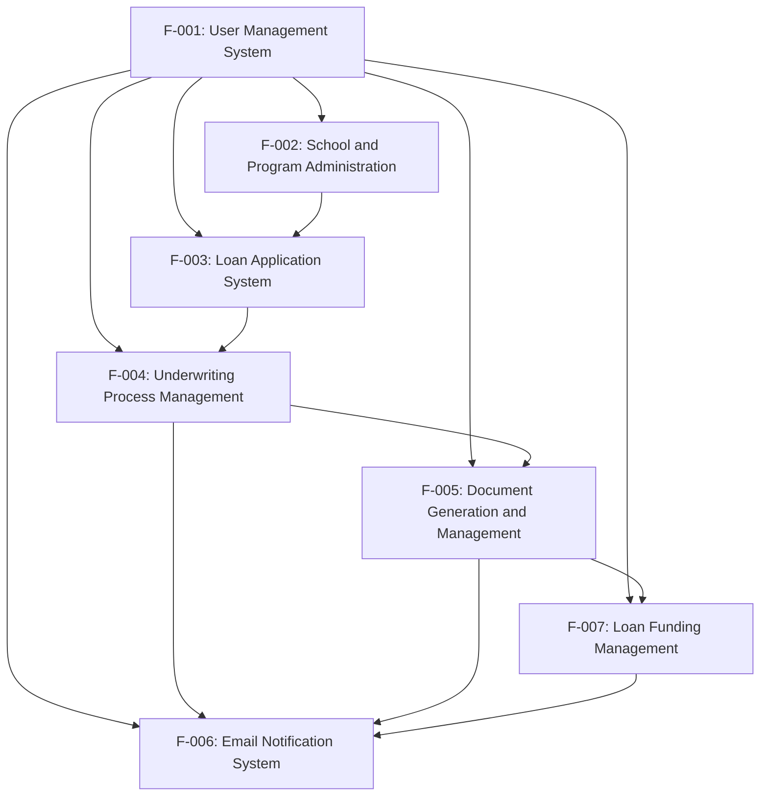
```mermaid
graph TD
    F001[F-001: User Management System]
    F002[F-002: School and Program Administration]
    F003[F-003: Loan Application System]
    F004[F-004: Underwriting Process Management]
    F005[F-005: Document Generation and Management]
    F006[F-006: Email Notification System]
    F007[F-007: Loan Funding Management]
    
    F001 --> F002
    F001 --> F003
    F001 --> F004
    F001 --> F005
    F001 --> F006
    F001 --> F007
    
    F002 --> F003
    
    F003 --> F004
    
    F004 --> F005
    F004 --> F006
    
    F005 --> F007
    F005 --> F006
    
    F007 --> F006
```

#### Integration Points

| Feature | Integration Points |
|---------|-------------------|
| User Management (F-001) | - Authentication service<br>- Email notification system (F-006) |
| School/Program Admin (F-002) | - User Management (F-001) for administrator assignment |
| Loan Application (F-003) | - School/Program data (F-002)<br>- User Management (F-001) for borrower accounts |
| Underwriting (F-004) | - Loan Application data (F-003)<br>- Document Management (F-005)<br>- Notification System (F-006) |
| Document Management (F-005) | - E-signature service<br>- Notification System (F-006)<br>- Secure document storage |
| Notification System (F-006) | - Email delivery service<br>- All core workflow processes |
| Funding Management (F-007) | - Document Management (F-005)<br>- Notification System (F-006) |

#### Shared Components

| Component | Used By Features |
|-----------|------------------|
| User Authentication | All features (F-001 through F-007) |
| Document Storage | Loan Application (F-003), Underwriting (F-004), Document Management (F-005) |
| Workflow Engine | Underwriting (F-004), Document Management (F-005), Funding Management (F-007) |
| Template Engine | Document Management (F-005), Notification System (F-006) |
| Audit Logging | All features (F-001 through F-007) |

### 2.4 IMPLEMENTATION CONSIDERATIONS

#### Technical Constraints

| Feature | Technical Constraints |
|---------|----------------------|
| User Management (F-001) | - Must support role-based access control<br>- Must securely store sensitive user information<br>- Must support password policies and reset functionality |
| School/Program Admin (F-002) | - Must support hierarchical data relationships<br>- Must allow for program cost updates and versioning |
| Loan Application (F-003) | - Must handle sensitive personal and financial information<br>- Must support partial save and resume functionality<br>- Must validate data completeness before submission |
| Underwriting (F-004) | - Must present comprehensive application data in usable format<br>- Must support decision recording with audit trail<br>- Must integrate with document generation |
| Document Management (F-005) | - Must generate legally compliant documents<br>- Must integrate with e-signature service<br>- Must securely store executed documents |
| Notification System (F-006) | - Must support template customization<br>- Must track delivery status<br>- Must handle email delivery failures |
| Funding Management (F-007) | - Must enforce proper approval sequence<br>- Must track disbursement details<br>- Must maintain audit trail of all funding activities |

#### Performance Requirements

| Feature | Performance Requirements |
|---------|--------------------------|
| User Management (F-001) | - User authentication response within 2 seconds<br>- User creation/update within 5 seconds |
| School/Program Admin (F-002) | - School/program data retrieval within 3 seconds<br>- Updates processed within 5 seconds |
| Loan Application (F-003) | - Form loading within 3 seconds<br>- Form submission processing within 5 seconds<br>- Support for at least 100 concurrent applications |
| Underwriting (F-004) | - Application loading for review within 3 seconds<br>- Decision recording within 3 seconds |
| Document Management (F-005) | - Document generation within 10 seconds<br>- E-signature request processing within 5 seconds |
| Notification System (F-006) | - Email generation and queuing within 3 seconds |
| Funding Management (F-007) | - Status updates processed within 3 seconds<br>- Disbursement recording within 5 seconds |

#### Security Implications

| Feature | Security Implications |
|---------|----------------------|
| User Management (F-001) | - Protection of user credentials and personal information<br>- Prevention of unauthorized access<br>- Session management and timeout policies |
| School/Program Admin (F-002) | - Restricted access to school/program creation and modification<br>- Audit logging of all configuration changes |
| Loan Application (F-003) | - Encryption of sensitive personal and financial information<br>- Secure transmission of application data<br>- Protection against data manipulation |
| Underwriting (F-004) | - Restricted access to underwriting functions<br>- Audit logging of all underwriting decisions<br>- Protection of credit information |
| Document Management (F-005) | - Secure document generation and storage<br>- Verification of e-signature authenticity<br>- Prevention of document tampering |
| Notification System (F-006) | - Prevention of sensitive information in email content<br>- Protection against phishing attempts<br>- Secure links for document access |
| Funding Management (F-007) | - Multi-level approval for disbursement actions<br>- Comprehensive audit trail<br>- Prevention of unauthorized disbursements |

#### Traceability Matrix

| Requirement ID | Feature ID | Business Need | Verification Method |
|----------------|-----------|---------------|---------------------|
| F-001-RQ-001 | F-001 | Secure user access management | Functional Testing |
| F-002-RQ-001 | F-002 | School profile management | Functional Testing |
| F-002-RQ-002 | F-002 | Educational program configuration | Functional Testing |
| F-003-RQ-001 | F-003 | Borrower information collection | Functional Testing |
| F-003-RQ-002 | F-003 | Co-borrower information collection | Functional Testing |
| F-003-RQ-003 | F-003 | Loan amount calculation | Functional Testing |
| F-004-RQ-001 | F-004 | Application review interface | Functional Testing |
| F-004-RQ-002 | F-004 | Underwriting decision recording | Functional Testing |
| F-005-RQ-001 | F-005 | Document generation | Functional Testing |
| F-005-RQ-002 | F-005 | E-signature collection | Functional Testing |
| F-006-RQ-001 | F-006 | Email notifications | Functional Testing |
| F-007-RQ-001 | F-007 | Loan funding workflow | Functional Testing |

## 3. TECHNOLOGY STACK

### 3.1 PROGRAMMING LANGUAGES

| Component | Language | Version | Justification |
|-----------|----------|---------|---------------|
| Backend | Python | 3.11+ | Selected for its robust ecosystem, readability, and extensive libraries for web development. Python's strong support for data processing is beneficial for loan application handling and document generation. |
| Frontend | JavaScript (TypeScript) | 5.0+ | TypeScript provides strong typing on top of JavaScript, reducing runtime errors and improving maintainability for the complex UI components needed in loan processing workflows. |
| Database Scripts | SQL | - | Required for database schema management, complex queries, and data migrations in the relational database environment. |
| DevOps Automation | Python/Bash | - | Python for complex automation tasks, Bash for deployment scripts and environment setup. |

### 3.2 FRAMEWORKS & LIBRARIES

#### Backend Framework

| Framework | Version | Purpose | Justification |
|-----------|---------|---------|---------------|
| Django | 4.2+ | Primary web framework | Django's built-in admin interface, ORM, authentication system, and security features make it ideal for developing a secure loan management system with complex user roles and permissions. |
| Django REST Framework | 3.14+ | API development | Provides robust tools for building RESTful APIs needed for frontend-backend communication and potential future integrations. |
| Celery | 5.3+ | Asynchronous task processing | Required for handling background tasks such as document generation, email notifications, and scheduled processes without blocking user interactions. |

#### Frontend Framework

| Framework | Version | Purpose | Justification |
|-----------|---------|---------|---------------|
| React | 18.0+ | UI component library | React's component-based architecture supports the complex form handling and workflow interfaces required for loan applications and underwriting. |
| Redux | 4.2+ | State management | Necessary for managing complex application state across multiple user workflows and maintaining consistency in the loan application process. |
| Material-UI | 5.14+ | UI component framework | Provides pre-built, accessible components that can be customized to match the application's design requirements while ensuring consistency. |
| Formik | 2.4+ | Form management | Simplifies complex form handling for loan applications with validation, error messages, and form state management. |

#### Utility Libraries

| Library | Version | Purpose | Justification |
|---------|---------|---------|---------------|
| PDFKit | 3.0+ | PDF generation | Required for generating loan documents, commitment letters, and disclosure forms. |
| PyJWT | 2.8+ | JWT authentication | Secure token-based authentication for API requests. |
| Pandas | 2.1+ | Data processing | Useful for complex data manipulations, reporting, and export functionality. |
| Pillow | 10.0+ | Image processing | Needed for handling document uploads and processing identification documents. |

### 3.3 DATABASES & STORAGE

#### Primary Database

| Database | Version | Purpose | Justification |
|----------|---------|---------|---------------|
| PostgreSQL | 15+ | Primary relational database | Selected for its robust transaction support, data integrity features, and ability to handle complex relationships between entities (users, schools, programs, applications). |

#### Database Design Considerations

| Aspect | Approach | Justification |
|--------|----------|---------------|
| Schema Design | Normalized relational model | The loan application domain has well-defined entities with clear relationships, making a normalized relational model appropriate. |
| Data Integrity | Foreign key constraints, transactions | Critical for maintaining relationships between users, applications, schools, and ensuring financial data accuracy. |
| Performance | Indexing, query optimization | Necessary for handling concurrent loan applications and quick retrieval of application data during underwriting. |

#### Document Storage

| Storage Solution | Purpose | Justification |
|------------------|---------|---------------|
| Amazon S3 | Document storage | Secure, scalable storage for loan documents, identification documents, and other uploaded files with versioning capabilities. |
| Database BLOBs | Small document templates | Templates and smaller documents can be stored directly in the database for easier versioning and management. |

#### Caching Solution

| Cache | Purpose | Justification |
|-------|---------|---------------|
| Redis | Application caching | Improves performance by caching frequently accessed data such as school/program information and user session data. |
| CDN | Static asset caching | Delivers static assets (CSS, JavaScript, images) efficiently to users across different locations. |

### 3.4 THIRD-PARTY SERVICES

#### Authentication & Security

| Service | Purpose | Justification |
|---------|---------|---------------|
| Auth0 | User authentication | Provides secure, compliant authentication with support for multi-factor authentication and different login methods. |
| AWS KMS | Encryption key management | Secures sensitive data encryption keys for PII and financial information. |

#### Document Processing

| Service | Purpose | Justification |
|---------|---------|---------------|
| DocuSign | E-signature collection | Industry-standard e-signature service with legal compliance, audit trails, and user-friendly signing experience. |
| AWS Textract | Document data extraction | Automates extraction of information from uploaded identification and income verification documents. |

#### Email & Notifications

| Service | Purpose | Justification |
|---------|---------|---------------|
| SendGrid | Email delivery | Reliable email delivery service with template support, delivery tracking, and high deliverability rates. |
| Twilio | SMS notifications | Optional SMS notifications for critical loan status updates and signature reminders. |

#### Monitoring & Analytics

| Service | Purpose | Justification |
|---------|---------|---------------|
| New Relic | Application performance monitoring | Provides insights into system performance, identifies bottlenecks, and alerts on issues. |
| Sentry | Error tracking | Captures and reports application errors for quick resolution. |
| Google Analytics | User behavior analytics | Tracks user interactions to identify usability issues and optimization opportunities. |

### 3.5 DEVELOPMENT & DEPLOYMENT

#### Development Environment

| Tool | Purpose | Justification |
|------|---------|---------------|
| VS Code | IDE | Feature-rich editor with strong Python and JavaScript support and extensive extension ecosystem. |
| Docker | Development containerization | Ensures consistent development environments across the team and matches production configuration. |
| Git | Version control | Industry-standard version control for collaborative development. |

#### CI/CD Pipeline

| Tool | Purpose | Justification |
|------|---------|---------------|
| GitHub Actions | CI/CD automation | Automates testing, building, and deployment processes integrated with the code repository. |
| pytest | Backend testing | Comprehensive testing framework for Python code. |
| Jest | Frontend testing | JavaScript testing framework for React components and application logic. |

#### Deployment Infrastructure

| Service | Purpose | Justification |
|---------|---------|---------------|
| AWS ECS | Container orchestration | Manages containerized application deployment with scalability and high availability. |
| AWS RDS | Database hosting | Managed PostgreSQL service with automated backups, scaling, and high availability. |
| AWS CloudFront | Content delivery | Distributes static assets and improves application loading times. |
| Terraform | Infrastructure as code | Manages cloud infrastructure with version-controlled configuration files. |

### 3.6 TECHNOLOGY STACK ARCHITECTURE

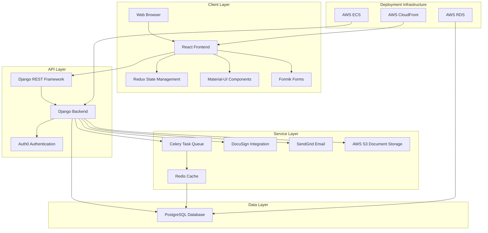
```mermaid
graph TD
    subgraph "Client Layer"
        Browser[Web Browser]
        Browser --> React[React Frontend]
        React --> Redux[Redux State Management]
        React --> MaterialUI[Material-UI Components]
        React --> Formik[Formik Forms]
    end
    
    subgraph "API Layer"
        React --> DRF[Django REST Framework]
        DRF --> Django[Django Backend]
        Django --> Auth0[Auth0 Authentication]
    end
    
    subgraph "Service Layer"
        Django --> Celery[Celery Task Queue]
        Celery --> Redis[Redis Cache]
        Django --> DocuSign[DocuSign Integration]
        Django --> SendGrid[SendGrid Email]
        Django --> S3[AWS S3 Document Storage]
    end
    
    subgraph "Data Layer"
        Django --> PostgreSQL[PostgreSQL Database]
        Redis --> PostgreSQL
    end
    
    subgraph "Deployment Infrastructure"
        ECS[AWS ECS]
        RDS[AWS RDS]
        CloudFront[AWS CloudFront]
        ECS --> Django
        RDS --> PostgreSQL
        CloudFront --> React
    end
```

### 3.7 TECHNOLOGY SELECTION CONSIDERATIONS

| Consideration | Analysis |
|---------------|----------|
| Security | The selected stack prioritizes security with Auth0 for authentication, AWS KMS for encryption, and Django's security features for protecting sensitive financial and personal data. |
| Scalability | AWS infrastructure components (ECS, RDS) provide scalability to handle growing numbers of loan applications and users. |
| Compliance | DocuSign provides legally compliant e-signatures, while PostgreSQL offers audit capabilities for tracking changes to sensitive data. |
| Development Efficiency | Django's admin interface and ORM accelerate development, while React components promote reusability for complex UI elements. |
| Maintenance | TypeScript and Python are both maintainable languages with strong typing and readability, reducing long-term maintenance costs. |
| Integration Capabilities | Django REST Framework facilitates API development for future integrations with other financial systems or services. |

## 4. PROCESS FLOWCHART

### 4.1 SYSTEM WORKFLOWS

#### 4.1.1 Core Business Processes

##### Loan Application End-to-End Process

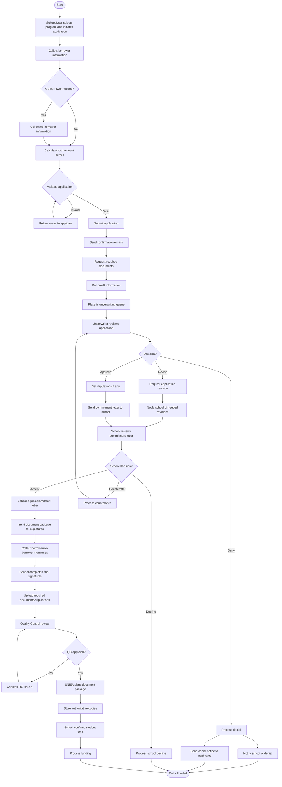
```mermaid
flowchart TD
    Start([Start]) --> SchoolSelect[School/User selects program and initiates application]
    SchoolSelect --> BorrowerInfo[Collect borrower information]
    BorrowerInfo --> CoBorrowerDecision{Co-borrower needed?}
    CoBorrowerDecision -->|Yes| CoBorrowerInfo[Collect co-borrower information]
    CoBorrowerDecision -->|No| LoanDetails[Calculate loan amount details]
    CoBorrowerInfo --> LoanDetails
    LoanDetails --> ValidateApp{Validate application}
    ValidateApp -->|Invalid| FixErrors[Return errors to applicant]
    FixErrors --> ValidateApp
    ValidateApp -->|Valid| SubmitApp[Submit application]
    SubmitApp --> SendConfirmation[Send confirmation emails]
    SendConfirmation --> DocRequest[Request required documents]
    DocRequest --> CreditCheck[Pull credit information]
    CreditCheck --> UnderwritingQueue[Place in underwriting queue]
    UnderwritingQueue --> UnderwriterReview[Underwriter reviews application]
    UnderwriterReview --> UnderwritingDecision{Decision?}
    UnderwritingDecision -->|Approve| SetStipulations[Set stipulations if any]
    UnderwritingDecision -->|Deny| DenialProcess[Process denial]
    UnderwritingDecision -->|Revise| RevisionProcess[Request application revision]
    SetStipulations --> SendCommitment[Send commitment letter to school]
    DenialProcess --> NotifySchool[Notify school of denial]
    DenialProcess --> NotifyApplicants[Send denial notice to applicants]
    RevisionProcess --> NotifySchoolRevision[Notify school of needed revisions]
    NotifySchool --> End([End - Denial])
    NotifyApplicants --> End
    NotifySchoolRevision --> SchoolReview[School reviews revision request]
    SendCommitment --> SchoolReview[School reviews commitment letter]
    SchoolReview --> SchoolDecision{School decision?}
    SchoolDecision -->|Accept| SchoolSignature[School signs commitment letter]
    SchoolDecision -->|Decline| ProcessDecline[Process school decline]
    SchoolDecision -->|Counteroffer| ProcessCounter[Process counteroffer]
    ProcessDecline --> End([End - School Declined])
    ProcessCounter --> UnderwriterReview
    SchoolSignature --> SendDocPackage[Send document package for signatures]
    SendDocPackage --> CollectSignatures[Collect borrower/co-borrower signatures]
    CollectSignatures --> SchoolFinalSign[School completes final signatures]
    SchoolFinalSign --> UploadDocs[Upload required documents/stipulations]
    UploadDocs --> QCReview[Quality Control review]
    QCReview --> QCDecision{QC approval?}
    QCDecision -->|No| FixIssues[Address QC issues]
    FixIssues --> QCReview
    QCDecision -->|Yes| UnisaSignature[UNISA signs document package]
    UnisaSignature --> StoreDocuments[Store authoritative copies]
    StoreDocuments --> ConfirmStart[School confirms student start]
    ConfirmStart --> ProcessFunding[Process funding]
    ProcessFunding --> End([End - Funded])
```

##### Underwriting Process Flow

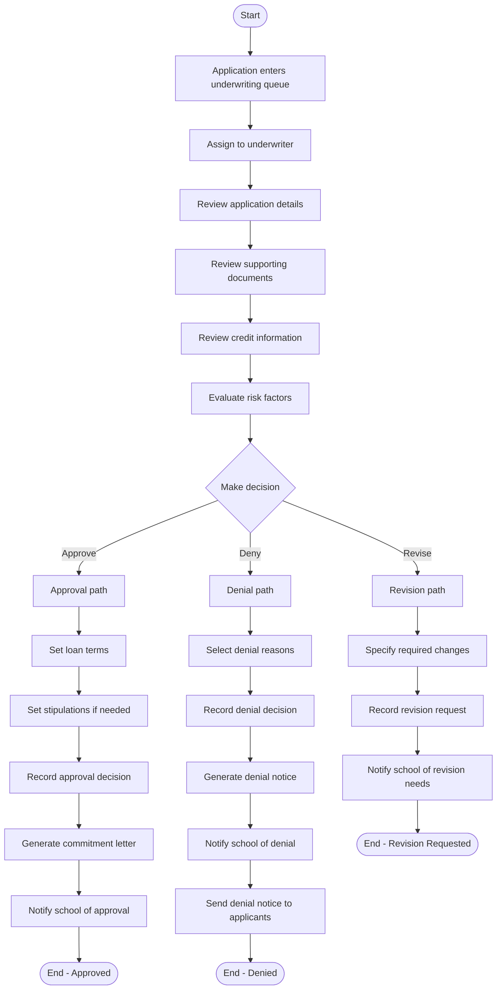
```mermaid
flowchart TD
    Start([Start]) --> AppQueue[Application enters underwriting queue]
    AppQueue --> AssignUnderwriter[Assign to underwriter]
    AssignUnderwriter --> ReviewApp[Review application details]
    ReviewApp --> ReviewDocs[Review supporting documents]
    ReviewDocs --> ReviewCredit[Review credit information]
    ReviewCredit --> EvaluateRisk[Evaluate risk factors]
    EvaluateRisk --> Decision{Make decision}
    
    Decision -->|Approve| ApprovalPath[Approval path]
    Decision -->|Deny| DenialPath[Denial path]
    Decision -->|Revise| RevisionPath[Revision path]
    
    ApprovalPath --> SetTerms[Set loan terms]
    SetTerms --> SetStipulations[Set stipulations if needed]
    SetStipulations --> RecordApproval[Record approval decision]
    RecordApproval --> GenerateCommitment[Generate commitment letter]
    GenerateCommitment --> NotifySchool[Notify school of approval]
    NotifySchool --> End1([End - Approved])
    
    DenialPath --> SelectReasons[Select denial reasons]
    SelectReasons --> RecordDenial[Record denial decision]
    RecordDenial --> GenerateDenial[Generate denial notice]
    GenerateDenial --> NotifySchoolDenial[Notify school of denial]
    NotifySchoolDenial --> NotifyApplicants[Send denial notice to applicants]
    NotifyApplicants --> End2([End - Denied])
    
    RevisionPath --> SpecifyChanges[Specify required changes]
    SpecifyChanges --> RecordRevision[Record revision request]
    RecordRevision --> NotifySchoolRevision[Notify school of revision needs]
    NotifySchoolRevision --> End3([End - Revision Requested])
```

##### Document Signing Process Flow

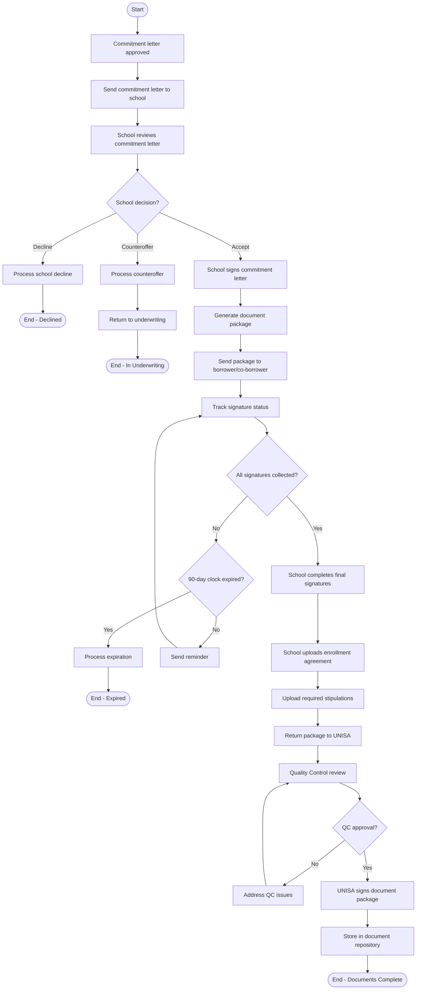
```mermaid
flowchart TD
    Start([Start]) --> CommitmentApproved[Commitment letter approved]
    CommitmentApproved --> SendToSchool[Send commitment letter to school]
    SendToSchool --> SchoolReviews[School reviews commitment letter]
    SchoolReviews --> SchoolDecision{School decision?}
    
    SchoolDecision -->|Accept| SchoolSigns[School signs commitment letter]
    SchoolDecision -->|Decline| ProcessDecline[Process school decline]
    SchoolDecision -->|Counteroffer| ProcessCounter[Process counteroffer]
    
    ProcessDecline --> End1([End - Declined])
    ProcessCounter --> ReturnToUnderwriting[Return to underwriting]
    ReturnToUnderwriting --> End2([End - In Underwriting])
    
    SchoolSigns --> GenerateDocPackage[Generate document package]
    GenerateDocPackage --> SendToBorrowers[Send package to borrower/co-borrower]
    SendToBorrowers --> TrackSignatures[Track signature status]
    TrackSignatures --> CheckStatus{All signatures collected?}
    
    CheckStatus -->|No| CheckExpiry{90-day clock expired?}
    CheckStatus -->|Yes| SchoolFinalSign[School completes final signatures]
    
    CheckExpiry -->|Yes| ExpireProcess[Process expiration]
    CheckExpiry -->|No| SendReminder[Send reminder]
    SendReminder --> TrackSignatures
    
    ExpireProcess --> End3([End - Expired])
    
    SchoolFinalSign --> UploadEnrollment[School uploads enrollment agreement]
    UploadEnrollment --> UploadStipulations[Upload required stipulations]
    UploadStipulations --> ReturnToUnisa[Return package to UNISA]
    ReturnToUnisa --> QCReview[Quality Control review]
    QCReview --> QCDecision{QC approval?}
    
    QCDecision -->|No| FixIssues[Address QC issues]
    QCDecision -->|Yes| UnisaSign[UNISA signs document package]
    
    FixIssues --> QCReview
    
    UnisaSign --> StoreDocuments[Store in document repository]
    StoreDocuments --> End4([End - Documents Complete])
```

##### Funding Process Flow

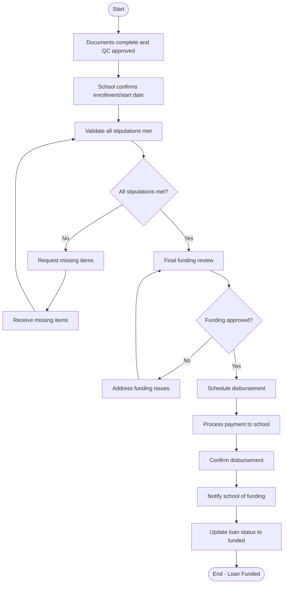
```mermaid
flowchart TD
    Start([Start]) --> DocsComplete[Documents complete and QC approved]
    DocsComplete --> ConfirmEnrollment[School confirms enrollment/start date]
    ConfirmEnrollment --> ValidateStipulations[Validate all stipulations met]
    ValidateStipulations --> StipulationsCheck{All stipulations met?}
    
    StipulationsCheck -->|No| RequestMissingItems[Request missing items]
    StipulationsCheck -->|Yes| FinalReview[Final funding review]
    
    RequestMissingItems --> ReceiveItems[Receive missing items]
    ReceiveItems --> ValidateStipulations
    
    FinalReview --> FundingApproval{Funding approved?}
    
    FundingApproval -->|No| AddressFundingIssues[Address funding issues]
    FundingApproval -->|Yes| ScheduleDisbursement[Schedule disbursement]
    
    AddressFundingIssues --> FinalReview
    
    ScheduleDisbursement --> ProcessPayment[Process payment to school]
    ProcessPayment --> ConfirmDisbursement[Confirm disbursement]
    ConfirmDisbursement --> NotifySchool[Notify school of funding]
    NotifySchool --> UpdateLoanStatus[Update loan status to funded]
    UpdateLoanStatus --> End([End - Loan Funded])
```

#### 4.1.2 Integration Workflows

##### Email Notification System Integration

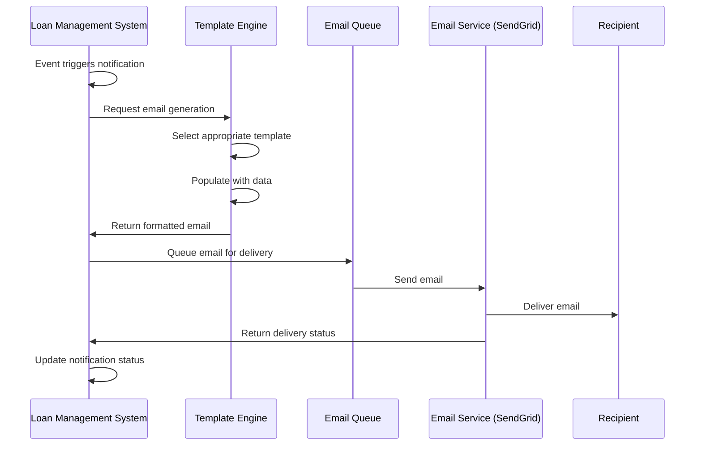
```mermaid
sequenceDiagram
    participant LMS as Loan Management System
    participant Template as Template Engine
    participant Queue as Email Queue
    participant Service as Email Service (SendGrid)
    participant User as Recipient
    
    LMS->>LMS: Event triggers notification
    LMS->>Template: Request email generation
    Template->>Template: Select appropriate template
    Template->>Template: Populate with data
    Template->>LMS: Return formatted email
    LMS->>Queue: Queue email for delivery
    Queue->>Service: Send email
    Service->>User: Deliver email
    Service->>LMS: Return delivery status
    LMS->>LMS: Update notification status
```

##### Document Generation and E-Signature Flow

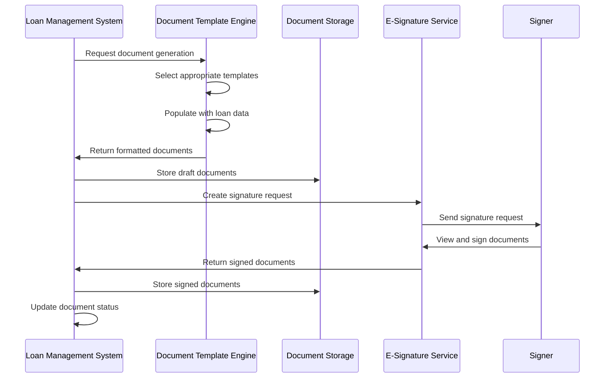
```mermaid
sequenceDiagram
    participant LMS as Loan Management System
    participant Template as Document Template Engine
    participant Storage as Document Storage
    participant ESign as E-Signature Service
    participant User as Signer
    
    LMS->>Template: Request document generation
    Template->>Template: Select appropriate templates
    Template->>Template: Populate with loan data
    Template->>LMS: Return formatted documents
    LMS->>Storage: Store draft documents
    LMS->>ESign: Create signature request
    ESign->>User: Send signature request
    User->>ESign: View and sign documents
    ESign->>LMS: Return signed documents
    LMS->>Storage: Store signed documents
    LMS->>LMS: Update document status
```

##### Credit Check Integration Flow

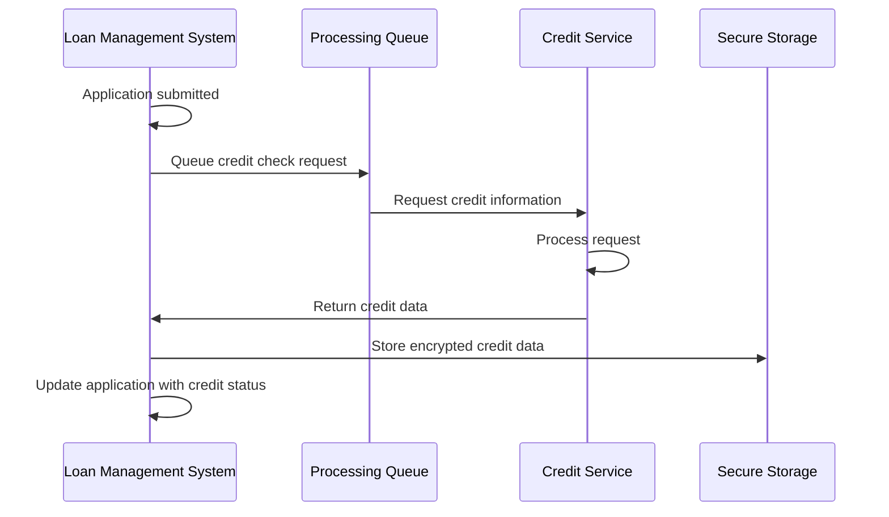
```mermaid
sequenceDiagram
    participant LMS as Loan Management System
    participant Queue as Processing Queue
    participant Credit as Credit Service
    participant Storage as Secure Storage
    
    LMS->>LMS: Application submitted
    LMS->>Queue: Queue credit check request
    Queue->>Credit: Request credit information
    Credit->>Credit: Process request
    Credit->>LMS: Return credit data
    LMS->>Storage: Store encrypted credit data
    LMS->>LMS: Update application with credit status
```

### 4.2 FLOWCHART REQUIREMENTS

#### 4.2.1 Loan Application Validation Flow

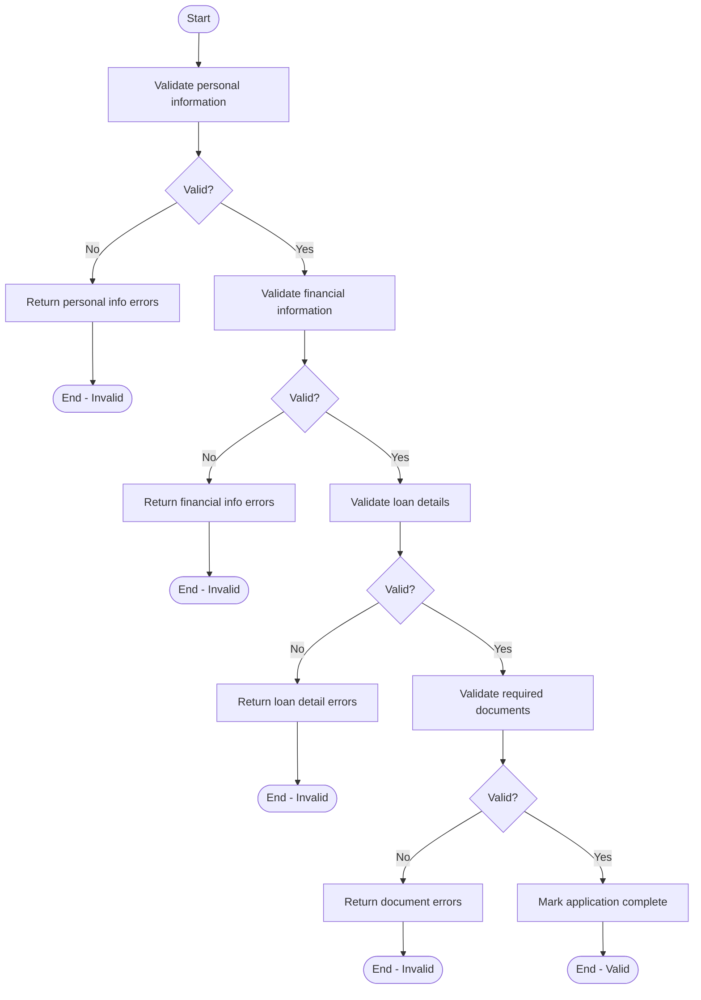
```mermaid
flowchart TD
    Start([Start]) --> ValidatePersonal[Validate personal information]
    ValidatePersonal --> PersonalValid{Valid?}
    
    PersonalValid -->|No| ReturnPersonalErrors[Return personal info errors]
    PersonalValid -->|Yes| ValidateFinancial[Validate financial information]
    
    ReturnPersonalErrors --> End1([End - Invalid])
    
    ValidateFinancial --> FinancialValid{Valid?}
    FinancialValid -->|No| ReturnFinancialErrors[Return financial info errors]
    FinancialValid -->|Yes| ValidateLoan[Validate loan details]
    
    ReturnFinancialErrors --> End2([End - Invalid])
    
    ValidateLoan --> LoanValid{Valid?}
    LoanValid -->|No| ReturnLoanErrors[Return loan detail errors]
    LoanValid -->|Yes| ValidateDocuments[Validate required documents]
    
    ReturnLoanErrors --> End3([End - Invalid])
    
    ValidateDocuments --> DocumentsValid{Valid?}
    DocumentsValid -->|No| ReturnDocumentErrors[Return document errors]
    DocumentsValid -->|Yes| ApplicationComplete[Mark application complete]
    
    ReturnDocumentErrors --> End4([End - Invalid])
    
    ApplicationComplete --> End5([End - Valid])
```

#### 4.2.2 User Authorization Checkpoints

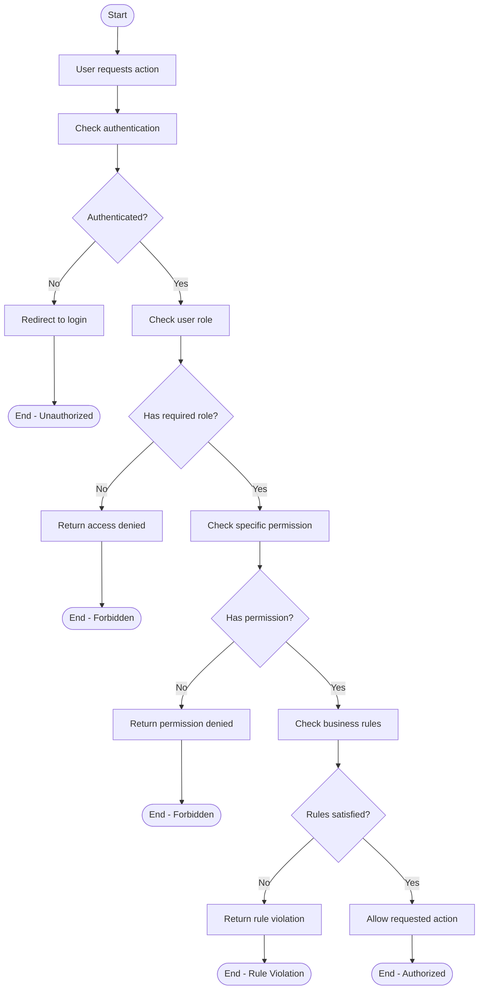
```mermaid
flowchart TD
    Start([Start]) --> AuthRequest[User requests action]
    AuthRequest --> CheckAuth[Check authentication]
    CheckAuth --> AuthValid{Authenticated?}
    
    AuthValid -->|No| RedirectLogin[Redirect to login]
    AuthValid -->|Yes| CheckRole[Check user role]
    
    RedirectLogin --> End1([End - Unauthorized])
    
    CheckRole --> RoleValid{Has required role?}
    RoleValid -->|No| AccessDenied[Return access denied]
    RoleValid -->|Yes| CheckPermission[Check specific permission]
    
    AccessDenied --> End2([End - Forbidden])
    
    CheckPermission --> PermissionValid{Has permission?}
    PermissionValid -->|No| PermissionDenied[Return permission denied]
    PermissionValid -->|Yes| CheckBusinessRules[Check business rules]
    
    PermissionDenied --> End3([End - Forbidden])
    
    CheckBusinessRules --> BusinessRulesValid{Rules satisfied?}
    BusinessRulesValid -->|No| RuleViolation[Return rule violation]
    BusinessRulesValid -->|Yes| AllowAction[Allow requested action]
    
    RuleViolation --> End4([End - Rule Violation])
    
    AllowAction --> End5([End - Authorized])
```

#### 4.2.3 Error Handling and Recovery Flow

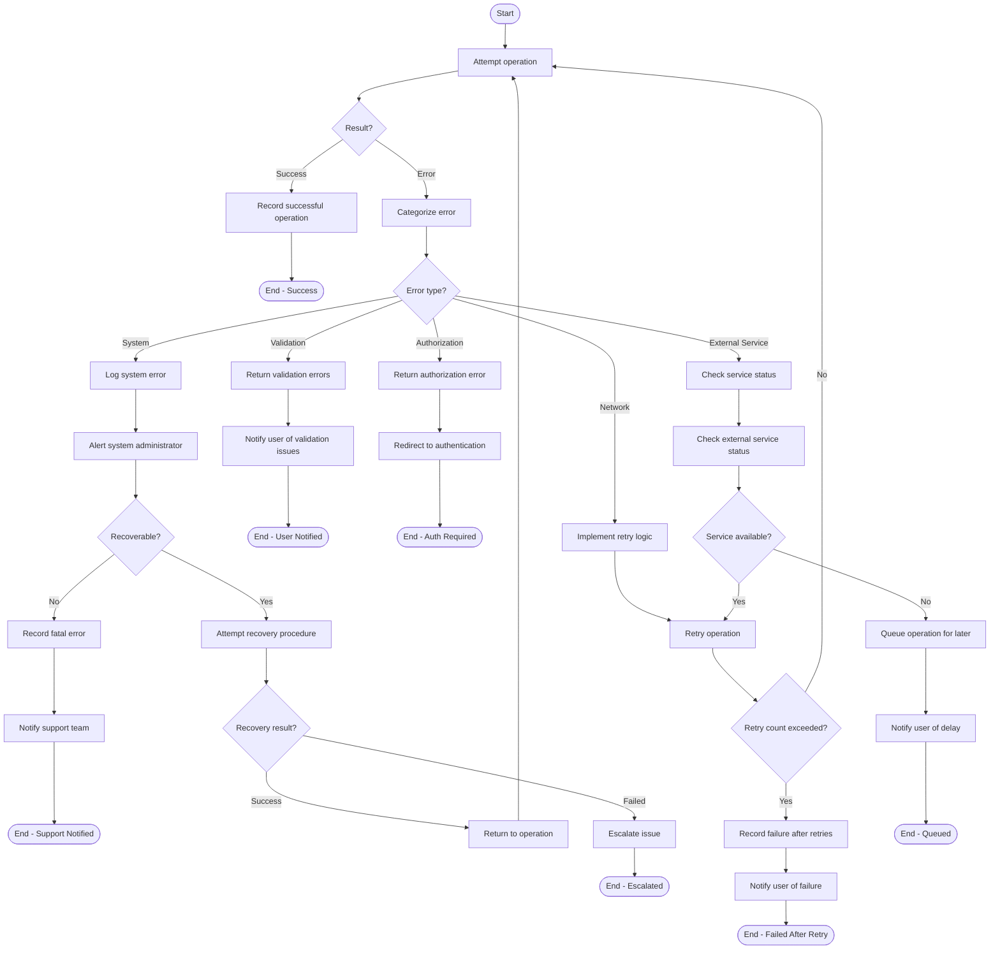
```mermaid
flowchart TD
    Start([Start]) --> AttemptOperation[Attempt operation]
    AttemptOperation --> OperationResult{Result?}
    
    OperationResult -->|Success| RecordSuccess[Record successful operation]
    OperationResult -->|Error| CategorizeError[Categorize error]
    
    RecordSuccess --> End1([End - Success])
    
    CategorizeError --> ErrorType{Error type?}
    
    ErrorType -->|Validation| HandleValidation[Return validation errors]
    ErrorType -->|Authorization| HandleAuth[Return authorization error]
    ErrorType -->|System| HandleSystem[Log system error]
    ErrorType -->|Network| HandleNetwork[Implement retry logic]
    ErrorType -->|External Service| HandleExternal[Check service status]
    
    HandleValidation --> NotifyUser[Notify user of validation issues]
    HandleAuth --> RedirectAuth[Redirect to authentication]
    HandleSystem --> AlertAdmin[Alert system administrator]
    HandleNetwork --> RetryOperation[Retry operation]
    HandleExternal --> CheckStatus[Check external service status]
    
    NotifyUser --> End2([End - User Notified])
    RedirectAuth --> End3([End - Auth Required])
    
    AlertAdmin --> RecoverableSystem{Recoverable?}
    RecoverableSystem -->|Yes| AttemptRecovery[Attempt recovery procedure]
    RecoverableSystem -->|No| RecordFatal[Record fatal error]
    
    RecordFatal --> NotifySupport[Notify support team]
    NotifySupport --> End4([End - Support Notified])
    
    AttemptRecovery --> RecoveryResult{Recovery result?}
    RecoveryResult -->|Success| ReturnToOperation[Return to operation]
    RecoveryResult -->|Failed| EscalateIssue[Escalate issue]
    
    ReturnToOperation --> AttemptOperation
    EscalateIssue --> End5([End - Escalated])
    
    RetryOperation --> RetryCount{Retry count exceeded?}
    RetryCount -->|No| AttemptOperation
    RetryCount -->|Yes| RecordFailure[Record failure after retries]
    
    RecordFailure --> NotifyUserFailure[Notify user of failure]
    NotifyUserFailure --> End6([End - Failed After Retry])
    
    CheckStatus --> ServiceAvailable{Service available?}
    ServiceAvailable -->|Yes| RetryOperation
    ServiceAvailable -->|No| QueueForLater[Queue operation for later]
    
    QueueForLater --> NotifyUserDelay[Notify user of delay]
    NotifyUserDelay --> End7([End - Queued])
```

### 4.3 TECHNICAL IMPLEMENTATION

#### 4.3.1 Loan Application State Transitions

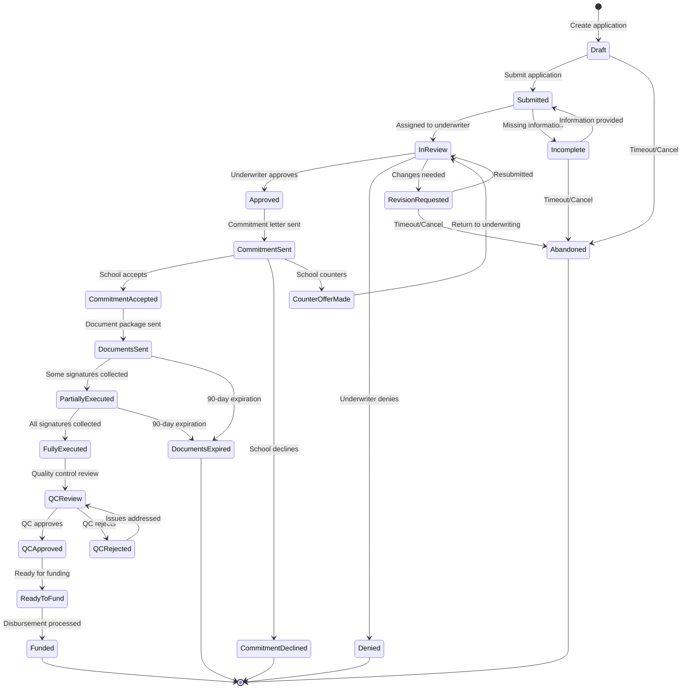
```mermaid
stateDiagram-v2
    [*] --> Draft: Create application
    
    Draft --> Submitted: Submit application
    Draft --> Abandoned: Timeout/Cancel
    
    Submitted --> InReview: Assigned to underwriter
    Submitted --> Incomplete: Missing information
    
    Incomplete --> Submitted: Information provided
    Incomplete --> Abandoned: Timeout/Cancel
    
    InReview --> Approved: Underwriter approves
    InReview --> Denied: Underwriter denies
    InReview --> RevisionRequested: Changes needed
    
    RevisionRequested --> InReview: Resubmitted
    RevisionRequested --> Abandoned: Timeout/Cancel
    
    Approved --> CommitmentSent: Commitment letter sent
    
    CommitmentSent --> CommitmentAccepted: School accepts
    CommitmentSent --> CommitmentDeclined: School declines
    CommitmentSent --> CounterOfferMade: School counters
    
    CounterOfferMade --> InReview: Return to underwriting
    
    CommitmentAccepted --> DocumentsSent: Document package sent
    
    DocumentsSent --> PartiallyExecuted: Some signatures collected
    DocumentsSent --> DocumentsExpired: 90-day expiration
    
    PartiallyExecuted --> FullyExecuted: All signatures collected
    PartiallyExecuted --> DocumentsExpired: 90-day expiration
    
    FullyExecuted --> QCReview: Quality control review
    
    QCReview --> QCApproved: QC approves
    QCReview --> QCRejected: QC rejects
    
    QCRejected --> QCReview: Issues addressed
    
    QCApproved --> ReadyToFund: Ready for funding
    
    ReadyToFund --> Funded: Disbursement processed
    
    Funded --> [*]
    Denied --> [*]
    Abandoned --> [*]
    CommitmentDeclined --> [*]
    DocumentsExpired --> [*]
```

#### 4.3.2 Transaction Boundaries and Data Persistence

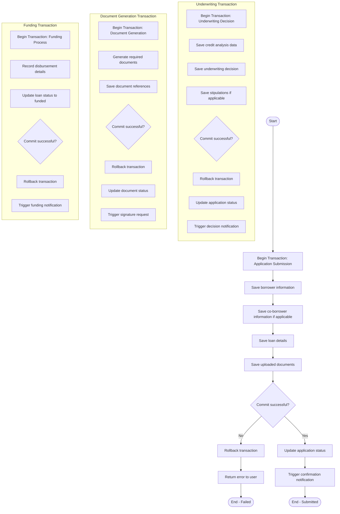
```mermaid
flowchart TD
    Start([Start]) --> BeginTx1[Begin Transaction: Application Submission]
    BeginTx1 --> SaveBorrower[Save borrower information]
    SaveBorrower --> SaveCoBorrower[Save co-borrower information if applicable]
    SaveCoBorrower --> SaveLoanDetails[Save loan details]
    SaveLoanDetails --> SaveDocuments[Save uploaded documents]
    SaveDocuments --> CommitTx1{Commit successful?}
    
    CommitTx1 -->|No| RollbackTx1[Rollback transaction]
    CommitTx1 -->|Yes| UpdateAppStatus[Update application status]
    
    RollbackTx1 --> ReturnError1[Return error to user]
    ReturnError1 --> End1([End - Failed])
    
    UpdateAppStatus --> TriggerNotification[Trigger confirmation notification]
    TriggerNotification --> End2([End - Submitted])
    
    subgraph "Underwriting Transaction"
        BeginTx2[Begin Transaction: Underwriting Decision]
        SaveCreditData[Save credit analysis data]
        SaveDecision[Save underwriting decision]
        SaveStipulations[Save stipulations if applicable]
        CommitTx2{Commit successful?}
        RollbackTx2[Rollback transaction]
        UpdateAppStatus2[Update application status]
        TriggerNotification2[Trigger decision notification]
    end
    
    subgraph "Document Generation Transaction"
        BeginTx3[Begin Transaction: Document Generation]
        GenerateDocuments[Generate required documents]
        SaveDocRefs[Save document references]
        CommitTx3{Commit successful?}
        RollbackTx3[Rollback transaction]
        UpdateDocStatus[Update document status]
        TriggerSignatureRequest[Trigger signature request]
    end
    
    subgraph "Funding Transaction"
        BeginTx4[Begin Transaction: Funding Process]
        RecordDisbursement[Record disbursement details]
        UpdateLoanStatus[Update loan status to funded]
        CommitTx4{Commit successful?}
        RollbackTx4[Rollback transaction]
        TriggerFundingNotification[Trigger funding notification]
    end
```

#### 4.3.3 Error Handling and Retry Mechanisms

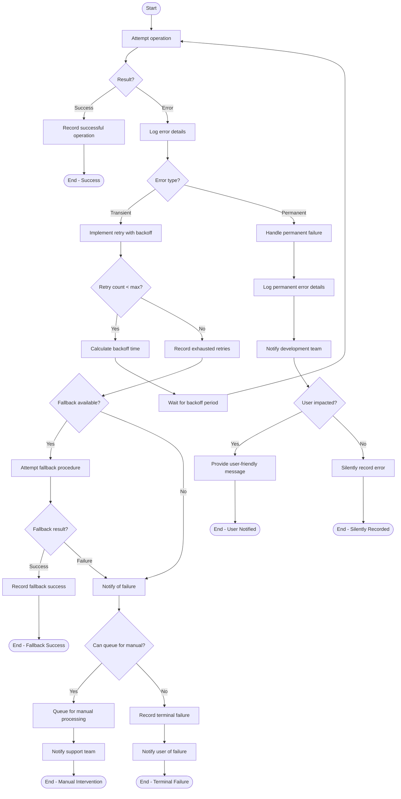
```mermaid
flowchart TD
    Start([Start]) --> AttemptOperation[Attempt operation]
    AttemptOperation --> OperationResult{Result?}
    
    OperationResult -->|Success| RecordSuccess[Record successful operation]
    OperationResult -->|Error| LogError[Log error details]
    
    RecordSuccess --> End1([End - Success])
    
    LogError --> ErrorType{Error type?}
    
    ErrorType -->|Transient| ImplementRetry[Implement retry with backoff]
    ErrorType -->|Permanent| HandlePermanent[Handle permanent failure]
    
    ImplementRetry --> RetryCount{Retry count < max?}
    RetryCount -->|Yes| CalculateBackoff[Calculate backoff time]
    RetryCount -->|No| ExhaustedRetries[Record exhausted retries]
    
    CalculateBackoff --> WaitBackoff[Wait for backoff period]
    WaitBackoff --> AttemptOperation
    
    ExhaustedRetries --> FallbackAvailable{Fallback available?}
    FallbackAvailable -->|Yes| AttemptFallback[Attempt fallback procedure]
    FallbackAvailable -->|No| NotifyFailure[Notify of failure]
    
    AttemptFallback --> FallbackResult{Fallback result?}
    FallbackResult -->|Success| RecordFallbackSuccess[Record fallback success]
    FallbackResult -->|Failure| NotifyFailure
    
    RecordFallbackSuccess --> End2([End - Fallback Success])
    
    NotifyFailure --> QueueForManual{Can queue for manual?}
    QueueForManual -->|Yes| QueueManualProcess[Queue for manual processing]
    QueueForManual -->|No| RecordTerminalFailure[Record terminal failure]
    
    QueueManualProcess --> NotifySupport[Notify support team]
    NotifySupport --> End3([End - Manual Intervention])
    
    RecordTerminalFailure --> NotifyUser[Notify user of failure]
    NotifyUser --> End4([End - Terminal Failure])
    
    HandlePermanent --> LogPermanentError[Log permanent error details]
    LogPermanentError --> NotifyDevelopers[Notify development team]
    NotifyDevelopers --> UserImpact{User impacted?}
    
    UserImpact -->|Yes| ProvideUserMessage[Provide user-friendly message]
    UserImpact -->|No| SilentRecord[Silently record error]
    
    ProvideUserMessage --> End5([End - User Notified])
    SilentRecord --> End6([End - Silently Recorded])
```

### 4.4 HIGH-LEVEL SYSTEM WORKFLOW

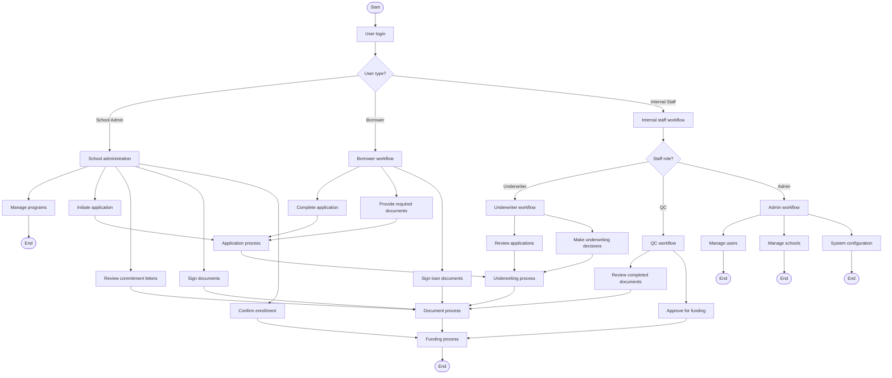
```mermaid
flowchart TD
    Start([Start]) --> UserLogin[User login]
    UserLogin --> UserType{User type?}
    
    UserType -->|School Admin| SchoolAdmin[School administration]
    UserType -->|Borrower| BorrowerFlow[Borrower workflow]
    UserType -->|Internal Staff| InternalStaff[Internal staff workflow]
    
    SchoolAdmin --> ManagePrograms[Manage programs]
    SchoolAdmin --> InitiateApp[Initiate application]
    SchoolAdmin --> ReviewCommitment[Review commitment letters]
    SchoolAdmin --> SignDocuments[Sign documents]
    SchoolAdmin --> ConfirmEnrollment[Confirm enrollment]
    
    BorrowerFlow --> CompleteApp[Complete application]
    BorrowerFlow --> ProvideDocuments[Provide required documents]
    BorrowerFlow --> SignLoanDocs[Sign loan documents]
    
    InternalStaff --> StaffRole{Staff role?}
    
    StaffRole -->|Underwriter| UnderwriterFlow[Underwriter workflow]
    StaffRole -->|QC| QCFlow[QC workflow]
    StaffRole -->|Admin| AdminFlow[Admin workflow]
    
    UnderwriterFlow --> ReviewApplications[Review applications]
    UnderwriterFlow --> MakeDecisions[Make underwriting decisions]
    
    QCFlow --> ReviewDocuments[Review completed documents]
    QCFlow --> ApproveFunding[Approve for funding]
    
    AdminFlow --> ManageUsers[Manage users]
    AdminFlow --> ManageSchools[Manage schools]
    AdminFlow --> SystemConfig[System configuration]
    
    ManagePrograms --> End1([End])
    InitiateApp --> ApplicationProcess[Application process]
    ReviewCommitment --> DocumentProcess[Document process]
    SignDocuments --> DocumentProcess
    ConfirmEnrollment --> FundingProcess[Funding process]
    
    CompleteApp --> ApplicationProcess
    ProvideDocuments --> ApplicationProcess
    SignLoanDocs --> DocumentProcess
    
    ReviewApplications --> UnderwritingProcess[Underwriting process]
    MakeDecisions --> UnderwritingProcess
    
    ReviewDocuments --> DocumentProcess
    ApproveFunding --> FundingProcess
    
    ManageUsers --> End2([End])
    ManageSchools --> End3([End])
    SystemConfig --> End4([End])
    
    ApplicationProcess --> UnderwritingProcess
    UnderwritingProcess --> DocumentProcess
    DocumentProcess --> FundingProcess
    FundingProcess --> End5([End])
```

### 4.5 SWIM LANE DIAGRAM FOR LOAN PROCESS

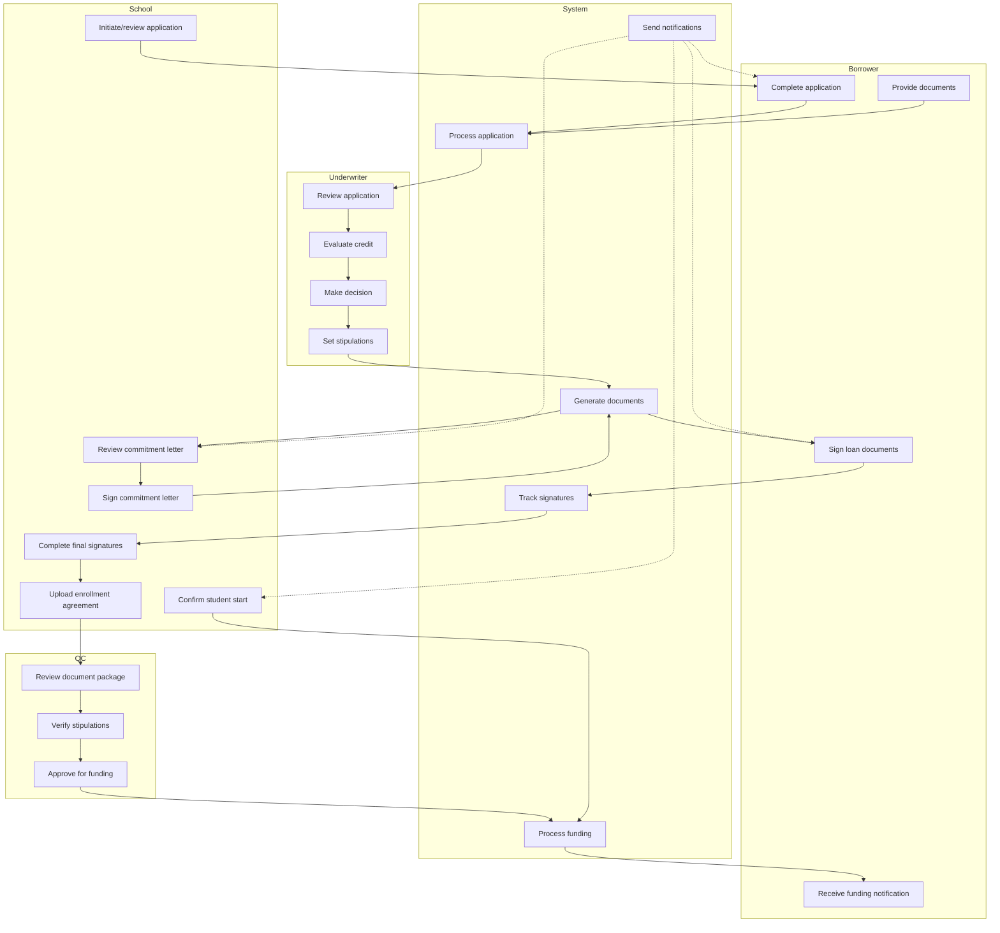
```mermaid
flowchart TD
    subgraph Borrower
        B1[Complete application]
        B2[Provide documents]
        B3[Sign loan documents]
        B4[Receive funding notification]
    end
    
    subgraph School
        S1[Initiate/review application]
        S2[Review commitment letter]
        S3[Sign commitment letter]
        S4[Complete final signatures]
        S5[Upload enrollment agreement]
        S6[Confirm student start]
    end
    
    subgraph Underwriter
        U1[Review application]
        U2[Evaluate credit]
        U3[Make decision]
        U4[Set stipulations]
    end
    
    subgraph QC
        Q1[Review document package]
        Q2[Verify stipulations]
        Q3[Approve for funding]
    end
    
    subgraph System
        SYS1[Process application]
        SYS2[Generate documents]
        SYS3[Send notifications]
        SYS4[Track signatures]
        SYS5[Process funding]
    end
    
    S1 --> B1
    B1 --> SYS1
    B2 --> SYS1
    SYS1 --> U1
    U1 --> U2
    U2 --> U3
    U3 --> U4
    U4 --> SYS2
    SYS2 --> S2
    S2 --> S3
    S3 --> SYS2
    SYS2 --> B3
    B3 --> SYS4
    SYS4 --> S4
    S4 --> S5
    S5 --> Q1
    Q1 --> Q2
    Q2 --> Q3
    Q3 --> SYS5
    S6 --> SYS5
    SYS5 --> B4
    SYS3 -.-> B1
    SYS3 -.-> B3
    SYS3 -.-> S2
    SYS3 -.-> S6
```

### 4.6 VALIDATION RULES AND BUSINESS LOGIC

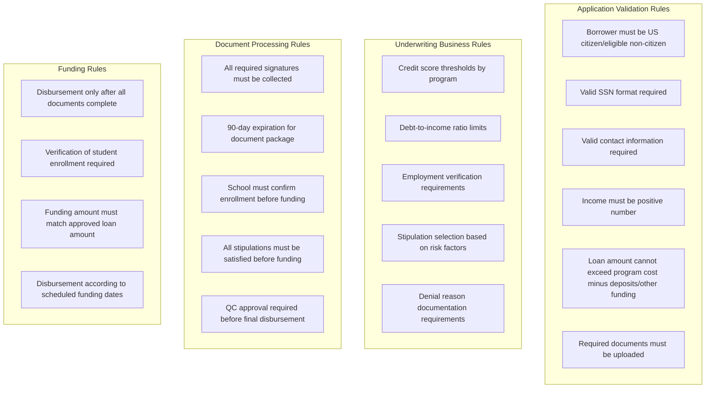
```mermaid
flowchart TD
    subgraph "Application Validation Rules"
        AV1[Borrower must be US citizen/eligible non-citizen]
        AV2[Valid SSN format required]
        AV3[Valid contact information required]
        AV4[Income must be positive number]
        AV5[Loan amount cannot exceed program cost minus deposits/other funding]
        AV6[Required documents must be uploaded]
    end
    
    subgraph "Underwriting Business Rules"
        UW1[Credit score thresholds by program]
        UW2[Debt-to-income ratio limits]
        UW3[Employment verification requirements]
        UW4[Stipulation selection based on risk factors]
        UW5[Denial reason documentation requirements]
    end
    
    subgraph "Document Processing Rules"
        DP1[All required signatures must be collected]
        DP2[90-day expiration for document package]
        DP3[School must confirm enrollment before funding]
        DP4[All stipulations must be satisfied before funding]
        DP5[QC approval required before final disbursement]
    end
    
    subgraph "Funding Rules"
        FR1[Disbursement only after all documents complete]
        FR2[Verification of student enrollment required]
        FR3[Funding amount must match approved loan amount]
        FR4[Disbursement according to scheduled funding dates]
    end
```

### 4.7 TIMING AND SLA CONSIDERATIONS

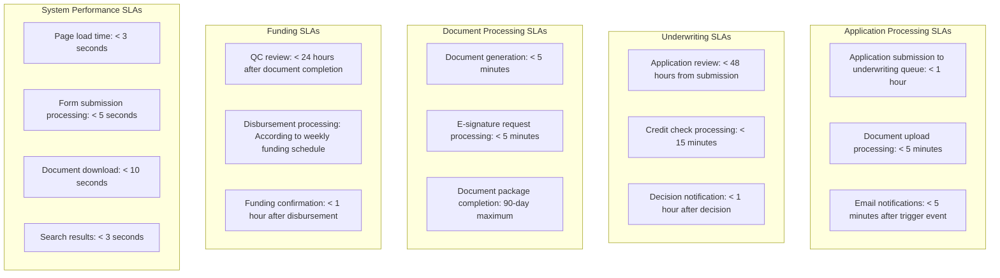
```mermaid
flowchart TD
    subgraph "Application Processing SLAs"
        AP1[Application submission to underwriting queue: < 1 hour]
        AP2[Document upload processing: < 5 minutes]
        AP3[Email notifications: < 5 minutes after trigger event]
    end
    
    subgraph "Underwriting SLAs"
        UW1[Application review: < 48 hours from submission]
        UW2[Credit check processing: < 15 minutes]
        UW3[Decision notification: < 1 hour after decision]
    end
    
    subgraph "Document Processing SLAs"
        DP1[Document generation: < 5 minutes]
        DP2[E-signature request processing: < 5 minutes]
        DP3[Document package completion: 90-day maximum]
    end
    
    subgraph "Funding SLAs"
        FR1[QC review: < 24 hours after document completion]
        FR2[Disbursement processing: According to weekly funding schedule]
        FR3[Funding confirmation: < 1 hour after disbursement]
    end
    
    subgraph "System Performance SLAs"
        SP1[Page load time: < 3 seconds]
        SP2[Form submission processing: < 5 seconds]
        SP3[Document download: < 10 seconds]
        SP4[Search results: < 3 seconds]
    end
```

## 5. SYSTEM ARCHITECTURE

### 5.1 HIGH-LEVEL ARCHITECTURE

#### System Overview

The loan management system will follow a multi-tiered architecture with a clear separation of concerns, implementing a microservices-inspired approach while maintaining practical integration patterns. The system is designed around the following key architectural principles:

- **Separation of Concerns**: Clear boundaries between presentation, business logic, and data access layers
- **Domain-Driven Design**: Core business entities (users, schools, loan applications, etc.) are modeled as distinct domains
- **Service-Oriented Architecture**: Business capabilities exposed as services with well-defined interfaces
- **Event-Driven Communication**: Key system events trigger notifications and workflow transitions
- **Security by Design**: Authentication, authorization, and data protection built into the architecture

The system boundaries encompass the web application interface, API services, document generation and management, notification services, and integration with external e-signature and email delivery services. The architecture prioritizes data integrity, security, and auditability given the sensitive financial and personal information being processed.

#### Core Components Table

| Component Name | Primary Responsibility | Key Dependencies | Critical Considerations |
|----------------|------------------------|------------------|-------------------------|
| User Management Service | Handle authentication, authorization, and user profile management | Authentication provider, Database | Security, role-based access control, audit logging |
| School Management Module | Manage school and program information | User Management Service, Database | Data integrity, versioning of program information |
| Loan Application Service | Process and validate loan applications | School Management Module, Document Service | Data validation, state management, security |
| Underwriting Engine | Facilitate loan review and decision-making | Loan Application Service, Notification Service | Decision tracking, audit trail, business rules |
| Document Management Service | Generate, store, and track loan documents | E-signature service, Storage service | Template management, document security, versioning |
| Notification Service | Manage and deliver email communications | Email delivery service, Template engine | Delivery tracking, template management |
| Workflow Engine | Orchestrate the loan lifecycle processes | All other services | State transitions, process integrity |
| Reporting Service | Generate operational and analytical reports | All other services | Data aggregation, performance |

#### Data Flow Description

The system's primary data flows begin with user authentication, followed by school/program selection and loan application submission. Application data flows to the underwriting engine, which applies business rules and facilitates decision-making. Approved applications trigger document generation, with data flowing to the document service which creates loan agreements and other required documentation.

Document data flows to the e-signature service for signature collection, with status updates flowing back to the document service. Notifications flow from various trigger points to the notification service, which transforms event data into appropriate messages using templates before delivery.

All components interact with the workflow engine, which maintains the state of each loan application and orchestrates transitions based on events. Data is persisted in the primary database, with document files stored in a dedicated document storage service. Caching is implemented for frequently accessed reference data such as school and program information.

#### External Integration Points

| System Name | Integration Type | Data Exchange Pattern | Protocol/Format | SLA Requirements |
|-------------|------------------|------------------------|-----------------|------------------|
| Auth0 | Authentication Service | Request/Response | OAuth 2.0/OIDC | 99.9% uptime, <500ms response |
| DocuSign | E-Signature Service | Asynchronous | REST API/JSON | 99.5% uptime, <2s response |
| SendGrid | Email Delivery | Fire-and-Forget with Status Callback | REST API/JSON | 99.5% delivery rate, <5min delivery |
| AWS S3 | Document Storage | Request/Response | REST API/JSON | 99.99% availability, <1s response |
| Redis | Caching Service | Request/Response | Redis Protocol | <10ms response time |

### 5.2 COMPONENT DETAILS

#### User Management Service

- **Purpose**: Manages user authentication, authorization, and profile information for all user types (borrowers, co-borrowers, school administrators, underwriters, QC personnel)
- **Technologies**: Django authentication framework, Auth0 integration, JWT tokens
- **Key Interfaces**:
  - User registration API
  - Authentication API
  - Profile management API
  - Role and permission management API
- **Data Persistence**: User profiles, roles, and permissions stored in PostgreSQL
- **Scaling Considerations**: Horizontal scaling for authentication requests, caching of user permissions

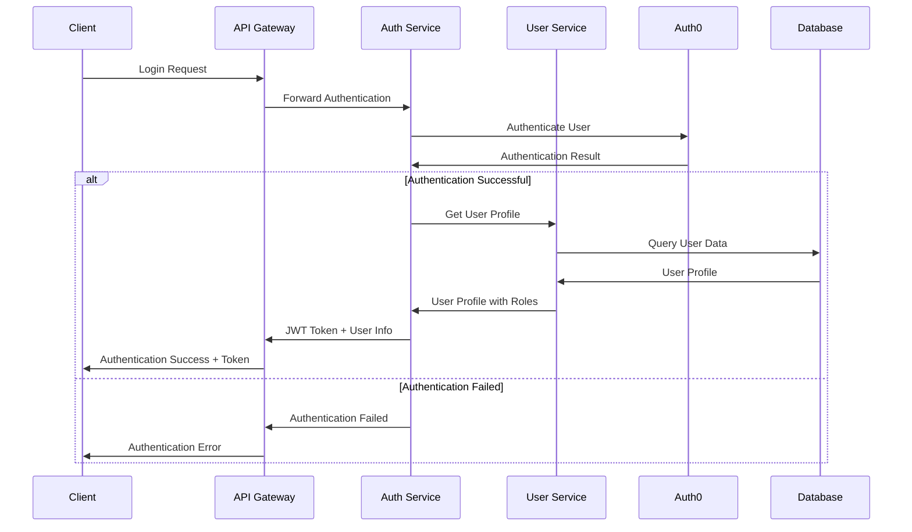
```mermaid
sequenceDiagram
    participant Client
    participant API Gateway
    participant Auth Service
    participant User Service
    participant Auth0
    participant Database
    
    Client->>API Gateway: Login Request
    API Gateway->>Auth Service: Forward Authentication
    Auth Service->>Auth0: Authenticate User
    Auth0->>Auth Service: Authentication Result
    
    alt Authentication Successful
        Auth Service->>User Service: Get User Profile
        User Service->>Database: Query User Data
        Database->>User Service: User Profile
        User Service->>Auth Service: User Profile with Roles
        Auth Service->>API Gateway: JWT Token + User Info
        API Gateway->>Client: Authentication Success + Token
    else Authentication Failed
        Auth Service->>API Gateway: Authentication Failed
        API Gateway->>Client: Authentication Error
    end
```

#### School Management Module

- **Purpose**: Manages school profiles, educational programs, and associated configuration
- **Technologies**: Django ORM, PostgreSQL, Redis caching
- **Key Interfaces**:
  - School management API
  - Program management API
  - School configuration API
- **Data Persistence**: School profiles, programs, and configurations stored in PostgreSQL with versioning
- **Scaling Considerations**: Read-heavy workload, implement caching for school and program data

```mermaid
stateDiagram-v2
    [*] --> Draft: Create School
    Draft --> Active: Activate School
    Draft --> Deleted: Delete Draft
    Active --> Inactive: Deactivate School
    Inactive --> Active: Reactivate School
    Active --> [*]: Delete School
    Inactive --> [*]: Delete School
    
    state Active {
        [*] --> NoPrograms
        NoPrograms --> WithPrograms: Add Program
        WithPrograms --> NoPrograms: Remove All Programs
    }
```

#### Loan Application Service

- **Purpose**: Handles the creation, validation, and processing of loan applications
- **Technologies**: Django, Django REST Framework, Celery for background tasks
- **Key Interfaces**:
  - Application submission API
  - Application status API
  - Document upload API
  - Application review API
- **Data Persistence**: Application data stored in PostgreSQL, documents referenced in document storage
- **Scaling Considerations**: Transaction integrity, potential for high concurrent submissions

```mermaid
sequenceDiagram
    participant Client
    participant API Gateway
    participant Application Service
    participant Validation Service
    participant Document Service
    participant Database
    participant Notification Service
    
    Client->>API Gateway: Submit Application
    API Gateway->>Application Service: Process Application
    Application Service->>Validation Service: Validate Application Data
    
    alt Validation Successful
        Validation Service->>Application Service: Validation Success
        Application Service->>Database: Store Application
        Database->>Application Service: Confirmation
        Application Service->>Document Service: Request Document Upload URLs
        Document Service->>Application Service: Secure Upload URLs
        Application Service->>API Gateway: Application Submitted + Upload URLs
        API Gateway->>Client: Success Response
        Application Service->>Notification Service: Trigger Confirmation Email
    else Validation Failed
        Validation Service->>Application Service: Validation Errors
        Application Service->>API Gateway: Validation Failed
        API Gateway->>Client: Validation Error Details
    end
```

#### Underwriting Engine

- **Purpose**: Facilitates the review and decision-making process for loan applications
- **Technologies**: Django, business rules engine, workflow state machine
- **Key Interfaces**:
  - Application review API
  - Decision recording API
  - Stipulation management API
- **Data Persistence**: Underwriting decisions, comments, and stipulations stored in PostgreSQL with audit trail
- **Scaling Considerations**: Decision consistency, audit requirements

```mermaid
stateDiagram-v2
    [*] --> Submitted
    Submitted --> InReview: Assign to Underwriter
    InReview --> Approved: Approve Application
    InReview --> Denied: Deny Application
    InReview --> RevisionRequested: Request Changes
    RevisionRequested --> Submitted: Resubmit
    Approved --> CommitmentGenerated: Generate Commitment
    Denied --> [*]
    CommitmentGenerated --> [*]
```

#### Document Management Service

- **Purpose**: Generates, manages, and tracks loan documents throughout the lifecycle
- **Technologies**: PDFKit, AWS S3, DocuSign integration
- **Key Interfaces**:
  - Document generation API
  - Document storage and retrieval API
  - E-signature request API
  - Signature status API
- **Data Persistence**: Document metadata in PostgreSQL, document files in S3, templates in database
- **Scaling Considerations**: Document generation performance, storage capacity planning

```mermaid
sequenceDiagram
    participant Client
    participant API Gateway
    participant Document Service
    participant Template Engine
    participant Storage Service
    participant E-Signature Service
    participant Database
    
    Client->>API Gateway: Request Document Generation
    API Gateway->>Document Service: Generate Document
    Document Service->>Database: Retrieve Application Data
    Database->>Document Service: Application Data
    Document Service->>Template Engine: Generate Document from Template
    Template Engine->>Document Service: Generated Document
    Document Service->>Storage Service: Store Document
    Storage Service->>Document Service: Document ID
    Document Service->>Database: Update Document Metadata
    
    alt Signature Required
        Document Service->>E-Signature Service: Create Signature Request
        E-Signature Service->>Document Service: Signature Request ID
        Document Service->>Database: Update Signature Status
        Document Service->>API Gateway: Document Generated + Signature URL
        API Gateway->>Client: Success Response + Signature URL
    else No Signature Required
        Document Service->>API Gateway: Document Generated
        API Gateway->>Client: Success Response + Document URL
    end
```

#### Notification Service

- **Purpose**: Manages and delivers email notifications based on system events
- **Technologies**: SendGrid integration, template engine, message queue
- **Key Interfaces**:
  - Notification trigger API
  - Template management API
  - Delivery status API
- **Data Persistence**: Notification templates in database, delivery status in PostgreSQL
- **Scaling Considerations**: Queue management for high-volume periods, delivery tracking

```mermaid
sequenceDiagram
    participant System Component
    participant Notification Service
    participant Template Engine
    participant Message Queue
    participant Email Provider
    participant Database
    
    System Component->>Notification Service: Trigger Notification
    Notification Service->>Database: Retrieve Recipient Data
    Database->>Notification Service: Recipient Data
    Notification Service->>Template Engine: Generate Email Content
    Template Engine->>Notification Service: Formatted Email
    Notification Service->>Message Queue: Queue Email for Delivery
    Message Queue->>Email Provider: Send Email
    Email Provider-->>Message Queue: Delivery Status
    Message Queue-->>Notification Service: Status Update
    Notification Service->>Database: Record Delivery Status
```

#### Workflow Engine

- **Purpose**: Orchestrates the loan application lifecycle and manages state transitions
- **Technologies**: State machine implementation, event-driven architecture
- **Key Interfaces**:
  - Workflow state API
  - Transition trigger API
  - Process status API
- **Data Persistence**: Workflow states and transitions stored in PostgreSQL with audit trail
- **Scaling Considerations**: Transaction integrity, event processing reliability

```mermaid
stateDiagram-v2
    [*] --> Draft
    Draft --> Submitted: Submit
    Submitted --> InReview: Assign
    InReview --> Approved: Approve
    InReview --> Denied: Deny
    InReview --> RevisionRequested: Request Revision
    RevisionRequested --> Submitted: Resubmit
    Approved --> CommitmentSent: Send Commitment
    CommitmentSent --> CommitmentAccepted: School Accepts
    CommitmentSent --> CommitmentDeclined: School Declines
    CommitmentAccepted --> DocumentsSent: Send Documents
    DocumentsSent --> PartiallyExecuted: Partial Signatures
    PartiallyExecuted --> FullyExecuted: All Signatures
    FullyExecuted --> QCReview: QC Process
    QCReview --> QCApproved: QC Approves
    QCReview --> QCRejected: QC Rejects
    QCRejected --> QCReview: Fix Issues
    QCApproved --> ReadyToFund: Ready for Funding
    ReadyToFund --> Funded: Disburse Funds
    Funded --> [*]
    Denied --> [*]
    CommitmentDeclined --> [*]
```

### 5.3 TECHNICAL DECISIONS

#### Architecture Style Decisions

| Decision Area | Selected Approach | Alternatives Considered | Rationale |
|---------------|-------------------|-------------------------|-----------|
| Overall Architecture | Multi-tiered with service orientation | Monolithic, Microservices | Balances separation of concerns with practical integration needs; easier to maintain than full microservices while providing better modularity than monolith |
| API Design | REST with JSON | GraphQL, SOAP | Industry standard with wide tooling support; appropriate for the domain with clear resource boundaries |
| Frontend Architecture | Component-based SPA | Server-rendered MPA | Better user experience for complex form workflows; reduces server load for rendering |
| State Management | Centralized with Redux | Context API only, Local state | Complex workflow states benefit from centralized management; easier debugging and state tracking |

#### Communication Pattern Choices

| Pattern | Use Cases | Rationale |
|---------|-----------|-----------|
| Synchronous Request/Response | User interactions, Data validation | Immediate feedback required for user experience |
| Asynchronous Processing | Document generation, Email notifications | Operations can be processed in background without blocking user interaction |
| Event-Driven | Status changes, Workflow transitions | Loose coupling between components; allows for extensibility |
| Publish/Subscribe | Notifications, Audit logging | Multiple consumers may need to react to the same event |

```mermaid
flowchart TD
    A[Event Source] -->|Publish Event| B[Event Bus]
    B -->|Subscribe| C[Notification Service]
    B -->|Subscribe| D[Audit Service]
    B -->|Subscribe| E[Workflow Engine]
    
    subgraph "Synchronous Patterns"
        F[Client] -->|Request| G[API Gateway]
        G -->|Response| F
    end
    
    subgraph "Asynchronous Patterns"
        H[Document Request] -->|Queue| I[Document Generation Service]
        I -->|Store| J[Document Repository]
        I -.->|Callback| H
    end
```

#### Data Storage Solution Rationale

| Data Type | Storage Solution | Rationale |
|-----------|------------------|-----------|
| Relational Data | PostgreSQL | Strong ACID compliance for financial transactions; complex relationships between entities |
| Document Storage | AWS S3 | Scalable, secure storage for loan documents with versioning capabilities |
| Caching | Redis | In-memory performance for frequently accessed data; supports complex data structures |
| Session State | Redis | Distributed session management for horizontal scaling |

#### Caching Strategy Justification

| Cache Type | Implementation | Rationale |
|------------|----------------|-----------|
| Application Data | Redis with time-based expiration | Reduces database load for frequently accessed reference data (schools, programs) |
| User Session | Redis with sliding expiration | Maintains user context across requests while allowing horizontal scaling |
| API Responses | HTTP caching with ETags | Reduces bandwidth and processing for repeated requests |
| Static Assets | CDN with long expiration | Offloads static content delivery from application servers |

#### Security Mechanism Selection

| Security Concern | Selected Mechanism | Rationale |
|------------------|---------------------|-----------|
| Authentication | OAuth 2.0/OIDC with Auth0 | Industry standard; supports multiple authentication methods; reduces security implementation burden |
| Authorization | Role-based access control | Clear mapping between user roles and permissions; easier to audit and maintain |
| Data Protection | Field-level encryption for PII | Protects sensitive data even in case of database compromise |
| API Security | JWT with short expiration | Stateless authentication for API requests; reduces database lookups |
| Document Security | Signed URLs with expiration | Secure access to documents without exposing storage credentials |

```mermaid
flowchart TD
    A[User] -->|Login| B[Authentication]
    B -->|Success| C[JWT Token]
    C -->|Access| D[Protected Resource]
    D -->|Check| E[Authorization]
    E -->|Permitted| F[Resource Access]
    E -->|Denied| G[Access Denied]
    
    subgraph "Data Protection"
        H[Sensitive Data] -->|Encrypt| I[Encrypted Storage]
        I -->|Decrypt| J[Authorized Access]
    end
    
    subgraph "Document Security"
        K[Document Request] -->|Generate| L[Signed URL]
        L -->|Temporary Access| M[Document Storage]
    end
```

### 5.4 CROSS-CUTTING CONCERNS

#### Monitoring and Observability Approach

The system will implement a comprehensive monitoring strategy focusing on:

- **Application Performance Monitoring**: New Relic for real-time performance tracking, identifying bottlenecks, and alerting on anomalies
- **Infrastructure Monitoring**: AWS CloudWatch for monitoring server resources, database performance, and service health
- **Business Metrics**: Custom dashboards tracking loan application volume, processing times, approval rates, and funding metrics
- **User Experience Monitoring**: Real user monitoring to track page load times, form submission times, and user journey completion rates

Key metrics will include:
- Application response times (95th percentile < 3 seconds)
- API endpoint performance (99th percentile < 1 second)
- Document generation time (average < 10 seconds)
- End-to-end loan processing time (from submission to approval)
- Error rates by component (target < 0.1%)

#### Logging and Tracing Strategy

The system will implement structured logging with consistent formats across all components:

- **Log Levels**: ERROR, WARN, INFO, DEBUG with appropriate usage guidelines
- **Contextual Information**: Each log entry includes request ID, user ID (anonymized), component, and timestamp
- **Distributed Tracing**: Request IDs propagated across service boundaries for end-to-end request tracking
- **Sensitive Data Handling**: PII and financial data redacted from logs with placeholder indicators
- **Log Aggregation**: Centralized log collection using ELK stack (Elasticsearch, Logstash, Kibana)
- **Retention Policy**: 30 days for INFO and above, 7 days for DEBUG

#### Error Handling Patterns

| Error Type | Handling Approach | User Experience |
|------------|-------------------|-----------------|
| Validation Errors | Immediate feedback with specific field errors | Form highlights with error messages |
| Authentication Failures | Redirect to login with appropriate message | Clear login error with guidance |
| Authorization Errors | Log attempt and return 403 status | "Not authorized" message with support contact |
| System Errors | Graceful degradation, retry with backoff | Friendly error page with incident ID |

```mermaid
flowchart TD
    A[Operation Request] --> B{Input Validation}
    B -->|Valid| C[Process Request]
    B -->|Invalid| D[Return Validation Errors]
    
    C --> E{Processing}
    E -->|Success| F[Return Success Response]
    E -->|Transient Error| G[Implement Retry Logic]
    E -->|Permanent Error| H[Log Detailed Error]
    
    G --> I{Retry Count}
    I -->|Exceeded| J[Fallback Mechanism]
    I -->|Not Exceeded| K[Backoff Delay]
    K --> C
    
    H --> L[Return Error Response]
    J --> M{Fallback Available}
    M -->|Yes| N[Execute Fallback]
    M -->|No| O[Return Service Unavailable]
    
    N --> P{Fallback Result}
    P -->|Success| Q[Return Fallback Response]
    P -->|Failure| R[Return Degraded Response]
```

#### Authentication and Authorization Framework

The authentication and authorization framework will be built on the following principles:

- **Centralized Authentication**: Auth0 as the identity provider with support for username/password, social logins, and MFA
- **Role-Based Access Control**: Predefined roles (borrower, co-borrower, school admin, underwriter, QC, system admin) with associated permissions
- **Permission Granularity**: Fine-grained permissions for specific actions (view application, approve loan, manage school, etc.)
- **Context-Aware Authorization**: Permissions evaluated based on user role, resource ownership, and application state
- **Session Management**: Short-lived JWT tokens (1 hour) with refresh token capability
- **Audit Logging**: All authentication and authorization events logged for compliance and security monitoring

#### Performance Requirements and SLAs

| Component | Performance Metric | Target SLA |
|-----------|-------------------|------------|
| Page Load Time | Initial load | < 3 seconds |
| Form Submission | Processing time | < 5 seconds |
| Document Generation | Generation time | < 10 seconds |
| Email Notification | Delivery time | < 5 minutes |
| Search Operations | Response time | < 3 seconds |

System availability targets:
- Core application: 99.9% uptime (< 8.76 hours downtime per year)
- API services: 99.95% uptime (< 4.38 hours downtime per year)
- Scheduled maintenance windows: Sundays 2:00 AM - 6:00 AM EST, monthly

#### Disaster Recovery Procedures

The disaster recovery strategy focuses on data protection and service restoration:

- **Backup Strategy**:
  - Database: Daily full backups, hourly incremental backups, 30-day retention
  - Document storage: Versioning enabled, cross-region replication
  - Configuration: Infrastructure as code with version control

- **Recovery Time Objectives (RTO)**:
  - Critical functions: < 4 hours
  - Non-critical functions: < 24 hours

- **Recovery Point Objectives (RPO)**:
  - Database: < 1 hour data loss
  - Document storage: < 15 minutes data loss

- **Failover Procedures**:
  - Database: Automated failover to standby replica
  - Application: Multi-AZ deployment with load balancer health checks
  - DNS: Route 53 health checks with failover routing

- **Testing Schedule**:
  - Backup restoration testing: Monthly
  - Full DR simulation: Quarterly
  - Tabletop exercises: Bi-monthly

## 6. SYSTEM COMPONENTS DESIGN

### 6.1 USER MANAGEMENT COMPONENT

#### 6.1.1 User Types and Roles

| User Type | Description | Primary Responsibilities | Access Level |
|-----------|-------------|--------------------------|--------------|
| Borrower | Primary loan applicant | - Submit loan applications<br>- Upload required documents<br>- Sign loan agreements<br>- View application status | Limited to own applications and documents |
| Co-Borrower | Secondary loan applicant | - Provide personal/financial information<br>- Sign loan agreements<br>- View application status | Limited to associated applications and documents |
| School Administrator | School representative | - Initiate applications<br>- Review applications<br>- Sign commitment letters<br>- Confirm enrollment<br>- Upload school documents | Limited to school's applications and programs |
| Underwriter | Internal loan evaluator | - Review applications<br>- Evaluate credit information<br>- Make approval decisions<br>- Set stipulations | All applications in underwriting queue |
| Quality Control (QC) | Internal compliance reviewer | - Review completed document packages<br>- Verify stipulations<br>- Approve for funding | All applications in QC queue |
| System Administrator | Internal system manager | - Manage users<br>- Configure schools and programs<br>- System configuration<br>- Template management | Full system access |

#### 6.1.2 User Data Model

```mermaid
classDiagram
    class User {
        +id: UUID
        +email: String
        +password_hash: String
        +first_name: String
        +last_name: String
        +phone: String
        +is_active: Boolean
        +created_at: DateTime
        +last_login: DateTime
        +user_type: Enum
    }
    
    class Role {
        +id: UUID
        +name: String
        +description: String
    }
    
    class Permission {
        +id: UUID
        +name: String
        +description: String
        +resource_type: String
    }
    
    class UserRole {
        +user_id: UUID
        +role_id: UUID
        +assigned_at: DateTime
        +assigned_by: UUID
    }
    
    class RolePermission {
        +role_id: UUID
        +permission_id: UUID
    }
    
    class BorrowerProfile {
        +user_id: UUID
        +ssn: EncryptedString
        +dob: Date
        +citizenship_status: Enum
        +address_line1: String
        +address_line2: String
        +city: String
        +state: String
        +zip_code: String
        +housing_status: Enum
        +housing_payment: Decimal
    }
    
    class EmploymentInfo {
        +profile_id: UUID
        +employment_type: Enum
        +employer_name: String
        +occupation: String
        +employer_phone: String
        +years_employed: Integer
        +months_employed: Integer
        +annual_income: Decimal
        +other_income: Decimal
        +other_income_source: String
    }
    
    class SchoolAdminProfile {
        +user_id: UUID
        +school_id: UUID
        +title: String
        +department: String
        +is_primary_contact: Boolean
        +can_sign_documents: Boolean
    }
    
    class InternalUserProfile {
        +user_id: UUID
        +employee_id: String
        +department: String
        +title: String
        +supervisor_id: UUID
    }
    
    User "1" -- "1..*" UserRole
    Role "1" -- "1..*" UserRole
    Role "1" -- "1..*" RolePermission
    Permission "1" -- "1..*" RolePermission
    User "1" -- "0..1" BorrowerProfile
    User "1" -- "0..1" SchoolAdminProfile
    User "1" -- "0..1" InternalUserProfile
    BorrowerProfile "1" -- "1" EmploymentInfo
```

#### 6.1.3 Authentication Flow

```mermaid
sequenceDiagram
    participant User
    participant Frontend
    participant AuthService
    participant UserService
    participant Auth0
    
    User->>Frontend: Enter credentials
    Frontend->>AuthService: Login request
    AuthService->>Auth0: Authenticate user
    Auth0->>AuthService: Authentication result
    
    alt Authentication Successful
        AuthService->>UserService: Get user profile and roles
        UserService->>AuthService: User profile with roles
        AuthService->>Frontend: JWT token + user info
        Frontend->>User: Redirect to dashboard
    else Authentication Failed
        AuthService->>Frontend: Authentication error
        Frontend->>User: Display error message
    end
```

#### 6.1.4 Authorization Matrix

| Feature/Resource | Borrower | Co-Borrower | School Admin | Underwriter | QC | System Admin |
|------------------|----------|-------------|--------------|-------------|----|--------------| 
| View Own Profile | ✓ | ✓ | ✓ | ✓ | ✓ | ✓ |
| Edit Own Profile | ✓ | ✓ | ✓ | ✓ | ✓ | ✓ |
| Create Application | ✓ | - | ✓ | - | - | ✓ |
| View Own Applications | ✓ | ✓ | - | - | - | - |
| View School Applications | - | - | ✓ | - | - | ✓ |
| View All Applications | - | - | - | ✓ | ✓ | ✓ |
| Make Underwriting Decisions | - | - | - | ✓ | - | - |
| Perform QC Review | - | - | - | - | ✓ | - |
| Sign Loan Documents | ✓ | ✓ | ✓ | - | - | ✓ |
| Manage Schools | - | - | - | - | - | ✓ |
| Manage Programs | - | - | ✓ | - | - | ✓ |
| Manage Users | - | - | - | - | - | ✓ |
| Manage Templates | - | - | - | - | - | ✓ |
| View Reports | - | - | ✓ | ✓ | ✓ | ✓ |

### 6.2 SCHOOL AND PROGRAM MANAGEMENT

#### 6.2.1 School Data Model

```mermaid
classDiagram
    class School {
        +id: UUID
        +name: String
        +legal_name: String
        +tax_id: EncryptedString
        +address_line1: String
        +address_line2: String
        +city: String
        +state: String
        +zip_code: String
        +phone: String
        +website: String
        +status: Enum
        +created_at: DateTime
        +updated_at: DateTime
    }
    
    class SchoolContact {
        +id: UUID
        +school_id: UUID
        +user_id: UUID
        +contact_type: Enum
        +is_primary: Boolean
    }
    
    class Program {
        +id: UUID
        +school_id: UUID
        +name: String
        +description: String
        +duration_hours: Integer
        +duration_weeks: Integer
        +tuition_amount: Decimal
        +status: Enum
        +created_at: DateTime
        +updated_at: DateTime
    }
    
    class ProgramVersion {
        +id: UUID
        +program_id: UUID
        +version_number: Integer
        +effective_date: Date
        +tuition_amount: Decimal
        +is_current: Boolean
    }
    
    class SchoolDocument {
        +id: UUID
        +school_id: UUID
        +document_type: Enum
        +file_name: String
        +file_path: String
        +uploaded_at: DateTime
        +uploaded_by: UUID
        +status: Enum
    }
    
    School "1" -- "1..*" SchoolContact
    School "1" -- "1..*" Program
    Program "1" -- "1..*" ProgramVersion
    School "1" -- "0..*" SchoolDocument
```

#### 6.2.2 School Management Workflows

```mermaid
stateDiagram-v2
    [*] --> Draft: Create School
    Draft --> PendingApproval: Submit for Approval
    Draft --> Deleted: Delete Draft
    
    PendingApproval --> Active: Approve School
    PendingApproval --> Rejected: Reject School
    
    Active --> Inactive: Deactivate School
    Inactive --> Active: Reactivate School
    
    Active --> [*]
    Inactive --> [*]
    Rejected --> [*]
    Deleted --> [*]
```

#### 6.2.3 Program Configuration Interface

The program configuration interface will allow school administrators and system administrators to manage educational programs offered by schools. Key features include:

1. **Program Creation Form**:
   - Program name and description
   - Duration (hours and weeks)
   - Tuition amount
   - Effective date

2. **Program Version Management**:
   - Create new versions when tuition changes
   - Set effective dates for versions
   - Maintain history of program changes

3. **Program Status Controls**:
   - Activate/deactivate programs
   - Mark programs as available/unavailable for new applications

4. **Bulk Operations**:
   - Import multiple programs via CSV
   - Batch update program statuses

#### 6.2.4 School-Program Relationship

```mermaid
flowchart TD
    A[School] -->|has many| B[Programs]
    B -->|has many| C[Program Versions]
    A -->|has many| D[School Administrators]
    D -->|manage| B
    B -->|selected in| E[Loan Applications]
    C -->|determines| F[Tuition Amount]
    F -->|influences| G[Loan Amount]
```

### 6.3 LOAN APPLICATION COMPONENT

#### 6.3.1 Application Data Model

```mermaid
classDiagram
    class LoanApplication {
        +id: UUID
        +borrower_id: UUID
        +co_borrower_id: UUID
        +school_id: UUID
        +program_id: UUID
        +program_version_id: UUID
        +status: Enum
        +submission_date: DateTime
        +last_updated: DateTime
        +created_by: UUID
    }
    
    class LoanDetails {
        +application_id: UUID
        +tuition_amount: Decimal
        +deposit_amount: Decimal
        +other_funding: Decimal
        +requested_amount: Decimal
        +approved_amount: Decimal
        +start_date: Date
        +completion_date: Date
    }
    
    class ApplicationDocument {
        +id: UUID
        +application_id: UUID
        +document_type: Enum
        +file_name: String
        +file_path: String
        +uploaded_at: DateTime
        +uploaded_by: UUID
        +status: Enum
    }
    
    class ApplicationStatusHistory {
        +id: UUID
        +application_id: UUID
        +previous_status: Enum
        +new_status: Enum
        +changed_at: DateTime
        +changed_by: UUID
        +comments: String
    }
    
    class UnderwritingDecision {
        +application_id: UUID
        +decision: Enum
        +decision_date: DateTime
        +underwriter_id: UUID
        +comments: String
        +approved_amount: Decimal
        +interest_rate: Decimal
        +term_months: Integer
    }
    
    class Stipulation {
        +id: UUID
        +application_id: UUID
        +stipulation_type: Enum
        +description: String
        +required_by_date: Date
        +status: Enum
        +created_at: DateTime
        +created_by: UUID
        +satisfied_at: DateTime
        +satisfied_by: UUID
    }
    
    LoanApplication "1" -- "1" LoanDetails
    LoanApplication "1" -- "0..*" ApplicationDocument
    LoanApplication "1" -- "1..*" ApplicationStatusHistory
    LoanApplication "1" -- "0..1" UnderwritingDecision
    LoanApplication "1" -- "0..*" Stipulation
```

#### 6.3.2 Application Form Design

The loan application form will be designed as a multi-step process with clear sections and validation:

1. **Borrower Information Section**:
   - Personal information (name, DOB, SSN, contact details)
   - Address information
   - Citizenship status
   - Housing information (rent/own, payment amount)

2. **Employment and Income Section**:
   - Employment type
   - Employer details
   - Occupation
   - Years/months employed
   - Income information (gross annual/monthly)
   - Other income sources

3. **Co-Borrower Section** (optional):
   - Same fields as borrower
   - Relationship to borrower

4. **Program and Loan Details Section**:
   - School selection (from authorized schools)
   - Program selection (from school's programs)
   - Start date and anticipated completion date
   - Tuition amount (auto-populated from program)
   - Deposit amount
   - Other funding sources
   - Calculated requested loan amount

5. **Document Upload Section**:
   - Driver's license upload
   - Proof of income upload
   - Additional documents as needed

6. **Review and Submit Section**:
   - Summary of all entered information
   - Terms and conditions acceptance
   - Submission confirmation

#### 6.3.3 Application Validation Rules

| Field | Validation Rule | Error Message |
|-------|-----------------|---------------|
| First Name | Required, letters only | "First name is required and must contain only letters" |
| Last Name | Required, letters only | "Last name is required and must contain only letters" |
| SSN | Required, format XXX-XX-XXXX | "Valid Social Security Number is required" |
| DOB | Required, must be 18+ years old | "Applicant must be at least 18 years old" |
| Email | Required, valid email format | "Valid email address is required" |
| Phone | Required, valid US format | "Valid phone number is required" |
| Citizenship | Required, must be US citizen or eligible non-citizen | "Applicant must be a US citizen or eligible non-citizen" |
| Address | Required, valid US address | "Complete address information is required" |
| Employment Type | Required | "Employment type is required" |
| Employer Name | Required if employed | "Employer name is required" |
| Income | Required, must be positive number | "Valid income amount is required" |
| Housing Payment | Required, must be positive number | "Valid housing payment amount is required" |
| Program | Required | "Program selection is required" |
| Start Date | Required, must be in future | "Valid future start date is required" |
| Tuition Amount | Required, must match program | "Tuition amount must match selected program" |
| Requested Amount | Required, must be <= (Tuition - Deposit - Other Funding) | "Requested amount cannot exceed available tuition balance" |

#### 6.3.4 Application Status Flow

```mermaid
stateDiagram-v2
    [*] --> Draft: Create Application
    
    Draft --> Submitted: Submit Application
    Draft --> Abandoned: Cancel/Timeout
    
    Submitted --> InReview: Assign to Underwriter
    Submitted --> Incomplete: Missing Information
    
    Incomplete --> Submitted: Information Provided
    Incomplete --> Abandoned: Timeout
    
    InReview --> Approved: Approve Application
    InReview --> Denied: Deny Application
    InReview --> RevisionRequested: Request Changes
    
    RevisionRequested --> Submitted: Resubmit
    RevisionRequested --> Abandoned: Timeout
    
    Approved --> CommitmentSent: Send Commitment Letter
    
    CommitmentSent --> CommitmentAccepted: School Accepts
    CommitmentSent --> CommitmentDeclined: School Declines
    CommitmentSent --> CounterOfferMade: School Counters
    
    CounterOfferMade --> InReview: Return to Underwriting
    
    CommitmentAccepted --> DocumentsSent: Send Document Package
    
    DocumentsSent --> PartiallyExecuted: Some Signatures Collected
    DocumentsSent --> DocumentsExpired: 90-day Expiration
    
    PartiallyExecuted --> FullyExecuted: All Signatures Collected
    PartiallyExecuted --> DocumentsExpired: 90-day Expiration
    
    FullyExecuted --> QCReview: Quality Control Review
    
    QCReview --> QCApproved: QC Approves
    QCReview --> QCRejected: QC Rejects
    
    QCRejected --> QCReview: Issues Addressed
    
    QCApproved --> ReadyToFund: Ready for Funding
    
    ReadyToFund --> Funded: Disbursement Processed
    
    Funded --> [*]
    Denied --> [*]
    Abandoned --> [*]
    CommitmentDeclined --> [*]
    DocumentsExpired --> [*]
```

### 6.4 UNDERWRITING COMPONENT

#### 6.4.1 Underwriting Data Model

```mermaid
classDiagram
    class UnderwritingQueue {
        +id: UUID
        +application_id: UUID
        +assigned_to: UUID
        +assignment_date: DateTime
        +priority: Integer
        +status: Enum
        +due_date: DateTime
    }
    
    class CreditInformation {
        +id: UUID
        +application_id: UUID
        +borrower_id: UUID
        +is_co_borrower: Boolean
        +credit_score: Integer
        +report_date: DateTime
        +report_reference: String
        +file_path: String
        +uploaded_by: UUID
        +uploaded_at: DateTime
    }
    
    class UnderwritingDecision {
        +application_id: UUID
        +decision: Enum
        +decision_date: DateTime
        +underwriter_id: UUID
        +comments: String
        +approved_amount: Decimal
        +interest_rate: Decimal
        +term_months: Integer
    }
    
    class DecisionReason {
        +id: UUID
        +decision_id: UUID
        +reason_code: String
        +description: String
        +is_primary: Boolean
    }
    
    class Stipulation {
        +id: UUID
        +application_id: UUID
        +stipulation_type: Enum
        +description: String
        +required_by_date: Date
        +status: Enum
        +created_at: DateTime
        +created_by: UUID
        +satisfied_at: DateTime
        +satisfied_by: UUID
    }
    
    class UnderwritingNote {
        +id: UUID
        +application_id: UUID
        +note_text: String
        +created_at: DateTime
        +created_by: UUID
        +is_internal: Boolean
    }
    
    UnderwritingQueue "1" -- "1" LoanApplication
    LoanApplication "1" -- "0..*" CreditInformation
    LoanApplication "1" -- "0..1" UnderwritingDecision
    UnderwritingDecision "1" -- "0..*" DecisionReason
    UnderwritingDecision "1" -- "0..*" Stipulation
    LoanApplication "1" -- "0..*" UnderwritingNote
```

#### 6.4.2 Underwriting Review Interface

The underwriting review interface will provide underwriters with a comprehensive view of the loan application and tools to make and record decisions:

1. **Application Overview Section**:
   - Borrower and co-borrower information
   - Program and loan details
   - Application status and history

2. **Credit Information Section**:
   - Credit scores for borrower and co-borrower
   - Credit report access
   - Key credit metrics (debt-to-income ratio, payment history)

3. **Document Review Section**:
   - Access to all uploaded documents
   - Document status tracking
   - Document annotation capabilities

4. **Decision Interface**:
   - Approval/denial/revision options
   - Loan terms specification (amount, rate, term)
   - Stipulation selection and management
   - Reason code selection for decisions
   - Comments field for notes

5. **Workflow Controls**:
   - Save in progress reviews
   - Submit final decisions
   - Request additional information
   - Escalate complex cases

#### 6.4.3 Underwriting Decision Rules

| Decision Factor | Approval Criteria | Consideration Criteria | Denial Criteria |
|-----------------|-------------------|------------------------|-----------------|
| Credit Score | 680+ | 620-679 | Below 620 |
| Debt-to-Income Ratio | < 40% | 40-50% | > 50% |
| Employment History | 2+ years stable | 1-2 years | < 1 year |
| Housing Payment | < 30% of income | 30-40% of income | > 40% of income |
| Citizenship Status | US Citizen/Permanent Resident | Eligible Non-Citizen | Ineligible Non-Citizen |
| Program Eligibility | Approved program | Program under review | Non-approved program |

#### 6.4.4 Stipulation Types and Management

| Stipulation Category | Examples | Required For |
|----------------------|----------|-------------|
| Identity Verification | - Driver's License/ID<br>- Passport<br>- Social Security Card | All loans |
| Income Verification | - Pay stubs<br>- W-2 forms<br>- Tax returns<br>- Employment verification letter | All loans |
| Citizenship/Residency | - Birth certificate<br>- Permanent resident card<br>- Visa documentation | Non-citizens |
| Education Documentation | - Enrollment agreement<br>- Program acceptance letter<br>- Previous education records | All loans |
| Financial | - Bank statements<br>- Explanation of credit issues<br>- Proof of resolved collections | Credit issues |

```mermaid
flowchart TD
    A[Underwriting Decision] -->|Approved with Stipulations| B[Create Stipulations]
    B --> C[Notify Applicant/School]
    C --> D[Track Stipulation Status]
    D --> E{Stipulations Satisfied?}
    E -->|Yes| F[Proceed to Document Generation]
    E -->|No| G{Deadline Passed?}
    G -->|Yes| H[Escalate or Cancel]
    G -->|No| I[Send Reminder]
    I --> D
```

### 6.5 DOCUMENT MANAGEMENT COMPONENT

#### 6.5.1 Document Data Model

```mermaid
classDiagram
    class DocumentTemplate {
        +id: UUID
        +name: String
        +description: String
        +document_type: Enum
        +file_path: String
        +version: String
        +is_active: Boolean
        +created_at: DateTime
        +created_by: UUID
    }
    
    class DocumentPackage {
        +id: UUID
        +application_id: UUID
        +package_type: Enum
        +status: Enum
        +created_at: DateTime
        +expiration_date: DateTime
    }
    
    class Document {
        +id: UUID
        +package_id: UUID
        +document_type: Enum
        +file_name: String
        +file_path: String
        +version: String
        +status: Enum
        +generated_at: DateTime
        +generated_by: UUID
    }
    
    class SignatureRequest {
        +id: UUID
        +document_id: UUID
        +signer_id: UUID
        +signer_type: Enum
        +status: Enum
        +requested_at: DateTime
        +completed_at: DateTime
        +reminder_count: Integer
        +last_reminder_at: DateTime
        +external_reference: String
    }
    
    class DocumentField {
        +id: UUID
        +document_id: UUID
        +field_name: String
        +field_type: Enum
        +field_value: String
        +x_position: Integer
        +y_position: Integer
        +page_number: Integer
    }
    
    DocumentTemplate "1" -- "0..*" Document
    DocumentPackage "1" -- "1..*" Document
    Document "1" -- "0..*" SignatureRequest
    Document "1" -- "0..*" DocumentField
```

#### 6.5.2 Document Generation Process

```mermaid
flowchart TD
    A[Trigger Document Generation] --> B{Document Type?}
    
    B -->|Commitment Letter| C[Retrieve Approval Data]
    B -->|Loan Agreement| D[Retrieve Application & Approval Data]
    B -->|Disclosure Documents| E[Retrieve Application Data]
    
    C --> F[Select Commitment Template]
    D --> G[Select Loan Agreement Template]
    E --> H[Select Disclosure Templates]
    
    F --> I[Populate Template Fields]
    G --> I
    H --> I
    
    I --> J[Generate PDF Document]
    J --> K[Store in Document Repository]
    K --> L[Create Document Record]
    L --> M[Update Application Status]
    
    M -->|Commitment Letter| N[Notify School]
    M -->|Loan Documents| O[Create Signature Requests]
    M -->|Disclosures| P[Create Signature Requests]
    
    N --> Q[End]
    O --> Q
    P --> Q
```

#### 6.5.3 E-Signature Integration

```mermaid
sequenceDiagram
    participant System
    participant DocService
    participant DocuSign
    participant Signer
    participant Storage
    
    System->>DocService: Request signature for document
    DocService->>Storage: Retrieve document
    Storage->>DocService: Document file
    
    DocService->>DocuSign: Create signature envelope
    DocuSign->>DocService: Envelope ID and signing URL
    
    DocService->>System: Update signature request status
    System->>Signer: Send email with signing link
    
    Signer->>DocuSign: Access signing session
    DocuSign->>Signer: Present document for signature
    Signer->>DocuSign: Complete signature
    
    DocuSign->>DocService: Signature completion webhook
    DocService->>Storage: Store signed document
    DocService->>System: Update signature status to completed
```

#### 6.5.4 Document Types and Templates

| Document Category | Document Types | Required Signers | Generation Trigger |
|-------------------|----------------|------------------|---------------------|
| Pre-Approval | - Disclosures<br>- Consent forms | Borrower, Co-Borrower | Application submission |
| Approval | - Commitment letter<br>- Approval terms | School | Underwriting approval |
| Loan Agreement | - Retail installment contract<br>- Truth in Lending disclosure<br>- Promissory note | Borrower, Co-Borrower, School | Commitment acceptance |
| Supporting | - Auto-pay authorization<br>- Reference form<br>- Employer reimbursement form | Borrower, Co-Borrower | Document package creation |
| Funding | - Disbursement authorization<br>- Final approval | Internal (UNISA) | QC approval |

### 6.6 NOTIFICATION COMPONENT

#### 6.6.1 Notification Data Model

```mermaid
classDiagram
    class NotificationTemplate {
        +id: UUID
        +name: String
        +description: String
        +notification_type: Enum
        +subject: String
        +body_template: String
        +is_active: Boolean
        +created_at: DateTime
        +updated_at: DateTime
    }
    
    class Notification {
        +id: UUID
        +template_id: UUID
        +recipient_id: UUID
        +recipient_email: String
        +subject: String
        +body: String
        +status: Enum
        +created_at: DateTime
        +sent_at: DateTime
        +error_message: String
        +retry_count: Integer
    }
    
    class NotificationEvent {
        +id: UUID
        +event_type: Enum
        +entity_id: UUID
        +entity_type: String
        +triggered_at: DateTime
        +triggered_by: UUID
        +processed: Boolean
        +processed_at: DateTime
    }
    
    class NotificationEventMapping {
        +id: UUID
        +event_type: Enum
        +template_id: UUID
        +recipient_type: Enum
        +is_active: Boolean
    }
    
    NotificationTemplate "1" -- "0..*" Notification
    NotificationEvent "1" -- "0..*" Notification
    NotificationEventMapping "1" -- "0..*" NotificationEvent
    NotificationTemplate "1" -- "1..*" NotificationEventMapping
```

#### 6.6.2 Email Notification Templates

| Notification Type | Recipients | Trigger Event | Key Content |
|-------------------|------------|--------------|-------------|
| Application Confirmation | Borrower, Co-Borrower | Application submission | - Application ID<br>- Summary of application<br>- Next steps |
| Document Request | Borrower, Co-Borrower | Document needed | - Required document type<br>- Instructions for upload<br>- Deadline |
| Application Approval | School | Underwriting approval | - Application ID<br>- Approved amount<br>- Commitment letter link |
| Application Denial | School, Borrower, Co-Borrower | Underwriting denial | - Application ID<br>- Denial reasons<br>- Next steps |
| Signature Request | Borrower, Co-Borrower, School | Document ready for signature | - Document type<br>- Signing link<br>- Deadline |
| Signature Reminder | Borrower, Co-Borrower, School | X days before expiration | - Document type<br>- Signing link<br>- Expiration date |
| Funding Confirmation | School | Disbursement processed | - Application ID<br>- Funded amount<br>- Funding date |

#### 6.6.3 Notification Process Flow

```mermaid
flowchart TD
    A[System Event Occurs] --> B[Create Notification Event]
    B --> C[Event Processing Service]
    C --> D{Notification Mapping Exists?}
    
    D -->|Yes| E[Retrieve Template]
    D -->|No| F[End - No Notification]
    
    E --> G[Determine Recipients]
    G --> H[Populate Template]
    H --> I[Create Notification Records]
    I --> J[Queue for Delivery]
    
    J --> K[Email Delivery Service]
    K --> L{Delivery Successful?}
    
    L -->|Yes| M[Update Status to Sent]
    L -->|No| N[Record Error]
    
    N --> O{Retry Count < Max?}
    O -->|Yes| P[Increment Retry Count]
    O -->|No| Q[Mark as Failed]
    
    P --> R[Requeue with Backoff]
    R --> K
    
    M --> S[End - Notification Sent]
    Q --> T[End - Notification Failed]
```

#### 6.6.4 Notification Templates Management

The notification template management interface will allow system administrators to:

1. **Create and Edit Templates**:
   - Template name and description
   - Subject line
   - HTML body with variable placeholders
   - Plain text alternative

2. **Template Variables**:
   - Application-related variables (ID, status, amount)
   - User-related variables (name, contact info)
   - School-related variables (name, program)
   - Document-related variables (types, links, deadlines)

3. **Event Mapping Configuration**:
   - Map system events to notification templates
   - Configure recipient types for each event
   - Enable/disable specific notifications

4. **Testing and Preview**:
   - Preview template with sample data
   - Send test notifications
   - Validate template variables

### 6.7 FUNDING PROCESS COMPONENT

#### 6.7.1 Funding Data Model

```mermaid
classDiagram
    class FundingRequest {
        +id: UUID
        +application_id: UUID
        +status: Enum
        +requested_amount: Decimal
        +approved_amount: Decimal
        +requested_at: DateTime
        +requested_by: UUID
        +approved_at: DateTime
        +approved_by: UUID
    }
    
    class Disbursement {
        +id: UUID
        +funding_request_id: UUID
        +amount: Decimal
        +disbursement_date: DateTime
        +disbursement_method: Enum
        +reference_number: String
        +status: Enum
        +processed_by: UUID
    }
    
    class EnrollmentVerification {
        +id: UUID
        +application_id: UUID
        +verification_type: Enum
        +verified_by: UUID
        +verified_at: DateTime
        +start_date: Date
        +comments: String
        +document_id: UUID
    }
    
    class FundingNote {
        +id: UUID
        +funding_request_id: UUID
        +note_text: String
        +created_at: DateTime
        +created_by: UUID
    }
    
    class StipulationVerification {
        +id: UUID
        +stipulation_id: UUID
        +verified_by: UUID
        +verified_at: DateTime
        +status: Enum
        +comments: String
    }
    
    FundingRequest "1" -- "1..*" Disbursement
    FundingRequest "1" -- "1" EnrollmentVerification
    FundingRequest "1" -- "0..*" FundingNote
    FundingRequest "1" -- "1..*" StipulationVerification
```

#### 6.7.2 Funding Workflow

```mermaid
stateDiagram-v2
    [*] --> DocumentsComplete: QC Approval
    
    DocumentsComplete --> PendingEnrollment: Request Enrollment Verification
    PendingEnrollment --> EnrollmentVerified: School Confirms Enrollment
    
    EnrollmentVerified --> StipulationReview: Review Stipulations
    StipulationReview --> StipulationsComplete: All Stipulations Satisfied
    StipulationReview --> PendingStipulations: Stipulations Incomplete
    
    PendingStipulations --> StipulationReview: Stipulations Provided
    
    StipulationsComplete --> FundingApproval: Submit for Funding Approval
    FundingApproval --> ApprovedForFunding: Funding Approved
    
    ApprovedForFunding --> ScheduledForDisbursement: Schedule Disbursement
    ScheduledForDisbursement --> Disbursed: Process Disbursement
    
    Disbursed --> FundingComplete: Confirm Disbursement
    FundingComplete --> [*]
```

#### 6.7.3 Quality Control Checklist

| Category | Check Items | Verification Method |
|----------|-------------|---------------------|
| Document Completeness | - All required documents present<br>- All signatures collected<br>- No expired documents | Document system verification |
| Loan Information | - Loan amount matches approval<br>- Term and rate match approval<br>- Program details consistent | Manual comparison |
| Borrower Information | - Personal information consistent across documents<br>- Identity verification complete | Manual review |
| School Information | - Enrollment agreement matches loan details<br>- Start date confirmed<br>- Program cost matches | Manual comparison |
| Stipulations | - All required stipulations satisfied<br>- Stipulation documents verified | Manual review |
| Compliance | - All required disclosures provided and signed<br>- Cooling-off periods observed<br>- Regulatory requirements met | Compliance checklist |

#### 6.7.4 Disbursement Process

```mermaid
sequenceDiagram
    participant QC as QC Reviewer
    participant Funding as Funding Team
    participant School
    participant System
    participant Accounting
    
    QC->>System: Approve document package
    System->>School: Request enrollment confirmation
    School->>System: Confirm enrollment and start date
    
    System->>Funding: Place in funding queue
    Funding->>System: Verify all stipulations met
    
    alt All Requirements Met
        Funding->>System: Approve for disbursement
        System->>Accounting: Create disbursement request
        Accounting->>System: Process disbursement
        System->>School: Send funding confirmation
        System->>Funding: Update loan status to funded
    else Missing Requirements
        Funding->>System: Flag missing requirements
        System->>School: Request missing items
        School->>System: Provide missing items
        System->>Funding: Return to verification
    end
```

### 6.8 REPORTING AND ANALYTICS

#### 6.8.1 Report Types

| Report Category | Report Types | Primary Users | Key Metrics |
|-----------------|--------------|---------------|-------------|
| Application Reports | - Application Volume<br>- Application Status<br>- Application Source | School Admins, Underwriters, System Admins | - Applications by status<br>- Conversion rates<br>- Time in each status |
| Underwriting Reports | - Approval Rates<br>- Denial Reasons<br>- Decision Timing | Underwriters, System Admins | - Approval percentage<br>- Common denial reasons<br>- Average decision time |
| Document Reports | - Document Completion<br>- Signature Status<br>- Expiration Risk | School Admins, System Admins | - Completion rates<br>- Average signing time<br>- Expiring documents |
| Funding Reports | - Disbursement Volume<br>- Funding Timeline<br>- School Payments | School Admins, Funding Team, System Admins | - Total funded amount<br>- Average time to fund<br>- Disbursements by school |
| Operational Reports | - User Activity<br>- System Performance<br>- Error Rates | System Admins | - Active users<br>- Response times<br>- Error frequency |

#### 6.8.2 Dashboard Designs

1. **School Administrator Dashboard**:
   - Application status summary
   - Pending actions (signatures, documents)
   - Recent funding activity
   - Application conversion funnel

2. **Underwriter Dashboard**:
   - Applications in queue
   - Applications assigned
   - Decision metrics
   - Workload distribution

3. **System Administrator Dashboard**:
   - System health metrics
   - User activity summary
   - Error rate tracking
   - Processing volume

4. **Executive Dashboard**:
   - Overall loan volume
   - Approval rates by school
   - Funding trends
   - Key performance indicators

#### 6.8.3 Data Export Capabilities

The system will provide the following data export capabilities:

1. **Standard Reports**:
   - PDF format for presentation
   - Excel format for data analysis
   - CSV format for data integration

2. **Custom Report Builder**:
   - Field selection interface
   - Filtering and sorting options
   - Grouping and aggregation functions
   - Scheduling and distribution options

3. **API-Based Data Access**:
   - Authenticated API endpoints for report data
   - Pagination and filtering parameters
   - Rate limiting and access controls

4. **Data Warehouse Integration**:
   - Scheduled data extracts
   - Transformation mappings
   - Incremental update support

## 6.1 CORE SERVICES ARCHITECTURE

### SERVICE COMPONENTS

The loan management system will be built using a service-oriented architecture with clearly defined service boundaries. While not a full microservices architecture, this approach provides modularity, maintainability, and the ability to scale individual components as needed.

#### Service Boundaries and Responsibilities

| Service | Primary Responsibilities | Key Dependencies |
|---------|--------------------------|------------------|
| User Service | User authentication, authorization, profile management | Auth0, Database |
| School Service | School and program management, configuration | User Service, Database |
| Application Service | Loan application processing, validation, status tracking | School Service, Document Service |
| Underwriting Service | Application review, decision management, stipulation handling | Application Service, Notification Service |
| Document Service | Document generation, storage, e-signature integration | DocuSign, S3 Storage |
| Notification Service | Email template management, notification delivery | SendGrid, Template Engine |
| Funding Service | Disbursement management, verification tracking | Application Service, Document Service |

#### Inter-Service Communication Patterns

```mermaid
flowchart TD
    subgraph "Synchronous Communication"
        US[User Service] <-->|REST API| AS[Application Service]
        SS[School Service] <-->|REST API| AS
        AS <-->|REST API| UWS[Underwriting Service]
        AS <-->|REST API| DS[Document Service]
        UWS <-->|REST API| DS
    end
    
    subgraph "Asynchronous Communication"
        AS -->|Events| NS[Notification Service]
        UWS -->|Events| NS
        DS -->|Events| NS
        UWS -->|Events| FS[Funding Service]
        DS -->|Events| FS
    end
    
    subgraph "External Services"
        DS <-->|API| ESS[E-Signature Service]
        NS <-->|API| EDS[Email Delivery Service]
    end
```

#### Service Discovery and Communication

| Mechanism | Implementation | Purpose |
|-----------|----------------|---------|
| API Gateway | Django REST Framework with routing | Central entry point for client requests, routing to appropriate services |
| Service Registry | Configuration-based service registry | Maintain service endpoint information for inter-service communication |
| Event Bus | Redis pub/sub for event distribution | Enable asynchronous communication between services |

#### Load Balancing Strategy

The system will implement load balancing at multiple levels:

1. **Application-Level Load Balancing**:
   - Django application servers behind AWS Application Load Balancer
   - Session affinity disabled to allow true distribution
   - Health checks to ensure traffic only routes to healthy instances

2. **Database Load Balancing**:
   - Read replicas for distributing read-heavy operations
   - Connection pooling to optimize database connections
   - Query caching for frequently accessed data

3. **Service-Specific Load Balancing**:
   - Document generation service with dedicated resources
   - Notification service with separate processing capacity

#### Circuit Breaker Patterns

```mermaid
stateDiagram-v2
    [*] --> Closed
    Closed --> Open: Failure threshold exceeded
    Open --> HalfOpen: Timeout period elapsed
    HalfOpen --> Closed: Success threshold met
    HalfOpen --> Open: Failure occurs
```

The system will implement circuit breakers for critical external service dependencies:

| Service Dependency | Circuit Breaker Configuration | Fallback Strategy |
|--------------------|-------------------------------|-------------------|
| E-Signature Service | 5 failures in 30 seconds, 60-second timeout | Queue for retry, notify administrators |
| Email Service | 10 failures in 60 seconds, 120-second timeout | Store in database for later delivery |
| Document Storage | 3 failures in 15 seconds, 30-second timeout | Store temporarily in local storage |

#### Retry and Fallback Mechanisms

| Operation Type | Retry Strategy | Fallback Mechanism |
|----------------|----------------|---------------------|
| Document Generation | Exponential backoff (3 retries, starting at 2s) | Generate simplified document version |
| Email Delivery | Fixed interval (5 retries, 1-minute intervals) | Store in database for manual review |
| E-Signature Requests | Incremental backoff (3 retries, 5/10/20 seconds) | Generate manual signature instructions |
| External API Calls | Exponential backoff with jitter (3 retries) | Use cached data if available |

### SCALABILITY DESIGN

#### Horizontal/Vertical Scaling Approach

The system employs a hybrid scaling approach:

| Component | Scaling Approach | Rationale |
|-----------|------------------|-----------|
| Web/API Tier | Horizontal scaling | Handle variable user load efficiently |
| Application Services | Horizontal scaling | Distribute processing load across instances |
| Database | Vertical scaling with read replicas | Maintain transaction integrity while scaling reads |
| Document Generation | Horizontal scaling with dedicated worker pools | CPU-intensive operations benefit from parallelization |
| Background Processing | Horizontal scaling with work queues | Distribute asynchronous tasks efficiently |

#### Auto-Scaling Triggers and Rules

```mermaid
flowchart TD
    M[Monitoring Metrics] --> CPU[CPU Utilization]
    M --> MQ[Message Queue Depth]
    M --> RT[Response Time]
    M --> RPS[Requests Per Second]
    
    CPU --> CPURule[Scale Out: >70% for 5 min<br>Scale In: <30% for 10 min]
    MQ --> MQRule[Scale Out: >100 messages<br>Scale In: <10 messages for 10 min]
    RT --> RTRule[Scale Out: >2s avg for 5 min<br>Scale In: <1s avg for 15 min]
    RPS --> RPSRule[Scale Out: >50 RPS per instance<br>Scale In: <20 RPS per instance for 15 min]
    
    CPURule --> AS[Auto-Scaling Actions]
    MQRule --> AS
    RTRule --> AS
    RPSRule --> AS
    
    AS --> SO[Scale Out: Add Instances]
    AS --> SI[Scale In: Remove Instances]
```

#### Resource Allocation Strategy

| Service Component | Initial Resources | Max Resources | Scaling Unit |
|-------------------|-------------------|---------------|--------------|
| Web/API Servers | 2 instances (2 vCPU, 4GB RAM) | 10 instances | 1 instance |
| Application Services | 2 instances per service (2 vCPU, 4GB RAM) | 8 instances per service | 1 instance |
| Document Workers | 2 instances (4 vCPU, 8GB RAM) | 6 instances | 1 instance |
| Database | Primary (4 vCPU, 16GB RAM) + 1 read replica | Primary + 3 read replicas | 1 read replica |
| Redis Cache | 2 nodes (2 vCPU, 8GB RAM) | 4 nodes | 1 node |

#### Performance Optimization Techniques

1. **Caching Strategy**:
   - Application data caching in Redis (schools, programs, templates)
   - Database query result caching for frequently accessed data
   - HTTP response caching for static resources
   - CDN for static assets and documents

2. **Database Optimization**:
   - Indexing strategy for common query patterns
   - Partitioning of historical data
   - Connection pooling to reduce connection overhead
   - Query optimization and monitoring

3. **Application Optimizations**:
   - Asynchronous processing for non-critical operations
   - Batch processing for document generation
   - Pagination for large data sets
   - Compression for API responses

#### Capacity Planning Guidelines

| Metric | Planning Threshold | Action Required |
|--------|---------------------|----------------|
| CPU Utilization | Sustained >60% average | Increase instance size or count |
| Memory Usage | Sustained >70% average | Increase memory allocation |
| Database Connections | >80% of maximum | Add read replicas or increase connection limit |
| Storage Utilization | >70% of allocated space | Increase storage allocation or implement archiving |
| Request Latency | >1.5s average | Investigate bottlenecks, optimize or scale |

### RESILIENCE PATTERNS

#### Fault Tolerance Mechanisms

```mermaid
flowchart TD
    subgraph "Application Tier"
        A1[App Server 1] --- A2[App Server 2]
        A1 --- A3[App Server 3]
    end
    
    subgraph "Database Tier"
        DB1[(Primary DB)] --- DB2[(Read Replica 1)]
        DB1 --- DB3[(Read Replica 2)]
    end
    
    subgraph "Cache Tier"
        C1[Cache Node 1] --- C2[Cache Node 2]
    end
    
    subgraph "Document Processing"
        DP1[Document Worker 1] --- DP2[Document Worker 2]
    end
    
    subgraph "Storage Tier"
        S1[Storage Region 1] --- S2[Storage Region 2]
    end
    
    LB[Load Balancer] --- A1
    LB --- A2
    LB --- A3
    
    A1 --- DB1
    A2 --- DB1
    A3 --- DB1
    
    A1 --- C1
    A2 --- C1
    A3 --- C2
    
    A1 --- DP1
    A2 --- DP2
    A3 --- DP1
    
    DP1 --- S1
    DP2 --- S1
    DP1 -.-> S2
    DP2 -.-> S2
```

#### Disaster Recovery Procedures

| Scenario | Recovery Procedure | RTO | RPO |
|----------|---------------------|-----|-----|
| Application Server Failure | Auto-scaling group replaces failed instance | 5 minutes | 0 (no data loss) |
| Database Primary Failure | Automatic failover to replica, promote to primary | 15 minutes | <5 minutes |
| Availability Zone Failure | Traffic routed to alternate AZ, instances launched | 30 minutes | <5 minutes |
| Region Failure | DNS failover to secondary region, restore from backup | 4 hours | <1 hour |
| Data Corruption | Point-in-time recovery from backups | 2 hours | Depends on backup schedule |

#### Data Redundancy Approach

1. **Database Redundancy**:
   - Primary database with synchronous replication to standby
   - Point-in-time recovery with transaction logs
   - Daily full backups with 30-day retention

2. **Document Storage Redundancy**:
   - S3 with cross-region replication
   - Versioning enabled to prevent accidental deletion
   - Lifecycle policies for archiving older documents

3. **Application State Redundancy**:
   - Distributed session storage in Redis
   - Event sourcing for critical workflows
   - Transaction logs for audit and recovery

#### Failover Configurations

| Component | Failover Mechanism | Trigger | Recovery Action |
|-----------|---------------------|---------|----------------|
| Web/API Tier | Load balancer health checks | Instance unresponsive for 30 seconds | Route traffic to healthy instances |
| Database | Automated failover | Primary database unavailable | Promote read replica to primary |
| Cache | Redis Sentinel | Master node failure | Promote slave to master |
| Document Storage | Multi-region configuration | Region unavailability | Automatic routing to available region |

#### Service Degradation Policies

The system implements graceful degradation to maintain core functionality during partial outages:

1. **Critical Path Protection**:
   - Loan application submission
   - Document signing
   - Funding disbursement

2. **Degradation Levels**:
   - Level 1: Disable non-essential features (reporting, analytics)
   - Level 2: Limit document generation to critical documents only
   - Level 3: Queue non-critical notifications for later delivery
   - Level 4: Read-only mode for non-critical operations

3. **User Experience During Degradation**:
   - Clear messaging about limited functionality
   - Estimated resolution timeframes when available
   - Alternative workflows for critical operations

```mermaid
flowchart TD
    Normal[Normal Operation] --> L1[Level 1 Degradation]
    L1 --> L2[Level 2 Degradation]
    L2 --> L3[Level 3 Degradation]
    L3 --> L4[Level 4 Degradation]
    
    L1 --> Normal
    L2 --> L1
    L3 --> L2
    L4 --> L3
    
    subgraph "Level 1"
        L1F1[Disable Reports]
        L1F2[Reduce Caching]
        L1F3[Limit Concurrent Users]
    end
    
    subgraph "Level 2"
        L2F1[Essential Documents Only]
        L2F2[Simplified Templates]
        L2F3[Batch Processing]
    end
    
    subgraph "Level 3"
        L3F1[Queue Notifications]
        L3F2[Manual Document Review]
        L3F3[Simplified Workflows]
    end
    
    subgraph "Level 4"
        L4F1[Read-Only Mode]
        L4F2[Emergency Procedures]
        L4F3[Manual Intervention]
    end
```

## 6.2 DATABASE DESIGN

### 6.2.1 SCHEMA DESIGN

#### Entity Relationships

The loan management system requires a comprehensive database schema to support the various entities and their relationships. The core entities include Users, Schools, Programs, Loan Applications, Documents, and Workflow states.

```mermaid
erDiagram
    User ||--o{ UserRole : has
    User ||--o| BorrowerProfile : has
    User ||--o| SchoolAdminProfile : has
    User ||--o| InternalUserProfile : has
    
    Role ||--o{ UserRole : assigned_to
    Role ||--o{ RolePermission : has
    Permission ||--o{ RolePermission : assigned_to
    
    School ||--o{ Program : offers
    School ||--o{ SchoolContact : has
    User ||--o{ SchoolContact : is
    
    Program ||--o{ ProgramVersion : has
    School ||--o{ SchoolDocument : has
    
    LoanApplication ||--|| BorrowerProfile : primary_borrower
    LoanApplication ||--o| BorrowerProfile : co_borrower
    LoanApplication ||--|| School : for_school
    LoanApplication ||--|| Program : for_program
    LoanApplication ||--|| ProgramVersion : uses_version
    
    LoanApplication ||--|| LoanDetails : has
    LoanApplication ||--o{ ApplicationDocument : has
    LoanApplication ||--o{ ApplicationStatusHistory : has
    
    LoanApplication ||--o| UnderwritingDecision : has
    UnderwritingDecision ||--o{ DecisionReason : has
    UnderwritingDecision ||--o{ Stipulation : requires
    
    LoanApplication ||--o{ CreditInformation : has
    LoanApplication ||--o{ UnderwritingNote : has
    
    DocumentTemplate ||--o{ Document : based_on
    DocumentPackage ||--o{ Document : contains
    Document ||--o{ SignatureRequest : requires
    Document ||--o{ DocumentField : has
    
    LoanApplication ||--o| DocumentPackage : has
    
    LoanApplication ||--o| FundingRequest : has
    FundingRequest ||--o{ Disbursement : has
    FundingRequest ||--|| EnrollmentVerification : requires
    FundingRequest ||--o{ FundingNote : has
    FundingRequest ||--o{ StipulationVerification : has
    
    NotificationTemplate ||--o{ Notification : based_on
    NotificationEvent ||--o{ Notification : triggers
    NotificationEventMapping ||--o{ NotificationEvent : maps
    NotificationTemplate ||--o{ NotificationEventMapping : used_in
```

#### Data Models and Structures

##### User Management Tables

| Table | Description | Primary Key | Foreign Keys |
|-------|-------------|------------|--------------|
| users | Stores core user information | id (UUID) | - |
| roles | Defines system roles | id (UUID) | - |
| permissions | Defines granular permissions | id (UUID) | - |
| user_roles | Maps users to roles | (user_id, role_id) | user_id, role_id |
| role_permissions | Maps roles to permissions | (role_id, permission_id) | role_id, permission_id |
| borrower_profiles | Stores borrower-specific information | user_id (UUID) | user_id |
| employment_info | Stores employment details | profile_id (UUID) | profile_id |
| school_admin_profiles | Stores school admin information | user_id (UUID) | user_id, school_id |
| internal_user_profiles | Stores internal staff information | user_id (UUID) | user_id, supervisor_id |

##### School and Program Tables

| Table | Description | Primary Key | Foreign Keys |
|-------|-------------|------------|--------------|
| schools | Stores school information | id (UUID) | - |
| school_contacts | Maps users to schools as contacts | id (UUID) | school_id, user_id |
| programs | Stores program information | id (UUID) | school_id |
| program_versions | Tracks program version history | id (UUID) | program_id |
| school_documents | Stores school-related documents | id (UUID) | school_id, uploaded_by |

##### Loan Application Tables

| Table | Description | Primary Key | Foreign Keys |
|-------|-------------|------------|--------------|
| loan_applications | Core application information | id (UUID) | borrower_id, co_borrower_id, school_id, program_id, program_version_id, created_by |
| loan_details | Financial details of the loan | application_id (UUID) | application_id |
| application_documents | Documents attached to applications | id (UUID) | application_id, uploaded_by |
| application_status_history | Tracks status changes | id (UUID) | application_id, changed_by |
| underwriting_queue | Tracks applications in underwriting | id (UUID) | application_id, assigned_to |
| credit_information | Stores credit report data | id (UUID) | application_id, borrower_id |
| underwriting_decisions | Stores underwriting decisions | application_id (UUID) | application_id, underwriter_id |
| decision_reasons | Reasons for underwriting decisions | id (UUID) | decision_id |
| stipulations | Requirements for loan approval | id (UUID) | application_id, created_by, satisfied_by |
| underwriting_notes | Notes added during underwriting | id (UUID) | application_id, created_by |

##### Document Management Tables

| Table | Description | Primary Key | Foreign Keys |
|-------|-------------|------------|--------------|
| document_templates | Templates for generating documents | id (UUID) | created_by |
| document_packages | Groups of related documents | id (UUID) | application_id |
| documents | Individual document records | id (UUID) | package_id, generated_by |
| signature_requests | Tracks e-signature requests | id (UUID) | document_id, signer_id |
| document_fields | Tracks fields within documents | id (UUID) | document_id |

##### Funding Process Tables

| Table | Description | Primary Key | Foreign Keys |
|-------|-------------|------------|--------------|
| funding_requests | Tracks funding requests | id (UUID) | application_id, requested_by, approved_by |
| disbursements | Records of fund disbursements | id (UUID) | funding_request_id, processed_by |
| enrollment_verifications | Verifies student enrollment | id (UUID) | application_id, verified_by, document_id |
| funding_notes | Notes related to funding | id (UUID) | funding_request_id, created_by |
| stipulation_verifications | Verifies stipulation completion | id (UUID) | stipulation_id, verified_by |

##### Notification Tables

| Table | Description | Primary Key | Foreign Keys |
|-------|-------------|------------|--------------|
| notification_templates | Templates for notifications | id (UUID) | - |
| notifications | Individual notification records | id (UUID) | template_id, recipient_id |
| notification_events | System events that trigger notifications | id (UUID) | triggered_by |
| notification_event_mappings | Maps events to templates | id (UUID) | event_type, template_id |

#### Indexing Strategy

| Table | Index Name | Columns | Type | Purpose |
|-------|------------|---------|------|---------|
| users | users_email_idx | email | UNIQUE | Fast lookup by email |
| users | users_last_name_idx | last_name | BTREE | Name searches |
| borrower_profiles | borrower_profiles_ssn_idx | ssn | UNIQUE | SSN lookups (encrypted) |
| loan_applications | loan_applications_borrower_idx | borrower_id | BTREE | Find applications by borrower |
| loan_applications | loan_applications_school_idx | school_id | BTREE | Find applications by school |
| loan_applications | loan_applications_status_idx | status | BTREE | Filter by status |
| loan_applications | loan_applications_submission_date_idx | submission_date | BTREE | Date-based queries |
| underwriting_queue | underwriting_queue_assigned_to_idx | assigned_to | BTREE | Find assignments by underwriter |
| underwriting_queue | underwriting_queue_status_idx | status | BTREE | Filter by queue status |
| documents | documents_status_idx | status | BTREE | Filter by document status |
| signature_requests | signature_requests_signer_idx | signer_id | BTREE | Find requests by signer |
| signature_requests | signature_requests_status_idx | status | BTREE | Filter by signature status |
| funding_requests | funding_requests_status_idx | status | BTREE | Filter by funding status |

#### Partitioning Approach

The system will implement table partitioning for large tables with historical data:

| Table | Partitioning Type | Partition Key | Retention Policy |
|-------|-------------------|---------------|------------------|
| application_status_history | RANGE | changed_at | 7 years |
| notifications | RANGE | created_at | 1 year |
| signature_requests | RANGE | requested_at | 7 years |
| documents | LIST | document_type | Based on document type |

#### Replication Configuration

```mermaid
flowchart TD
    PrimaryDB[(Primary Database)] --> ReadReplica1[(Read Replica 1)]
    PrimaryDB --> ReadReplica2[(Read Replica 2)]
    
    subgraph "Primary Region"
        PrimaryDB
        ReadReplica1
    end
    
    subgraph "Secondary Region"
        ReadReplica2
        StandbyDB[(Standby Database)]
    end
    
    PrimaryDB -.-> StandbyDB
```

The database replication strategy includes:

1. **Primary-Replica Configuration**:
   - Synchronous replication to standby database
   - Asynchronous replication to read replicas
   - Automatic failover to standby in case of primary failure

2. **Read-Write Splitting**:
   - Write operations directed to primary database
   - Read operations distributed across replicas
   - Reporting queries directed to dedicated replicas

#### Backup Architecture

```mermaid
flowchart TD
    DB[(Production Database)] --> FS[Full Backup - Daily]
    DB --> IS[Incremental Backup - Hourly]
    DB --> TL[Transaction Logs - Continuous]
    
    FS --> PS[Primary Storage]
    IS --> PS
    TL --> PS
    
    PS --> SS[Secondary Storage]
    
    SS --> A[Archive - Monthly]
    
    A --> LTA[Long-term Archive]
```

The backup strategy includes:

1. **Regular Backups**:
   - Full database backups daily (during low-traffic hours)
   - Incremental backups hourly
   - Transaction log backups continuous (every 15 minutes)

2. **Storage Tiers**:
   - Primary storage (fast access) - 30 days retention
   - Secondary storage (slower access) - 90 days retention
   - Long-term archive - 7 years retention

3. **Verification Process**:
   - Automated restore testing weekly
   - Integrity checks on all backups
   - Point-in-time recovery testing monthly

### 6.2.2 DATA MANAGEMENT

#### Migration Procedures

The database migration strategy follows these principles:

1. **Schema Evolution**:
   - Migrations managed through version-controlled scripts
   - Forward-only migrations (no rollbacks in production)
   - Blue-green deployment for major schema changes

2. **Migration Process**:
   - Development: Schema changes developed and tested
   - Staging: Full migration rehearsal with production-like data
   - Production: Scheduled maintenance window for migrations
   - Verification: Post-migration validation tests

3. **Data Migration Tools**:
   - Django migrations for schema changes
   - Custom ETL scripts for complex data transformations
   - Monitoring and logging of migration progress

#### Versioning Strategy

| Version Component | Strategy | Implementation |
|-------------------|----------|----------------|
| Schema Versioning | Sequential numbering | Migration files with timestamps |
| Data Versioning | Audit tables | Track changes with before/after values |
| Soft Deletes | Flagging | status/is_deleted fields with timestamps |
| Temporal Data | Effective dating | start_date/end_date for versioned records |

#### Archival Policies

| Data Category | Active Retention | Archive Retention | Archival Trigger |
|---------------|------------------|-------------------|------------------|
| Loan Applications | 2 years | 7 years | Application completion |
| Documents | 3 years | 10 years | Loan funding or denial |
| User Accounts | Until inactive | 7 years after inactivity | 1 year of inactivity |
| Audit Logs | 1 year | 7 years | Age-based |
| System Logs | 30 days | 1 year | Age-based |

The archival process includes:

1. **Data Identification**:
   - Monthly jobs identify archival candidates
   - Verification of data completeness before archival

2. **Archival Process**:
   - Data compressed and moved to archive storage
   - Metadata retained in primary database
   - Archive indexed for searchability

3. **Retrieval Process**:
   - Self-service interface for common retrievals
   - Admin process for complex retrievals
   - SLA of 24 hours for archive data access

#### Data Storage and Retrieval Mechanisms

```mermaid
flowchart TD
    App[Application] --> AC[Application Cache]
    App --> DB[(Primary Database)]
    App --> DS[Document Storage]
    
    DB --> DBCache[Database Cache]
    
    subgraph "Fast Access Layer"
        AC
        DBCache
    end
    
    subgraph "Persistent Storage"
        DB
        DS[Document Storage]
        Archive[Archive Storage]
    end
    
    DB -.-> Archive
    DS -.-> Archive
```

1. **Structured Data**:
   - PostgreSQL for relational data
   - JSON columns for semi-structured data
   - Materialized views for reporting data

2. **Document Storage**:
   - S3 for document files
   - Metadata in database
   - Versioning enabled for document history

3. **Retrieval Patterns**:
   - API-based access for application data
   - Presigned URLs for document access
   - Batch processing for reporting data

#### Caching Policies

| Cache Type | Implementation | Expiration Policy | Invalidation Trigger |
|------------|----------------|-------------------|----------------------|
| Application Data | Redis | 15 minutes | Data updates |
| User Sessions | Redis | 30 minutes (sliding) | Logout or timeout |
| Reference Data | Redis | 1 hour | Admin updates |
| Query Results | PostgreSQL | 5 minutes | Data changes |
| Document Metadata | Redis | 10 minutes | Document updates |

### 6.2.3 COMPLIANCE CONSIDERATIONS

#### Data Retention Rules

| Data Category | Retention Period | Regulatory Requirement |
|---------------|------------------|------------------------|
| Loan Applications | 7 years | ECOA, FCRA |
| Credit Information | 7 years | FCRA |
| Identity Verification | 7 years | BSA/AML |
| Financial Documents | 7 years | GLBA, IRS |
| User Authentication | 2 years | Security best practices |
| System Access Logs | 2 years | Security best practices |

#### Backup and Fault Tolerance Policies

1. **Backup Schedule**:
   - Full backups: Daily at 1:00 AM EST
   - Incremental backups: Hourly
   - Transaction logs: Every 15 minutes

2. **Retention Periods**:
   - Daily backups: 30 days
   - Weekly backups: 3 months
   - Monthly backups: 1 year
   - Yearly backups: 7 years

3. **Fault Tolerance**:
   - Multi-AZ database deployment
   - Automatic failover configuration
   - Read replicas for load distribution
   - Cross-region replication for disaster recovery

#### Privacy Controls

| Privacy Measure | Implementation | Data Types Protected |
|-----------------|----------------|----------------------|
| Data Encryption | Column-level encryption | SSN, DOB, financial data |
| Data Masking | Partial display | SSN, account numbers |
| Access Controls | Role-based permissions | All PII data |
| Audit Logging | All access recorded | Sensitive data access |
| Data Minimization | Limited retention | Non-essential PII |

#### Audit Mechanisms

1. **Database-Level Auditing**:
   - DDL changes logged
   - Privileged user actions logged
   - Schema changes versioned

2. **Application-Level Auditing**:
   - Data modifications tracked
   - User access logged
   - Business events recorded

3. **Audit Tables Structure**:
   - Entity type and ID
   - Action type (create, read, update, delete)
   - User ID and timestamp
   - Before/after values for changes
   - Client IP and session information

#### Access Controls

```mermaid
flowchart TD
    User[User] --> Auth[Authentication]
    Auth --> RBAC[Role-Based Access Control]
    RBAC --> RowLevel[Row-Level Security]
    RowLevel --> ColumnLevel[Column-Level Security]
    
    subgraph "Database Security Layers"
        RowLevel
        ColumnLevel
        DataMask[Data Masking]
    end
    
    ColumnLevel --> DataMask
    DataMask --> Data[(Protected Data)]
```

1. **Database User Management**:
   - Application service account with limited privileges
   - Admin accounts with MFA
   - No direct developer access to production

2. **Row-Level Security**:
   - School administrators see only their school's data
   - Borrowers see only their own applications
   - Underwriters see assigned applications

3. **Column-Level Security**:
   - Encrypted columns for sensitive data
   - Role-based column access
   - Data masking for reporting users

### 6.2.4 PERFORMANCE OPTIMIZATION

#### Query Optimization Patterns

1. **Index Strategy**:
   - Covering indexes for common queries
   - Partial indexes for filtered queries
   - Expression indexes for computed values

2. **Query Patterns**:
   - Prepared statements for all queries
   - Pagination for large result sets
   - Optimized joins with proper ordering

3. **Monitoring and Tuning**:
   - Slow query logging
   - Execution plan analysis
   - Regular index maintenance

| Query Type | Optimization Technique | Expected Performance |
|------------|------------------------|----------------------|
| Application Lookup | Covering index on ID | < 10ms |
| User Search | Partial index on active users | < 100ms |
| Status Reports | Materialized views | < 500ms |
| Document Queries | Composite indexes | < 50ms |

#### Caching Strategy

```mermaid
flowchart TD
    Client[Client Request] --> APICache[API Response Cache]
    APICache -->|Cache Miss| AppServer[Application Server]
    AppServer --> QueryCache[Query Cache]
    QueryCache -->|Cache Miss| DB[(Database)]
    
    DB -->|Frequent Data| RefCache[Reference Data Cache]
    DB -->|User Data| SessionCache[Session Cache]
    
    RefCache --> AppServer
    SessionCache --> AppServer
    QueryCache -->|Cache Hit| AppServer
    AppServer --> APICache
    APICache -->|Cache Hit| Client
```

1. **Multi-Level Caching**:
   - L1: Application memory cache (in-process)
   - L2: Distributed cache (Redis)
   - L3: Database query cache

2. **Cache Invalidation**:
   - Time-based expiration for reference data
   - Event-based invalidation for modified data
   - Versioned cache keys for bulk invalidation

3. **Preloading Strategy**:
   - Warm caches after deployments
   - Background refresh of expiring data
   - Predictive loading based on user activity

#### Connection Pooling

| Pool Type | Min Size | Max Size | Idle Timeout | Configuration |
|-----------|----------|----------|--------------|---------------|
| Web Tier | 5 | 20 | 60 seconds | Per instance |
| Service Tier | 10 | 30 | 120 seconds | Per service |
| Background Workers | 3 | 10 | 300 seconds | Per worker type |

Connection pool management includes:

1. **Monitoring**:
   - Pool utilization metrics
   - Connection lifetime tracking
   - Wait time measurement

2. **Optimization**:
   - Dynamic pool sizing based on load
   - Connection validation before use
   - Statement caching

#### Read/Write Splitting

```mermaid
flowchart TD
    App[Application] --> Router[Query Router]
    
    Router -->|Writes| Primary[(Primary DB)]
    Router -->|Reads| ReadBalancer[Read Balancer]
    
    ReadBalancer -->|Reports| ReportReplica[(Reporting Replica)]
    ReadBalancer -->|User Queries| UserReplica[(User Query Replica)]
    ReadBalancer -->|Reference Data| RefReplica[(Reference Data Replica)]
    
    Primary --> UserReplica
    Primary --> ReportReplica
    Primary --> RefReplica
```

The read/write splitting strategy includes:

1. **Write Operations**:
   - All writes directed to primary database
   - Transactional integrity maintained
   - Write performance optimized

2. **Read Operations**:
   - User queries to user-focused replicas
   - Reporting queries to reporting replicas
   - Reference data queries to dedicated replicas

3. **Consistency Management**:
   - Session consistency for user operations
   - Eventual consistency for reporting
   - Replication lag monitoring

#### Batch Processing Approach

| Process Type | Batch Size | Frequency | Processing Window |
|--------------|------------|-----------|-------------------|
| Document Generation | 50 | Every 5 minutes | 24/7 |
| Email Notifications | 100 | Every 2 minutes | 24/7 |
| Reporting Data | 1000 | Hourly | Off-peak hours |
| Archiving | 500 | Daily | Maintenance window |

Batch processing optimizations include:

1. **Chunking Strategy**:
   - Optimal chunk sizes based on operation type
   - Progressive processing with checkpoints
   - Parallel processing where possible

2. **Resource Management**:
   - Scheduled during lower utilization periods
   - Resource limits to prevent overload
   - Monitoring and auto-scaling

3. **Error Handling**:
   - Partial batch completion
   - Failed item tracking and retry
   - Circuit breakers for dependent services

## 6.3 INTEGRATION ARCHITECTURE

The loan management system requires integration with several external services to provide a complete end-to-end loan processing experience. These integrations enable critical functionality such as authentication, e-signature collection, email notifications, and document storage.

### 6.3.1 API DESIGN

#### Protocol Specifications

| Aspect | Specification | Justification |
|--------|---------------|---------------|
| Primary Protocol | REST over HTTPS | Industry standard, wide support, stateless nature suitable for web applications |
| Data Format | JSON | Lightweight, human-readable, excellent language support |
| HTTP Methods | GET, POST, PUT, PATCH, DELETE | Standard REST methods for CRUD operations |
| Status Codes | Standard HTTP status codes | Consistent error reporting using appropriate 2xx, 4xx, 5xx codes |

#### Authentication Methods

| Method | Use Case | Implementation |
|--------|----------|----------------|
| OAuth 2.0 / OIDC | User authentication | Integration with Auth0 for secure identity management |
| API Keys | Service-to-service | For internal service communication and trusted external services |
| JWT Tokens | Session management | Short-lived tokens (1 hour) with refresh capability |
| Client Certificates | Secure integrations | For high-security integrations with financial partners |

#### Authorization Framework

```mermaid
flowchart TD
    A[API Request] --> B[Authentication]
    B --> C{Valid Credentials?}
    C -->|No| D[401 Unauthorized]
    C -->|Yes| E[Token Validation]
    E --> F{Valid Token?}
    F -->|No| G[401 Unauthorized]
    F -->|Yes| H[Permission Check]
    H --> I{Has Permission?}
    I -->|No| J[403 Forbidden]
    I -->|Yes| K[Resource Access]
    K --> L[Business Logic]
    L --> M[Response]
```

The authorization framework implements:

1. **Role-Based Access Control (RBAC)**:
   - Predefined roles (borrower, school admin, underwriter, etc.)
   - Permissions mapped to roles
   - Resource-level access control

2. **Resource Ownership**:
   - Borrowers can only access their own applications
   - Schools can only access their own programs and applications
   - Underwriters can access assigned applications

3. **Context-Based Authorization**:
   - Application state influences available actions
   - Time-based restrictions for certain operations
   - Workflow stage determines allowed operations

#### Rate Limiting Strategy

| API Consumer Type | Rate Limit | Time Window | Enforcement |
|-------------------|------------|-------------|-------------|
| Unauthenticated | 10 requests | Per minute | Hard limit with 429 response |
| Authenticated Users | 60 requests | Per minute | Hard limit with 429 response |
| Internal Services | 1000 requests | Per minute | Soft limit with monitoring |
| Batch Operations | 5 requests | Per minute | Queue-based throttling |

Rate limiting implementation includes:

1. **Headers**:
   - `X-RateLimit-Limit`: Maximum requests allowed
   - `X-RateLimit-Remaining`: Requests remaining in window
   - `X-RateLimit-Reset`: Time when limit resets

2. **Enforcement**:
   - Redis-based token bucket algorithm
   - Distributed rate limiting across instances
   - Graceful degradation during overload

#### Versioning Approach

| Aspect | Approach | Implementation |
|--------|----------|----------------|
| Version Identifier | URI path versioning | `/api/v1/resource` |
| Compatibility | Backward compatibility within major versions | Breaking changes trigger major version increment |
| Deprecation | Explicit deprecation notices | Deprecation headers and documentation |
| Sunset Policy | 6-month minimum support for deprecated versions | Clear communication of end-of-life dates |

#### Documentation Standards

The API documentation will follow these standards:

1. **OpenAPI Specification**:
   - OpenAPI 3.0 format
   - Generated from code annotations
   - Interactive documentation with Swagger UI

2. **Documentation Content**:
   - Endpoint descriptions and purposes
   - Request/response schemas with examples
   - Error codes and handling
   - Authentication requirements
   - Rate limiting information

3. **Developer Resources**:
   - Getting started guides
   - Authentication tutorials
   - Code samples in multiple languages
   - Postman collections

### 6.3.2 MESSAGE PROCESSING

#### Event Processing Patterns

```mermaid
flowchart TD
    A[System Event] --> B[Event Publisher]
    B --> C[Event Bus]
    C --> D[Event Subscribers]
    D --> E[Event Handlers]
    E --> F[Business Logic]
    F --> G[State Changes]
    G --> H[New Events]
    H --> B
```

The system implements the following event processing patterns:

1. **Event-Driven Architecture**:
   - Domain events for significant state changes
   - Event publishing from service boundaries
   - Event subscription by interested services

2. **Event Types**:
   - Application status changes (ApplicationSubmitted, ApplicationApproved, etc.)
   - Document events (DocumentGenerated, SignatureCompleted, etc.)
   - User events (UserCreated, ProfileUpdated, etc.)
   - Workflow events (WorkflowStageCompleted, etc.)

3. **Event Schema**:
   - Event type identifier
   - Timestamp
   - Source service
   - Event payload
   - Correlation ID for tracing

#### Message Queue Architecture

```mermaid
flowchart TD
    A[Producer Services] --> B[Message Broker]
    B --> C[Consumer Services]
    
    subgraph "Message Broker"
        Q1[Application Queue]
        Q2[Document Queue]
        Q3[Notification Queue]
        Q4[Dead Letter Queue]
    end
    
    A --> Q1
    A --> Q2
    A --> Q3
    
    Q1 --> C
    Q2 --> C
    Q3 --> C
    
    C -->|Failed Processing| Q4
    Q4 -->|Retry Logic| C
```

The message queue architecture includes:

1. **Queue Types**:
   - Task queues for asynchronous processing
   - Event queues for event distribution
   - Dead letter queues for failed messages

2. **Message Broker**:
   - Redis for lightweight messaging
   - Persistent queues for critical operations
   - Message TTL for expiration management

3. **Consumer Patterns**:
   - Competing consumers for scalability
   - Message acknowledgment for reliability
   - Poison message handling

#### Stream Processing Design

For real-time data processing, the system implements:

1. **Event Streams**:
   - Application status updates
   - Document processing events
   - User activity tracking

2. **Stream Processing**:
   - Real-time notifications
   - Activity monitoring
   - Audit trail generation

3. **Implementation**:
   - Redis Streams for lightweight streaming
   - Consumer groups for distributed processing
   - Checkpointing for failure recovery

#### Batch Processing Flows

```mermaid
flowchart TD
    A[Batch Scheduler] --> B[Job Coordinator]
    B --> C[Data Extraction]
    C --> D[Data Transformation]
    D --> E[Data Loading]
    E --> F[Validation]
    F --> G{Valid?}
    G -->|Yes| H[Commit]
    G -->|No| I[Rollback]
    H --> J[Notification]
    I --> K[Error Handling]
    K --> L[Retry or Manual Intervention]
```

The system implements batch processing for:

1. **Document Generation**:
   - Scheduled batch generation of documents
   - Chunked processing for large volumes
   - Progress tracking and reporting

2. **Email Notifications**:
   - Batched email delivery
   - Retry mechanisms for failed deliveries
   - Delivery status tracking

3. **Reporting Data**:
   - Scheduled data aggregation
   - Off-peak processing windows
   - Incremental processing where possible

#### Error Handling Strategy

| Error Type | Handling Approach | Recovery Mechanism |
|------------|-------------------|---------------------|
| Transient Errors | Retry with exponential backoff | Automatic retry up to configured limit |
| Validation Errors | Reject with detailed error information | Manual correction and resubmission |
| System Errors | Circuit breaker pattern | Fallback to alternative process |
| Integration Errors | Dead letter queue | Alert and manual intervention |

The error handling implementation includes:

1. **Error Classification**:
   - Categorization of errors by type and severity
   - Appropriate response based on error category
   - Consistent error format across services

2. **Recovery Patterns**:
   - Retry policies tailored to error types
   - Circuit breakers for external dependencies
   - Fallback mechanisms where appropriate

3. **Monitoring and Alerting**:
   - Error rate monitoring
   - Threshold-based alerting
   - Error pattern analysis

### 6.3.3 EXTERNAL SYSTEMS

#### Third-Party Integration Patterns

```mermaid
sequenceDiagram
    participant LMS as Loan Management System
    participant Gateway as API Gateway
    participant Auth as Auth0
    participant ESign as DocuSign
    participant Email as SendGrid
    participant Storage as AWS S3
    
    LMS->>Gateway: API Request
    Gateway->>Auth: Authenticate User
    Auth->>Gateway: Authentication Result
    Gateway->>LMS: Authenticated Request
    
    LMS->>ESign: Create Signature Request
    ESign-->>LMS: Signature URL
    
    LMS->>Email: Send Notification
    Email-->>LMS: Delivery Status
    
    LMS->>Storage: Store Document
    Storage-->>LMS: Storage Confirmation
```

The system integrates with the following third-party services:

| Service | Purpose | Integration Pattern |
|---------|---------|---------------------|
| Auth0 | User authentication | OAuth 2.0/OIDC flow |
| DocuSign | E-signature collection | REST API with webhooks |
| SendGrid | Email delivery | REST API with delivery tracking |
| AWS S3 | Document storage | REST API with presigned URLs |

#### Legacy System Interfaces

The system does not currently integrate with legacy systems, but provides extension points for future integrations:

1. **Adapter Pattern**:
   - Standardized interfaces for potential legacy systems
   - Transformation layers for data mapping
   - Protocol adapters for different communication methods

2. **Integration Readiness**:
   - Well-defined data contracts
   - Flexible import/export capabilities
   - Batch processing support for legacy data

#### API Gateway Configuration

```mermaid
flowchart TD
    Client[Client Applications] --> Gateway[API Gateway]
    
    Gateway --> Auth[Authentication Service]
    Gateway --> Rate[Rate Limiting]
    Gateway --> Logging[Request Logging]
    
    subgraph "Internal Services"
        UserAPI[User API]
        SchoolAPI[School API]
        ApplicationAPI[Application API]
        DocumentAPI[Document API]
        NotificationAPI[Notification API]
    end
    
    Gateway --> UserAPI
    Gateway --> SchoolAPI
    Gateway --> ApplicationAPI
    Gateway --> DocumentAPI
    Gateway --> NotificationAPI
    
    subgraph "External Services"
        Auth0[Auth0]
        DocuSign[DocuSign]
        SendGrid[SendGrid]
        S3[AWS S3]
    end
    
    UserAPI --> Auth0
    DocumentAPI --> DocuSign
    DocumentAPI --> S3
    NotificationAPI --> SendGrid
```

The API Gateway provides:

1. **Request Routing**:
   - Path-based routing to appropriate services
   - Version routing based on URI path
   - Load balancing across service instances

2. **Cross-Cutting Concerns**:
   - Authentication and authorization
   - Rate limiting and throttling
   - Request/response logging
   - CORS handling

3. **Traffic Management**:
   - Circuit breaking for failing services
   - Retry policies for transient errors
   - Request timeouts and cancellation

#### External Service Contracts

| Service | Contract Type | SLA Requirements | Fallback Strategy |
|---------|---------------|------------------|-------------------|
| Auth0 | Service Level Agreement | 99.9% uptime, <500ms response | Local cache of permissions, degraded functionality |
| DocuSign | Service Level Agreement | 99.5% uptime, <2s response | Manual document handling process |
| SendGrid | Service Level Agreement | 99.5% delivery rate, <5min delivery | Secondary email provider, database queue |
| AWS S3 | Service Level Agreement | 99.99% availability, <1s response | Local temporary storage with async upload |

### 6.3.4 INTEGRATION FLOWS

#### Authentication Flow

```mermaid
sequenceDiagram
    participant User
    participant Client
    participant API
    participant Auth0
    
    User->>Client: Login Request
    Client->>Auth0: Authentication Request
    Auth0->>User: Login UI
    User->>Auth0: Credentials
    Auth0->>Auth0: Validate Credentials
    Auth0->>Client: Authentication Response (Code)
    Client->>Auth0: Token Request (Code)
    Auth0->>Client: Access & Refresh Tokens
    Client->>API: API Request + Access Token
    API->>API: Validate Token
    API->>Client: API Response
```

#### Document Signing Flow

```mermaid
sequenceDiagram
    participant LMS as Loan Management System
    participant DocGen as Document Generation
    participant Storage as S3 Storage
    participant DocuSign
    participant User as Signer
    
    LMS->>DocGen: Generate Document
    DocGen->>Storage: Store Document
    Storage-->>DocGen: Document URL
    DocGen-->>LMS: Document Ready
    
    LMS->>DocuSign: Create Envelope
    DocuSign-->>LMS: Envelope ID
    
    LMS->>DocuSign: Add Document to Envelope
    LMS->>DocuSign: Add Recipient
    LMS->>DocuSign: Set Signing Fields
    LMS->>DocuSign: Send Envelope
    
    DocuSign->>User: Email Notification
    User->>DocuSign: Access Signing Session
    User->>DocuSign: Complete Signing
    
    DocuSign->>LMS: Webhook (Signing Complete)
    LMS->>DocuSign: Download Signed Document
    LMS->>Storage: Store Signed Document
    LMS->>LMS: Update Document Status
```

#### Email Notification Flow

```mermaid
sequenceDiagram
    participant System as Loan Management System
    participant Template as Template Engine
    participant Queue as Message Queue
    participant SendGrid
    participant User as Recipient
    
    System->>System: Event Triggers Notification
    System->>Template: Get Email Template
    Template-->>System: Rendered Template
    
    System->>Queue: Queue Email Message
    Queue->>SendGrid: Send Email Request
    SendGrid->>User: Deliver Email
    
    SendGrid-->>Queue: Delivery Status
    Queue-->>System: Update Notification Status
```

#### Document Storage Flow

```mermaid
sequenceDiagram
    participant App as Loan Management System
    participant S3 as AWS S3
    participant DB as Database
    
    App->>App: Generate Document
    
    App->>S3: Request Presigned URL
    S3-->>App: Presigned URL
    
    App->>S3: Upload Document
    S3-->>App: Upload Confirmation
    
    App->>DB: Store Document Metadata
    DB-->>App: Storage Confirmation
    
    App->>S3: Request Presigned Download URL
    S3-->>App: Download URL
    App->>App: Provide URL to User
```

### 6.3.5 INTEGRATION SECURITY

| Security Aspect | Implementation | Purpose |
|-----------------|----------------|---------|
| Transport Security | TLS 1.2+ for all communications | Protect data in transit |
| API Authentication | OAuth 2.0, API keys, client certificates | Verify identity of callers |
| Request Signing | HMAC signature for critical operations | Ensure request integrity |
| Data Encryption | Field-level encryption for sensitive data | Protect sensitive data |

Security measures for integrations include:

1. **Credential Management**:
   - Secure storage of integration credentials
   - Regular rotation of API keys and secrets
   - Least privilege principle for service accounts

2. **Vulnerability Management**:
   - Regular security scanning of APIs
   - Dependency vulnerability monitoring
   - Security patch management

3. **Compliance Requirements**:
   - PCI DSS for payment-related integrations
   - GLBA for financial data protection
   - SOC 2 compliance for service providers

## 6.4 SECURITY ARCHITECTURE

### 6.4.1 AUTHENTICATION FRAMEWORK

The loan management system handles sensitive financial and personal information, requiring a robust authentication framework to ensure only authorized users can access the system.

#### Identity Management

| Component | Implementation | Purpose |
|-----------|----------------|---------|
| Identity Provider | Auth0 | Centralized identity management with support for multiple authentication methods |
| User Directory | Auth0 + Internal Database | Store user profiles, credentials, and authentication history |
| Account Provisioning | Role-based workflow | Controlled creation of accounts based on user type |
| Identity Verification | Multi-step verification | Verify identity of borrowers and co-borrowers during onboarding |

#### Multi-Factor Authentication (MFA)

| User Type | MFA Requirement | Supported Methods |
|-----------|-----------------|-------------------|
| Internal Users | Required | Authenticator app, SMS, Email |
| School Administrators | Required | Authenticator app, SMS, Email |
| Borrowers/Co-borrowers | Optional (recommended) | SMS, Email |

```mermaid
flowchart TD
    A[Login Attempt] --> B[Primary Authentication]
    B --> C{MFA Required?}
    C -->|Yes| D[Request MFA]
    C -->|No| J[Authentication Complete]
    D --> E[Send Challenge]
    E --> F{Valid Response?}
    F -->|Yes| G[Record MFA Success]
    F -->|No| H[Increment Failure Count]
    G --> J
    H --> I{Max Attempts?}
    I -->|Yes| K[Lock Account]
    I -->|No| D
```

#### Session Management

| Aspect | Implementation | Details |
|--------|----------------|---------|
| Session Duration | Tiered approach | Internal users: 8 hours<br>School admins: 12 hours<br>Borrowers: 24 hours |
| Inactivity Timeout | Role-based | Internal users: 30 minutes<br>School admins: 60 minutes<br>Borrowers: 120 minutes |
| Concurrent Sessions | Limited | Internal users: 2 max<br>School admins: 3 max<br>Borrowers: 5 max |
| Session Termination | Multiple triggers | Logout, timeout, password change, suspicious activity |

#### Token Handling

| Token Type | Purpose | Lifetime | Storage |
|------------|---------|----------|---------|
| Access Token (JWT) | API authorization | 1 hour | Client memory (not persistent) |
| Refresh Token | Obtain new access tokens | 14 days | HTTP-only secure cookie |
| ID Token | User identity information | 1 hour | Client memory (not persistent) |

```mermaid
sequenceDiagram
    participant User
    participant Client
    participant API
    participant Auth0
    
    User->>Client: Login
    Client->>Auth0: Authentication Request
    Auth0->>Client: Access Token, Refresh Token, ID Token
    
    Client->>API: Request + Access Token
    API->>API: Validate Token
    API->>Client: Response
    
    Note over Client,API: When Access Token expires
    
    Client->>Auth0: Refresh Token Request
    Auth0->>Client: New Access Token
    Client->>API: Request + New Access Token
    API->>Client: Response
```

#### Password Policies

| Policy Element | Requirement | Enforcement |
|----------------|-------------|-------------|
| Minimum Length | 12 characters | At creation and change |
| Complexity | Must contain 3 of 4: uppercase, lowercase, numbers, special characters | At creation and change |
| History | No reuse of last 10 passwords | At password change |
| Maximum Age | 90 days | Forced change prompt |
| Account Lockout | 5 failed attempts | Temporary lockout (30 minutes) |

### 6.4.2 AUTHORIZATION SYSTEM

#### Role-Based Access Control (RBAC)

| Role | Description | Access Level |
|------|-------------|--------------|
| System Administrator | Manages system configuration | Full system access |
| Underwriter | Reviews and approves/denies loan applications | Access to assigned applications and underwriting tools |
| Quality Control | Reviews completed document packages | Access to completed applications pending QC |
| School Administrator | Manages school programs and reviews applications | Access to school's programs and applications |
| Borrower | Applies for loans and signs documents | Access to own applications and documents |
| Co-Borrower | Supports loan application and signs documents | Access to associated applications and documents |

#### Permission Management

```mermaid
flowchart TD
    subgraph "Permission Hierarchy"
        Roles[Roles] --> Permissions[Permissions]
        Permissions --> Resources[Resources]
        Permissions --> Actions[Actions]
    end
    
    subgraph "Assignment Flow"
        User[User] --> UserRoles[User Roles]
        UserRoles --> RolePermissions[Role Permissions]
        RolePermissions --> EffectivePermissions[Effective Permissions]
    end
    
    subgraph "Authorization Check"
        Request[Request] --> ResourceCheck[Resource Check]
        Request --> ActionCheck[Action Check]
        ResourceCheck --> AuthDecision{Authorization Decision}
        ActionCheck --> AuthDecision
        EffectivePermissions --> AuthDecision
    end
```

| Permission Category | Examples | Assigned Roles |
|---------------------|----------|----------------|
| User Management | Create users, Assign roles, Reset passwords | System Administrator |
| School Management | Create schools, Configure programs | System Administrator |
| Application Processing | Submit applications, Upload documents | Borrower, School Administrator |
| Underwriting | Review applications, Make decisions | Underwriter |
| Document Management | Generate documents, Request signatures | System Administrator, Underwriter |
| Funding | Approve funding, Process disbursements | Quality Control, System Administrator |

#### Resource Authorization

| Resource Type | Authorization Rule | Implementation |
|---------------|---------------------|----------------|
| Loan Applications | Borrowers can only access own applications<br>School admins can only access their school's applications<br>Underwriters can access assigned applications | Database-level filtering based on user context |
| Documents | Access limited to users associated with the document's application | Document metadata includes authorized user IDs |
| School Data | School admins can only access their own school<br>System admins can access all schools | Row-level security in database |
| User Data | Users can only access their own profile<br>System admins can access all profiles | Explicit permission checks |

#### Policy Enforcement Points

```mermaid
flowchart TD
    Client[Client Application] --> APIGateway[API Gateway]
    
    subgraph "Security Enforcement Points"
        APIGateway --> AuthN[Authentication Check]
        AuthN --> AuthZ[Authorization Check]
        AuthZ --> InputVal[Input Validation]
        InputVal --> BusinessRules[Business Rules]
    end
    
    BusinessRules --> Service[Service Layer]
    Service --> Database[(Database)]
    
    Database --> RowLevel[Row-Level Security]
    Database --> ColumnLevel[Column-Level Security]
```

| Enforcement Point | Security Controls | Implementation |
|-------------------|-------------------|----------------|
| API Gateway | Authentication validation, Rate limiting | JWT validation, API key verification |
| Service Layer | Authorization checks, Input validation | Permission verification before operations |
| Data Access Layer | Data filtering, Field-level security | Row-level security, column encryption |
| Client Application | UI element visibility, Client-side validation | Role-based UI rendering |

#### Audit Logging

| Audit Category | Events Logged | Retention Period |
|----------------|---------------|------------------|
| Authentication | Login attempts, Password changes, MFA events | 2 years |
| Authorization | Access attempts, Permission changes | 2 years |
| Data Access | Sensitive data views, Exports, Reports | 7 years |
| Administrative | User creation, Role assignments, Configuration changes | 7 years |
| Application | Status changes, Decision recording, Document generation | 7 years |

### 6.4.3 DATA PROTECTION

#### Encryption Standards

| Data Category | Encryption Standard | Implementation |
|---------------|---------------------|----------------|
| Data at Rest | AES-256 | Database column-level encryption, Encrypted file storage |
| Data in Transit | TLS 1.2+ | HTTPS for all communications, Certificate pinning |
| Sensitive Fields | Field-level encryption | SSN, DOB, financial data encrypted at application level |
| Backups | AES-256 | Encrypted backups with separate key management |

#### Key Management

```mermaid
flowchart TD
    subgraph "Key Hierarchy"
        MasterKey[Master Key] --> DEK1[Data Encryption Key 1]
        MasterKey --> DEK2[Data Encryption Key 2]
        MasterKey --> DEK3[Data Encryption Key 3]
    end
    
    subgraph "Key Storage"
        MasterKey --> KMS[AWS KMS]
        DEK1 --> EncryptedStorage[Encrypted Storage]
        DEK2 --> EncryptedStorage
        DEK3 --> EncryptedStorage
    end
    
    subgraph "Key Usage"
        DEK1 --> PII[PII Encryption]
        DEK2 --> Financial[Financial Data]
        DEK3 --> Documents[Document Encryption]
    end
```

| Key Type | Management Approach | Rotation Policy |
|----------|---------------------|-----------------|
| Master Keys | AWS KMS with CMK | Annual rotation |
| Data Encryption Keys | Envelope encryption | 90-day rotation |
| TLS Certificates | Managed certificates | 1-year validity |
| API Keys | Secure storage with access control | 90-day rotation |

#### Data Masking Rules

| Data Element | Masking Rule | Display Format |
|--------------|--------------|---------------|
| Social Security Number | Show last 4 digits | XXX-XX-1234 |
| Credit Card Number | Show last 4 digits | XXXX-XXXX-XXXX-1234 |
| Date of Birth | Show only month and day | XX/DD/YYYY |
| Account Numbers | Show last 4 digits | XXXXX1234 |
| Email Address | Show first character and domain | j***@example.com |

#### Secure Communication

| Communication Path | Security Controls | Implementation |
|---------------------|-------------------|----------------|
| Client to API | TLS 1.2+, Certificate validation | HTTPS with HSTS |
| Service to Service | Mutual TLS, API keys | Service mesh with mTLS |
| External Integrations | TLS 1.2+, API keys, IP whitelisting | Secure API gateway |
| Database Connections | TLS, Connection encryption | Encrypted connection strings |

```mermaid
graph TD
    subgraph "Public Zone"
        Client[Client Browser]
        MobileApp[Mobile Application]
    end
    
    subgraph "DMZ"
        LB[Load Balancer]
        WAF[Web Application Firewall]
        APIGateway[API Gateway]
    end
    
    subgraph "Application Zone"
        WebServer[Web Server]
        APIServer[API Server]
        AppServer[Application Server]
    end
    
    subgraph "Data Zone"
        DB[(Database)]
        FileStore[(Document Storage)]
        Cache[(Cache)]
    end
    
    subgraph "Integration Zone"
        Auth0[Auth0]
        DocuSign[DocuSign]
        SendGrid[SendGrid]
    end
    
    Client --> WAF
    MobileApp --> WAF
    WAF --> LB
    LB --> APIGateway
    APIGateway --> WebServer
    APIGateway --> APIServer
    WebServer --> AppServer
    APIServer --> AppServer
    AppServer --> DB
    AppServer --> FileStore
    AppServer --> Cache
    AppServer --> Auth0
    AppServer --> DocuSign
    AppServer --> SendGrid
```

#### Compliance Controls

| Regulation | Key Requirements | Implementation |
|------------|------------------|----------------|
| GLBA | Privacy notices, Safeguarding personal information | Privacy policy, Encryption, Access controls |
| FCRA | Permissible purpose for credit checks, Adverse action notices | Consent tracking, Automated notices |
| ECOA | Non-discrimination, Notice of action taken | Standardized underwriting, Decision documentation |
| SOC 2 | Security, Availability, Processing integrity, Confidentiality, Privacy | Comprehensive controls across all domains |

### 6.4.4 SECURITY MONITORING AND INCIDENT RESPONSE

#### Security Monitoring

| Monitoring Type | Tools/Approach | Alert Triggers |
|-----------------|----------------|---------------|
| Authentication Monitoring | Auth0 logs, Application logs | Failed login attempts, Unusual login patterns |
| Authorization Monitoring | Application logs, Database audit logs | Unauthorized access attempts, Privilege escalation |
| Network Monitoring | AWS CloudWatch, VPC Flow Logs | Unusual traffic patterns, Denied connections |
| Data Access Monitoring | Database audit logs | Sensitive data access, Bulk data retrieval |

#### Vulnerability Management

| Component | Assessment Approach | Frequency |
|-----------|---------------------|-----------|
| Application Code | Static Application Security Testing (SAST) | Every build |
| Dependencies | Software Composition Analysis (SCA) | Daily |
| Deployed Application | Dynamic Application Security Testing (DAST) | Weekly |
| Infrastructure | Automated scanning | Weekly |
| Overall Security | Penetration testing | Annually |

#### Incident Response Plan

```mermaid
flowchart TD
    A[Security Event Detection] --> B{Incident?}
    B -->|No| C[Log and Monitor]
    B -->|Yes| D[Incident Classification]
    
    D --> E{Severity Level}
    E -->|Low| F[Standard Response]
    E -->|Medium| G[Escalated Response]
    E -->|High| H[Emergency Response]
    
    F --> I[Containment]
    G --> I
    H --> I
    
    I --> J[Investigation]
    J --> K[Remediation]
    K --> L[Recovery]
    L --> M[Post-Incident Review]
```

| Incident Type | Response Team | Initial Response Time |
|---------------|---------------|------------------------|
| Unauthorized Access | Security Team, System Administrators | < 1 hour |
| Data Breach | Security Team, Legal, Executive Team | < 30 minutes |
| Malware/Ransomware | Security Team, System Administrators | < 1 hour |
| Denial of Service | Network Team, Security Team | < 30 minutes |

### 6.4.5 SECURITY POLICIES AND PROCEDURES

#### Security Policy Framework

| Policy Category | Key Policies | Application to System |
|-----------------|-------------|------------------------|
| Access Control | Least privilege, Separation of duties | Role-based access, Approval workflows |
| Data Protection | Data classification, Retention, Disposal | Encryption, Masking, Archival processes |
| Change Management | Secure development, Testing, Deployment | CI/CD pipeline security controls |
| Incident Management | Detection, Response, Recovery | Monitoring, Alerting, Response procedures |

#### Security Training and Awareness

| Audience | Training Type | Frequency |
|----------|---------------|-----------|
| Developers | Secure coding practices | Quarterly |
| Administrators | Security configuration, Threat detection | Quarterly |
| End Users | Security awareness, Phishing prevention | Annually |
| New Employees | Security orientation | Onboarding |

#### Security Compliance Matrix

| Requirement | Control Implementation | Verification Method |
|-------------|------------------------|---------------------|
| Authentication | Multi-factor authentication, Password policies | Regular access reviews, Authentication logs |
| Authorization | Role-based access control, Least privilege | Permission audits, Access attempt logs |
| Data Protection | Encryption, Masking, Access controls | Security scans, Penetration testing |
| Audit Logging | Comprehensive event logging, Tamper protection | Log reviews, Retention verification |
| Secure Communications | TLS, API security, Network segmentation | Configuration reviews, Vulnerability scans |

## 6.5 MONITORING AND OBSERVABILITY

### 6.5.1 MONITORING INFRASTRUCTURE

The loan management system requires comprehensive monitoring to ensure reliable operation, maintain security, and provide visibility into system performance and business processes.

#### Metrics Collection

| Component | Metrics Type | Collection Method | Retention |
|-----------|-------------|-------------------|-----------|
| Application Servers | CPU, memory, request rates, error rates | Prometheus agents | 30 days |
| Database | Query performance, connection counts, replication lag | Database exporter | 30 days |
| API Gateway | Request volume, latency, error rates | API Gateway metrics | 30 days |
| Background Workers | Queue depth, processing time, failure rates | Custom exporters | 30 days |

The metrics collection architecture implements a pull-based model where Prometheus servers scrape metrics endpoints exposed by each system component. Custom metrics are exposed for business-specific measurements such as application processing times and approval rates.

#### Log Aggregation

```mermaid
flowchart TD
    subgraph "Application Components"
        WebApp[Web Application]
        APIServices[API Services]
        Workers[Background Workers]
        Database[(Database)]
    end
    
    subgraph "Log Collection"
        LogAgent[Log Agent]
        Fluentd[Fluentd Aggregator]
    end
    
    subgraph "Log Storage & Analysis"
        Elasticsearch[(Elasticsearch)]
        Kibana[Kibana Dashboards]
    end
    
    WebApp --> LogAgent
    APIServices --> LogAgent
    Workers --> LogAgent
    Database --> LogAgent
    
    LogAgent --> Fluentd
    Fluentd --> Elasticsearch
    Elasticsearch --> Kibana
```

The log aggregation system collects logs from all components using a standardized format that includes:

- Timestamp in ISO 8601 format
- Log level (INFO, WARN, ERROR, DEBUG)
- Service/component name
- Request ID for correlation
- User ID (anonymized for privacy)
- Message content
- Contextual metadata

Structured logging is implemented across all components to ensure consistent parsing and analysis.

#### Distributed Tracing

| Tracing Component | Implementation | Purpose |
|-------------------|----------------|---------|
| Trace Generation | OpenTelemetry instrumentation | Create trace spans for requests |
| Context Propagation | HTTP headers, message attributes | Maintain trace context across services |
| Sampling Strategy | Adaptive sampling | Balance coverage with performance |
| Visualization | Jaeger UI | Analyze and visualize traces |

Distributed tracing is implemented for all critical workflows including:
- Loan application submission
- Underwriting process
- Document generation and signing
- Funding disbursement

Each trace captures timing information, service dependencies, and error details to facilitate troubleshooting of complex issues.

#### Alert Management

```mermaid
flowchart TD
    subgraph "Alert Sources"
        Prometheus[Prometheus]
        LogAlerts[Log-based Alerts]
        SyntheticChecks[Synthetic Checks]
    end
    
    subgraph "Alert Processing"
        AlertManager[Alert Manager]
        Routing[Alert Routing]
        Deduplication[Deduplication]
        Grouping[Grouping]
    end
    
    subgraph "Notification Channels"
        Email[Email]
        SMS[SMS]
        PagerDuty[PagerDuty]
        Slack[Slack Channel]
    end
    
    Prometheus --> AlertManager
    LogAlerts --> AlertManager
    SyntheticChecks --> AlertManager
    
    AlertManager --> Routing
    Routing --> Deduplication
    Deduplication --> Grouping
    
    Grouping --> Email
    Grouping --> SMS
    Grouping --> PagerDuty
    Grouping --> Slack
```

The alert management system implements a tiered approach based on severity:

- **Critical**: Immediate notification via PagerDuty and SMS
- **High**: PagerDuty and Slack notification
- **Medium**: Slack notification
- **Low**: Email digest

Alerts include context-rich information to facilitate rapid diagnosis, including:
- Alert description and severity
- Affected component
- Metric values and thresholds
- Links to relevant dashboards
- Suggested remediation steps

#### Dashboard Design

The monitoring system includes purpose-built dashboards for different stakeholders:

1. **Operational Dashboards**:
   - System health overview
   - Service status and performance
   - Error rates and latency
   - Resource utilization

2. **Business Dashboards**:
   - Application volume and status
   - Processing times by stage
   - Approval/denial rates
   - Document completion rates

3. **Executive Dashboards**:
   - Key performance indicators
   - SLA compliance
   - System reliability metrics
   - Business volume trends

```mermaid
graph TD
    subgraph "Dashboard Hierarchy"
        ED[Executive Dashboard]
        BD[Business Dashboard]
        OD[Operational Dashboard]
        
        ED --> BD
        BD --> OD
    end
    
    subgraph "Operational Dashboard Components"
        SH[System Health]
        AP[API Performance]
        DB[Database Metrics]
        Q[Queue Status]
    end
    
    subgraph "Business Dashboard Components"
        AV[Application Volume]
        PT[Processing Times]
        AR[Approval Rates]
        DS[Document Status]
    end
    
    subgraph "Executive Dashboard Components"
        KPI[Key Performance Indicators]
        SLA[SLA Compliance]
        REL[System Reliability]
        VOL[Business Volume]
    end
    
    OD --> SH
    OD --> AP
    OD --> DB
    OD --> Q
    
    BD --> AV
    BD --> PT
    BD --> AR
    BD --> DS
    
    ED --> KPI
    ED --> SLA
    ED --> REL
    ED --> VOL
```

### 6.5.2 OBSERVABILITY PATTERNS

#### Health Checks

| Component | Health Check Type | Frequency | Failure Action |
|-----------|-------------------|-----------|----------------|
| Web Application | HTTP endpoint check | 30 seconds | Alert, auto-restart |
| API Services | Synthetic transaction | 1 minute | Alert, auto-restart |
| Database | Connection and query test | 1 minute | Alert, failover |
| Document Service | End-to-end test | 5 minutes | Alert, manual intervention |

Health checks are implemented at multiple levels:

1. **Basic Availability**:
   - TCP/HTTP connectivity checks
   - Service process checks
   - Database connection checks

2. **Functional Checks**:
   - API endpoint validation
   - Authentication verification
   - Critical workflow validation

3. **Dependency Checks**:
   - External service availability
   - Integration point validation
   - Third-party API status

#### Performance Metrics

The system tracks key performance metrics across all components:

| Metric Category | Key Metrics | Thresholds | Action |
|-----------------|------------|------------|--------|
| Response Time | API response time (95th percentile) | Warning: >1s, Critical: >3s | Optimize, scale |
| Throughput | Requests per minute | Warning: >80% capacity | Scale out |
| Error Rate | Percentage of failed requests | Warning: >1%, Critical: >5% | Investigate, fix |
| Resource Utilization | CPU, memory, disk, network | Warning: >70%, Critical: >85% | Scale, optimize |

Performance metrics are collected at different granularities:

- **Real-time**: 10-second intervals for immediate issue detection
- **Short-term**: 1-minute aggregates for trend analysis
- **Long-term**: Hourly and daily aggregates for capacity planning

#### Business Metrics

| Business Metric | Definition | Purpose | Target |
|-----------------|------------|---------|--------|
| Application Completion Rate | % of started applications completed | Measure user experience | >80% |
| Time to Decision | Hours from submission to underwriting decision | Measure process efficiency | <48 hours |
| Approval Rate | % of applications approved | Track underwriting outcomes | 60-80% |
| Document Completion Time | Hours from approval to completed signatures | Measure document process | <72 hours |
| Funding Time | Hours from document completion to disbursement | Measure funding efficiency | <24 hours |

Business metrics are tracked in real-time dashboards and historical reports to identify trends and improvement opportunities.

#### SLA Monitoring

The system implements comprehensive SLA monitoring for critical business processes:

| Process | SLA Target | Measurement Method | Reporting Frequency |
|---------|------------|---------------------|---------------------|
| Application Processing | 95% processed within 24 hours | Time from submission to underwriting queue | Daily |
| Underwriting Decision | 90% decided within 48 hours | Time from queue entry to decision | Daily |
| Document Generation | 99% generated within 10 minutes | Time from trigger to completion | Hourly |
| E-signature Completion | 80% completed within 7 days | Time from request to all signatures | Weekly |
| Funding Disbursement | 95% disbursed within 24 hours of approval | Time from QC approval to funding | Daily |

SLA compliance is tracked through:
- Real-time dashboards showing current compliance
- Historical trends to identify process degradation
- Automated alerts when SLA thresholds are at risk
- Regular reports to stakeholders

#### Capacity Tracking

```mermaid
flowchart TD
    subgraph "Capacity Metrics"
        CPU[CPU Utilization]
        MEM[Memory Usage]
        DISK[Disk Space]
        CONN[Connection Pools]
        QUEUE[Queue Depth]
    end
    
    subgraph "Capacity Analysis"
        TREND[Trend Analysis]
        FORECAST[Usage Forecasting]
        PEAK[Peak Analysis]
        GROWTH[Growth Modeling]
    end
    
    subgraph "Capacity Actions"
        SCALE[Auto-scaling]
        OPTIMIZE[Resource Optimization]
        PLAN[Capacity Planning]
        ALERT[Threshold Alerts]
    end
    
    CPU --> TREND
    MEM --> TREND
    DISK --> TREND
    CONN --> TREND
    QUEUE --> TREND
    
    TREND --> FORECAST
    FORECAST --> GROWTH
    TREND --> PEAK
    
    FORECAST --> PLAN
    PEAK --> SCALE
    GROWTH --> PLAN
    TREND --> OPTIMIZE
    TREND --> ALERT
```

The system implements proactive capacity tracking to ensure resources are available to meet demand:

1. **Resource Utilization Tracking**:
   - CPU, memory, disk, and network utilization
   - Database connections and query throughput
   - Queue depths and processing rates
   - Storage consumption and growth rates

2. **Predictive Analysis**:
   - Trend analysis based on historical data
   - Seasonal pattern identification
   - Growth forecasting
   - Capacity planning recommendations

3. **Automated Scaling**:
   - Dynamic scaling based on utilization metrics
   - Scheduled scaling for known peak periods
   - Graceful degradation during resource constraints

### 6.5.3 INCIDENT RESPONSE

#### Alert Routing

```mermaid
flowchart TD
    A[Alert Triggered] --> B{Severity Level}
    
    B -->|Critical| C[Page On-Call Engineer]
    B -->|High| D[Notify Team Channel]
    B -->|Medium| E[Team Dashboard]
    B -->|Low| F[Alert Log]
    
    C --> G[Immediate Response Required]
    D --> H[Response Within 30 Minutes]
    E --> I[Response Within 4 Hours]
    F --> J[Review During Business Hours]
    
    G --> K[Incident Management Process]
    H --> K
    I --> K
    J --> L[Regular Review Process]
    
    K --> M[Incident Resolution]
    L --> N[Process Improvement]
```

The alert routing system ensures that notifications reach the appropriate responders based on:

1. **Severity Classification**:
   - Critical: System outage or data integrity issues
   - High: Significant performance degradation or partial functionality loss
   - Medium: Minor functionality issues or warning conditions
   - Low: Informational alerts or potential future issues

2. **Functional Area**:
   - Application team for application issues
   - Database team for database issues
   - Infrastructure team for infrastructure issues
   - Security team for security-related alerts

3. **Business Impact**:
   - User-facing issues prioritized during business hours
   - Processing pipeline issues prioritized based on SLA impact
   - Reporting issues handled during standard business hours

#### Escalation Procedures

| Escalation Level | Time Threshold | Responders | Communication Channel |
|------------------|----------------|------------|----------------------|
| Level 1 | Initial alert | On-call engineer | PagerDuty, Slack |
| Level 2 | 30 minutes without resolution | Team lead, additional engineers | PagerDuty, Slack, SMS |
| Level 3 | 1 hour without resolution | Engineering manager, senior engineers | PagerDuty, Slack, SMS, Phone |
| Level 4 | 2 hours without resolution | CTO, VP of Engineering | PagerDuty, Slack, SMS, Phone |

The escalation process includes:
- Clear handoff procedures between responders
- Situation briefing templates for efficient knowledge transfer
- Automated escalation based on acknowledgment and resolution times
- Management notification for extended incidents

#### Runbooks

The system includes detailed runbooks for common incident scenarios:

1. **Application Performance Degradation**:
   - Diagnostic steps to identify bottlenecks
   - Performance optimization actions
   - Scaling procedures
   - Temporary mitigation strategies

2. **Database Issues**:
   - Connection problems troubleshooting
   - Query performance analysis
   - Replication failure recovery
   - Backup restoration procedures

3. **Integration Failures**:
   - Third-party service connectivity checks
   - Authentication troubleshooting
   - Circuit breaker management
   - Manual processing alternatives

4. **Security Incidents**:
   - Unauthorized access response
   - Data breach containment
   - Forensic analysis procedures
   - Regulatory reporting requirements

Runbooks are maintained in a searchable knowledge base with regular reviews and updates based on incident learnings.

#### Post-Mortem Processes

```mermaid
flowchart TD
    A[Incident Resolved] --> B[Schedule Post-Mortem]
    B --> C[Collect Data]
    C --> D[Analyze Root Cause]
    D --> E[Document Timeline]
    E --> F[Identify Contributing Factors]
    F --> G[Develop Action Items]
    G --> H[Assign Responsibilities]
    H --> I[Share Findings]
    I --> J[Track Implementation]
    J --> K[Validate Effectiveness]
```

The post-mortem process follows a blameless approach focused on system improvement:

1. **Incident Documentation**:
   - Detailed timeline of events
   - Actions taken during response
   - Impact assessment
   - Root cause analysis

2. **Contributing Factors Analysis**:
   - Technical factors
   - Process factors
   - People factors
   - External factors

3. **Action Item Development**:
   - Preventive measures
   - Detection improvements
   - Response enhancements
   - Recovery optimizations

Post-mortems are conducted for all critical and high-severity incidents, with findings shared across the organization to promote learning.

#### Improvement Tracking

| Improvement Category | Tracking Method | Review Frequency | Success Metrics |
|----------------------|-----------------|------------------|-----------------|
| Incident Prevention | Action item tracker | Bi-weekly | Reduction in similar incidents |
| Detection Enhancement | Monitoring coverage metrics | Monthly | Reduced time to detection |
| Response Optimization | Response time metrics | Monthly | Reduced time to resolution |
| Process Refinement | Process compliance audits | Quarterly | Improved adherence to procedures |

The improvement tracking system ensures that lessons learned from incidents lead to measurable improvements:

1. **Action Item Tracking**:
   - Clear ownership and deadlines
   - Progress reporting
   - Validation of effectiveness
   - Closure criteria

2. **Metrics-Based Evaluation**:
   - Mean time to detect (MTTD)
   - Mean time to resolve (MTTR)
   - Incident frequency by category
   - SLA compliance trends

3. **Continuous Improvement Process**:
   - Regular review of incident patterns
   - Proactive identification of potential issues
   - Scheduled testing of incident response procedures
   - Feedback loops from responders and stakeholders

### 6.5.4 MONITORING ARCHITECTURE

```mermaid
flowchart TD
    subgraph "Data Sources"
        App[Application Servers]
        API[API Services]
        DB[Databases]
        Queue[Message Queues]
        Doc[Document Services]
        Int[Integrations]
    end
    
    subgraph "Collection Layer"
        Prom[Prometheus]
        Fluent[Fluentd]
        Jaeger[Jaeger]
        Synth[Synthetic Monitors]
    end
    
    subgraph "Storage Layer"
        TSDB[(Time Series DB)]
        ES[(Elasticsearch)]
        Traces[(Trace Storage)]
    end
    
    subgraph "Processing Layer"
        Rules[Alert Rules]
        LogProc[Log Processing]
        Corr[Correlation Engine]
    end
    
    subgraph "Visualization Layer"
        Grafana[Grafana Dashboards]
        Kibana[Kibana]
        JaegerUI[Jaeger UI]
    end
    
    subgraph "Alerting Layer"
        AM[Alert Manager]
        PD[PagerDuty]
        Slack[Slack]
        Email[Email]
    end
    
    App --> Prom
    API --> Prom
    DB --> Prom
    Queue --> Prom
    Doc --> Prom
    Int --> Prom
    
    App --> Fluent
    API --> Fluent
    DB --> Fluent
    Queue --> Fluent
    Doc --> Fluent
    Int --> Fluent
    
    App --> Jaeger
    API --> Jaeger
    Queue --> Jaeger
    Doc --> Jaeger
    Int --> Jaeger
    
    Synth --> App
    Synth --> API
    Synth --> Int
    
    Prom --> TSDB
    Fluent --> ES
    Jaeger --> Traces
    
    TSDB --> Rules
    ES --> LogProc
    Traces --> Corr
    ES --> Corr
    TSDB --> Corr
    
    TSDB --> Grafana
    Rules --> Grafana
    ES --> Kibana
    LogProc --> Kibana
    Traces --> JaegerUI
    
    Rules --> AM
    LogProc --> AM
    Corr --> AM
    
    AM --> PD
    AM --> Slack
    AM --> Email
```

### 6.5.5 ALERT THRESHOLDS AND SLA REQUIREMENTS

#### System Health Alert Thresholds

| Component | Metric | Warning Threshold | Critical Threshold | Response Time |
|-----------|--------|-------------------|---------------------|---------------|
| Web Application | CPU Utilization | >70% for 5 min | >85% for 5 min | 30 min |
| Web Application | Memory Usage | >75% for 5 min | >90% for 5 min | 30 min |
| Web Application | Error Rate | >1% for 5 min | >5% for 5 min | 15 min |
| API Services | Response Time (p95) | >1s for 5 min | >3s for 5 min | 15 min |
| API Services | Error Rate | >1% for 5 min | >5% for 5 min | 15 min |
| Database | CPU Utilization | >70% for 5 min | >85% for 5 min | 15 min |
| Database | Connection Usage | >80% for 5 min | >90% for 5 min | 15 min |
| Database | Replication Lag | >30s for 5 min | >120s for 5 min | 15 min |
| Message Queue | Queue Depth | >100 for 10 min | >500 for 10 min | 30 min |
| Message Queue | Processing Delay | >5 min | >15 min | 30 min |
| Document Service | Generation Time | >30s for 5 min | >120s for 5 min | 30 min |
| Storage | Disk Usage | >75% | >90% | 4 hours |

#### Business Process SLA Requirements

| Business Process | Target SLA | Warning Threshold | Critical Threshold | Measurement Method |
|------------------|------------|-------------------|---------------------|-------------------|
| Application Submission | 99.5% success rate | <99.5% for 15 min | <98% for 15 min | Success/failure ratio |
| Application Processing | 95% within 24 hours | <95% within 24 hours | <90% within 24 hours | Time from submission to queue |
| Underwriting Decision | 90% within 48 hours | <90% within 48 hours | <80% within 48 hours | Time from queue to decision |
| Document Generation | 99% within 10 minutes | <99% within 10 minutes | <95% within 10 minutes | Time from trigger to completion |
| E-signature Request | 99% delivery success | <99% for 30 min | <95% for 30 min | Successful delivery rate |
| E-signature Completion | 80% within 7 days | <80% within 7 days | <70% within 7 days | Time from request to completion |
| Funding Disbursement | 95% within 24 hours | <95% within 24 hours | <90% within 24 hours | Time from approval to funding |

#### System Availability Requirements

| System Component | Availability Target | Allowed Downtime (Monthly) | Measurement Method |
|------------------|---------------------|----------------------------|-------------------|
| User Portal | 99.9% | 43 minutes | Synthetic checks |
| API Services | 99.95% | 22 minutes | Endpoint monitoring |
| Database | 99.99% | 4 minutes | Connection checks |
| Document Services | 99.9% | 43 minutes | End-to-end tests |
| Authentication Services | 99.95% | 22 minutes | Login success rate |
| Overall System | 99.9% | 43 minutes | Critical path monitoring |

### 6.5.6 DASHBOARD LAYOUTS

```mermaid
graph TD
    subgraph "Executive Dashboard"
        E1[System Health Summary]
        E2[Business KPIs]
        E3[SLA Compliance]
        E4[Incident Overview]
    end
    
    subgraph "Operational Dashboard"
        O1[Service Status]
        O2[Error Rates]
        O3[Performance Metrics]
        O4[Resource Utilization]
        O5[Queue Status]
        O6[Database Health]
        O7[Integration Status]
        O8[Active Alerts]
    end
    
    subgraph "Application Dashboard"
        A1[Application Volume]
        A2[Submission Success Rate]
        A3[Processing Times]
        A4[Error Breakdown]
        A5[User Activity]
        A6[Response Times]
        A7[API Usage]
        A8[Feature Usage]
    end
    
    subgraph "Business Process Dashboard"
        B1[Application Status Breakdown]
        B2[Underwriting Queue]
        B3[Decision Metrics]
        B4[Document Status]
        B5[Signature Completion]
        B6[Funding Status]
        B7[SLA Compliance]
        B8[Process Bottlenecks]
    end
    
    subgraph "Infrastructure Dashboard"
        I1[Server Health]
        I2[Database Performance]
        I3[Network Status]
        I4[Storage Utilization]
        I5[Cache Performance]
        I6[Scaling Events]
        I7[Deployment Status]
        I8[Security Events]
    end
```

## 6.6 TESTING STRATEGY

### 6.6.1 TESTING APPROACH

#### Unit Testing

| Aspect | Details |
|--------|---------|
| Frameworks & Tools | - **Backend**: pytest with pytest-django<br>- **Frontend**: Jest with React Testing Library<br>- **Coverage**: pytest-cov for backend, Jest coverage for frontend |
| Test Organization | - Tests mirror application structure<br>- One test file per module/component<br>- Group tests by functionality and edge cases<br>- Separate fixtures in dedicated modules |
| Mocking Strategy | - Use pytest-mock for backend mocking<br>- Mock external services (Auth0, DocuSign, SendGrid)<br>- Mock database for service layer tests<br>- Use MSW (Mock Service Worker) for frontend API mocking |

**Code Coverage Requirements:**
- Minimum 80% code coverage for backend business logic
- Minimum 70% code coverage for frontend components
- Critical paths (loan application, underwriting, document generation) require 90% coverage
- Exemptions documented for auto-generated or framework code

**Test Naming Conventions:**
- Backend: `test_<function_name>_<scenario_description>`
- Frontend: `should <expected behavior> when <condition>`
- Test classes follow `Test<ComponentName>` pattern

**Test Data Management:**
- Fixture-based test data for reusable entities (users, schools, applications)
- Factory pattern using FactoryBoy for dynamic test data generation
- Separate test database with migrations applied
- Anonymized production data subset for complex scenarios

#### Integration Testing

| Aspect | Details |
|--------|---------|
| Service Integration | - Test service boundaries and interactions<br>- Focus on workflow transitions between services<br>- Verify event propagation between components<br>- Test transaction boundaries and rollback scenarios |
| API Testing | - Contract-based API testing with OpenAPI validation<br>- Test all API endpoints with various input combinations<br>- Verify authentication and authorization rules<br>- Test error handling and response formats |
| Database Integration | - Test complex queries and transactions<br>- Verify data integrity constraints<br>- Test migration scripts<br>- Performance testing for critical queries |
| External Service Mocking | - WireMock for HTTP-based service simulation<br>- Configurable response scenarios for third-party services<br>- Simulate error conditions and timeouts<br>- Record/replay capabilities for complex interactions |

**Test Environment Management:**
- Dedicated integration test environment with isolated database
- Docker-based setup for consistent environment configuration
- Database reset between test suites
- Seeded reference data (schools, programs, templates)
- Simulated third-party services using mock servers

#### End-to-End Testing

| Scenario Category | Key Test Scenarios |
|-------------------|-------------------|
| User Management | - User registration and profile management<br>- Role assignment and permission verification<br>- Password reset and account recovery |
| Loan Application | - Complete application submission flow<br>- Document upload and validation<br>- Application status tracking<br>- Co-borrower addition |
| Underwriting | - Application review and decision recording<br>- Credit information evaluation<br>- Stipulation management<br>- Decision notification |
| Document Processing | - Document generation from templates<br>- E-signature request and collection<br>- Document status tracking<br>- Document package completion |

**UI Automation Approach:**
- Cypress for end-to-end browser testing
- Page Object Model pattern for test organization
- Visual regression testing with Percy
- Accessibility testing with axe-core
- Cross-browser testing with BrowserStack

**Test Data Setup/Teardown:**
- Isolated test data for each test run
- API-based test data setup for efficiency
- Database snapshots for quick restoration
- Cleanup procedures to remove test artifacts
- Data seeding scripts for standard test scenarios

**Performance Testing Requirements:**
- Load testing with k6 for critical workflows
- Stress testing for peak load scenarios (application submission, document generation)
- Endurance testing for long-running processes
- API response time benchmarks
- Database query performance monitoring

### 6.6.2 TEST AUTOMATION

```mermaid
flowchart TD
    PR[Pull Request] --> UnitTests[Unit Tests]
    UnitTests --> Linting[Linting & Static Analysis]
    Linting --> IntegrationTests[Integration Tests]
    IntegrationTests --> SecurityScan[Security Scan]
    SecurityScan --> BuildDeploy[Build & Deploy to Test]
    BuildDeploy --> E2ETests[E2E Tests]
    E2ETests --> PerformanceTests[Performance Tests]
    PerformanceTests --> Report[Generate Test Report]
    Report --> QualityGate{Quality Gate}
    QualityGate -->|Pass| Approve[Approve PR]
    QualityGate -->|Fail| Reject[Reject PR]
```

| Automation Aspect | Implementation |
|-------------------|----------------|
| CI/CD Integration | - GitHub Actions for CI pipeline<br>- Automated test execution on pull requests<br>- Scheduled nightly test runs for regression testing<br>- Deployment pipeline with quality gates |
| Test Triggers | - Pull request creation/update<br>- Direct push to development/main branches<br>- Scheduled daily runs<br>- Manual trigger for specific test suites |
| Parallel Execution | - Test suites divided into parallel jobs<br>- Isolated test environments for parallel runs<br>- Test data isolation to prevent conflicts<br>- Aggregated results from parallel runs |
| Reporting | - JUnit XML reports for CI integration<br>- HTML reports with test details and screenshots<br>- Test coverage reports<br>- Performance test dashboards<br>- Trend analysis for test metrics |

**Failed Test Handling:**
- Automatic retry for potentially flaky tests (maximum 2 retries)
- Detailed failure logs with context information
- Screenshots and DOM snapshots for UI test failures
- Video recording of failed E2E test scenarios
- Slack notifications for test failures with links to reports

**Flaky Test Management:**
- Tracking system to identify and monitor flaky tests
- Quarantine mechanism for known flaky tests
- Regular review and remediation of flaky tests
- Stability score for test suites
- Automated detection of test flakiness patterns

### 6.6.3 TEST ENVIRONMENTS

```mermaid
flowchart TD
    subgraph "Development Environment"
        DevApp[Application Servers]
        DevDB[(Development DB)]
        DevMocks[Mocked Services]
    end
    
    subgraph "Test Environment"
        TestApp[Application Servers]
        TestDB[(Test DB)]
        TestMocks[Simulated Services]
        TestMonitoring[Test Monitoring]
    end
    
    subgraph "Staging Environment"
        StagingApp[Application Servers]
        StagingDB[(Staging DB)]
        StagingInt[Integration Points]
        StagingMon[Monitoring]
    end
    
    subgraph "Production Environment"
        ProdApp[Application Servers]
        ProdDB[(Production DB)]
        ProdInt[External Services]
        ProdMon[Monitoring]
    end
    
    Dev[Developers] --> Development
    QA[QA Team] --> TestEnvironment
    
    Development --> TestEnvironment
    TestEnvironment --> Staging
    Staging --> Production
    
    subgraph "Development"
        DevApp
        DevDB
        DevMocks
    end
    
    subgraph "TestEnvironment"
        TestApp
        TestDB
        TestMocks
        TestMonitoring
    end
    
    subgraph "Staging"
        StagingApp
        StagingDB
        StagingInt
        StagingMon
    end
    
    subgraph "Production"
        ProdApp
        ProdDB
        ProdInt
        ProdMon
    end
```

| Environment | Purpose | Configuration |
|-------------|---------|---------------|
| Development | Developer testing | - Local environment with Docker<br>- Mocked external services<br>- Subset of test data |
| Test | Automated testing | - Isolated cloud environment<br>- Simulated third-party services<br>- Reset between test runs<br>- Monitoring for test execution |
| Staging | Pre-production validation | - Production-like environment<br>- Sandbox integration with third parties<br>- Anonymized production data<br>- Performance monitoring |
| Production | Live system | - Full production configuration<br>- Real external service connections<br>- Production monitoring and alerting |

**Test Data Management Across Environments:**
- Development: Generated test data and developer-created scenarios
- Test: Comprehensive test data sets covering all test cases
- Staging: Anonymized copy of production data for realistic testing
- Production: Monitoring and observability for production validation

### 6.6.4 QUALITY METRICS

| Metric Category | Specific Metrics | Targets |
|-----------------|------------------|---------|
| Code Quality | - Code coverage<br>- Cyclomatic complexity<br>- Duplication<br>- Technical debt | - 80% overall coverage<br>- Complexity < 15<br>- Duplication < 3%<br>- Tech debt < 5% |
| Test Effectiveness | - Defect detection rate<br>- Test pass rate<br>- Requirements coverage<br>- Critical path coverage | - 90% defect detection<br>- 98% pass rate<br>- 100% requirements coverage<br>- 100% critical path coverage |
| Performance | - Response time<br>- Throughput<br>- Error rate<br>- Resource utilization | - API response < 500ms (95th percentile)<br>- Support 100 concurrent users<br>- Error rate < 0.1%<br>- CPU/Memory < 70% |
| Security | - Vulnerability scan results<br>- OWASP compliance<br>- Dependency checks<br>- Authentication tests | - Zero high/critical vulnerabilities<br>- OWASP Top 10 compliance<br>- No known vulnerable dependencies<br>- 100% auth test pass rate |

**Quality Gates:**
- Unit tests must pass at 100%
- Code coverage must meet minimum thresholds
- No critical or high security vulnerabilities
- Performance tests must meet SLA requirements
- Accessibility compliance for user interfaces
- All critical path tests must pass

### 6.6.5 SPECIALIZED TESTING

#### Security Testing

| Test Type | Approach | Tools |
|-----------|----------|-------|
| Vulnerability Scanning | Automated scanning of application and dependencies | OWASP ZAP, Snyk, Dependabot |
| Penetration Testing | Manual and automated attempts to exploit vulnerabilities | Burp Suite, manual testing |
| Authentication Testing | Verify all authentication mechanisms and flows | Custom test scripts, OWASP tools |
| Authorization Testing | Verify proper access controls for all user types | Role-based test suite |
| Data Protection | Verify encryption and data handling practices | Custom test scripts, encryption validation |

#### Accessibility Testing

- WCAG 2.1 AA compliance testing
- Automated checks with axe-core
- Screen reader compatibility testing
- Keyboard navigation testing
- Color contrast and text sizing validation

#### Compliance Testing

| Compliance Area | Test Focus |
|-----------------|------------|
| GLBA | - Privacy notice delivery<br>- Secure handling of financial information<br>- Access controls and audit trails |
| FCRA | - Credit check authorization<br>- Adverse action notices<br>- Permissible purpose verification |
| ECOA | - Non-discrimination in lending<br>- Notice requirements<br>- Record retention |
| E-SIGN Act | - Electronic signature validity<br>- Consent for electronic documents<br>- Record retention |

### 6.6.6 TEST DATA MANAGEMENT

```mermaid
flowchart TD
    subgraph "Test Data Sources"
        Generated[Generated Test Data]
        Anonymized[Anonymized Production Data]
        Static[Static Test Fixtures]
    end
    
    subgraph "Test Data Processing"
        Transform[Data Transformation]
        Subset[Data Subsetting]
        Mask[Data Masking]
    end
    
    subgraph "Test Data Storage"
        TestDB[(Test Database)]
        Fixtures[Test Fixtures]
        Snapshots[Database Snapshots]
    end
    
    subgraph "Test Data Usage"
        UnitTests[Unit Tests]
        IntegrationTests[Integration Tests]
        E2ETests[E2E Tests]
        PerformanceTests[Performance Tests]
    end
    
    Generated --> Transform
    Anonymized --> Mask
    Anonymized --> Subset
    Static --> Fixtures
    
    Transform --> TestDB
    Subset --> TestDB
    Mask --> TestDB
    
    TestDB --> Snapshots
    
    Fixtures --> UnitTests
    TestDB --> IntegrationTests
    Snapshots --> E2ETests
    TestDB --> PerformanceTests
```

**Test Data Requirements:**

| Entity Type | Data Requirements | Generation Approach |
|-------------|-------------------|---------------------|
| Users | - Various user types and roles<br>- Different permission combinations<br>- Edge cases (inactive, locked) | Factory-based generation with randomized attributes |
| Schools/Programs | - Multiple schools with varying programs<br>- Different program costs and durations<br>- Various configuration options | Static fixtures with parameterized variations |
| Loan Applications | - Applications in all possible states<br>- Various borrower/co-borrower combinations<br>- Different loan amounts and terms | Scenario-based generation with state transitions |
| Documents | - All document types<br>- Various signature states<br>- Different template variations | Template-based generation with dynamic content |

**Data Masking Requirements:**
- PII (names, addresses, SSNs) must be completely anonymized
- Financial data must be randomized while maintaining realistic patterns
- Relationships between entities must be preserved
- Data volume and distribution should reflect production patterns

### 6.6.7 RISK-BASED TESTING APPROACH

| Risk Category | Testing Focus | Test Intensity |
|---------------|---------------|---------------|
| Financial Calculation Accuracy | Loan amount calculations, interest calculations | High - Comprehensive test cases with boundary testing |
| Data Security | PII handling, encryption, access controls | High - Penetration testing and security scanning |
| Regulatory Compliance | Document generation, disclosures, notifications | High - Compliance validation with regulatory requirements |
| User Experience | Application flow, form validation, error handling | Medium - Usability testing and user journey validation |
| System Integration | Third-party service integration, data exchange | Medium - Integration testing with simulated services |
| Performance | System responsiveness, resource utilization | Medium - Load testing for expected user volumes |
| Browser Compatibility | Cross-browser functionality | Low - Testing on major browsers and versions |

**Test Prioritization Matrix:**

| Feature | Business Impact | Technical Risk | Test Priority |
|---------|----------------|---------------|---------------|
| Loan Application Submission | High | Medium | P1 |
| Underwriting Decision Process | High | High | P1 |
| Document Generation | High | High | P1 |
| E-Signature Collection | High | Medium | P1 |
| Funding Disbursement | High | High | P1 |
| User Management | Medium | Low | P2 |
| School/Program Management | Medium | Low | P2 |
| Notification System | Medium | Medium | P2 |
| Reporting | Low | Low | P3 |

### 6.6.8 TESTING RESPONSIBILITIES

| Role | Testing Responsibilities |
|------|--------------------------|
| Developers | - Write and maintain unit tests<br>- Create integration tests for their components<br>- Fix issues found in testing<br>- Participate in code reviews |
| QA Engineers | - Design and implement test plans<br>- Create and maintain automated tests<br>- Execute manual test scenarios<br>- Report and track defects |
| DevOps | - Maintain test environments<br>- Configure CI/CD pipelines for testing<br>- Monitor test infrastructure<br>- Support performance testing |
| Security Team | - Conduct security assessments<br>- Review security test results<br>- Validate security controls<br>- Perform penetration testing |
| Product Owners | - Define acceptance criteria<br>- Review and approve test scenarios<br>- Participate in UAT<br>- Sign off on test results |

**Testing Workflow:**

```mermaid
sequenceDiagram
    participant Dev as Developer
    participant QA as QA Engineer
    participant PO as Product Owner
    participant Ops as DevOps
    
    Dev->>Dev: Write code with unit tests
    Dev->>QA: Submit for testing
    QA->>QA: Execute test plan
    
    alt Tests Pass
        QA->>PO: Submit for acceptance
        PO->>PO: Perform UAT
        
        alt Acceptance Criteria Met
            PO->>Ops: Approve for deployment
            Ops->>Ops: Deploy to production
        else Issues Found
            PO->>Dev: Return with feedback
            Dev->>Dev: Address issues
            Dev->>QA: Resubmit for testing
        end
        
    else Tests Fail
        QA->>Dev: Return with defects
        Dev->>Dev: Fix issues
        Dev->>QA: Resubmit for testing
    end
```

## 7. USER INTERFACE DESIGN

### 7.1 DESIGN PRINCIPLES

The loan management system UI follows these core design principles:

1. **Role-Based Access**: Different interfaces for borrowers, school administrators, underwriters, and other roles
2. **Progressive Disclosure**: Show only relevant information for the current task
3. **Guided Workflows**: Clear step-by-step processes for complex tasks like loan applications
4. **Responsive Design**: Optimized for desktop with mobile-friendly views for key functions
5. **Accessibility**: WCAG 2.1 AA compliance for all interfaces

### 7.2 DESIGN SYSTEM

#### 7.2.1 Typography

- Primary Font: Roboto (sans-serif)
- Headings: 24px/20px/18px/16px (h1/h2/h3/h4)
- Body Text: 14px
- Small Text/Captions: 12px

#### 7.2.2 Color Palette

- Primary: #1976D2 (blue)
- Secondary: #388E3C (green)
- Error: #D32F2F (red)
- Warning: #FFA000 (amber)
- Info: #0288D1 (light blue)
- Success: #388E3C (green)
- Background: #F5F5F5 (light grey)
- Surface: #FFFFFF (white)
- Text Primary: #212121 (dark grey)
- Text Secondary: #757575 (medium grey)

#### 7.2.3 UI Components Legend

```
UI COMPONENTS LEGEND
--------------------
[Button]       - Button
[ ]            - Checkbox
( )            - Radio button
[...]          - Text input field
[v]            - Dropdown menu
[====]         - Progress bar
[^]            - File upload
[Search...]    - Search field

ICONS LEGEND
------------
[@]            - User/Profile
[#]            - Dashboard/Home
[$]            - Financial information
[i]            - Information
[?]            - Help
[!]            - Alert/Warning
[+]            - Add new
[x]            - Close/Remove
[<] [>]        - Navigation
[=]            - Menu
[*]            - Important/Featured
```

### 7.3 USER INTERFACES BY ROLE

#### 7.3.1 Common Components

##### Header and Navigation

```
+------------------------------------------------------------------------------+
| [=] Loan Management System                                [@] Admin User [v] |
+------------------------------------------------------------------------------+
| [#] Dashboard | [$] Applications | [i] Schools | [@] Users | [?] Help       |
+------------------------------------------------------------------------------+
```

##### Notification Component

```
+------------------------------------------------------------------------------+
| [!] Notification Title                                                    [x] |
| Notification message with details about the action or information.           |
| [Action Button]                                                              |
+------------------------------------------------------------------------------+
```

#### 7.3.2 Borrower Interfaces

##### Borrower Dashboard

```
+------------------------------------------------------------------------------+
| [=] Loan Management System                          [@] John Smith [v]       |
+------------------------------------------------------------------------------+
| [#] Dashboard | [$] My Applications | [i] Documents | [@] Profile | [?] Help |
+------------------------------------------------------------------------------+
| Welcome, John                                                                |
+------------------------------------------------------------------------------+
| MY APPLICATIONS                                                              |
+------------------------------------------------------------------------------+
| ID        | School          | Program        | Amount    | Status    | Action |
|-----------|-----------------|----------------|-----------|-----------|--------|
| APP-1001  | ABC School      | Web Dev        | $10,000   | Approved  | [View] |
| APP-1002  | XYZ Academy     | Data Science   | $15,000   | Pending   | [View] |
+------------------------------------------------------------------------------+
| [+ New Application]                                                          |
+------------------------------------------------------------------------------+
| DOCUMENTS REQUIRING SIGNATURE                                                |
+------------------------------------------------------------------------------+
| Document                | Application | Due Date   | Status     | Action     |
|-----------------------|------------|------------|------------|-------------|
| Loan Agreement        | APP-1001   | 05/15/2023 | Pending    | [Sign Now]  |
| Disclosure Form       | APP-1001   | 05/15/2023 | Completed  | [View]      |
+------------------------------------------------------------------------------+
| RECENT NOTIFICATIONS                                                         |
+------------------------------------------------------------------------------+
| [!] Your application APP-1001 has been approved                              |
| [i] Please sign your loan documents by 05/15/2023                            |
+------------------------------------------------------------------------------+
```

##### Loan Application Form (Multi-step)

```
+------------------------------------------------------------------------------+
| [=] Loan Management System                          [@] John Smith [v]       |
+------------------------------------------------------------------------------+
| [#] Dashboard | [$] My Applications | [i] Documents | [@] Profile | [?] Help |
+------------------------------------------------------------------------------+
| New Loan Application                                                         |
+------------------------------------------------------------------------------+
| [====================================                  ] Step 2 of 5          |
+------------------------------------------------------------------------------+
| PERSONAL INFORMATION                                                         |
+------------------------------------------------------------------------------+
| First Name:      [...................] Middle Name: [...................]    |
| Last Name:       [...................]                                       |
| SSN:             [...................] DOB:         [MM/DD/YYYY]             |
| Email:           [...................] Phone:       [...................]    |
| US Citizen:      (•) Yes ( ) No                                              |
|                                                                              |
| Street Address:  [......................................................]    |
| City:            [...................] State: [v] Zip: [...........]         |
|                                                                              |
| Housing Status:  ( ) Own (•) Rent    Monthly Payment: [$............]        |
+------------------------------------------------------------------------------+
| [< Back]                                                      [Next >]       |
+------------------------------------------------------------------------------+
```

##### Employment Information (Application Step)

```
+------------------------------------------------------------------------------+
| [=] Loan Management System                          [@] John Smith [v]       |
+------------------------------------------------------------------------------+
| [#] Dashboard | [$] My Applications | [i] Documents | [@] Profile | [?] Help |
+------------------------------------------------------------------------------+
| New Loan Application                                                         |
+------------------------------------------------------------------------------+
| [========================================            ] Step 3 of 5           |
+------------------------------------------------------------------------------+
| EMPLOYMENT INFORMATION                                                       |
+------------------------------------------------------------------------------+
| Employment Type:  [v] Full-Time                                              |
| Employer Name:    [......................................................]    |
| Occupation:       [......................................................]    |
| Employer Phone:   [...................]                                      |
|                                                                              |
| Years Employed:   [...] Months Employed: [...]                               |
|                                                                              |
| Income Frequency: (•) Annual ( ) Monthly                                     |
| Gross Income:     [$.................]                                       |
|                                                                              |
| Other Income:     [$.................]                                       |
| Other Income Source: [...................................................]    |
+------------------------------------------------------------------------------+
| [< Back]                                                      [Next >]       |
+------------------------------------------------------------------------------+
```

##### Co-Borrower Information (Application Step)

```
+------------------------------------------------------------------------------+
| [=] Loan Management System                          [@] John Smith [v]       |
+------------------------------------------------------------------------------+
| [#] Dashboard | [$] My Applications | [i] Documents | [@] Profile | [?] Help |
+------------------------------------------------------------------------------+
| New Loan Application                                                         |
+------------------------------------------------------------------------------+
| [==============================================      ] Step 4 of 5           |
+------------------------------------------------------------------------------+
| CO-BORROWER INFORMATION                                                      |
+------------------------------------------------------------------------------+
| Do you want to add a co-borrower? (•) Yes ( ) No                             |
|                                                                              |
| Relationship to Applicant: [v] Spouse                                        |
|                                                                              |
| First Name:      [...................] Middle Name: [...................]    |
| Last Name:       [...................]                                       |
| SSN:             [...................] DOB:         [MM/DD/YYYY]             |
| Email:           [...................] Phone:       [...................]    |
| US Citizen:      (•) Yes ( ) No                                              |
|                                                                              |
| Same Address as Applicant? [x] Yes                                           |
|                                                                              |
| Employment Type:  [v] Full-Time                                              |
| Employer Name:    [......................................................]    |
| Occupation:       [......................................................]    |
| Employer Phone:   [...................]                                      |
|                                                                              |
| Years Employed:   [...] Months Employed: [...]                               |
|                                                                              |
| Income Frequency: (•) Annual ( ) Monthly                                     |
| Gross Income:     [$.................]                                       |
+------------------------------------------------------------------------------+
| [< Back]                                                      [Next >]       |
+------------------------------------------------------------------------------+
```

##### Loan Details (Application Step)

```
+------------------------------------------------------------------------------+
| [=] Loan Management System                          [@] John Smith [v]       |
+------------------------------------------------------------------------------+
| [#] Dashboard | [$] My Applications | [i] Documents | [@] Profile | [?] Help |
+------------------------------------------------------------------------------+
| New Loan Application                                                         |
+------------------------------------------------------------------------------+
| [==================================================== ] Step 5 of 5          |
+------------------------------------------------------------------------------+
| LOAN DETAILS                                                                 |
+------------------------------------------------------------------------------+
| School:            [v] ABC School                                            |
| Program:           [v] Web Development Bootcamp                              |
|                                                                              |
| Program Duration:  12 weeks                                                  |
| Start Date:        [MM/DD/YYYY]                                              |
| Completion Date:   [MM/DD/YYYY]                                              |
|                                                                              |
| Tuition Amount:    [$.................]                                      |
| Deposit Amount:    [$.................]                                      |
| Other Funding:     [$.................]                                      |
|                                                                              |
| Requested Amount:  [$.................]                                      |
|                    (Tuition - Deposit - Other Funding)                       |
+------------------------------------------------------------------------------+
| [< Back]                                                    [Submit]         |
+------------------------------------------------------------------------------+
```

##### Document Signing Interface

```
+------------------------------------------------------------------------------+
| [=] Loan Management System                          [@] John Smith [v]       |
+------------------------------------------------------------------------------+
| [#] Dashboard | [$] My Applications | [i] Documents | [@] Profile | [?] Help |
+------------------------------------------------------------------------------+
| Document Signing - Loan Agreement APP-1001                                   |
+------------------------------------------------------------------------------+
| DOCUMENT PREVIEW                                                             |
+------------------------------------------------------------------------------+
|                                                                              |
|                      LOAN AGREEMENT                                          |
|                                                                              |
|  This agreement is made between John Smith ("Borrower") and                  |
|  Loan Management System ("Lender") for the purpose of financing              |
|  education at ABC School.                                                    |
|                                                                              |
|  Loan Amount: $10,000                                                        |
|  Interest Rate: 5.25%                                                        |
|  Term: 36 months                                                             |
|                                                                              |
|  ...                                                                         |
|                                                                              |
|  Signature: _________________                                                |
|                                                                              |
+------------------------------------------------------------------------------+
| [i] By clicking "Sign Document", you agree to the terms and conditions       |
| outlined in this document and consent to electronic signature.               |
+------------------------------------------------------------------------------+
| [< Back]                                             [Sign Document]         |
+------------------------------------------------------------------------------+
```

##### Application Status View

```
+------------------------------------------------------------------------------+
| [=] Loan Management System                          [@] John Smith [v]       |
+------------------------------------------------------------------------------+
| [#] Dashboard | [$] My Applications | [i] Documents | [@] Profile | [?] Help |
+------------------------------------------------------------------------------+
| Application Details - APP-1001                                               |
+------------------------------------------------------------------------------+
| STATUS: APPROVED                                                             |
+------------------------------------------------------------------------------+
| APPLICATION INFORMATION                                                      |
+------------------------------------------------------------------------------+
| School:            ABC School                                                |
| Program:           Web Development Bootcamp                                  |
| Requested Amount:  $10,000                                                   |
| Approved Amount:   $10,000                                                   |
| Submission Date:   01/15/2023                                                |
| Approval Date:     01/20/2023                                                |
+------------------------------------------------------------------------------+
| APPLICATION TIMELINE                                                         |
+------------------------------------------------------------------------------+
| [*] 01/15/2023 - Application Submitted                                       |
| [*] 01/16/2023 - Application Sent to Underwriting                            |
| [*] 01/20/2023 - Application Approved                                        |
| [ ] Document Signing - Pending                                               |
| [ ] Funding - Pending                                                        |
+------------------------------------------------------------------------------+
| REQUIRED ACTIONS                                                             |
+------------------------------------------------------------------------------+
| [!] Sign Loan Agreement by 02/20/2023                [Sign Now]              |
| [!] Upload Proof of Income                           [Upload]                |
+------------------------------------------------------------------------------+
| [< Back to Dashboard]                                                        |
+------------------------------------------------------------------------------+
```

#### 7.3.3 School Administrator Interfaces

##### School Admin Dashboard

```
+------------------------------------------------------------------------------+
| [=] Loan Management System                    [@] Sarah Johnson (ABC) [v]    |
+------------------------------------------------------------------------------+
| [#] Dashboard | [$] Applications | [i] Programs | [@] Users | [?] Help       |
+------------------------------------------------------------------------------+
| Welcome, Sarah                                                               |
+------------------------------------------------------------------------------+
| APPLICATIONS OVERVIEW                                                        |
+------------------------------------------------------------------------------+
| New:        12  |  In Review:  5  |  Approved:  28  |  Declined:  3          |
+------------------------------------------------------------------------------+
| RECENT APPLICATIONS                                                          |
+------------------------------------------------------------------------------+
| ID        | Student         | Program        | Amount    | Status    | Action |
|-----------|-----------------|----------------|-----------|-----------|--------|
| APP-1005  | Michael Brown   | Data Science   | $15,000   | New       | [View] |
| APP-1004  | Lisa Chen       | Web Dev        | $10,000   | In Review | [View] |
| APP-1003  | David Wilson    | UX Design      | $12,000   | Approved  | [View] |
+------------------------------------------------------------------------------+
| [+ New Application]                [View All Applications]                   |
+------------------------------------------------------------------------------+
| DOCUMENTS REQUIRING SIGNATURE                                                |
+------------------------------------------------------------------------------+
| Document                | Student        | Due Date   | Status     | Action   |
|-----------------------|---------------|------------|------------|-----------|
| Commitment Letter      | David Wilson   | 05/10/2023 | Pending    | [Sign]   |
| Enrollment Agreement   | Lisa Chen      | 05/12/2023 | Pending    | [Sign]   |
+------------------------------------------------------------------------------+
| PROGRAM SUMMARY                                                              |
+------------------------------------------------------------------------------+
| Program           | Active Students | Funding Volume | Avg. Approval Rate    |
|-------------------|----------------|---------------|------------------------|
| Web Development   | 15             | $150,000      | 92%                    |
| Data Science      | 12             | $180,000      | 85%                    |
| UX Design         | 8              | $96,000       | 88%                    |
+------------------------------------------------------------------------------+
```

##### Application Management Interface

```
+------------------------------------------------------------------------------+
| [=] Loan Management System                    [@] Sarah Johnson (ABC) [v]    |
+------------------------------------------------------------------------------+
| [#] Dashboard | [$] Applications | [i] Programs | [@] Users | [?] Help       |
+------------------------------------------------------------------------------+
| Applications                                                                 |
+------------------------------------------------------------------------------+
| FILTERS                                                                      |
+------------------------------------------------------------------------------+
| Status: [v] All          Program: [v] All          Date: [MM/DD/YYYY-Range] |
| [Apply Filters]                                                              |
+------------------------------------------------------------------------------+
| APPLICATIONS (32 total)                                                      |
+------------------------------------------------------------------------------+
| ID        | Student         | Program        | Amount    | Status    | Action |
|-----------|-----------------|----------------|-----------|-----------|--------|
| APP-1005  | Michael Brown   | Data Science   | $15,000   | New       | [View] |
| APP-1004  | Lisa Chen       | Web Dev        | $10,000   | In Review | [View] |
| APP-1003  | David Wilson    | UX Design      | $12,000   | Approved  | [View] |
| APP-1002  | Emma Davis      | Data Science   | $15,000   | Declined  | [View] |
| APP-1001  | John Smith      | Web Dev        | $10,000   | Approved  | [View] |
+------------------------------------------------------------------------------+
| [< 1 2 3 ... >]                                                              |
+------------------------------------------------------------------------------+
| [+ New Application]                [Export to CSV]                           |
+------------------------------------------------------------------------------+
```

##### Program Management Interface

```
+------------------------------------------------------------------------------+
| [=] Loan Management System                    [@] Sarah Johnson (ABC) [v]    |
+------------------------------------------------------------------------------+
| [#] Dashboard | [$] Applications | [i] Programs | [@] Users | [?] Help       |
+------------------------------------------------------------------------------+
| Programs                                                                     |
+------------------------------------------------------------------------------+
| ACTIVE PROGRAMS                                                              |
+------------------------------------------------------------------------------+
| Program Name      | Duration | Tuition   | Status  | Students | Action       |
|-------------------|----------|-----------|---------|----------|--------------|
| Web Development   | 12 weeks | $10,000   | Active  | 15       | [Edit]       |
| Data Science      | 16 weeks | $15,000   | Active  | 12       | [Edit]       |
| UX Design         | 10 weeks | $12,000   | Active  | 8        | [Edit]       |
+------------------------------------------------------------------------------+
| [+ Add Program]                                                              |
+------------------------------------------------------------------------------+
```

##### Program Edit Interface

```
+------------------------------------------------------------------------------+
| [=] Loan Management System                    [@] Sarah Johnson (ABC) [v]    |
+------------------------------------------------------------------------------+
| [#] Dashboard | [$] Applications | [i] Programs | [@] Users | [?] Help       |
+------------------------------------------------------------------------------+
| Edit Program                                                                 |
+------------------------------------------------------------------------------+
| PROGRAM DETAILS                                                              |
+------------------------------------------------------------------------------+
| Program Name:     [Web Development Bootcamp...........................]      |
| Description:      [Intensive coding bootcamp covering front-end and back-end |
|                   development technologies...........................]      |
|                                                                              |
| Duration (weeks): [12........]                                               |
| Duration (hours): [480.......]                                               |
|                                                                              |
| Tuition Amount:   [$10,000.....]                                             |
|                                                                              |
| Status:           (•) Active ( ) Inactive                                    |
|                                                                              |
| Effective Date:   [05/01/2023]                                               |
+------------------------------------------------------------------------------+
| PROGRAM HISTORY                                                              |
+------------------------------------------------------------------------------+
| Version | Tuition   | Effective Date | End Date   | Status                   |
|---------|-----------|---------------|------------|--------------------------|
| 2.0     | $10,000   | 05/01/2023    | Current    | Active                   |
| 1.0     | $9,500    | 01/01/2023    | 04/30/2023 | Inactive                 |
+------------------------------------------------------------------------------+
| [Cancel]                                                     [Save Changes]  |
+------------------------------------------------------------------------------+
```

##### Commitment Letter Review

```
+------------------------------------------------------------------------------+
| [=] Loan Management System                    [@] Sarah Johnson (ABC) [v]    |
+------------------------------------------------------------------------------+
| [#] Dashboard | [$] Applications | [i] Programs | [@] Users | [?] Help       |
+------------------------------------------------------------------------------+
| Commitment Letter Review - APP-1003                                          |
+------------------------------------------------------------------------------+
| STUDENT: David Wilson                                                        |
| PROGRAM: UX Design                                                           |
| AMOUNT: $12,000                                                              |
+------------------------------------------------------------------------------+
| COMMITMENT LETTER                                                            |
+------------------------------------------------------------------------------+
|                                                                              |
|                      COMMITMENT LETTER                                       |
|                                                                              |
|  Date: 05/01/2023                                                            |
|                                                                              |
|  ABC School                                                                  |
|  123 Education St.                                                           |
|  Anytown, ST 12345                                                           |
|                                                                              |
|  Re: David Wilson - UX Design Program                                        |
|                                                                              |
|  We are pleased to inform you that the loan application for                  |
|  David Wilson has been approved for $12,000 to attend the                    |
|  UX Design program.                                                          |
|                                                                              |
|  Terms: 36 months, 5.25% interest rate                                       |
|                                                                              |
|  Stipulations:                                                               |
|  - Enrollment Agreement                                                      |
|  - Proof of Income                                                           |
|                                                                              |
|  ...                                                                         |
|                                                                              |
+------------------------------------------------------------------------------+
| ACTION                                                                       |
+------------------------------------------------------------------------------+
| ( ) Accept Commitment Letter                                                 |
| ( ) Decline Commitment Letter                                                |
| ( ) Submit Counteroffer                                                      |
|                                                                              |
| Counteroffer Amount: [$............]                                         |
| Reason: [.................................................]                 |
+------------------------------------------------------------------------------+
| [Cancel]                                                     [Submit]        |
+------------------------------------------------------------------------------+
```

#### 7.3.4 Underwriter Interfaces

##### Underwriter Dashboard

```
+------------------------------------------------------------------------------+
| [=] Loan Management System                      [@] Robert Taylor [v]        |
+------------------------------------------------------------------------------+
| [#] Dashboard | [$] Applications | [i] Reports | [@] Settings | [?] Help     |
+------------------------------------------------------------------------------+
| Welcome, Robert                                                              |
+------------------------------------------------------------------------------+
| UNDERWRITING QUEUE                                                           |
+------------------------------------------------------------------------------+
| Assigned to you: 8  |  Pending review: 15  |  Completed today: 6             |
+------------------------------------------------------------------------------+
| YOUR ASSIGNED APPLICATIONS                                                   |
+------------------------------------------------------------------------------+
| ID        | Applicant       | School      | Amount    | Received   | Action  |
|-----------|-----------------|-------------|-----------|------------|---------|
| APP-1004  | Lisa Chen       | ABC School  | $10,000   | 05/01/2023 | [Review]|
| APP-1005  | Michael Brown   | ABC School  | $15,000   | 05/01/2023 | [Review]|
| APP-1006  | Jennifer Lee    | XYZ Academy | $12,500   | 05/02/2023 | [Review]|
+------------------------------------------------------------------------------+
| [View All Assigned]                                                          |
+------------------------------------------------------------------------------+
| PERFORMANCE METRICS                                                          |
+------------------------------------------------------------------------------+
| Average decision time: 1.2 days  |  Applications processed: 45 (this week)   |
| Approval rate: 82%               |  Decisions pending review: 2              |
+------------------------------------------------------------------------------+
```

##### Application Review Interface

```
+------------------------------------------------------------------------------+
| [=] Loan Management System                      [@] Robert Taylor [v]        |
+------------------------------------------------------------------------------+
| [#] Dashboard | [$] Applications | [i] Reports | [@] Settings | [?] Help     |
+------------------------------------------------------------------------------+
| Application Review - APP-1004                                                |
+------------------------------------------------------------------------------+
| APPLICANT INFORMATION                | CREDIT INFORMATION                    |
|-------------------------------------|-------------------------------------|
| Name: Lisa Chen                      | Credit Score: 720                    |
| SSN: XXX-XX-1234                     | Monthly Debt: $1,200                 |
| DOB: 05/15/1990                      | Debt-to-Income: 32%                  |
| Citizenship: US Citizen              | [View Full Credit Report]            |
|                                      |                                     |
| Address: 123 Main St                 | EMPLOYMENT INFORMATION               |
| Anytown, ST 12345                    |-------------------------------------|
| Housing: Rent - $1,500/month         | Employer: Tech Solutions Inc.        |
|                                      | Occupation: Software Developer       |
|                                      | Years Employed: 3.5                  |
|                                      | Annual Income: $85,000               |
+------------------------------------------------------------------------------+
| CO-APPLICANT INFORMATION             | LOAN DETAILS                         |
|-------------------------------------|-------------------------------------|
| Name: N/A                            | School: ABC School                   |
|                                      | Program: Web Development             |
|                                      | Tuition: $10,000                     |
|                                      | Requested Amount: $10,000            |
|                                      | Start Date: 06/01/2023               |
+------------------------------------------------------------------------------+
| DOCUMENTS                                                                    |
+------------------------------------------------------------------------------+
| [x] Driver's License      [View]                                             |
| [x] Proof of Income       [View]                                             |
| [ ] Enrollment Agreement  [Not Uploaded]                                     |
+------------------------------------------------------------------------------+
| UNDERWRITING DECISION                                                        |
+------------------------------------------------------------------------------+
| Decision:                                                                    |
| ( ) Approve                                                                  |
| ( ) Deny                                                                     |
| ( ) Request Revision                                                         |
|                                                                              |
| Approved Amount: [$10,000.......]                                            |
| Interest Rate:   [5.25%........]                                             |
| Term (months):   [36............]                                            |
|                                                                              |
| Stipulations:                                                                |
| [ ] Enrollment Agreement                                                     |
| [ ] Additional Proof of Income                                               |
| [ ] Proof of Residence                                                       |
| [ ] Co-signer Required                                                       |
|                                                                              |
| Comments:                                                                    |
| [................................................................]          |
| [................................................................]          |
+------------------------------------------------------------------------------+
| [Save Draft]                                              [Submit Decision]  |
+------------------------------------------------------------------------------+
```

##### Underwriting Reports

```
+------------------------------------------------------------------------------+
| [=] Loan Management System                      [@] Robert Taylor [v]        |
+------------------------------------------------------------------------------+
| [#] Dashboard | [$] Applications | [i] Reports | [@] Settings | [?] Help     |
+------------------------------------------------------------------------------+
| Underwriting Reports                                                         |
+------------------------------------------------------------------------------+
| REPORT TYPE                                                                  |
+------------------------------------------------------------------------------+
| [v] Application Volume by Status                                             |
| Date Range: [04/01/2023] to [05/01/2023]    [Generate Report]               |
+------------------------------------------------------------------------------+
| REPORT RESULTS                                                               |
+------------------------------------------------------------------------------+
|                                                                              |
|    Application Status Distribution                                           |
|                                                                              |
|    Approved: =============================================== 65% (78)        |
|    Denied:   ============= 15% (18)                                         |
|    Revised:  ========== 12% (14)                                            |
|    Pending:  ======== 8% (10)                                               |
|                                                                              |
|                                                                              |
|    Daily Application Volume                                                  |
|                                                                              |
|    04/01: ======== 8                                                         |
|    04/02: ========== 10                                                      |
|    04/03: ============= 13                                                   |
|    04/04: ================ 16                                                |
|    ...                                                                       |
|                                                                              |
+------------------------------------------------------------------------------+
| [Export to CSV]                                           [Export to PDF]    |
+------------------------------------------------------------------------------+
```

#### 7.3.5 Quality Control (QC) Interfaces

##### QC Dashboard

```
+------------------------------------------------------------------------------+
| [=] Loan Management System                        [@] Patricia Lopez [v]     |
+------------------------------------------------------------------------------+
| [#] Dashboard | [$] QC Review | [i] Reports | [@] Settings | [?] Help        |
+------------------------------------------------------------------------------+
| Welcome, Patricia                                                            |
+------------------------------------------------------------------------------+
| QC REVIEW QUEUE                                                              |
+------------------------------------------------------------------------------+
| Pending review: 12  |  Completed today: 8  |  Returned for correction: 3     |
+------------------------------------------------------------------------------+
| APPLICATIONS READY FOR QC                                                    |
+------------------------------------------------------------------------------+
| ID        | Applicant       | School      | Amount    | Docs Complete | Action|
|-----------|-----------------|-------------|-----------|---------------|-------|
| APP-1001  | John Smith      | ABC School  | $10,000   | 05/01/2023    |[Review]|
| APP-1003  | David Wilson    | ABC School  | $12,000   | 05/02/2023    |[Review]|
| APP-1007  | Amanda Garcia   | XYZ Academy | $14,500   | 05/02/2023    |[Review]|
+------------------------------------------------------------------------------+
| [View All Pending]                                                           |
+------------------------------------------------------------------------------+
| APPLICATIONS PENDING FUNDING                                                 |
+------------------------------------------------------------------------------+
| ID        | Applicant       | School      | Amount    | QC Approved   | Action|
|-----------|-----------------|-------------|-----------|---------------|-------|
| APP-0998  | Thomas Wright   | ABC School  | $9,500    | 04/30/2023    |[View] |
| APP-0999  | Sarah Johnson   | XYZ Academy | $13,000   | 04/30/2023    |[View] |
+------------------------------------------------------------------------------+
```

##### QC Review Interface

```
+------------------------------------------------------------------------------+
| [=] Loan Management System                        [@] Patricia Lopez [v]     |
+------------------------------------------------------------------------------+
| [#] Dashboard | [$] QC Review | [i] Reports | [@] Settings | [?] Help        |
+------------------------------------------------------------------------------+
| QC Review - APP-1001                                                         |
+------------------------------------------------------------------------------+
| LOAN INFORMATION                                                             |
+------------------------------------------------------------------------------+
| Applicant: John Smith                | School: ABC School                    |
| Program: Web Development             | Amount: $10,000                       |
| Term: 36 months                      | Interest Rate: 5.25%                  |
+------------------------------------------------------------------------------+
| DOCUMENT VERIFICATION                                                        |
+------------------------------------------------------------------------------+
| Document               | Status      | Last Updated | Verification           |
|------------------------|-------------|-------------|------------------------|
| Loan Agreement         | Signed      | 05/01/2023  | [x] Verified           |
| Disclosure Forms       | Signed      | 05/01/2023  | [x] Verified           |
| Enrollment Agreement   | Uploaded    | 05/01/2023  | [ ] Verified           |
| Proof of Income        | Uploaded    | 04/28/2023  | [x] Verified           |
| Driver's License       | Uploaded    | 04/28/2023  | [x] Verified           |
+------------------------------------------------------------------------------+
| STIPULATION VERIFICATION                                                     |
+------------------------------------------------------------------------------+
| Stipulation            | Status      | Last Updated | Verification           |
|------------------------|-------------|-------------|------------------------|
| Enrollment Agreement   | Satisfied   | 05/01/2023  | [ ] Verified           |
+------------------------------------------------------------------------------+
| VERIFICATION CHECKLIST                                                       |
+------------------------------------------------------------------------------+
| [x] All required documents are present and signed                            |
| [x] Loan amount matches approved amount                                      |
| [x] Borrower information is consistent across documents                      |
| [ ] Program details match enrollment agreement                               |
| [x] All stipulations have been satisfied                                     |
| [x] Signatures are valid and complete                                        |
+------------------------------------------------------------------------------+
| NOTES                                                                        |
+------------------------------------------------------------------------------+
| [Need to verify program details on enrollment agreement match loan docs...]  |
+------------------------------------------------------------------------------+
| QC DECISION                                                                  |
+------------------------------------------------------------------------------+
| ( ) Approve for Funding                                                      |
| ( ) Return for Correction                                                    |
|                                                                              |
| Reason for Return:                                                           |
| [................................................................]          |
+------------------------------------------------------------------------------+
| [Cancel]                                                     [Submit]        |
+------------------------------------------------------------------------------+
```

#### 7.3.6 System Administrator Interfaces

##### User Management Interface

```
+------------------------------------------------------------------------------+
| [=] Loan Management System                         [@] Admin User [v]        |
+------------------------------------------------------------------------------+
| [#] Dashboard | [$] Schools | [i] Users | [@] Settings | [?] Help            |
+------------------------------------------------------------------------------+
| User Management                                                              |
+------------------------------------------------------------------------------+
| FILTERS                                                                      |
+------------------------------------------------------------------------------+
| Role: [v] All          Status: [v] All          Search: [............]       |
| [Apply Filters]                                                              |
+------------------------------------------------------------------------------+
| USERS (45 total)                                                             |
+------------------------------------------------------------------------------+
| ID      | Name           | Email                | Role        | Status | Action|
|---------|----------------|----------------------|-------------|--------|-------|
| USR-001 | John Smith     | john@example.com     | Borrower    | Active |[Edit] |
| USR-002 | Sarah Johnson  | sarah@abcschool.edu  | School Admin| Active |[Edit] |
| USR-003 | Robert Taylor  | robert@loanmgmt.com  | Underwriter | Active |[Edit] |
| USR-004 | Patricia Lopez | patricia@loanmgmt.com| QC          | Active |[Edit] |
| USR-005 | David Wilson   | david@example.com    | Borrower    | Active |[Edit] |
+------------------------------------------------------------------------------+
| [< 1 2 3 ... >]                                                              |
+------------------------------------------------------------------------------+
| [+ Add User]                [Export to CSV]                                  |
+------------------------------------------------------------------------------+
```

##### User Edit Interface

```
+------------------------------------------------------------------------------+
| [=] Loan Management System                         [@] Admin User [v]        |
+------------------------------------------------------------------------------+
| [#] Dashboard | [$] Schools | [i] Users | [@] Settings | [?] Help            |
+------------------------------------------------------------------------------+
| Edit User - USR-002                                                          |
+------------------------------------------------------------------------------+
| USER INFORMATION                                                             |
+------------------------------------------------------------------------------+
| First Name:      [Sarah...............]                                      |
| Last Name:       [Johnson.............]                                      |
| Email:           [sarah@abcschool.edu.]                                      |
| Phone:           [(555) 123-4567......]                                      |
|                                                                              |
| User Type:       [v] School Administrator                                    |
| Status:          (•) Active ( ) Inactive                                     |
|                                                                              |
| Associated School: [v] ABC School                                            |
|                                                                              |
| [ ] Reset Password                                                           |
+------------------------------------------------------------------------------+
| PERMISSIONS                                                                  |
+------------------------------------------------------------------------------+
| [x] View School Applications                                                 |
| [x] Create Applications                                                      |
| [x] Manage Programs                                                          |
| [x] Sign Documents                                                           |
| [ ] View Reports                                                             |
| [ ] Manage School Users                                                      |
+------------------------------------------------------------------------------+
| [Cancel]                                                     [Save Changes]  |
+------------------------------------------------------------------------------+
```

##### School Management Interface

```
+------------------------------------------------------------------------------+
| [=] Loan Management System                         [@] Admin User [v]        |
+------------------------------------------------------------------------------+
| [#] Dashboard | [$] Schools | [i] Users | [@] Settings | [?] Help            |
+------------------------------------------------------------------------------+
| School Management                                                            |
+------------------------------------------------------------------------------+
| SCHOOLS                                                                      |
+------------------------------------------------------------------------------+
| ID      | Name           | Programs | Users | Status | Applications | Action |
|---------|----------------|----------|-------|--------|--------------|--------|
| SCH-001 | ABC School     | 3        | 5     | Active | 45           |[Edit]  |
| SCH-002 | XYZ Academy    | 2        | 3     | Active | 32           |[Edit]  |
| SCH-003 | Tech Institute | 4        | 4     | Active | 28           |[Edit]  |
+------------------------------------------------------------------------------+
| [+ Add School]                                                               |
+------------------------------------------------------------------------------+
```

##### School Edit Interface

```
+------------------------------------------------------------------------------+
| [=] Loan Management System                         [@] Admin User [v]        |
+------------------------------------------------------------------------------+
| [#] Dashboard | [$] Schools | [i] Users | [@] Settings | [?] Help            |
+------------------------------------------------------------------------------+
| Edit School - SCH-001                                                        |
+------------------------------------------------------------------------------+
| SCHOOL INFORMATION                                                           |
+------------------------------------------------------------------------------+
| School Name:      [ABC School................................]               |
| Legal Name:       [ABC School of Technology, Inc.............]               |
| Tax ID:           [12-3456789................................]               |
|                                                                              |
| Street Address:   [123 Education Street......................]               |
| City:             [Anytown............] State: [v] Zip: [12345..]            |
| Phone:            [(555) 987-6543......]                                     |
| Website:          [https://www.abcschool.edu.................]               |
|                                                                              |
| Status:           (•) Active ( ) Inactive                                    |
+------------------------------------------------------------------------------+
| SCHOOL ADMINISTRATORS                                                        |
+------------------------------------------------------------------------------+
| Name             | Email                | Primary Contact | Can Sign | Action |
|------------------|----------------------|----------------|----------|--------|
| Sarah Johnson    | sarah@abcschool.edu | Yes            | Yes      |[Remove]|
| Michael Thompson | mike@abcschool.edu  | No             | Yes      |[Remove]|
+------------------------------------------------------------------------------+
| [+ Add Administrator]                                                        |
+------------------------------------------------------------------------------+
| PROGRAMS                                                                     |
+------------------------------------------------------------------------------+
| Program Name      | Duration | Tuition   | Status  | Students | Action       |
|-------------------|----------|-----------|---------|----------|--------------|
| Web Development   | 12 weeks | $10,000   | Active  | 15       | [Edit]       |
| Data Science      | 16 weeks | $15,000   | Active  | 12       | [Edit]       |
| UX Design         | 10 weeks | $12,000   | Active  | 8        | [Edit]       |
+------------------------------------------------------------------------------+
| [+ Add Program]                                                              |
+------------------------------------------------------------------------------+
| [Cancel]                                                     [Save Changes]  |
+------------------------------------------------------------------------------+
```

##### Email Template Management

```
+------------------------------------------------------------------------------+
| [=] Loan Management System                         [@] Admin User [v]        |
+------------------------------------------------------------------------------+
| [#] Dashboard | [$] Schools | [i] Users | [@] Settings | [?] Help            |
+------------------------------------------------------------------------------+
| Email Template Management                                                    |
+------------------------------------------------------------------------------+
| TEMPLATES                                                                    |
+------------------------------------------------------------------------------+
| Template Name                | Last Modified | Status  | Action               |
|------------------------------|---------------|---------|----------------------|
| Application Confirmation     | 04/15/2023    | Active  | [Edit]               |
| Application Approval         | 04/15/2023    | Active  | [Edit]               |
| Application Denial           | 04/15/2023    | Active  | [Edit]               |
| Document Signature Request   | 04/15/2023    | Active  | [Edit]               |
| Funding Confirmation         | 04/15/2023    | Active  | [Edit]               |
+------------------------------------------------------------------------------+
| [+ Add Template]                                                             |
+------------------------------------------------------------------------------+
```

##### Email Template Edit Interface

```
+------------------------------------------------------------------------------+
| [=] Loan Management System                         [@] Admin User [v]        |
+------------------------------------------------------------------------------+
| [#] Dashboard | [$] Schools | [i] Users | [@] Settings | [?] Help            |
+------------------------------------------------------------------------------+
| Edit Email Template - Application Approval                                   |
+------------------------------------------------------------------------------+
| TEMPLATE DETAILS                                                             |
+------------------------------------------------------------------------------+
| Template Name:    [Application Approval........................]             |
| Subject Line:     [Your loan application has been approved!......]           |
| Status:           (•) Active ( ) Inactive                                    |
+------------------------------------------------------------------------------+
| AVAILABLE VARIABLES                                                          |
+------------------------------------------------------------------------------+
| {{applicant_name}} - Applicant's full name                                   |
| {{application_id}} - Application ID                                          |
| {{school_name}} - School name                                                |
| {{program_name}} - Program name                                              |
| {{approved_amount}} - Approved loan amount                                   |
| {{document_link}} - Link to documents                                        |
+------------------------------------------------------------------------------+
| TEMPLATE CONTENT                                                             |
+------------------------------------------------------------------------------+
| [Dear {{applicant_name}},                                                    |
|                                                                              |
| We are pleased to inform you that your loan application ({{application_id}}) |
| for {{program_name}} at {{school_name}} has been approved for                |
| {{approved_amount}}.                                                         |
|                                                                              |
| The next step is to review and sign your loan documents. Please click the    |
| link below to access your documents:                                         |
|                                                                              |
| {{document_link}}                                                            |
|                                                                              |
| If you have any questions, please contact our support team.                  |
|                                                                              |
| Sincerely,                                                                   |
| The Loan Management Team                                                     |
| ]                                                                            |
+------------------------------------------------------------------------------+
| [Preview]                                                    [Save Template] |
+------------------------------------------------------------------------------+
```

### 7.4 RESPONSIVE DESIGN CONSIDERATIONS

The loan management system will implement a responsive design approach with the following considerations:

1. **Breakpoints**:
   - Desktop: 1200px and above
   - Tablet: 768px to 1199px
   - Mobile: Below 768px

2. **Mobile Adaptations**:
   - Simplified navigation with hamburger menu
   - Single column layouts
   - Larger touch targets (minimum 44x44px)
   - Reduced table columns with expandable rows
   - Simplified forms with progressive disclosure

3. **Critical Mobile Workflows**:
   - Document signing
   - Application status checking
   - Document uploads
   - Basic notifications

4. **Desktop-Only Features**:
   - Complex reporting interfaces
   - Multi-column data tables
   - Advanced filtering and search
   - Administrative functions

### 7.5 ACCESSIBILITY REQUIREMENTS

The loan management system will comply with WCAG 2.1 AA standards, including:

1. **Keyboard Navigation**:
   - All interactive elements accessible via keyboard
   - Logical tab order
   - Visible focus indicators
   - Keyboard shortcuts for common actions

2. **Screen Reader Compatibility**:
   - Proper semantic HTML structure
   - ARIA labels for complex components
   - Alternative text for images
   - Descriptive link text

3. **Color and Contrast**:
   - Minimum contrast ratio of 4.5:1 for normal text
   - Minimum contrast ratio of 3:1 for large text
   - Color not used as the only means of conveying information
   - High contrast mode support

4. **Text and Typography**:
   - Text resizable up to 200% without loss of content
   - No fixed font sizes
   - Line height at least 1.5 times the font size
   - Paragraph spacing at least 2 times the font size

5. **Forms and Validation**:
   - Clear labels for all form fields
   - Error messages linked to specific fields
   - Instructions for complex inputs
   - No time limits for form completion

### 7.6 USABILITY CONSIDERATIONS

1. **Error Prevention**:
   - Confirmation for destructive actions
   - Inline validation for form fields
   - Clear error messages with recovery instructions
   - Auto-save for long forms

2. **Efficiency**:
   - Keyboard shortcuts for common actions
   - Batch operations for repetitive tasks
   - Recently used items for quick access
   - Saved filters and searches

3. **Learnability**:
   - Consistent UI patterns across the application
   - Contextual help and tooltips
   - Guided tours for new users
   - Progressive disclosure of complex features

4. **User Feedback**:
   - Loading indicators for asynchronous operations
   - Success/error notifications
   - Progress indicators for multi-step processes
   - Status updates for long-running operations

## 8. INFRASTRUCTURE

### 8.1 DEPLOYMENT ENVIRONMENT

#### 8.1.1 Target Environment Assessment

| Aspect | Details | Justification |
|--------|---------|---------------|
| Environment Type | Cloud-based (AWS) | Scalability requirements, cost efficiency, and built-in security features for financial data |
| Geographic Distribution | Primary region: US East (N. Virginia)<br>Disaster recovery: US West (Oregon) | Compliance with financial regulations, data residency requirements, and disaster recovery needs |
| Compliance Requirements | PCI DSS, GLBA, SOC 2 | Financial data handling, personally identifiable information (PII) protection, and security standards for financial services |

**Resource Requirements:**

| Resource Type | Development | Staging | Production |
|---------------|------------|---------|------------|
| Compute | 2 vCPU, 4 instances | 4 vCPU, 6 instances | 8 vCPU, 12+ instances (auto-scaling) |
| Memory | 8GB per instance | 16GB per instance | 32GB per instance |
| Storage | 100GB SSD | 500GB SSD | 1TB SSD + S3 for documents |
| Network | 1Gbps | 1Gbps | 10Gbps with WAF |

#### 8.1.2 Environment Management

**Infrastructure as Code (IaC) Approach:**

The loan management system will use Terraform for infrastructure provisioning and management, with the following structure:

```mermaid
flowchart TD
    subgraph "IaC Repository"
        TF[Terraform Modules]
        Vars[Environment Variables]
        Scripts[Deployment Scripts]
    end
    
    subgraph "AWS Resources"
        VPC[VPC & Networking]
        Compute[ECS Clusters]
        DB[RDS Databases]
        Storage[S3 Buckets]
        Cache[ElastiCache]
    end
    
    TF --> VPC
    TF --> Compute
    TF --> DB
    TF --> Storage
    TF --> Cache
    
    Vars --> TF
    Scripts --> TF
```

**Configuration Management Strategy:**

| Component | Tool | Approach |
|-----------|------|----------|
| Application Config | AWS Parameter Store | Environment-specific parameters with encryption for sensitive values |
| Secrets | AWS Secrets Manager | Rotation-enabled secrets for database credentials and API keys |
| Infrastructure | Terraform state in S3 | State locking with DynamoDB, versioned state files |

**Environment Promotion Strategy:**

```mermaid
flowchart LR
    Dev[Development] --> DevTest[Dev Testing]
    DevTest --> Staging[Staging]
    Staging --> StagingTest[UAT/Integration]
    StagingTest --> Prod[Production]
    
    subgraph "Automated Promotion"
        Dev --> DevTest
        DevTest --> Staging
    end
    
    subgraph "Manual Approval"
        Staging --> StagingTest
        StagingTest --> Prod
    end
```

**Backup and Disaster Recovery Plans:**

| Component | Backup Strategy | Recovery Strategy | RPO | RTO |
|-----------|-----------------|-------------------|-----|-----|
| Database | Automated daily snapshots<br>Point-in-time recovery<br>Cross-region replication | Automated failover to standby<br>Cross-region recovery procedure | 15 minutes | 1 hour |
| Document Storage | S3 cross-region replication<br>Versioning enabled | Automatic failover to replica region | 5 minutes | 15 minutes |
| Application State | Stateless design with persistent storage in database/S3 | Auto-scaling group replacement<br>Cross-region deployment | 0 minutes | 30 minutes |

### 8.2 CLOUD SERVICES

#### 8.2.1 Cloud Provider Selection

AWS has been selected as the primary cloud provider for the loan management system based on:

1. Comprehensive security and compliance certifications (PCI DSS, HIPAA, SOC)
2. Robust financial services customer base and industry-specific solutions
3. Extensive service offerings that align with system requirements
4. Strong data residency controls for regulatory compliance
5. Advanced monitoring and observability tools

#### 8.2.2 Core Services Required

| Service | Purpose | Configuration |
|---------|---------|---------------|
| Amazon ECS | Container orchestration | Fargate for serverless container management |
| Amazon RDS | Database service | PostgreSQL 15+, Multi-AZ deployment |
| Amazon S3 | Document storage | Versioning enabled, server-side encryption |
| Amazon ElastiCache | Caching layer | Redis 7.0+, cluster mode enabled |
| Amazon CloudFront | Content delivery | Edge caching for static assets |
| AWS WAF | Web application firewall | OWASP Top 10 protection rules |
| AWS KMS | Encryption key management | Customer-managed keys for sensitive data |

#### 8.2.3 High Availability Design

```mermaid
flowchart TD
    subgraph "Region 1: US East"
        subgraph "AZ 1"
            ALB1[Application Load Balancer]
            ECS1[ECS Cluster]
            RDS1[RDS Primary]
            Redis1[ElastiCache Primary]
        end
        
        subgraph "AZ 2"
            ECS2[ECS Cluster]
            RDS2[RDS Standby]
            Redis2[ElastiCache Replica]
        end
        
        S3_1[S3 Bucket]
        CloudFront[CloudFront]
    end
    
    subgraph "Region 2: US West"
        RDS_DR[RDS DR Instance]
        S3_2[S3 Bucket Replica]
        ECS_DR[ECS DR Cluster]
    end
    
    ALB1 --> ECS1
    ALB1 --> ECS2
    ECS1 --> RDS1
    ECS2 --> RDS1
    RDS1 --> RDS2
    Redis1 --> Redis2
    
    ECS1 --> S3_1
    ECS2 --> S3_1
    S3_1 --> S3_2
    
    CloudFront --> S3_1
    
    RDS1 -.-> RDS_DR
```

#### 8.2.4 Cost Optimization Strategy

| Strategy | Implementation | Estimated Savings |
|----------|----------------|-------------------|
| Right-sizing | Regular resource utilization review<br>Automated scaling based on usage patterns | 20-30% |
| Reserved Instances | 1-year commitment for baseline capacity<br>On-demand for variable capacity | 30-40% |
| Spot Instances | Use for non-critical background processing | 60-70% |
| Storage Tiering | S3 lifecycle policies for document archiving<br>RDS storage optimization | 15-25% |

**Estimated Monthly Infrastructure Costs:**

| Environment | Estimated Cost | Key Cost Drivers |
|-------------|----------------|------------------|
| Development | $2,000-$3,000 | RDS instances, ECS clusters |
| Staging | $3,000-$4,000 | RDS instances, ECS clusters, ElastiCache |
| Production | $8,000-$12,000 | RDS Multi-AZ, ECS scaling, S3 storage, data transfer |

#### 8.2.5 Security and Compliance Considerations

| Security Aspect | Implementation |
|-----------------|----------------|
| Network Security | VPC with private subnets<br>Security groups with least privilege<br>Network ACLs for subnet protection |
| Data Protection | Encryption at rest for all storage (S3, RDS, EFS)<br>Encryption in transit (TLS 1.2+)<br>Field-level encryption for PII |
| Access Control | IAM roles with least privilege<br>Service control policies<br>AWS Organizations for account segregation |
| Compliance Monitoring | AWS Config for compliance rules<br>CloudTrail for audit logging<br>Security Hub for compliance dashboards |

### 8.3 CONTAINERIZATION

#### 8.3.1 Container Platform Selection

Docker has been selected as the containerization platform for the loan management system due to:

1. Industry standard with extensive tooling and community support
2. Seamless integration with AWS ECS and CI/CD pipelines
3. Consistent deployment across environments
4. Isolation of application dependencies

#### 8.3.2 Base Image Strategy

| Component | Base Image | Justification |
|-----------|------------|---------------|
| Web/API | Python 3.11-slim | Minimal footprint while providing required Python version |
| Document Service | Python 3.11 with additional libraries | Additional dependencies for PDF generation |
| Background Workers | Python 3.11-slim | Optimized for background processing |
| Frontend | Node 18-alpine | Minimal footprint for serving static assets |

#### 8.3.3 Image Versioning Approach

```mermaid
flowchart TD
    Code[Code Repository] --> Build[Build Process]
    Build --> Tag[Image Tagging]
    Tag --> Push[Push to Registry]
    
    subgraph "Tagging Strategy"
        Commit[Commit Hash]
        Semantic[Semantic Version]
        Environment[Environment Tag]
    end
    
    Tag --> Commit
    Tag --> Semantic
    Tag --> Environment
    
    Push --> ECR[Amazon ECR]
    ECR --> Deploy[Deployment]
```

**Image Tagging Strategy:**

- Development: `dev-{commit-hash}`
- Staging: `staging-{semantic-version}-{build-number}`
- Production: `{semantic-version}`
- Latest stable: `latest`

#### 8.3.4 Build Optimization Techniques

| Technique | Implementation | Benefit |
|-----------|----------------|---------|
| Multi-stage Builds | Separate build and runtime stages | Smaller final images |
| Layer Caching | Optimize Dockerfile for cache utilization | Faster builds |
| Dependency Caching | Separate dependency installation layer | Efficient rebuilds |
| Image Scanning | Automated vulnerability scanning in pipeline | Security compliance |

#### 8.3.5 Security Scanning Requirements

| Scan Type | Tool | Frequency | Action on Failure |
|-----------|------|-----------|-------------------|
| Vulnerability Scanning | Trivy | Every build | Block deployment for critical/high |
| Secret Detection | git-secrets | Pre-commit and in CI | Block commit/build |
| Compliance Scanning | Dockle | Every build | Warning for non-critical |
| Runtime Security | AWS ECR Image Scanning | On push and daily | Alert and remediate |

### 8.4 ORCHESTRATION

#### 8.4.1 Orchestration Platform Selection

AWS ECS with Fargate has been selected as the orchestration platform for the loan management system due to:

1. Serverless container management reducing operational overhead
2. Seamless integration with AWS services (ALB, CloudWatch, IAM)
3. Simplified scaling and deployment management
4. Cost-effective for the expected workload patterns

#### 8.4.2 Cluster Architecture

```mermaid
flowchart TD
    subgraph "ECS Cluster Architecture"
        ALB[Application Load Balancer]
        
        subgraph "Web Service"
            WebTask1[Web Task 1]
            WebTask2[Web Task 2]
            WebTaskN[Web Task N]
        end
        
        subgraph "API Service"
            APITask1[API Task 1]
            APITask2[API Task 2]
            APITaskN[API Task N]
        end
        
        subgraph "Document Service"
            DocTask1[Document Task 1]
            DocTask2[Document Task 2]
        end
        
        subgraph "Worker Service"
            WorkerTask1[Worker Task 1]
            WorkerTask2[Worker Task 2]
        end
    end
    
    ALB --> WebTask1
    ALB --> WebTask2
    ALB --> WebTaskN
    
    ALB --> APITask1
    ALB --> APITask2
    ALB --> APITaskN
    
    ALB --> DocTask1
    ALB --> DocTask2
```

#### 8.4.3 Service Deployment Strategy

| Service | Deployment Type | Scaling Strategy | Min/Max Tasks |
|---------|----------------|------------------|---------------|
| Web Service | Rolling update | CPU/Memory utilization | 2/10 |
| API Service | Blue/Green | Request count, CPU utilization | 2/20 |
| Document Service | Rolling update | Queue depth, CPU utilization | 2/8 |
| Worker Service | Rolling update | Queue depth | 2/10 |

#### 8.4.4 Auto-scaling Configuration

| Service | Scaling Metric | Scale Out Threshold | Scale In Threshold | Cooldown Period |
|---------|---------------|---------------------|-------------------|----------------|
| Web Service | CPU Utilization | >70% for 3 minutes | <30% for 10 minutes | 5 minutes |
| API Service | Request Count | >50 req/task/sec for 3 minutes | <20 req/task/sec for 10 minutes | 3 minutes |
| Document Service | Queue Depth | >20 messages per task | <5 messages per task for 5 minutes | 5 minutes |
| Worker Service | Queue Depth | >30 messages per task | <10 messages per task for 5 minutes | 5 minutes |

#### 8.4.5 Resource Allocation Policies

| Service | CPU Allocation | Memory Allocation | Justification |
|---------|---------------|-------------------|---------------|
| Web Service | 0.5 vCPU | 1 GB | Lightweight serving of UI assets |
| API Service | 1 vCPU | 2 GB | Higher computational needs for business logic |
| Document Service | 2 vCPU | 4 GB | Resource-intensive document generation |
| Worker Service | 1 vCPU | 2 GB | Background processing requirements |

### 8.5 CI/CD PIPELINE

#### 8.5.1 Build Pipeline

```mermaid
flowchart TD
    Code[Code Repository] --> PR[Pull Request]
    PR --> UnitTests[Unit Tests]
    UnitTests --> Lint[Linting & Static Analysis]
    Lint --> SecurityScan[Security Scanning]
    SecurityScan --> Build[Build Container Images]
    Build --> PushDev[Push to Dev Registry]
    
    subgraph "Quality Gates"
        UnitTests
        Lint
        SecurityScan
    end
    
    PushDev --> DeployDev[Deploy to Development]
    DeployDev --> IntegrationTests[Integration Tests]
    IntegrationTests --> E2ETests[End-to-End Tests]
    E2ETests --> Promote[Promote to Staging]
```

**Source Control Triggers:**

| Trigger | Action | Environment |
|---------|--------|-------------|
| Pull Request | Build, test, security scan | Temporary |
| Merge to develop | Deploy | Development |
| Merge to staging | Deploy | Staging |
| Tag release | Deploy | Production |

**Build Environment Requirements:**

| Requirement | Specification | Purpose |
|-------------|--------------|---------|
| Runner | GitHub Actions runner with 4 vCPU, 8GB RAM | Build performance |
| Dependencies | Docker, Python 3.11, Node.js 18 | Build environment |
| Caching | Action caching for dependencies | Build speed |
| Secrets | Access to AWS credentials, registry credentials | Deployment |

#### 8.5.2 Deployment Pipeline

```mermaid
flowchart TD
    Artifact[Container Images] --> DeployDev[Deploy to Development]
    DeployDev --> TestDev[Test in Development]
    TestDev --> PromoteStaging[Promote to Staging]
    PromoteStaging --> DeployStaging[Deploy to Staging]
    DeployStaging --> TestStaging[Test in Staging]
    TestStaging --> ApprovalGate{Manual Approval}
    ApprovalGate -->|Approved| PromoteProd[Promote to Production]
    ApprovalGate -->|Rejected| Feedback[Feedback Loop]
    PromoteProd --> DeployProd[Deploy to Production]
    DeployProd --> Validate[Post-Deployment Validation]
    Validate --> Monitor[Monitoring Period]
```

**Deployment Strategy:**

| Environment | Strategy | Validation | Rollback Procedure |
|-------------|----------|------------|-------------------|
| Development | Direct deployment | Automated tests | Automatic on test failure |
| Staging | Blue/Green | Automated + manual testing | Switch back to previous version |
| Production | Blue/Green | Synthetic transactions, canary testing | Traffic shift to previous version |

**Environment Promotion Workflow:**

1. Development deployment triggered by merge to develop branch
2. Automated testing in development environment
3. Promotion to staging requires successful tests and code review
4. Staging deployment with blue/green strategy
5. UAT and integration testing in staging
6. Production deployment requires manual approval
7. Canary deployment to production with gradual traffic shift
8. Post-deployment validation with synthetic transactions
9. Monitoring period with automated rollback triggers

### 8.6 INFRASTRUCTURE MONITORING

#### 8.6.1 Resource Monitoring Approach

```mermaid
flowchart TD
    subgraph "Monitoring Sources"
        CloudWatch[AWS CloudWatch]
        XRay[AWS X-Ray]
        Custom[Custom Metrics]
    end
    
    subgraph "Aggregation & Analysis"
        Dashboards[CloudWatch Dashboards]
        Insights[CloudWatch Insights]
        Alarms[CloudWatch Alarms]
    end
    
    subgraph "Notification & Response"
        SNS[Amazon SNS]
        PagerDuty[PagerDuty]
        Slack[Slack Alerts]
        Lambda[Remediation Lambda]
    end
    
    CloudWatch --> Dashboards
    XRay --> Dashboards
    Custom --> Dashboards
    
    CloudWatch --> Insights
    CloudWatch --> Alarms
    
    Alarms --> SNS
    SNS --> PagerDuty
    SNS --> Slack
    SNS --> Lambda
```

#### 8.6.2 Performance Metrics Collection

| Component | Key Metrics | Collection Method | Alerting Threshold |
|-----------|------------|-------------------|-------------------|
| ECS Services | CPU/Memory utilization<br>Task count<br>Service errors | CloudWatch metrics | >80% CPU for 5 min<br><min task count<br>>1% error rate |
| RDS Database | CPU utilization<br>Free storage space<br>Connection count<br>Replica lag | CloudWatch metrics | >75% CPU for 10 min<br><20% free storage<br>>80% connections<br>>30 sec replica lag |
| API Endpoints | Latency<br>Error rate<br>Request count | CloudWatch metrics + X-Ray | >1s p95 latency<br>>1% error rate |
| Document Processing | Queue depth<br>Processing time<br>Error rate | Custom metrics | >100 items in queue<br>>30s processing time<br>>2% error rate |

#### 8.6.3 Cost Monitoring and Optimization

| Monitoring Aspect | Tool | Action Items |
|-------------------|------|-------------|
| Budget Tracking | AWS Budgets | Monthly budget alerts at 50%, 80%, 100% |
| Cost Anomaly Detection | AWS Cost Explorer | Automated alerts for unusual spending patterns |
| Resource Optimization | AWS Trusted Advisor | Weekly review of optimization recommendations |
| Idle Resource Detection | Custom CloudWatch metrics | Automated detection and notification of idle resources |

#### 8.6.4 Security Monitoring

| Security Aspect | Monitoring Approach | Response Plan |
|-----------------|---------------------|--------------|
| Infrastructure Changes | AWS Config + CloudTrail | Alert on unauthorized changes, automated remediation |
| Access Patterns | CloudTrail + GuardDuty | Alert on suspicious access patterns, account lockdown |
| Vulnerability Management | Amazon Inspector | Weekly scans, prioritized remediation |
| Network Traffic | VPC Flow Logs + WAF logs | Alert on suspicious traffic patterns, IP blocking |

#### 8.6.5 Compliance Auditing

| Compliance Requirement | Auditing Mechanism | Reporting Frequency |
|------------------------|---------------------|---------------------|
| PCI DSS | AWS Config Rules + Custom Checks | Monthly |
| GLBA | CloudTrail + Config + Security Hub | Quarterly |
| SOC 2 | Comprehensive audit package | Semi-annually |
| Internal Security Policy | Custom compliance dashboard | Weekly |

### 8.7 NETWORK ARCHITECTURE

```mermaid
flowchart TD
    Internet((Internet)) --> CloudFront[CloudFront]
    CloudFront --> WAF[AWS WAF]
    WAF --> ALB[Application Load Balancer]
    
    subgraph "VPC"
        subgraph "Public Subnets"
            ALB
            NAT[NAT Gateway]
        end
        
        subgraph "Private Subnets - Application Tier"
            ECS[ECS Services]
        end
        
        subgraph "Private Subnets - Data Tier"
            RDS[(RDS Database)]
            ElastiCache[(ElastiCache)]
        end
        
        subgraph "Private Subnets - Integration Tier"
            Endpoints[VPC Endpoints]
        end
    end
    
    ALB --> ECS
    ECS --> RDS
    ECS --> ElastiCache
    ECS --> Endpoints
    
    Endpoints --> S3[S3]
    Endpoints --> SQS[SQS]
    Endpoints --> Secrets[Secrets Manager]
    Endpoints --> ECR[ECR]
    
    ECS --> NAT
    NAT --> Internet
```

**Network Security Controls:**

| Security Control | Implementation | Purpose |
|------------------|----------------|---------|
| Network ACLs | Stateless filtering at subnet level | Coarse-grained network security |
| Security Groups | Stateful filtering at instance level | Fine-grained access control |
| WAF Rules | OWASP Top 10 protection, rate limiting | Application-layer protection |
| VPC Endpoints | Private connectivity to AWS services | Eliminate public internet exposure |
| NAT Gateway | Outbound-only internet access | Protect private resources |

### 8.8 DISASTER RECOVERY PLAN

#### 8.8.1 Recovery Strategies

| Scenario | Recovery Strategy | RTO | RPO |
|----------|-------------------|-----|-----|
| Single AZ Failure | Automatic failover to secondary AZ | 5 minutes | 0 minutes |
| Database Failure | RDS Multi-AZ automatic failover | 5 minutes | 0 minutes |
| Region Failure | Cross-region recovery procedure | 4 hours | 15 minutes |
| Accidental Data Deletion | Point-in-time recovery from backups | 1 hour | Varies by component |
| Security Incident | Isolation and clean deployment | 8 hours | Varies by severity |

#### 8.8.2 Backup Procedures

| Component | Backup Method | Frequency | Retention |
|-----------|--------------|-----------|-----------|
| Database | Automated RDS snapshots<br>Continuous transaction logs | Daily snapshots<br>5-minute transaction logs | 35 days snapshots<br>7 days logs |
| Document Storage | S3 versioning<br>Cross-region replication | Continuous | 7 years (compliance requirement) |
| Application Configuration | Infrastructure as Code<br>Parameter Store versioning | Every change | Indefinite |
| Container Images | ECR image retention | Every build | 90 days |

#### 8.8.3 DR Testing Schedule

| Test Type | Frequency | Scope | Success Criteria |
|-----------|-----------|-------|------------------|
| Tabletop Exercise | Quarterly | All recovery scenarios | Team understanding of procedures |
| AZ Failover Test | Quarterly | Database, application services | Successful failover within RTO |
| Backup Restoration | Monthly | Database, document storage | Successful restoration within RTO |
| Full DR Test | Annually | Complete region failover | Full system recovery within RTO/RPO |

### 8.9 MAINTENANCE PROCEDURES

#### 8.9.1 Routine Maintenance

| Maintenance Task | Frequency | Impact | Notification Period |
|------------------|-----------|--------|---------------------|
| OS Patching | Monthly | Minimal (rolling updates) | 1 week |
| Database Maintenance | Quarterly | 5-10 minutes downtime | 2 weeks |
| Security Updates | As needed | Varies by severity | Depends on severity |
| Performance Tuning | Quarterly | None | N/A |

#### 8.9.2 Maintenance Windows

| Environment | Primary Window | Secondary Window | Approval Process |
|-------------|----------------|------------------|------------------|
| Development | Monday-Friday, 9 AM - 5 PM | N/A | Team notification |
| Staging | Tuesday/Thursday, 7 PM - 10 PM | Saturday, 9 AM - 12 PM | 24-hour notice |
| Production | Sunday, 2 AM - 6 AM | Wednesday, 2 AM - 4 AM | Change advisory board |

#### 8.9.3 Version Upgrade Procedures

```mermaid
flowchart TD
    Plan[Plan Upgrade] --> Test[Test in Development]
    Test --> Staging[Deploy to Staging]
    Staging --> UAT[User Acceptance Testing]
    UAT --> Approval{Approval}
    Approval -->|Approved| Schedule[Schedule Production Upgrade]
    Approval -->|Rejected| Revise[Revise Plan]
    Revise --> Test
    Schedule --> Backup[Backup Production]
    Backup --> Deploy[Deploy to Production]
    Deploy --> Verify[Verify Upgrade]
    Verify --> Rollback{Success?}
    Rollback -->|Yes| Complete[Complete]
    Rollback -->|No| Restore[Restore from Backup]
    Restore --> Investigate[Investigate Failure]
    Investigate --> Revise
```

## APPENDICES

### ADDITIONAL TECHNICAL INFORMATION

#### Document Lifecycle Management

The system will implement a comprehensive document lifecycle management approach to ensure proper handling of all loan-related documents:

| Lifecycle Stage | Description | Key Considerations |
|-----------------|-------------|-------------------|
| Creation | Document generation from templates using borrower and loan data | Template versioning, data mapping, regulatory compliance |
| Distribution | Secure delivery of documents to appropriate parties for review/signature | Email notifications, secure access links, tracking |
| Execution | Collection of electronic signatures from all required parties | 90-day expiration clock, signature sequence, authentication |
| Storage | Secure archival of executed documents | Encryption, retention policies, access controls |
| Retrieval | Authorized access to stored documents | Role-based permissions, audit logging, search capabilities |

#### E-Signature Implementation Details

The DocuSign integration will support the following e-signature workflows:

1. **Commitment Letter Workflow**:
   - Generated after underwriting approval
   - Sent to school administrator for review
   - School can accept, decline, or counter-offer
   - Acceptance triggers document package generation

2. **Loan Document Package Workflow**:
   - Multiple documents requiring signatures
   - Predefined signing sequence (borrower → co-borrower → school → UNISA)
   - 90-day expiration period from initial distribution
   - Status tracking throughout the process

```mermaid
flowchart TD
    A[Document Generated] --> B[Signature Envelope Created]
    B --> C[Email Notification Sent]
    C --> D[Signer Authentication]
    D --> E[Document Signing]
    E --> F{More Signers?}
    F -->|Yes| G[Next Signer Notification]
    G --> D
    F -->|No| H[Completion Certificate]
    H --> I[Document Storage]
```

#### Quality Control Process Details

The QC review process will include the following verification steps:

| Verification Category | Items to Verify | Verification Method |
|-----------------------|-----------------|---------------------|
| Document Completeness | All required documents present and signed | Automated checklist with manual confirmation |
| Data Consistency | Loan amount, terms, borrower details consistent across documents | Automated data comparison with manual review |
| Stipulation Fulfillment | All required stipulations satisfied | Document review and manual verification |
| Regulatory Compliance | Required disclosures provided and acknowledged | Compliance checklist verification |

#### Funding Disbursement Controls

The system will implement the following controls for the funding disbursement process:

1. **Pre-Disbursement Verification**:
   - Enrollment verification from school
   - QC approval confirmation
   - Stipulation satisfaction verification
   - Document package completion verification

2. **Disbursement Authorization**:
   - Multi-level approval workflow
   - Segregation of duties between approval and execution
   - Amount verification against approved loan amount
   - Disbursement scheduling based on program start date

3. **Post-Disbursement Activities**:
   - Disbursement confirmation to school and borrower
   - Loan status update to "Funded"
   - Documentation of disbursement details
   - Audit trail of the entire funding process

### GLOSSARY

| Term | Definition |
|------|------------|
| Authoritative Copy | The legally definitive version of a loan document that is stored in a secure electronic vault after all signatures are collected. |
| Borrower | The primary applicant for the loan who will be responsible for repayment. |
| Co-Borrower | A secondary applicant who shares responsibility for loan repayment with the primary borrower. |
| Commitment Letter | A document sent to the school after loan approval, detailing the approved loan terms and conditions. |
| Debt-to-Income Ratio | A financial metric comparing a borrower's monthly debt payments to their gross monthly income, used in underwriting decisions. |
| Disbursement | The process of transferring approved loan funds to the school. |
| Document Package | A collection of loan documents requiring signatures from various parties, including the loan agreement, disclosures, and other forms. |
| E-Signature | An electronic method of signing documents that is legally binding and eliminates the need for physical signatures. |
| Enrollment Agreement | A document between the student and school confirming enrollment in a specific program, often required as a stipulation for loan funding. |
| Loan Application | The formal request for financing submitted by a borrower or school on behalf of a student. |
| Program | An educational course or curriculum offered by a school for which financing is being requested. |
| Quality Control (QC) | The process of reviewing completed loan documents to ensure accuracy, completeness, and compliance before funding. |
| School Administrator | A user associated with an educational institution who can initiate applications, review commitment letters, and sign documents. |
| Stipulation | A condition that must be satisfied before a loan can be funded, such as providing specific documentation. |
| Underwriting | The process of evaluating a loan application to determine approval, denial, or need for revisions. |

### ACRONYMS

| Acronym | Expanded Form |
|---------|---------------|
| API | Application Programming Interface |
| AWS | Amazon Web Services |
| CDL | Commercial Driver's License |
| CI/CD | Continuous Integration/Continuous Deployment |
| DOB | Date of Birth |
| ECS | Elastic Container Service |
| ECOA | Equal Credit Opportunity Act |
| FCRA | Fair Credit Reporting Act |
| GLBA | Gramm-Leach-Bliley Act |
| IAM | Identity and Access Management |
| JWT | JSON Web Token |
| KMS | Key Management Service |
| MFA | Multi-Factor Authentication |
| OIDC | OpenID Connect |
| PCI DSS | Payment Card Industry Data Security Standard |
| PII | Personally Identifiable Information |
| QC | Quality Control |
| RBAC | Role-Based Access Control |
| RDS | Relational Database Service |
| RIC | Retail Installment Contract |
| RPO | Recovery Point Objective |
| RTO | Recovery Time Objective |
| S3 | Simple Storage Service |
| SLA | Service Level Agreement |
| SOC | Service Organization Control |
| SSN | Social Security Number |
| TILA | Truth in Lending Act |
| TLS | Transport Layer Security |
| UAT | User Acceptance Testing |
| UNISA | Universal Student Assistance (the loan management company) |
| VPC | Virtual Private Cloud |
| WAF | Web Application Firewall |
| WCAG | Web Content Accessibility Guidelines |