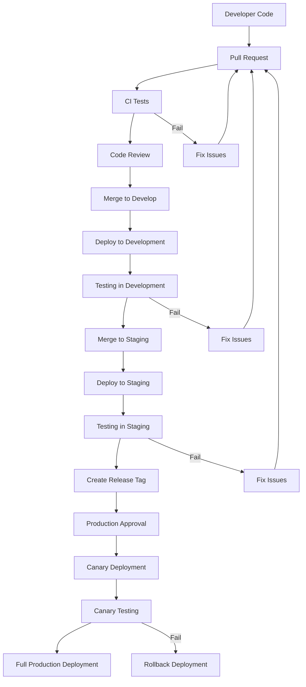

## Introduction

This document provides a comprehensive overview of the Continuous Integration and Continuous Deployment (CI/CD) pipeline for the Loan Management System. The CI/CD pipeline automates the building, testing, and deployment of the application across different environments, ensuring consistent and reliable delivery of new features and bug fixes.

## CI/CD Architecture Overview

The CI/CD pipeline is built using GitHub Actions and AWS services, providing a fully automated workflow from code commit to production deployment. The pipeline follows a multi-environment promotion strategy with appropriate testing and validation at each stage.

### Pipeline Components

The CI/CD pipeline consists of the following key components:

- **Source Control**: GitHub repository for code management
- **CI System**: GitHub Actions for automated builds and tests
- **Container Registry**: Amazon ECR for storing Docker images
- **Deployment Platform**: AWS ECS for container orchestration
- **Infrastructure as Code**: Terraform for infrastructure provisioning
- **Monitoring**: CloudWatch and New Relic for deployment monitoring

### Environment Strategy

The system uses a multi-environment strategy with the following environments:

- **Development**: Continuous deployment from the `develop` branch
- **Staging**: Controlled deployment from the `staging` branch with blue/green deployment
- **Production**: Highly controlled deployment from release tags with blue/green deployment and canary testing

Each environment has its own isolated infrastructure and configuration, with progressively stricter controls as code moves toward production.

### Pipeline Flow Diagram



## Continuous Integration

The Continuous Integration (CI) process automatically builds and tests code changes to ensure quality and prevent integration issues.

### Backend CI Workflow

The backend CI workflow is triggered on pull requests and pushes to the main branches (`main` and `develop`) that affect backend code. The workflow performs the following steps:

1. **Code Checkout**: Retrieves the latest code from the repository
2. **Environment Setup**: Sets up Python 3.11 with dependencies
3. **Code Quality Checks**:
   - Linting with flake8
   - Type checking with mypy
   - Security scanning with bandit and safety
4. **Unit Tests**: Runs pytest with coverage reporting
5. **Docker Build**: Builds the backend Docker image
6. **Security Scanning**: Scans the Docker image for vulnerabilities using Trivy

The workflow configuration is defined in `.github/workflows/backend-ci.yml`.

### Frontend CI Workflow

The frontend CI workflow is triggered on pull requests and pushes to the main branches (`main` and `develop`) that affect frontend code. The workflow performs the following steps:

1. **Code Checkout**: Retrieves the latest code from the repository
2. **Environment Setup**: Sets up Node.js 18 with dependencies
3. **Code Quality Checks**:
   - Linting with ESLint
   - Type checking with TypeScript
4. **Unit Tests**: Runs Jest tests with coverage reporting
5. **Build**: Builds the frontend application
6. **Security Scanning**: Scans dependencies for vulnerabilities
7. **Docker Build**: Builds the frontend Docker image
8. **Security Scanning**: Scans the Docker image for vulnerabilities using Trivy

The workflow configuration is defined in `.github/workflows/frontend-ci.yml`.

### Quality Gates

The CI pipeline includes the following quality gates that must be passed before code can be merged:

- **Unit Tests**: All tests must pass with no failures
- **Code Coverage**: Minimum 80% code coverage for backend, 70% for frontend
- **Linting**: No linting errors allowed
- **Security Scanning**: No critical or high vulnerabilities allowed
- **Type Checking**: No type errors allowed

These quality gates are enforced through branch protection rules in GitHub, preventing merges of code that doesn't meet the quality standards.

### CI Best Practices

When working with the CI system, follow these best practices:

1. **Run Tests Locally**: Before pushing code, run tests locally to catch issues early
   - Backend: Run `pytest` to execute unit tests
   - Frontend: Run `jest` to execute component and unit tests
   - Use `coverage` reports to ensure sufficient test coverage
   - Run linting tools locally: `flake8` for backend, `eslint` for frontend

2. **Keep PRs Small**: Smaller PRs are easier to review and test
3. **Fix CI Issues Promptly**: Address CI failures as soon as they occur
4. **Monitor Build Times**: Keep an eye on build times and optimize when necessary
5. **Update Dependencies Regularly**: Regularly update dependencies to avoid security issues
6. **Test Coverage**: Ensure new code has adequate test coverage focusing on:
   - Edge cases and error conditions
   - Business logic validation
   - Integration points between components
   - Security-sensitive functionality

## Continuous Deployment

The Continuous Deployment (CD) process automatically deploys code changes to different environments after passing the CI process.

### Development Environment Deployment

The development environment deployment is triggered automatically when code is merged to the `develop` branch. The workflow performs the following steps:

1. **Code Checkout**: Retrieves the latest code from the repository
2. **Environment Setup**: Sets up required tools and credentials
3. **Build and Push**: Builds and pushes Docker images to ECR
4. **Deploy**: Updates ECS services with the new images
5. **Verification**: Performs basic health checks to verify deployment

The development deployment uses a simple rolling update strategy with minimal downtime. The workflow configuration is defined in `.github/workflows/deploy-dev.yml`.

### Staging Environment Deployment

The staging environment deployment is triggered automatically when code is merged to the `staging` branch. The workflow performs the following steps:

1. **Code Checkout**: Retrieves the latest code from the repository
2. **Environment Setup**: Sets up required tools and credentials
3. **Build and Push**: Builds and pushes Docker images to ECR
4. **Blue/Green Deployment**: Creates a new deployment with CodeDeploy
5. **Integration Tests**: Runs integration tests against the new deployment
6. **Verification**: Verifies the deployment is functioning correctly
7. **Completion**: Completes the deployment if all tests pass

The staging deployment uses a blue/green deployment strategy with a 10% initial traffic shift, followed by full traffic shift after validation. The workflow configuration is defined in `.github/workflows/deploy-staging.yml`.

### Production Environment Deployment

The production environment deployment is triggered when a release tag (e.g., `v1.2.3`) is pushed to the repository or manually triggered with approval. The workflow performs the following steps:

1. **Approval**: Requires manual approval from authorized personnel
2. **Code Checkout**: Retrieves the latest code from the repository
3. **Environment Setup**: Sets up required tools and credentials
4. **Build and Push**: Builds and pushes Docker images to ECR
5. **Blue/Green Deployment**: Creates a new deployment with CodeDeploy
6. **Canary Deployment**: Initially routes 10% of traffic to the new version
7. **Integration Tests**: Runs comprehensive integration tests
8. **Canary Expansion**: Increases traffic to 50% if tests pass
9. **Monitoring**: Monitors error rates and performance metrics
10. **Full Deployment**: Completes the deployment with 100% traffic if all checks pass

The production deployment uses a blue/green deployment strategy with canary testing to minimize risk. The workflow configuration is defined in `.github/workflows/deploy-prod.yml`.

### Deployment Scripts

In addition to GitHub Actions workflows, the system includes shell scripts for manual deployment and troubleshooting:

- **deploy.sh**: Script for deploying to any environment with various options
- **rollback.sh**: Script for rolling back deployments in case of issues

These scripts are located in the `infrastructure/scripts` directory and can be used for manual deployments or when GitHub Actions is not available.

## Environment Configuration Management

The system uses a structured approach to manage configuration across different environments.

### Configuration Sources

Configuration is managed through the following sources:

1. **Environment Variables**: Runtime configuration stored in AWS Parameter Store
2. **Secrets**: Sensitive configuration stored in AWS Secrets Manager
3. **Infrastructure Configuration**: Environment-specific Terraform variables
4. **Application Configuration**: Environment-specific settings in code

This approach ensures that configuration is properly separated and secured across environments.

### Configuration Promotion

Configuration changes follow a promotion path similar to code changes:

1. **Development**: Configuration changes are tested in development first
2. **Staging**: After validation, configuration is promoted to staging
3. **Production**: Finally, configuration is promoted to production

Configuration promotion is managed through Terraform and AWS Parameter Store/Secrets Manager, with appropriate access controls at each level.

### Secret Management

Secrets are managed securely using the following practices:

1. **No Secrets in Code**: Secrets are never stored in the codebase
2. **Environment Isolation**: Each environment has its own set of secrets
3. **Least Privilege**: Access to secrets is restricted based on need
4. **Rotation**: Secrets are rotated regularly
5. **Audit Logging**: All secret access is logged and monitored

Secrets are stored in AWS Secrets Manager and accessed at runtime by the application.

## Rollback Procedures

Despite thorough testing, deployments may sometimes need to be rolled back. The system includes comprehensive rollback procedures for each environment.

### Automated Rollback

The deployment workflows include automated rollback capabilities:

1. **Staging Rollback**: If integration tests fail in staging, the deployment is automatically rolled back
2. **Production Canary Rollback**: If issues are detected during canary deployment, traffic is automatically shifted back to the previous version
3. **Production Full Rollback**: If issues are detected after full deployment, a rollback job is triggered

Automated rollbacks are implemented using AWS CodeDeploy's rollback features and custom scripts.

### Manual Rollback

For situations where automated rollback is not triggered or fails, manual rollback procedures are available:

1. **Using GitHub Actions**: Manually trigger the rollback workflow from GitHub
2. **Using Rollback Script**: Run the `rollback.sh` script with appropriate parameters
3. **Direct AWS Console**: Use the AWS Console to revert to previous task definitions

The `rollback.sh` script supports different rollback types:
- **Service Rollback**: Reverts ECS services to previous task definitions
- **Database Rollback**: Restores database from backup if needed
- **Full Rollback**: Performs both service and database rollback

Example usage:
```bash
./infrastructure/scripts/rollback.sh -e production -t service -s backend,frontend
```

### Rollback Testing

To ensure rollback procedures work when needed, regular rollback testing is performed:

1. **Scheduled Drills**: Monthly rollback drills in staging environment
2. **Post-Deployment Testing**: Rollback testing after major deployments
3. **Disaster Recovery Exercises**: Quarterly exercises including rollback scenarios

These tests help ensure that rollback procedures are effective and that the team is familiar with the process.

## Monitoring and Alerting

Comprehensive monitoring and alerting are essential for effective CI/CD operations.

### Deployment Monitoring

Deployments are monitored through the following mechanisms:

1. **GitHub Actions Logs**: Real-time logs of deployment workflows
2. **AWS CloudWatch**: Metrics and logs for AWS services
3. **New Relic APM**: Application performance monitoring
4. **Custom Dashboards**: Deployment-specific dashboards showing key metrics

These tools provide visibility into the deployment process and help identify issues quickly.

### Deployment Alerts

The system includes alerts for deployment events:

1. **Deployment Start**: Notification when a deployment begins
2. **Deployment Success**: Notification when a deployment completes successfully
3. **Deployment Failure**: Immediate alert when a deployment fails
4. **Rollback Triggered**: Alert when a rollback is initiated

Alerts are sent via Slack and email to the appropriate teams based on the environment and severity.

### Post-Deployment Monitoring

After a deployment, the system monitors for potential issues:

1. **Error Rate Monitoring**: Alerts if error rates increase above threshold
2. **Performance Monitoring**: Alerts if response times degrade
3. **Business Metrics**: Monitors key business metrics for anomalies
4. **Synthetic Transactions**: Regularly tests critical user flows

This monitoring helps detect issues that may not be caught during the deployment process itself.

## CI/CD Security

Security is integrated throughout the CI/CD pipeline to ensure the integrity and security of the deployment process.

### Pipeline Security

The CI/CD pipeline includes the following security measures:

1. **Secrets Management**: Secrets are stored securely in GitHub Secrets and AWS Secrets Manager
2. **Least Privilege**: CI/CD systems use minimal permissions needed for deployment
3. **Approval Gates**: Production deployments require explicit approval
4. **Audit Logging**: All pipeline actions are logged for audit purposes

These measures help prevent unauthorized access to the deployment pipeline.

### Security Scanning

Security scanning is integrated into the CI/CD pipeline:

1. **Dependency Scanning**: Checks for vulnerabilities in dependencies
2. **SAST**: Static Application Security Testing for code vulnerabilities
3. **Container Scanning**: Scans Docker images for vulnerabilities
4. **Infrastructure Scanning**: Checks Terraform code for security issues

Security issues found during scanning must be addressed before deployment can proceed.

### Compliance Validation

The CI/CD pipeline includes compliance validation steps:

1. **Policy Checks**: Ensures deployments comply with organizational policies
2. **Regulatory Checks**: Validates compliance with relevant regulations
3. **Documentation**: Automatically generates compliance documentation

These checks help ensure that all deployments meet the required compliance standards.

## CI/CD Pipeline Maintenance

The CI/CD pipeline itself requires regular maintenance to ensure it continues to function effectively.

### Pipeline Updates

The CI/CD pipeline is updated through the following process:

1. **Workflow Changes**: Updates to GitHub Actions workflows
2. **Script Updates**: Updates to deployment and rollback scripts
3. **Infrastructure Updates**: Updates to the underlying infrastructure

All changes to the CI/CD pipeline follow the same review and testing process as application code.

### Performance Optimization

The CI/CD pipeline is regularly optimized for performance:

1. **Build Time Optimization**: Reducing the time taken for builds
2. **Caching Strategies**: Effective use of caching to speed up builds
3. **Parallel Execution**: Running tests and builds in parallel
4. **Resource Allocation**: Ensuring appropriate resources for CI/CD jobs

These optimizations help reduce the time from code commit to deployment.

### Pipeline Metrics

The following metrics are tracked to evaluate CI/CD performance:

1. **Build Success Rate**: Percentage of successful builds
2. **Build Time**: Time taken for builds to complete
3. **Deployment Frequency**: How often deployments occur
4. **Lead Time**: Time from commit to deployment
5. **Mean Time to Recovery**: Time to recover from failures

These metrics help identify areas for improvement in the CI/CD process.

## Developer Workflow

This section describes how developers interact with the CI/CD pipeline in their daily work.

### Code Submission Process

Developers follow this process when submitting code:

1. **Create Feature Branch**: Branch from `develop` for new features
2. **Local Testing**: Run tests locally before pushing
3. **Push Changes**: Push changes to GitHub
4. **Create Pull Request**: Create PR targeting `develop`
5. **CI Validation**: Wait for CI checks to pass
6. **Code Review**: Address review comments
7. **Merge**: Merge code after approval

This process ensures that all code is properly tested and reviewed before deployment.

### Monitoring Deployments

Developers can monitor their deployments through:

1. **GitHub Actions UI**: View workflow runs and logs
2. **Slack Notifications**: Receive deployment status updates
3. **Deployment Dashboards**: Monitor application metrics after deployment

Developers are responsible for monitoring the impact of their changes after deployment.

### Handling Deployment Issues

When deployment issues occur, developers should follow these steps:

1. **Identify the Issue**: Use logs and monitoring to identify the problem
2. **Assess Impact**: Determine the severity and scope of the issue
3. **Fix or Rollback**: Either fix the issue quickly or initiate a rollback
4. **Post-Mortem**: Document the issue and prevention measures

The team lead or on-call engineer may assist with deployment issues, especially in production.

## Release Management

The release management process coordinates the planning, scheduling, and control of software releases.

### Release Versioning

The system uses semantic versioning (MAJOR.MINOR.PATCH) for releases:

- **MAJOR**: Incompatible API changes
- **MINOR**: New features in a backward-compatible manner
- **PATCH**: Backward-compatible bug fixes

Release tags follow the format `v1.2.3` and are used to trigger production deployments.

### Release Planning

Releases are planned through the following process:

1. **Feature Selection**: Determine features for the next release
2. **Release Schedule**: Set target dates for staging and production
3. **Testing Plan**: Define testing requirements for the release
4. **Documentation**: Update documentation for new features

Release planning is coordinated by the product manager and development team lead.

### Release Notes

Release notes are generated for each production release:

1. **Feature Summary**: Overview of new features
2. **Bug Fixes**: List of fixed issues
3. **Known Issues**: Any known issues or limitations
4. **Upgrade Notes**: Instructions for upgrading if needed

Release notes are published in GitHub Releases and shared with stakeholders.

### Hotfix Process

For urgent fixes that can't wait for the regular release cycle:

1. **Create Hotfix Branch**: Branch from `main` or the latest release tag
2. **Implement Fix**: Make minimal changes to address the issue
3. **Test**: Thoroughly test the fix
4. **Deploy**: Deploy to production after approval
5. **Merge Back**: Merge the fix back to `develop`

Hotfixes follow the same quality and approval requirements as regular releases but with expedited processing.

## Disaster Recovery

In addition to standard rollback procedures, the system includes comprehensive disaster recovery capabilities for more severe incidents.

### Disaster Scenarios

The disaster recovery plan addresses the following scenarios:

1. **Infrastructure Failure**: AWS region or service outage
2. **Data Corruption**: Database or file corruption
3. **Security Breach**: Unauthorized access or data breach
4. **Deployment Failure**: Failed deployment that cannot be rolled back normally

Each scenario has specific recovery procedures documented in the disaster recovery plan.

### Recovery Procedures

The general recovery procedure follows these steps:

1. **Incident Declaration**: Declare a disaster recovery incident
2. **Team Assembly**: Assemble the disaster recovery team
3. **Assessment**: Assess the extent of the incident
4. **Recovery Plan**: Select and execute the appropriate recovery plan
5. **Verification**: Verify the recovery was successful
6. **Root Cause Analysis**: Identify and address the root cause

Detailed procedures for each scenario are documented in the disaster recovery plan.

### Recovery Testing

To ensure recovery procedures work when needed, regular testing is performed:

1. **Tabletop Exercises**: Quarterly discussion-based exercises
2. **Functional Testing**: Semi-annual testing of recovery procedures
3. **Full DR Test**: Annual full disaster recovery test

These tests help ensure that recovery procedures are effective and that the team is prepared for incidents.

## Conclusion

The CI/CD pipeline is a critical component of the Loan Management System, enabling rapid, reliable, and secure delivery of new features and bug fixes. By following the processes and best practices outlined in this document, the development team can maintain a high level of quality and efficiency in the software delivery process.

## References

- [GitHub Actions Documentation](https://docs.github.com/en/actions)
- [AWS CodeDeploy Documentation](https://docs.aws.amazon.com/codedeploy/)
- [Docker Documentation](https://docs.docker.com/)\
- [Terraform Documentation](https://www.terraform.io/docs/)
- [Development Environment Setup](setup.md)